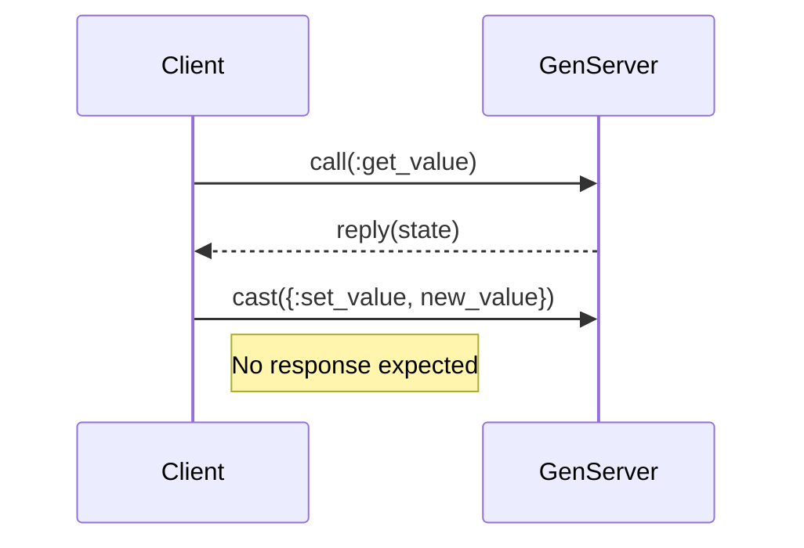

## 11.11. Patterns for Process Communication

In the world of Elixir, process communication is a cornerstone of building concurrent applications. Elixir's concurrency model, built on the Erlang VM (BEAM), allows developers to create highly concurrent and fault-tolerant systems. This section delves into the patterns for process communication, exploring synchronous vs. asynchronous communication, message routing, and selective receives. By mastering these patterns, you can harness the full power of Elixir's concurrency model to build robust and scalable applications.

### Synchronous vs. Asynchronous Communication

One of the fundamental decisions when designing process communication in Elixir is choosing between synchronous and asynchronous communication. This choice often revolves around the use of `call` and `cast` in the GenServer module.

#### Synchronous Communication with `call`

Synchronous communication involves waiting for a response from the recipient process. In Elixir, this is typically achieved using the `GenServer.call/2` function. This pattern is useful when you need to ensure that a message is processed before proceeding.

```elixir
defmodule MyServer do
  use GenServer

  # Client API
  def start_link(initial_value) do
    GenServer.start_link(__MODULE__, initial_value, name: __MODULE__)
  end

  def get_value() do
    GenServer.call(__MODULE__, :get_value)
  end

  # Server Callbacks
  def init(initial_value) do
    {:ok, initial_value}
  end

  def handle_call(:get_value, _from, state) do
    {:reply, state, state}
  end
end

# Usage
{:ok, _pid} = MyServer.start_link(42)
value = MyServer.get_value()
IO.puts("Value: #{value}")  # Output: Value: 42
```

In this example, `GenServer.call/2` is used to send a synchronous message to the server, waiting for a reply before continuing. This ensures that the client receives the current state of the server before proceeding.

#### Asynchronous Communication with `cast`

Asynchronous communication, on the other hand, does not wait for a response. This is achieved using the `GenServer.cast/2` function. This pattern is suitable for fire-and-forget scenarios where the client does not need to wait for a result.

```elixir
defmodule MyServer do
  use GenServer

  # Client API
  def start_link(initial_value) do
    GenServer.start_link(__MODULE__, initial_value, name: __MODULE__)
  end

  def set_value(new_value) do
    GenServer.cast(__MODULE__, {:set_value, new_value})
  end

  # Server Callbacks
  def init(initial_value) do
    {:ok, initial_value}
  end

  def handle_cast({:set_value, new_value}, _state) do
    {:noreply, new_value}
  end
end

# Usage
{:ok, _pid} = MyServer.start_link(42)
MyServer.set_value(100)
```

Here, `GenServer.cast/2` sends an asynchronous message to the server, allowing the client to continue executing without waiting for a response. The server updates its state without notifying the client.

#### Choosing Between `call` and `cast`

The choice between `call` and `cast` depends on the requirements of your application:

- Use `call` when you need a response from the server or when the order of operations is critical.
- Use `cast` when you don't need a response and want to improve performance by avoiding blocking operations.

### Message Routing

In Elixir, processes communicate by sending messages. Efficient message routing is essential for building scalable systems. There are several techniques for routing messages, including using process names, PIDs (Process Identifiers), and registries.

#### Using Process Names

Naming processes allows you to refer to them by name instead of using PIDs. This is particularly useful for long-lived processes that need to be accessed by multiple clients.

```elixir
defmodule NamedServer do
  use GenServer

  # Client API
  def start_link(initial_value) do
    GenServer.start_link(__MODULE__, initial_value, name: :named_server)
  end

  def get_value() do
    GenServer.call(:named_server, :get_value)
  end

  # Server Callbacks
  def init(initial_value) do
    {:ok, initial_value}
  end

  def handle_call(:get_value, _from, state) do
    {:reply, state, state}
  end
end

# Usage
{:ok, _pid} = NamedServer.start_link(42)
value = NamedServer.get_value()
IO.puts("Value: #{value}")  # Output: Value: 42
```

In this example, the server is started with a name `:named_server`, allowing clients to send messages using this name.

#### Using PIDs

PIDs are unique identifiers for processes. They can be used to send messages directly to a process, providing a more dynamic approach to message routing.

```elixir
defmodule PidServer do
  use GenServer

  # Client API
  def start_link(initial_value) do
    GenServer.start_link(__MODULE__, initial_value)
  end

  def get_value(pid) do
    GenServer.call(pid, :get_value)
  end

  # Server Callbacks
  def init(initial_value) do
    {:ok, initial_value}
  end

  def handle_call(:get_value, _from, state) do
    {:reply, state, state}
  end
end

# Usage
{:ok, pid} = PidServer.start_link(42)
value = PidServer.get_value(pid)
IO.puts("Value: #{value}")  # Output: Value: 42
```

Here, the client uses the PID returned by `start_link/1` to send messages directly to the server.

#### Using Registries

Registries provide a scalable way to manage and look up processes. They are particularly useful in systems with a large number of dynamic processes.

```elixir
defmodule RegistryServer do
  use GenServer

  # Client API
  def start_link(name, initial_value) do
    GenServer.start_link(__MODULE__, initial_value, name: {:via, Registry, {MyRegistry, name}})
  end

  def get_value(name) do
    GenServer.call({:via, Registry, {MyRegistry, name}}, :get_value)
  end

  # Server Callbacks
  def init(initial_value) do
    {:ok, initial_value}
  end

  def handle_call(:get_value, _from, state) do
    {:reply, state, state}
  end
end

# Usage
Registry.start_link(keys: :unique, name: MyRegistry)
{:ok, _pid} = RegistryServer.start_link(:my_server, 42)
value = RegistryServer.get_value(:my_server)
IO.puts("Value: #{value}")  # Output: Value: 42
```

In this example, processes are registered with a unique name in a registry, allowing clients to look them up dynamically.

### Selective Receives

Selective receives allow a process to handle specific messages from its mailbox, providing fine-grained control over message processing.

#### Matching Specific Messages

Processes can use pattern matching to selectively receive messages, ensuring that only relevant messages are processed.

```elixir
defmodule SelectiveReceiver do
  def loop do
    receive do
      {:important, msg} ->
        IO.puts("Received important message: #{msg}")
        loop()
      _other ->
        loop()
    end
  end
end

# Usage
pid = spawn(SelectiveReceiver, :loop, [])
send(pid, {:important, "This is important"})
send(pid, {:unimportant, "This is not important"})
```

In this example, the process only handles messages tagged with `:important`, ignoring others.

#### Handling Timeouts

Selective receives can also be used with timeouts to handle scenarios where a message may not arrive within a certain timeframe.

```elixir
defmodule TimeoutReceiver do
  def loop do
    receive do
      {:important, msg} ->
        IO.puts("Received important message: #{msg}")
        loop()
    after
      5000 ->
        IO.puts("Timeout: No important message received")
        loop()
    end
  end
end

# Usage
pid = spawn(TimeoutReceiver, :loop, [])
send(pid, {:important, "This is important"})
```

Here, if no `:important` message is received within 5 seconds, a timeout message is printed.

### Visualizing Process Communication

To better understand process communication in Elixir, let's visualize the flow of messages between processes using a sequence diagram.


```mermaid
sequenceDiagram
    participant Client
    participant GenServer
    Client->>GenServer: call(:get_value)
    GenServer-->>Client: reply(state)
    Client->>GenServer: cast({:set_value, new_value})
    Note right of Client: No response expected
```

This diagram illustrates the interaction between a client and a GenServer using both `call` and `cast`. The client sends a synchronous `call` and waits for a response, followed by an asynchronous `cast` where no response is expected.

### Design Considerations

When designing process communication patterns, consider the following:

- **Performance**: Asynchronous communication (`cast`) can improve performance by avoiding blocking operations, but it may complicate error handling and state consistency.
- **Fault Tolerance**: Use supervision trees to manage process failures and ensure system reliability.
- **Scalability**: Leverage registries for dynamic process management in large systems.
- **Complexity**: Avoid overcomplicating message routing and handling logic, which can lead to difficult-to-maintain code.

### Elixir Unique Features

Elixir's unique features, such as pattern matching, immutability, and the powerful OTP framework, make process communication both efficient and expressive. By leveraging these features, you can build systems that are not only robust and scalable but also easy to reason about.

### Differences and Similarities

While Elixir's process communication patterns share similarities with other actor-based systems, such as Akka in Scala, Elixir's integration with the BEAM VM provides unique advantages in terms of fault tolerance and scalability. Understanding these differences can help you choose the right tool for your specific use case.

### Try It Yourself

Experiment with the code examples provided in this section. Try modifying the message types, introducing new patterns, or implementing your own GenServer-based applications. Remember, practice is key to mastering process communication in Elixir.

## Quiz Time!



### Which function is used for synchronous communication in GenServer?

- [x] `GenServer.call/2`
- [ ] `GenServer.cast/2`
- [ ] `GenServer.send/2`
- [ ] `GenServer.reply/2`

> **Explanation:** `GenServer.call/2` is used for synchronous communication, waiting for a response from the server.

### What is the primary advantage of using `GenServer.cast/2`?

- [x] It allows asynchronous communication.
- [ ] It guarantees message delivery.
- [ ] It provides a response to the client.
- [ ] It is used for error handling.

> **Explanation:** `GenServer.cast/2` is used for asynchronous communication, allowing the client to continue without waiting for a response.

### How can processes be referred to by name in Elixir?

- [x] By using atoms as names.
- [ ] By using integers as identifiers.
- [ ] By using strings as labels.
- [ ] By using lists as descriptors.

> **Explanation:** Processes can be referred to by atoms, which serve as names for named processes.

### What is the purpose of using a registry in Elixir?

- [x] To manage and look up processes dynamically.
- [ ] To store process states.
- [ ] To handle errors in processes.
- [ ] To synchronize process communication.

> **Explanation:** Registries are used to manage and look up processes dynamically, especially in systems with many processes.

### What does a selective receive allow a process to do?

- [x] Handle specific messages from its mailbox.
- [ ] Send messages to multiple processes.
- [ ] Ignore all messages.
- [ ] Terminate other processes.

> **Explanation:** Selective receive allows a process to handle specific messages from its mailbox, providing fine-grained control over message processing.

### Which of the following is a unique feature of Elixir's concurrency model?

- [x] Built on the BEAM VM.
- [ ] Uses threads for concurrency.
- [ ] Requires manual memory management.
- [ ] Relies on global locks.

> **Explanation:** Elixir's concurrency model is built on the BEAM VM, which provides lightweight processes and fault-tolerance.

### What is the role of pattern matching in process communication?

- [x] To match specific messages in a process's mailbox.
- [ ] To encrypt messages before sending.
- [ ] To generate unique process identifiers.
- [ ] To synchronize communication between processes.

> **Explanation:** Pattern matching is used to match specific messages in a process's mailbox, enabling selective message handling.

### Which function is used to start a GenServer with a name?

- [x] `GenServer.start_link/3`
- [ ] `GenServer.init/2`
- [ ] `GenServer.call/2`
- [ ] `GenServer.cast/2`

> **Explanation:** `GenServer.start_link/3` can be used to start a GenServer with a name, allowing it to be referred to by that name.

### What is the purpose of a timeout in a receive block?

- [x] To handle scenarios where a message may not arrive within a certain timeframe.
- [ ] To delay message processing.
- [ ] To prioritize certain messages.
- [ ] To terminate the process after a delay.

> **Explanation:** A timeout in a receive block is used to handle scenarios where a message may not arrive within a certain timeframe, allowing the process to take alternative actions.

### True or False: `GenServer.cast/2` waits for a response from the server.

- [ ] True
- [x] False

> **Explanation:** `GenServer.cast/2` does not wait for a response from the server; it is used for asynchronous communication.



Remember, mastering process communication in Elixir is a journey. As you continue to explore and experiment with these patterns, you'll gain deeper insights into building concurrent and fault-tolerant systems. Stay curious, keep learning, and enjoy the journey!
