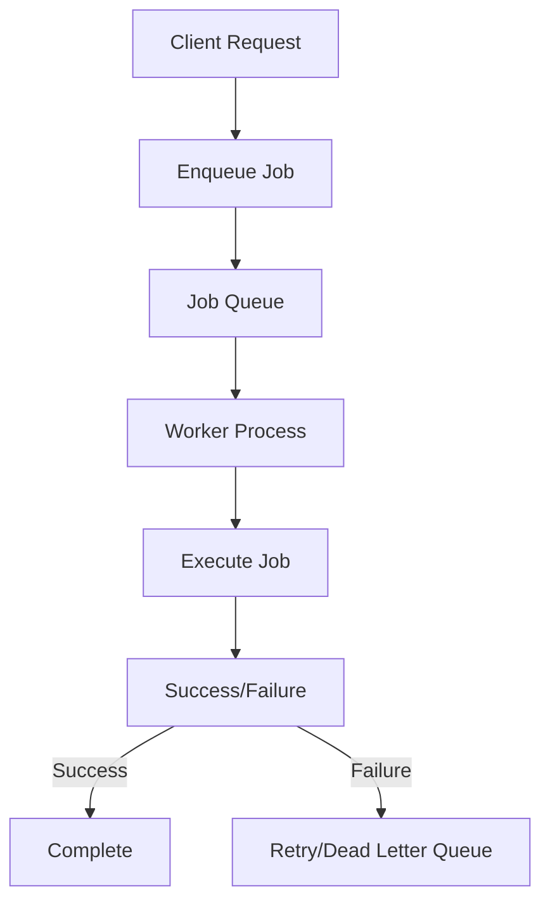

## 11.12. Implementing Work Queues and Job Processing

In the realm of concurrent programming, work queues and job processing are essential components for building scalable and efficient applications. Elixir, with its robust concurrency model and the power of the BEAM virtual machine, provides a fertile ground for implementing these patterns. In this section, we will explore the concepts of background job processing, delve into popular libraries like Oban and Exq, and discuss strategies for handling retries and failures.

### Background Job Processing

Background job processing involves queuing tasks for asynchronous execution, allowing your application to handle time-consuming operations without blocking the main execution flow. This is particularly useful for tasks such as sending emails, processing images, or performing complex calculations.

#### Key Concepts

- **Asynchronous Execution**: Offloading tasks to be executed in the background, freeing up the main application thread.
- **Task Queues**: Organizing tasks in a queue to be processed by worker processes.
- **Worker Processes**: Dedicated processes that consume tasks from the queue and execute them.
- **Scalability**: The ability to handle an increasing number of tasks by adding more worker processes.

### Using Libraries for Job Management

Elixir offers several libraries to facilitate work queue and job processing implementation. Two of the most popular libraries are Oban and Exq. Let's explore how these libraries can be leveraged to manage jobs effectively.

#### Oban

Oban is a robust and reliable job processing library for Elixir, built on top of PostgreSQL. It provides features such as job scheduling, retries, and unique job constraints.

**Key Features of Oban:**

- **PostgreSQL-backed**: Utilizes PostgreSQL for persistence, ensuring durability and reliability.
- **Job Scheduling**: Supports scheduling jobs to run at specific times.
- **Retries and Backoff**: Configurable retry strategies with exponential backoff.
- **Unique Jobs**: Ensures that only one instance of a job is executed at a time.

**Sample Code Snippet:**

```elixir
# Add Oban to your mix.exs dependencies
defp deps do
  [
    {:oban, "~> 2.0"}
  ]
end

# Configure Oban in your application
config :my_app, Oban,
  repo: MyApp.Repo,
  queues: [default: 10]

# Define a worker module
defmodule MyApp.Worker do
  use Oban.Worker, queue: :default, max_attempts: 5

  @impl Oban.Worker
  def perform(%Oban.Job{args: args}) do
    # Perform the job
    IO.inspect(args)
    :ok
  end
end

# Enqueue a job
MyApp.Worker.new(%{some: "data"}) |> Oban.insert()
```

#### Exq

Exq is another popular library for job processing in Elixir, built on top of Redis. It provides a simple and efficient way to manage background jobs.

**Key Features of Exq:**

- **Redis-backed**: Uses Redis for persistence and job management.
- **Real-time Monitoring**: Provides a web interface for monitoring job status.
- **Flexible Configuration**: Allows customization of queues and worker settings.

**Sample Code Snippet:**

```elixir
# Add Exq to your mix.exs dependencies
defp deps do
  [
    {:exq, "~> 0.15.0"},
    {:exq_ui, "~> 0.11.0"}
  ]
end

# Configure Exq in your application
config :exq,
  name: Exq,
  host: "127.0.0.1",
  port: 6379,
  namespace: "exq",
  queues: ["default"]

# Define a worker module
defmodule MyApp.ExqWorker do
  use Exq.Worker

  def perform(args) do
    # Perform the job
    IO.inspect(args)
    :ok
  end
end

# Enqueue a job
Exq.enqueue(Exq, "default", MyApp.ExqWorker, [arg1, arg2])
```

### Retry Strategies and Failure Handling

Handling retries and failures is a crucial aspect of job processing. Both Oban and Exq provide mechanisms to configure retry strategies and handle job failures gracefully.

#### Configuring Retries

- **Exponential Backoff**: Gradually increasing the delay between retries to avoid overwhelming the system.
- **Max Attempts**: Limiting the number of retry attempts to prevent infinite loops.
- **Dead Letter Queues**: Moving failed jobs to a separate queue for further inspection and manual intervention.

**Example with Oban:**

```elixir
defmodule MyApp.Worker do
  use Oban.Worker, queue: :default, max_attempts: 5

  @impl Oban.Worker
  def perform(%Oban.Job{args: args}) do
    case do_work(args) do
      :ok -> :ok
      :error -> {:error, "Failed to process job"}
    end
  end

  defp do_work(args) do
    # Simulate work
    if Enum.random(1..10) > 7 do
      :ok
    else
      :error
    end
  end
end
```

#### Failure Handling

- **Logging**: Capture detailed logs for failed jobs to facilitate debugging.
- **Alerts**: Set up alerts to notify developers of persistent failures.
- **Manual Intervention**: Allow manual retries or modifications for failed jobs.

### Visualizing Work Queue Architecture

To better understand the flow of work queues and job processing, let's visualize the architecture using a Mermaid.js diagram.



**Diagram Description:** This diagram illustrates the flow of a client request being enqueued as a job, processed by a worker, and resulting in either success or failure. Failed jobs can be retried or moved to a dead letter queue for further inspection.

### Try It Yourself

To deepen your understanding, try modifying the code examples provided:

- **Experiment with Different Retry Strategies**: Adjust the `max_attempts` and backoff settings to see how they affect job processing.
- **Implement Custom Failure Handling**: Add logging and alerting mechanisms to handle job failures more effectively.
- **Explore Oban and Exq Features**: Dive into the documentation of Oban and Exq to explore additional features and configurations.

### Knowledge Check

- **What are the benefits of using background job processing in Elixir?**
- **How do Oban and Exq differ in terms of persistence and job management?**
- **What strategies can be employed to handle job failures and retries effectively?**

### Summary

In this section, we've explored the implementation of work queues and job processing in Elixir using libraries like Oban and Exq. We've discussed the importance of background job processing, examined key features of these libraries, and delved into strategies for handling retries and failures. By leveraging these tools and techniques, you can build scalable and efficient applications that handle concurrent tasks with ease.

Remember, this is just the beginning. As you progress, you'll discover more advanced patterns and techniques to optimize your job processing workflows. Keep experimenting, stay curious, and enjoy the journey!

## Quiz: Implementing Work Queues and Job Processing



### What is the primary benefit of using background job processing in Elixir?

- [x] Asynchronous execution of tasks
- [ ] Synchronous execution of tasks
- [ ] Increased memory usage
- [ ] Reduced code readability

> **Explanation:** Background job processing allows tasks to be executed asynchronously, freeing up the main application thread.

### Which library is built on top of PostgreSQL for job processing in Elixir?

- [x] Oban
- [ ] Exq
- [ ] Sidekiq
- [ ] Resque

> **Explanation:** Oban is a job processing library for Elixir that is built on top of PostgreSQL.

### What is a key feature of Exq?

- [x] Redis-backed persistence
- [ ] PostgreSQL-backed persistence
- [ ] Built-in web server
- [ ] Native support for JavaScript

> **Explanation:** Exq uses Redis for persistence and job management.

### How can failed jobs be handled in a work queue system?

- [x] Using dead letter queues
- [ ] Ignoring them
- [ ] Deleting them immediately
- [ ] Logging them without retries

> **Explanation:** Failed jobs can be moved to dead letter queues for further inspection and manual intervention.

### What is the purpose of exponential backoff in retry strategies?

- [x] Gradually increasing the delay between retries
- [ ] Decreasing the delay between retries
- [ ] Eliminating retries altogether
- [ ] Increasing the number of retries

> **Explanation:** Exponential backoff gradually increases the delay between retries to avoid overwhelming the system.

### Which of the following is a feature of Oban?

- [x] Job scheduling
- [ ] Real-time monitoring
- [ ] Built-in web server
- [ ] Native support for Python

> **Explanation:** Oban supports job scheduling, allowing jobs to run at specific times.

### What is the role of worker processes in job processing?

- [x] Consuming tasks from the queue and executing them
- [ ] Enqueuing tasks into the queue
- [ ] Monitoring the job queue
- [ ] Managing database connections

> **Explanation:** Worker processes are responsible for consuming tasks from the queue and executing them.

### How can job failures be effectively managed?

- [x] Logging and alerts
- [ ] Ignoring them
- [ ] Deleting them immediately
- [ ] Increasing the number of retries

> **Explanation:** Logging and alerts help in managing job failures by providing insights and notifications.

### What is the purpose of a dead letter queue?

- [x] To store failed jobs for further inspection
- [ ] To store successful jobs
- [ ] To delete jobs immediately
- [ ] To increase job priority

> **Explanation:** A dead letter queue stores failed jobs for further inspection and manual intervention.

### True or False: Oban and Exq can be used together in the same application.

- [x] True
- [ ] False

> **Explanation:** While it's possible to use both libraries in the same application, it's generally not recommended due to potential conflicts and redundancy.




