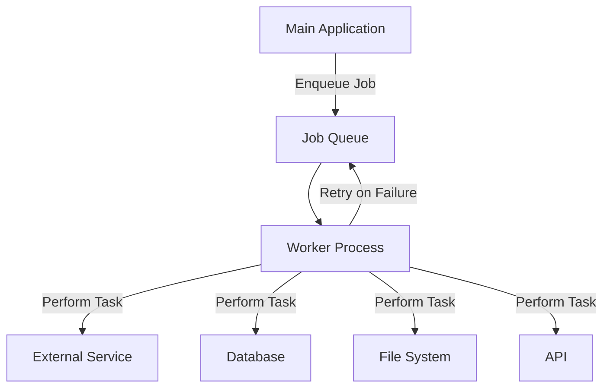

## 11.12. Implementing Work Queues and Job Processing

In the world of software engineering, efficiently managing background tasks and job processing is crucial for building scalable and responsive applications. Elixir, with its strong concurrency model and robust ecosystem, provides excellent tools and patterns for implementing work queues and job processing. In this section, we will explore the concepts, libraries, and strategies to effectively manage work queues and job processing in Elixir.

### Background Job Processing

Background job processing involves queuing tasks for asynchronous execution, allowing the main application to remain responsive while offloading time-consuming operations to be processed in the background. This is particularly useful for tasks such as sending emails, processing images, or performing complex calculations.

#### Key Concepts

- **Asynchronous Execution**: Separating task execution from the main application flow, allowing tasks to run independently.
- **Task Queues**: Structures that hold tasks to be processed, often with priority and scheduling capabilities.
- **Workers**: Processes that consume tasks from the queue and execute them.
- **Job Retries**: Mechanisms to handle failures by retrying tasks under certain conditions.

### Using Libraries

Elixir's ecosystem offers several libraries to facilitate work queues and job processing. Two of the most popular libraries are `Oban` and `Exq`.

#### Oban

Oban is a powerful and flexible job processing library for Elixir, built on top of PostgreSQL. It provides reliable, distributed job processing with features like job retries, scheduling, and unique job constraints.

##### Key Features

- **Reliability**: Jobs are stored in a PostgreSQL database, ensuring data persistence and consistency.
- **Concurrency**: Supports concurrent job processing with configurable worker pools.
- **Scheduling**: Allows scheduling jobs for future execution.
- **Unique Jobs**: Prevents duplicate job execution.
- **Telemetry**: Provides detailed metrics and logging for monitoring.

##### Sample Code Snippet

```elixir
# Add Oban to your mix.exs dependencies
defp deps do
  [
    {:oban, "~> 2.0"}
  ]
end

# Configure Oban in your application
config :my_app, Oban,
  repo: MyApp.Repo,
  queues: [default: 10]

# Define a worker module
defmodule MyApp.Worker do
  use Oban.Worker, queue: :default, max_attempts: 5

  @impl Oban.Worker
  def perform(%Oban.Job{args: args}) do
    # Perform the background task
    IO.inspect(args)
    :ok
  end
end

# Enqueue a job
:ok = Oban.insert(MyApp.Worker.new(%{key: "value"}))
```

#### Exq

Exq is another popular job processing library for Elixir, built on top of Redis. It provides a simple and efficient way to manage background jobs with support for retries and scheduling.

##### Key Features

- **Redis Backend**: Uses Redis for job storage and management.
- **Web UI**: Provides a web interface for monitoring jobs.
- **Retry Mechanism**: Supports automatic retries for failed jobs.
- **Scheduling**: Allows scheduling jobs for future execution.

##### Sample Code Snippet

```elixir
# Add Exq to your mix.exs dependencies
defp deps do
  [
    {:exq, "~> 0.15.0"},
    {:exq_ui, "~> 0.11.0"}
  ]
end

# Configure Exq in your application
config :exq,
  name: Exq,
  host: "127.0.0.1",
  port: 6379,
  namespace: "exq",
  queues: ["default"]

# Define a worker module
defmodule MyApp.ExqWorker do
  use Exq.Worker

  def perform(args) do
    # Perform the background task
    IO.inspect(args)
    :ok
  end
end

# Enqueue a job
Exq.enqueue(Exq, "default", MyApp.ExqWorker, ["arg1", "arg2"])
```

### Retry Strategies and Failure Handling

Handling failures and implementing retry strategies are essential aspects of job processing. Both Oban and Exq provide mechanisms to configure retries and handle failures gracefully.

#### Oban Retry Strategies

Oban allows configuring the number of attempts and backoff strategies for job retries. You can define custom backoff strategies using functions.

```elixir
defmodule MyApp.Worker do
  use Oban.Worker, queue: :default, max_attempts: 5

  @impl Oban.Worker
  def perform(%Oban.Job{args: args}) do
    # Simulate a task that may fail
    if :rand.uniform(2) == 1 do
      {:error, "Random failure"}
    else
      :ok
    end
  end

  @impl Oban.Worker
  def backoff(%Oban.Job{attempt: attempt}) do
    # Exponential backoff strategy
    :timer.seconds(:math.pow(2, attempt))
  end
end
```

#### Exq Retry Strategies

Exq supports retries with configurable retry count and delay. You can specify the number of retries and the delay between attempts.

```elixir
defmodule MyApp.ExqWorker do
  use Exq.Worker, max_retries: 5

  def perform(args) do
    # Simulate a task that may fail
    if :rand.uniform(2) == 1 do
      {:error, "Random failure"}
    else
      :ok
    end
  end
end
```

### Visualizing Work Queue Architecture

To better understand the architecture of work queues and job processing, let's visualize the flow using a Mermaid.js diagram.


```mermaid
graph TD;
    A[Main Application] -->|Enqueue Job| B[Job Queue]
    B --> C[Worker Process]
    C -->|Perform Task| D[External Service]
    C -->|Perform Task| E[Database]
    C -->|Perform Task| F[File System]
    C -->|Perform Task| G[API]
    C -->|Retry on Failure| B
```

This diagram illustrates the flow of a job from the main application to the job queue, where worker processes consume and execute tasks. In case of failure, jobs are retried according to the configured strategy.

### Design Considerations

When implementing work queues and job processing, consider the following design aspects:

- **Scalability**: Ensure the system can handle increased job loads by scaling worker processes and queue capacity.
- **Fault Tolerance**: Implement retry strategies and failure handling to ensure robustness.
- **Monitoring**: Use telemetry and logging to monitor job execution and performance.
- **Data Consistency**: Ensure jobs are idempotent to handle retries without side effects.

### Elixir Unique Features

Elixir's concurrency model, built on the BEAM VM, provides unique advantages for work queues and job processing:

- **Lightweight Processes**: Elixir processes are lightweight and can handle thousands of concurrent tasks efficiently.
- **Fault Isolation**: Processes are isolated, preventing failures from affecting the entire system.
- **Supervision Trees**: Use OTP supervision trees to manage worker processes and ensure fault tolerance.

### Differences and Similarities

While Oban and Exq are both used for job processing, they have distinct differences:

- **Backend**: Oban uses PostgreSQL, while Exq uses Redis.
- **Feature Set**: Oban offers more advanced features like unique jobs and telemetry.
- **Community and Support**: Consider the community support and documentation when choosing a library.

### Try It Yourself

To deepen your understanding, try modifying the code examples:

- **Change the number of retries** and observe how the system behaves under different failure scenarios.
- **Implement a custom backoff strategy** in Oban and see its effect on job retries.
- **Experiment with different queue configurations** to understand their impact on performance.

### Knowledge Check

- What are the key differences between Oban and Exq?
- How does Elixir's concurrency model benefit work queue implementation?
- What are some design considerations when implementing job processing?

### Embrace the Journey

Remember, implementing work queues and job processing is just the beginning. As you progress, you'll build more complex and efficient systems. Keep experimenting, stay curious, and enjoy the journey!

## Quiz Time!



### Which library uses PostgreSQL as its backend for job storage?

- [x] Oban
- [ ] Exq
- [ ] Sidekiq
- [ ] Resque

> **Explanation:** Oban uses PostgreSQL for job storage, ensuring data persistence and reliability.

### What is a key advantage of using Elixir's concurrency model for job processing?

- [x] Lightweight processes
- [ ] Heavyweight threads
- [ ] Synchronous execution
- [ ] Single-threaded model

> **Explanation:** Elixir's lightweight processes allow handling thousands of concurrent tasks efficiently.

### How can you prevent duplicate job execution in Oban?

- [x] Use unique job constraints
- [ ] Use Redis for job storage
- [ ] Increase worker pool size
- [ ] Disable retries

> **Explanation:** Oban provides unique job constraints to prevent duplicate job execution.

### Which feature is common to both Oban and Exq?

- [x] Job retries
- [ ] Unique jobs
- [ ] PostgreSQL backend
- [ ] Web UI

> **Explanation:** Both Oban and Exq support job retries to handle failures.

### What is the purpose of a worker process in job processing?

- [x] Execute tasks from the job queue
- [ ] Store jobs in the database
- [ ] Monitor application health
- [ ] Manage application configuration

> **Explanation:** Worker processes consume tasks from the job queue and execute them.

### How can you monitor job execution in Oban?

- [x] Use telemetry and logging
- [ ] Use Redis for monitoring
- [ ] Increase worker pool size
- [ ] Disable retries

> **Explanation:** Oban provides telemetry and logging for monitoring job execution and performance.

### What is a common design consideration for job processing systems?

- [x] Scalability
- [ ] Single-threaded execution
- [ ] Synchronous processing
- [ ] Manual task management

> **Explanation:** Scalability is crucial to handle increased job loads efficiently.

### Which library provides a web interface for monitoring jobs?

- [ ] Oban
- [x] Exq
- [ ] Sidekiq
- [ ] Resque

> **Explanation:** Exq provides a web UI for monitoring jobs and managing job queues.

### How can you handle failures in job processing?

- [x] Implement retry strategies
- [ ] Increase worker pool size
- [ ] Use Redis for storage
- [ ] Disable job retries

> **Explanation:** Implementing retry strategies helps handle failures and ensure robustness.

### Is it true that Elixir's processes are isolated, preventing failures from affecting the entire system?

- [x] True
- [ ] False

> **Explanation:** Elixir's processes are isolated, providing fault isolation and enhancing system robustness.




