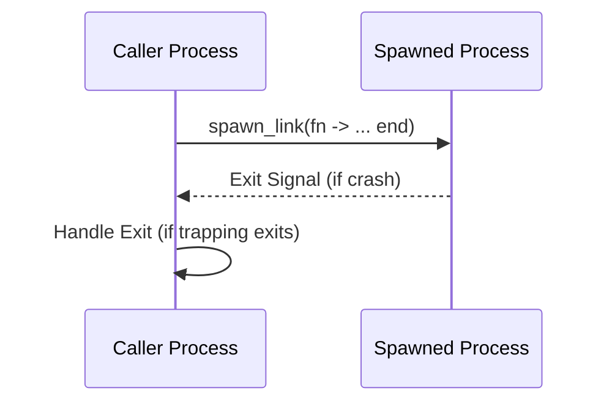

## 11.2. Process Lifecycle Management

In Elixir, processes are the fundamental units of concurrency, enabling developers to build highly concurrent and fault-tolerant systems. Understanding how to effectively manage the lifecycle of these processes is crucial for creating robust applications. This section will delve into the intricacies of process lifecycle management, covering the creation, monitoring, linking, and best practices for managing processes in Elixir.

### Creating and Managing Processes

Elixir provides several ways to spawn processes, each suited for different use cases. Let's explore these methods and understand their nuances.

#### Spawning Processes

1. **Using `spawn/1` and `spawn/3`:**

   The `spawn` function is the simplest way to create a new process. It takes a function and executes it in a new process.

   ```elixir
   defmodule ProcessExample do
     def start do
       spawn(fn -> IO.puts("Hello from a new process!") end)
     end
   end

   ProcessExample.start()
   ```

   In this example, `spawn/1` creates a new process that prints a message to the console. The process runs concurrently with the calling process.

2. **Using `spawn_link/1` and `spawn_link/3`:**

   `spawn_link` is similar to `spawn`, but it also creates a link between the calling process and the new process. If either process crashes, the other will be notified.

   ```elixir
   defmodule LinkedProcessExample do
     def start do
       spawn_link(fn -> raise "This will crash!" end)
     end
   end

   LinkedProcessExample.start()
   ```

   In this case, if the spawned process crashes, the calling process will also crash unless it is trapping exits.

3. **Using the `Task` Module:**

   The `Task` module provides a higher-level abstraction for spawning processes, especially useful for short-lived tasks.

   ```elixir
   defmodule TaskExample do
     def start do
       Task.start(fn -> IO.puts("Task running in a separate process") end)
     end
   end

   TaskExample.start()
   ```

   Tasks are particularly useful when you need to perform concurrent operations and handle their results.

### Monitoring and Linking

Monitoring and linking are essential for building fault-tolerant systems. They allow processes to detect failures and respond appropriately.

#### Using `Process.monitor/1`

`Process.monitor/1` creates a monitor for a process, allowing the monitoring process to receive a message if the monitored process exits.

```elixir
defmodule MonitorExample do
  def start do
    pid = spawn(fn -> :timer.sleep(1000) end)
    ref = Process.monitor(pid)
    receive do
      {:DOWN, ^ref, :process, _pid, reason} ->
        IO.puts("Process exited with reason: #{reason}")
    end
  end
end

MonitorExample.start()
```

In this example, the monitoring process will receive a `:DOWN` message when the monitored process exits.

#### Using `Process.link/1`

`Process.link/1` creates a bidirectional link between two processes. If one process exits, the linked process will receive an exit signal.

```elixir
defmodule LinkExample do
  def start do
    spawn_link(fn -> raise "This will crash!" end)
  end
end

LinkExample.start()
```

If the spawned process crashes, the calling process will also crash unless it is trapping exits.

#### Handling Process Exits

To handle process exits gracefully, you can use the `Process.flag/2` function to trap exits.

```elixir
defmodule TrapExitExample do
  def start do
    Process.flag(:trap_exit, true)
    spawn_link(fn -> raise "This will crash!" end)
    receive do
      {:EXIT, _pid, reason} ->
        IO.puts("Caught exit: #{reason}")
    end
  end
end

TrapExitExample.start()
```

By trapping exits, the calling process can handle exit signals and take appropriate actions.

### Best Practices

When designing systems with processes, it's important to follow best practices to ensure performance and reliability.

#### Designing Processes with Clear Responsibilities

Each process should have a single responsibility. This makes the system easier to understand and maintain.

- **Single Responsibility Principle:** Ensure each process handles a specific task or responsibility.
- **Modular Design:** Break down complex tasks into smaller, manageable processes.

#### Avoiding Excessive Process Creation

While processes are lightweight, creating too many can impact performance. Use processes judiciously.

- **Limit Process Creation:** Avoid creating processes for trivial tasks.
- **Use Process Pools:** For tasks that require many concurrent processes, consider using a process pool.

### Visualizing Process Lifecycle

To better understand the process lifecycle, let's visualize the interactions between processes using a sequence diagram.



This diagram illustrates the interaction between a caller process and a spawned process using `spawn_link`. If the spawned process crashes, an exit signal is sent to the caller process.

### Try It Yourself

Experiment with the code examples provided. Try modifying the functions to see how different scenarios affect process behavior. For instance, change the `spawn_link` to `spawn` and observe the differences in fault tolerance.

### References and Further Reading

- [Elixir Documentation on Processes](https://hexdocs.pm/elixir/Process.html)
- [Elixir Task Module](https://hexdocs.pm/elixir/Task.html)
- [Erlang's Process Documentation](https://erlang.org/doc/man/process.html)

### Knowledge Check

- What is the difference between `spawn` and `spawn_link`?
- How does `Process.monitor/1` help in fault detection?
- Why is it important to design processes with clear responsibilities?

### Embrace the Journey

Remember, mastering process lifecycle management is a journey. As you experiment and build more complex systems, you'll gain a deeper understanding of concurrency and fault tolerance in Elixir. Keep exploring, stay curious, and enjoy the process!

## Quiz: Process Lifecycle Management



### What is the primary purpose of using `spawn_link/1`?

- [x] To create a linked process that shares exit signals with the caller
- [ ] To spawn a process without linking
- [ ] To monitor a process without linking
- [ ] To create a process that cannot crash

> **Explanation:** `spawn_link/1` creates a linked process, meaning if one process crashes, the other receives an exit signal.

### How does `Process.monitor/1` differ from `Process.link/1`?

- [x] `Process.monitor/1` sends a message on process exit, while `Process.link/1` sends an exit signal
- [ ] `Process.monitor/1` creates a link, while `Process.link/1` does not
- [ ] `Process.monitor/1` is used for spawning processes
- [ ] `Process.link/1` is used for monitoring processes

> **Explanation:** `Process.monitor/1` sends a `:DOWN` message when the monitored process exits, while `Process.link/1` sends an exit signal.

### What function is used to trap exits in a process?

- [x] `Process.flag/2`
- [ ] `Process.exit/1`
- [ ] `Process.spawn/1`
- [ ] `Process.link/1`

> **Explanation:** `Process.flag/2` with `:trap_exit` set to `true` is used to trap exits in a process.

### Which module provides a higher-level abstraction for spawning processes?

- [x] Task
- [ ] Process
- [ ] GenServer
- [ ] Supervisor

> **Explanation:** The `Task` module provides a higher-level abstraction for spawning processes, especially for short-lived tasks.

### What is a best practice when designing processes?

- [x] Ensure each process has a single responsibility
- [ ] Create as many processes as possible
- [ ] Avoid linking processes
- [ ] Use `spawn` for all process creation

> **Explanation:** Ensuring each process has a single responsibility aligns with the Single Responsibility Principle, making systems easier to maintain.

### What happens if a linked process crashes and exits?

- [x] The linked process receives an exit signal
- [ ] The linked process continues running
- [ ] The linked process is automatically restarted
- [ ] The linked process is unaffected

> **Explanation:** If a linked process crashes, the other process receives an exit signal unless it is trapping exits.

### How can you handle process exits gracefully?

- [x] Use `Process.flag(:trap_exit, true)`
- [ ] Use `Process.exit/1`
- [ ] Use `Process.spawn/1`
- [ ] Use `Process.link/1`

> **Explanation:** `Process.flag(:trap_exit, true)` allows a process to handle exit signals gracefully.

### What is the purpose of using a process pool?

- [x] To manage a large number of concurrent processes efficiently
- [ ] To create a single process for all tasks
- [ ] To avoid using processes altogether
- [ ] To link all processes together

> **Explanation:** A process pool helps manage a large number of concurrent processes efficiently, avoiding excessive process creation.

### Which function is used to create a monitor for a process?

- [x] `Process.monitor/1`
- [ ] `Process.link/1`
- [ ] `Process.spawn/1`
- [ ] `Process.exit/1`

> **Explanation:** `Process.monitor/1` is used to create a monitor for a process, allowing the monitoring process to receive a message if the monitored process exits.

### True or False: Processes in Elixir are lightweight and can be created in large numbers without impacting performance.

- [x] True
- [ ] False

> **Explanation:** Processes in Elixir are lightweight and designed to be created in large numbers, but excessive creation should still be avoided for trivial tasks.


