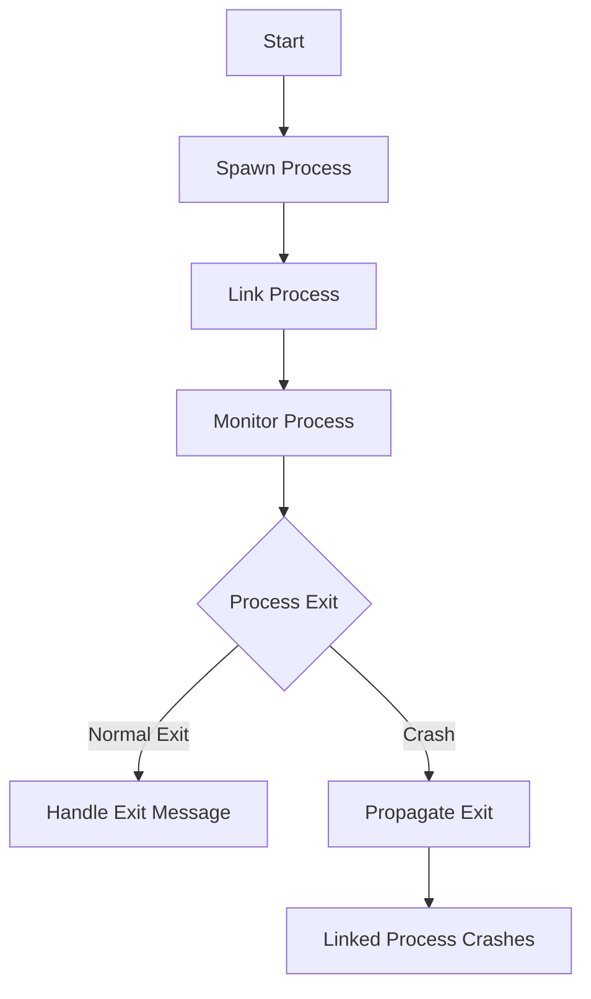

## 11.2. Process Lifecycle Management

In Elixir, understanding and managing the lifecycle of processes is crucial for building robust, concurrent, and fault-tolerant applications. This section will delve into the core concepts of process lifecycle management, including creating and managing processes, monitoring and linking for fault detection, and best practices for designing efficient systems.

### Creating and Managing Processes

In Elixir, processes are lightweight and run on the BEAM virtual machine, allowing for massive concurrency. Let's explore how to create and manage these processes effectively.

#### Spawning Processes

Elixir provides several ways to spawn processes, each serving different needs. The most common methods are `spawn`, `spawn_link`, and the `Task` module.

##### Using `spawn`

The `spawn` function is the simplest way to create a new process. It takes a function as an argument and executes it in a new process.

```elixir
defmodule MyModule do
  def say_hello do
    IO.puts("Hello from a new process!")
  end
end

pid = spawn(MyModule, :say_hello, [])
```

- **Explanation:** Here, `spawn/3` is used to create a new process that executes the `say_hello` function from `MyModule`. The process ID (`pid`) is returned, which can be used to send messages or monitor the process.

##### Using `spawn_link`

`spawn_link` is similar to `spawn`, but it establishes a link between the calling process and the spawned process. If either process crashes, the other will receive an exit signal.

```elixir
pid = spawn_link(MyModule, :say_hello, [])
```

- **Explanation:** The `spawn_link/3` function links the new process to the current one, ensuring that failures are propagated, which is useful for fault-tolerant design.

##### Using the `Task` Module

The `Task` module provides a higher-level abstraction for spawning processes, especially useful for short-lived tasks.

```elixir
task = Task.async(fn -> MyModule.say_hello() end)
Task.await(task)
```

- **Explanation:** `Task.async/1` starts a new process and returns a task struct. `Task.await/1` waits for the task to complete and returns the result. This pattern is particularly useful for concurrent computations.

#### Monitoring and Linking

Monitoring and linking are essential for managing process lifecycles and building fault-tolerant systems.

##### Using `Process.monitor/1`

`Process.monitor/1` creates a monitor for a process, allowing you to receive a message if the process exits.

```elixir
pid = spawn(MyModule, :say_hello, [])
ref = Process.monitor(pid)

receive do
  {:DOWN, ^ref, :process, _pid, reason} ->
    IO.puts("Process exited with reason: #{reason}")
end
```

- **Explanation:** Here, we monitor a process and handle its exit using a `receive` block. This pattern is useful for tracking process health without linking.

##### Using `Process.link/1`

`Process.link/1` creates a bidirectional link between processes, propagating exits.

```elixir
pid = spawn_link(MyModule, :say_hello, [])
```

- **Explanation:** Linking processes ensures that if one process crashes, the linked process will also crash, unless it traps exits. This is useful for supervisor trees in OTP.

##### Handling Process Exits

Processes can trap exits to handle them gracefully instead of crashing.

```elixir
Process.flag(:trap_exit, true)
pid = spawn_link(MyModule, :say_hello, [])

receive do
  {:EXIT, _pid, reason} ->
    IO.puts("Trapped exit with reason: #{reason}")
end
```

- **Explanation:** By setting the `:trap_exit` flag, a process can handle exit signals as messages, allowing for custom cleanup or recovery logic.

### Best Practices

Designing processes with clear responsibilities and avoiding excessive process creation are key to efficient systems.

#### Designing Processes with Clear Responsibilities

- **Single Responsibility Principle:** Each process should have a clear and singular purpose. This simplifies debugging and enhances maintainability.
- **Isolation:** Processes should be isolated from each other, communicating through message passing to avoid shared state issues.

#### Avoiding Excessive Process Creation

- **Resource Management:** Creating too many processes can lead to resource exhaustion. Use processes judiciously, especially in high-load scenarios.
- **Batch Processing:** For tasks that can be grouped, consider batch processing to reduce the number of processes.

### Visualizing Process Lifecycle

Let's use a Mermaid.js diagram to visualize the process lifecycle, including creation, linking, monitoring, and exit handling.


```mermaid
graph TD;
    A[Start] --> B[Spawn Process]
    B --> C[Link Process]
    C --> D[Monitor Process]
    D --> E{Process Exit}
    E -->|Normal Exit| F[Handle Exit Message]
    E -->|Crash| G[Propagate Exit]
    G --> H[Linked Process Crashes]
```

- **Diagram Explanation:** This flowchart illustrates the lifecycle of a process, from creation to exit handling. It shows how linking and monitoring can be used to manage process exits effectively.

### Try It Yourself

Experiment with the provided code examples by modifying them to suit different scenarios:

- **Create a process that performs a computation and returns the result.**
- **Link multiple processes and observe how failures propagate.**
- **Monitor a process and implement custom cleanup logic on exit.**

### References and Further Reading

- [Elixir's Official Documentation on Processes](https://hexdocs.pm/elixir/Process.html)
- [Understanding the BEAM VM](https://erlang.org/doc/apps/erts/BEAM.html)
- [Concurrency in Elixir](https://elixir-lang.org/getting-started/processes.html)

### Knowledge Check

- **What is the difference between `spawn` and `spawn_link`?**
- **How does `Process.monitor/1` differ from `Process.link/1`?**
- **Why is the `:trap_exit` flag useful in process management?**

### Embrace the Journey

Remember, mastering process lifecycle management is a journey. As you experiment and build more complex systems, you'll gain deeper insights into the power of Elixir's concurrency model. Keep exploring, stay curious, and enjoy the process!

## Quiz Time!



### What function is used to create a new process in Elixir?

- [x] spawn
- [ ] create_process
- [ ] new_process
- [ ] start_process

> **Explanation:** `spawn` is the function used to create a new process in Elixir.

### Which function links the calling process to a new process?

- [x] spawn_link
- [ ] spawn
- [ ] link_process
- [ ] monitor_process

> **Explanation:** `spawn_link` links the calling process to the new process, allowing exit signals to be propagated.

### What does `Process.monitor/1` do?

- [x] It creates a monitor for a process and sends a message if the process exits.
- [ ] It links two processes together.
- [ ] It starts a new process.
- [ ] It traps exits in a process.

> **Explanation:** `Process.monitor/1` creates a monitor for a process, allowing you to receive a message if the process exits.

### How can a process handle exit signals as messages?

- [x] By setting the `:trap_exit` flag to true.
- [ ] By using `Process.link/1`.
- [ ] By using `spawn_link`.
- [ ] By using `Task.async`.

> **Explanation:** Setting the `:trap_exit` flag to true allows a process to handle exit signals as messages.

### What is a key benefit of using the `Task` module?

- [x] It provides a higher-level abstraction for spawning processes.
- [ ] It allows for direct process linking.
- [ ] It automatically traps exits.
- [ ] It creates monitors for processes.

> **Explanation:** The `Task` module provides a higher-level abstraction for spawning processes, especially useful for short-lived tasks.

### What is the purpose of linking processes?

- [x] To propagate exit signals between processes.
- [ ] To monitor process health.
- [ ] To create new processes.
- [ ] To trap exits.

> **Explanation:** Linking processes ensures that if one process crashes, the linked process will also crash, unless it traps exits.

### What should be avoided to prevent resource exhaustion?

- [x] Excessive process creation.
- [ ] Using `Task` module.
- [ ] Linking processes.
- [ ] Monitoring processes.

> **Explanation:** Creating too many processes can lead to resource exhaustion, so it should be avoided.

### What principle should each process adhere to?

- [x] Single Responsibility Principle.
- [ ] Multiple Responsibilities Principle.
- [ ] No Responsibility Principle.
- [ ] Shared Responsibility Principle.

> **Explanation:** Each process should adhere to the Single Responsibility Principle, having a clear and singular purpose.

### What is the result of setting `:trap_exit` to true?

- [x] The process can handle exit signals as messages.
- [ ] The process automatically links to all spawned processes.
- [ ] The process will not receive exit signals.
- [ ] The process will crash on exit.

> **Explanation:** Setting `:trap_exit` to true allows the process to handle exit signals as messages.

### Is it true that `spawn_link` creates a monitor for the new process?

- [ ] True
- [x] False

> **Explanation:** `spawn_link` does not create a monitor; it creates a link between the calling process and the new process.


