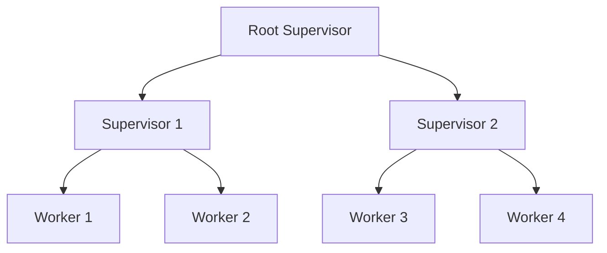

## 11.3. Supervisors and Supervision Trees

In the world of concurrent programming, building systems that are both robust and fault-tolerant is crucial. Elixir, with its roots in the Erlang ecosystem, provides powerful tools to achieve this through Supervisors and Supervision Trees. In this section, we will delve into the concepts of Supervisors and Supervision Trees, explore various supervision strategies, and learn how to design systems that can gracefully handle failures.

### Building Robust Systems

Supervisors are a fundamental part of the Open Telecom Platform (OTP) in Elixir. They are responsible for monitoring processes and automatically restarting them if they fail. This capability is essential for building systems that can recover from unexpected errors without human intervention.

#### Organizing Processes Under Supervisors

In Elixir, processes are lightweight and can be created in large numbers. However, managing these processes and ensuring they are resilient to failures requires a structured approach. This is where Supervisors come into play. By organizing processes under Supervisors, you can ensure that any process that crashes is automatically restarted, maintaining the overall stability of the system.

```elixir
defmodule MyApp.Supervisor do
  use Supervisor

  def start_link(init_arg) do
    Supervisor.start_link(__MODULE__, init_arg, name: __MODULE__)
  end

  def init(_init_arg) do
    children = [
      {MyApp.Worker, arg1},
      {MyApp.AnotherWorker, arg2}
    ]

    Supervisor.init(children, strategy: :one_for_one)
  end
end
```

In the example above, we define a Supervisor module that starts two worker processes. The `Supervisor.init/2` function specifies the supervision strategy, which in this case is `:one_for_one`. This means that if a worker process crashes, only that process will be restarted.

### Designing Supervision Trees

Supervision Trees are hierarchical structures that organize processes into a tree-like form. This design allows for modularity and fault isolation, making it easier to manage complex systems.

#### Structuring Applications Hierarchically

By structuring applications hierarchically, you can isolate faults to specific parts of the system. Each node in the tree represents a Supervisor or a worker process. Supervisors can supervise other Supervisors, creating a multi-level hierarchy.



In the diagram above, the root Supervisor oversees two child Supervisors, each managing their own set of worker processes. This structure allows for fine-grained control over process management and fault recovery.

### Supervision Strategies

Choosing the right supervision strategy is crucial for building resilient systems. Elixir provides several strategies, each suited for different scenarios.

#### Understanding Supervision Strategies

1. **One-for-One**: This strategy restarts only the failed process. It is suitable when processes are independent and do not affect each other.

2. **One-for-All**: When a process fails, all other processes are terminated and restarted. This strategy is useful when processes are interdependent and need to be in a consistent state.

3. **Rest-for-One**: If a process fails, the failed process and any processes started after it are restarted. This strategy is ideal when processes depend on each other in a sequential manner.

```elixir
defmodule MyApp.Supervisor do
  use Supervisor

  def init(_init_arg) do
    children = [
      {MyApp.Worker, arg1},
      {MyApp.AnotherWorker, arg2}
    ]

    # Choose the appropriate strategy
    Supervisor.init(children, strategy: :rest_for_one)
  end
end
```

In this example, we use the `:rest_for_one` strategy, which restarts the failed process and any subsequent processes. This is beneficial when the order of process execution matters.

#### Choosing the Appropriate Strategy

When selecting a supervision strategy, consider the dependencies between processes and the impact of a process failure on the system. Here are some guidelines:

- Use **One-for-One** when processes are independent.
- Opt for **One-for-All** when processes share state or need to be consistent.
- Choose **Rest-for-One** when processes have a sequential dependency.

### Elixir Unique Features

Elixir's unique features, such as lightweight processes and the BEAM virtual machine, make it an ideal choice for building fault-tolerant systems. The ability to create thousands of processes with minimal overhead allows developers to design systems that can handle failures gracefully.

### Differences and Similarities

Supervisors and Supervision Trees in Elixir are similar to other fault-tolerant systems in that they aim to recover from failures automatically. However, Elixir's approach is unique due to its lightweight processes and the ability to create complex supervision hierarchies with ease.

### Try It Yourself

To deepen your understanding, try modifying the code examples provided. Experiment with different supervision strategies and observe how they affect the system's behavior. Consider adding more worker processes and creating multi-level supervision trees to see how Elixir handles complex scenarios.

### Knowledge Check

- What is the primary role of a Supervisor in Elixir?
- How does a Supervision Tree enhance fault tolerance?
- When would you use a One-for-All strategy over a One-for-One strategy?

### Summary

Supervisors and Supervision Trees are essential components of building robust systems in Elixir. By organizing processes under Supervisors and choosing the right supervision strategy, you can create systems that are resilient to failures and easy to manage. Remember, this is just the beginning. As you progress, you'll build more complex and fault-tolerant systems. Keep experimenting, stay curious, and enjoy the journey!

## Quiz: Supervisors and Supervision Trees



### What is the primary role of a Supervisor in Elixir?

- [x] To monitor and restart processes
- [ ] To execute business logic
- [ ] To handle user input
- [ ] To manage database connections

> **Explanation:** Supervisors are responsible for monitoring processes and restarting them if they fail, ensuring system stability.

### Which supervision strategy restarts only the failed process?

- [x] One-for-One
- [ ] One-for-All
- [ ] Rest-for-One
- [ ] All-for-One

> **Explanation:** The One-for-One strategy restarts only the process that has failed, leaving others unaffected.

### In a Supervision Tree, what does each node represent?

- [x] A Supervisor or a worker process
- [ ] A database connection
- [ ] A user interface component
- [ ] A network socket

> **Explanation:** Each node in a Supervision Tree represents either a Supervisor or a worker process, forming a hierarchical structure.

### When should you use the One-for-All strategy?

- [x] When processes are interdependent and need to be in a consistent state
- [ ] When processes are independent
- [ ] When processes have no dependencies
- [ ] When processes are rarely used

> **Explanation:** The One-for-All strategy is suitable when processes are interdependent and must be restarted together to maintain consistency.

### What is a key benefit of using Supervision Trees?

- [x] Fault isolation and modularity
- [ ] Faster execution speed
- [ ] Reduced memory usage
- [ ] Simplified user interfaces

> **Explanation:** Supervision Trees provide fault isolation and modularity, making it easier to manage complex systems.

### Which strategy restarts the failed process and any subsequent processes?

- [x] Rest-for-One
- [ ] One-for-One
- [ ] One-for-All
- [ ] All-for-One

> **Explanation:** The Rest-for-One strategy restarts the failed process and any processes started after it, useful for sequential dependencies.

### How does Elixir's lightweight processes benefit Supervisors?

- [x] Allows creating many processes with minimal overhead
- [ ] Increases memory usage
- [ ] Slows down execution
- [ ] Complicates process management

> **Explanation:** Elixir's lightweight processes enable the creation of many processes with minimal overhead, enhancing the effectiveness of Supervisors.

### What is a common use case for the One-for-One strategy?

- [x] When processes are independent
- [ ] When processes share state
- [ ] When processes are sequentially dependent
- [ ] When processes are rarely used

> **Explanation:** The One-for-One strategy is ideal when processes are independent and do not affect each other.

### What does a Supervisor do when a process it monitors crashes?

- [x] Restarts the process
- [ ] Logs the error and does nothing
- [ ] Shuts down the system
- [ ] Sends an alert to the user

> **Explanation:** When a monitored process crashes, the Supervisor restarts it to maintain system stability.

### True or False: Supervisors can only monitor worker processes.

- [ ] True
- [x] False

> **Explanation:** Supervisors can monitor both worker processes and other Supervisors, forming a hierarchical Supervision Tree.


