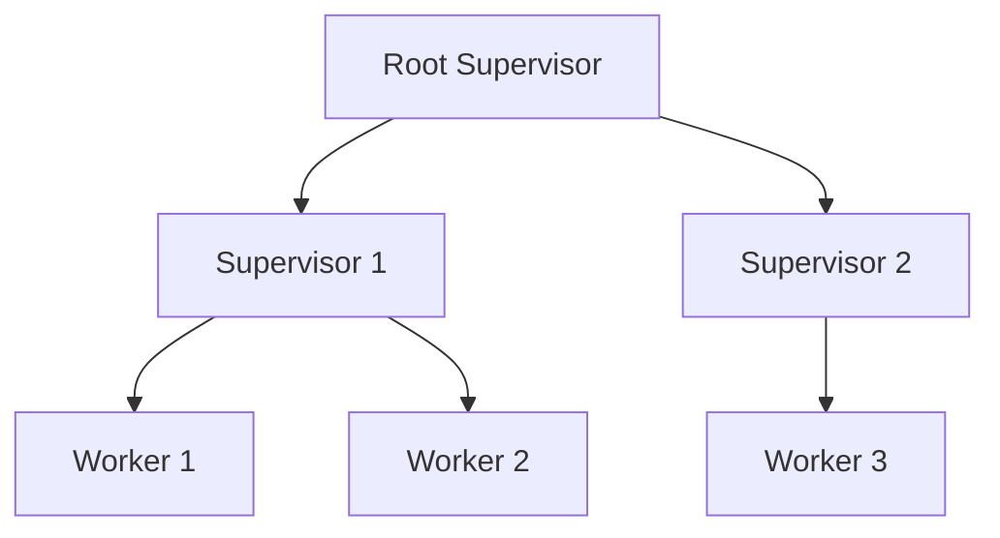

## 11.3. Supervisors and Supervision Trees

In the world of Elixir, building robust, fault-tolerant systems is a fundamental goal. One of the key mechanisms to achieve this is through the use of **Supervisors** and **Supervision Trees**. These constructs allow us to organize processes in a way that ensures automatic recovery from failures, maintaining the integrity and availability of our applications. In this section, we'll delve into the intricacies of Supervisors and Supervision Trees, exploring their design, strategies, and best practices.

### Building Robust Systems

Supervisors are specialized processes designed to monitor other processes, known as child processes. The primary role of a Supervisor is to ensure that its child processes are always running. If a child process crashes, the Supervisor automatically restarts it, thereby maintaining the system's reliability.

#### Key Concepts

- **Supervisors**: Processes that manage child processes, restarting them when necessary.
- **Child Processes**: The individual processes managed by a Supervisor.
- **Fault Tolerance**: The ability of a system to continue operating properly in the event of the failure of some of its components.

#### Code Example: Basic Supervisor Setup

Let's start with a simple example of setting up a Supervisor in Elixir:

```elixir
defmodule MyApp.Supervisor do
  use Supervisor

  def start_link(init_arg) do
    Supervisor.start_link(__MODULE__, init_arg, name: __MODULE__)
  end

  def init(_init_arg) do
    children = [
      {MyApp.Worker, arg1}
    ]

    Supervisor.init(children, strategy: :one_for_one)
  end
end

defmodule MyApp.Worker do
  use GenServer

  def start_link(arg) do
    GenServer.start_link(__MODULE__, arg, name: __MODULE__)
  end

  def init(arg) do
    {:ok, arg}
  end
end
```

In this example, `MyApp.Supervisor` is a Supervisor module that manages a single child process, `MyApp.Worker`. The Supervisor uses the `:one_for_one` strategy, meaning if `MyApp.Worker` crashes, only that process will be restarted.

### Designing Supervision Trees

A **Supervision Tree** is a hierarchical structure of Supervisors and their child processes. This structure allows us to build complex systems with modular components, each capable of handling its own failures independently.

#### Benefits of Supervision Trees

- **Modularity**: Each component of the system can be developed and tested independently.
- **Fault Isolation**: Failures in one part of the system do not necessarily affect other parts.
- **Scalability**: Supervision Trees can grow as the application requirements expand.

#### Visualizing a Supervision Tree

Below is a Mermaid.js diagram illustrating a simple Supervision Tree:


```mermaid
graph TD;
    A[Root Supervisor] --> B[Supervisor 1];
    A --> C[Supervisor 2];
    B --> D[Worker 1];
    B --> E[Worker 2];
    C --> F[Worker 3];
```

This diagram shows a root Supervisor overseeing two child Supervisors, each managing their own set of worker processes.

### Supervision Strategies

Elixir provides several strategies for managing child processes under a Supervisor. Choosing the right strategy depends on the specific needs of your application.

#### One-for-One Strategy

- **Description**: Restarts only the failed child process.
- **Use Case**: Suitable when child processes are independent and do not affect each other.

#### One-for-All Strategy

- **Description**: Restarts all child processes if one fails.
- **Use Case**: Ideal when child processes are interdependent, and a failure in one affects the others.

#### Rest-for-One Strategy

- **Description**: Restarts the failed child process and any processes started after it.
- **Use Case**: Useful when processes started after the failed one depend on it.

#### Code Example: Different Strategies

Let's see how to implement these strategies in code:

```elixir
defmodule MyApp.Supervisor do
  use Supervisor

  def start_link(init_arg) do
    Supervisor.start_link(__MODULE__, init_arg, name: __MODULE__)
  end

  def init(_init_arg) do
    children = [
      {MyApp.Worker1, arg1},
      {MyApp.Worker2, arg2}
    ]

    # One-for-One Strategy
    Supervisor.init(children, strategy: :one_for_one)

    # One-for-All Strategy
    # Supervisor.init(children, strategy: :one_for_all)

    # Rest-for-One Strategy
    # Supervisor.init(children, strategy: :rest_for_one)
  end
end
```

### Design Considerations

When designing a Supervision Tree, consider the following:

- **Hierarchy Depth**: Keep the hierarchy shallow to avoid complexity.
- **Process Dependencies**: Understand the dependencies between processes to choose the right strategy.
- **Error Handling**: Ensure that child processes handle errors gracefully and do not rely solely on Supervisors for recovery.

### Elixir Unique Features

Elixir's integration with the BEAM VM provides unique features that enhance the effectiveness of Supervisors and Supervision Trees:

- **Lightweight Processes**: The BEAM VM allows for the creation of thousands of lightweight processes, making it feasible to use Supervisors extensively.
- **Hot Code Swapping**: Elixir supports hot code swapping, allowing you to update running systems without downtime.
- **Built-in Fault Tolerance**: The "let it crash" philosophy encourages building systems that recover automatically from failures.

### Differences and Similarities

Supervisors in Elixir are similar to the concept of service managers in other programming environments, such as systemd in Linux. However, Elixir's Supervisors are more tightly integrated with the language runtime, providing seamless fault tolerance and process management.

### Try It Yourself

Experiment with the code examples provided by:

- Modifying the number of worker processes and observing the behavior of different strategies.
- Introducing intentional errors in worker processes to see how Supervisors handle them.
- Creating a more complex Supervision Tree with multiple layers of Supervisors.

### Knowledge Check

- What is the primary role of a Supervisor in Elixir?
- How does the one-for-all strategy differ from the one-for-one strategy?
- Why is fault isolation important in Supervision Trees?

### Summary

Supervisors and Supervision Trees are powerful tools in Elixir for building robust, fault-tolerant systems. By organizing processes under Supervisors and choosing appropriate supervision strategies, we can ensure that our applications remain resilient in the face of failures. Remember, this is just the beginning. As you progress, you'll build more complex systems with greater fault tolerance. Keep experimenting, stay curious, and enjoy the journey!

## Quiz Time!



### What is the primary role of a Supervisor in Elixir?

- [x] To monitor and restart child processes upon failure.
- [ ] To execute business logic.
- [ ] To handle user input.
- [ ] To manage database connections.

> **Explanation:** Supervisors are responsible for monitoring and restarting child processes to ensure system reliability.

### Which strategy restarts only the failed child process?

- [x] One-for-One
- [ ] One-for-All
- [ ] Rest-for-One
- [ ] All-for-One

> **Explanation:** The One-for-One strategy restarts only the failed child process.

### In which scenario is the One-for-All strategy most appropriate?

- [x] When child processes are interdependent.
- [ ] When child processes are independent.
- [ ] When there are no child processes.
- [ ] When processes need to run in parallel.

> **Explanation:** The One-for-All strategy is used when child processes are interdependent, and a failure in one affects the others.

### What does the Rest-for-One strategy do?

- [x] Restarts the failed process and any processes started after it.
- [ ] Restarts all processes.
- [ ] Restarts only the failed process.
- [ ] Restarts no processes.

> **Explanation:** The Rest-for-One strategy restarts the failed process and any processes started after it.

### What is a Supervision Tree?

- [x] A hierarchical structure of Supervisors and child processes.
- [ ] A data structure for storing process states.
- [ ] A type of database index.
- [ ] A graphical representation of user interfaces.

> **Explanation:** A Supervision Tree is a hierarchical structure of Supervisors and child processes.

### Why is fault isolation important in Supervision Trees?

- [x] To ensure that failures in one part of the system do not affect others.
- [ ] To increase system performance.
- [ ] To reduce code complexity.
- [ ] To handle user input more efficiently.

> **Explanation:** Fault isolation ensures that failures in one part of the system do not affect others, maintaining system integrity.

### Which Elixir feature allows for updating running systems without downtime?

- [x] Hot Code Swapping
- [ ] Cold Code Swapping
- [ ] Process Swapping
- [ ] Memory Swapping

> **Explanation:** Elixir supports hot code swapping, allowing updates to running systems without downtime.

### What does the "let it crash" philosophy encourage?

- [x] Building systems that recover automatically from failures.
- [ ] Ignoring errors in the system.
- [ ] Writing complex error-handling code.
- [ ] Avoiding the use of Supervisors.

> **Explanation:** The "let it crash" philosophy encourages building systems that recover automatically from failures.

### How does Elixir's integration with the BEAM VM enhance Supervisors?

- [x] By allowing the creation of thousands of lightweight processes.
- [ ] By limiting the number of processes.
- [ ] By increasing memory usage.
- [ ] By reducing system reliability.

> **Explanation:** The BEAM VM allows for the creation of thousands of lightweight processes, enhancing the effectiveness of Supervisors.

### Supervisors in Elixir are similar to what concept in other environments?

- [x] Service managers like systemd in Linux.
- [ ] Database managers.
- [ ] User interface frameworks.
- [ ] Network protocols.

> **Explanation:** Supervisors in Elixir are similar to service managers like systemd in Linux, providing process management and fault tolerance.




