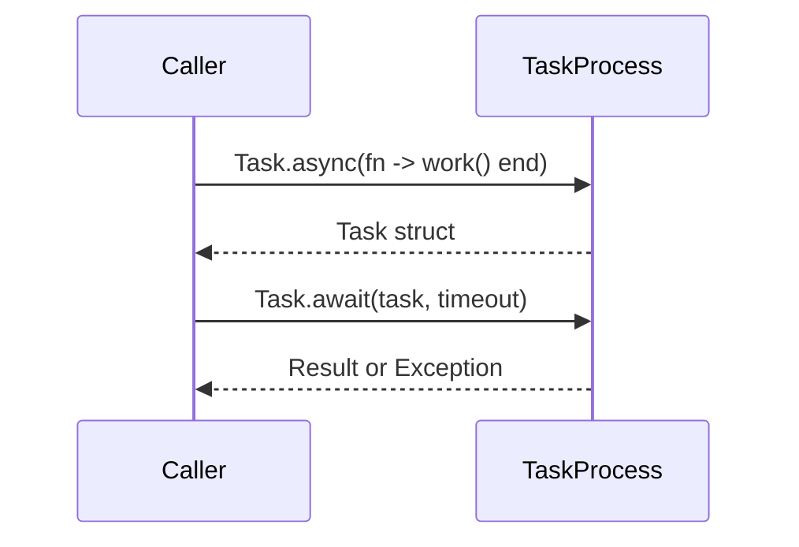

## 11.4. Task and Async Patterns

Concurrency is a core strength of Elixir, and mastering it is essential for building scalable and fault-tolerant applications. In this section, we will delve into the Task and Async patterns in Elixir, which provide powerful abstractions for handling concurrent operations. We will explore how to run asynchronous tasks, manage errors, and leverage the Task Supervisor for enhanced reliability.

### Simplifying Concurrency with the Task Module

The Task module in Elixir is designed to simplify the execution of concurrent operations. It provides a straightforward API for running tasks asynchronously and retrieving their results. Let's explore the key functions and patterns associated with the Task module.

#### Running Asynchronous Operations

To run a function asynchronously, you can use `Task.async/1`. This function spawns a new process to execute the given function and returns a task struct that can be awaited later to retrieve the result.

```elixir
defmodule AsyncExample do
  def fetch_data do
    # Simulate a long-running operation
    :timer.sleep(2000)
    "Data fetched"
  end

  def run do
    task = Task.async(fn -> fetch_data() end)
    result = Task.await(task, 5000) # Wait up to 5000ms for the result
    IO.puts("Result: #{result}")
  end
end

AsyncExample.run()
```

In this example, `Task.async/1` is used to run `fetch_data/0` asynchronously. `Task.await/2` is then called to wait for the result, with a timeout of 5000 milliseconds.

#### Fire-and-Forget Tasks

Sometimes, you may want to run a task without caring about its result. This is known as a "fire-and-forget" task. You can achieve this using `Task.start/1`, which starts a task without linking it to the calling process.

```elixir
defmodule FireAndForget do
  def perform_background_work do
    # Simulate background work
    :timer.sleep(1000)
    IO.puts("Background work completed")
  end

  def run do
    Task.start(fn -> perform_background_work() end)
    IO.puts("Task started")
  end
end

FireAndForget.run()
```

In this example, `Task.start/1` is used to initiate `perform_background_work/0` in the background. The calling process continues execution without waiting for the task to complete.

### Error Handling in Asynchronous Tasks

Handling errors in asynchronous tasks is crucial for building robust applications. Elixir provides mechanisms to manage failures and ensure that tasks do not crash the entire application.

#### Managing Failures

When using `Task.async/1`, any exception raised in the task will be propagated to the caller when `Task.await/2` is invoked. You can handle these exceptions using a `try...rescue` block.

```elixir
defmodule ErrorHandlingExample do
  def risky_operation do
    raise "Something went wrong"
  end

  def run do
    task = Task.async(fn -> risky_operation() end)

    try do
      Task.await(task, 5000)
    rescue
      e -> IO.puts("Caught exception: #{e}")
    end
  end
end

ErrorHandlingExample.run()
```

In this example, an exception is raised in `risky_operation/0`, and it is caught and handled in the `rescue` block when `Task.await/2` is called.

#### Using Task.Supervisor for Supervised Tasks

For tasks that require supervision, Elixir provides the `Task.Supervisor` module. This module allows you to start tasks under a supervisor, ensuring that they are restarted if they fail.

```elixir
defmodule SupervisedTaskExample do
  def start_link do
    Task.Supervisor.start_link(name: MyTaskSupervisor)
  end

  def run do
    Task.Supervisor.start_child(MyTaskSupervisor, fn ->
      # Simulate a task that might fail
      :timer.sleep(1000)
      raise "Task failed"
    end)
  end
end

{:ok, _} = SupervisedTaskExample.start_link()
SupervisedTaskExample.run()
```

In this example, a task is started under `MyTaskSupervisor`. If the task fails, the supervisor can be configured to restart it, ensuring reliability.

### Visualizing Task and Async Patterns

To better understand the flow of asynchronous tasks, let's visualize the process using a sequence diagram.



This diagram illustrates the interaction between the caller and the task process. The caller initiates the task using `Task.async/1`, receives a task struct, and later awaits the result using `Task.await/2`.

### Key Considerations and Best Practices

- **Timeouts:** Always specify a timeout when using `Task.await/2` to prevent indefinite blocking.
- **Error Handling:** Use `try...rescue` to handle exceptions in tasks gracefully.
- **Supervision:** Use `Task.Supervisor` for tasks that require fault tolerance and automatic restarts.
- **Fire-and-Forget:** Use `Task.start/1` for tasks where the result is not needed, but be mindful of potential failures.

### Elixir Unique Features

Elixir's concurrency model, based on the BEAM VM, provides lightweight processes and message passing, making it ideal for concurrent programming. The Task module leverages these features to simplify asynchronous operations.

### Differences and Similarities

The Task module in Elixir is similar to the Future or Promise patterns in other languages, providing a way to handle asynchronous operations. However, Elixir's approach is more lightweight and integrates seamlessly with its process-based concurrency model.

### Try It Yourself

Experiment with the examples provided by modifying the functions to perform different tasks. Try introducing delays or exceptions to see how the system handles them. This hands-on approach will deepen your understanding of Task and Async patterns in Elixir.

### Knowledge Check

- What is the purpose of `Task.async/1` and `Task.await/2`?
- How can you handle exceptions in asynchronous tasks?
- What is the role of `Task.Supervisor` in managing tasks?

### Embrace the Journey

Remember, mastering concurrency in Elixir is a journey. As you explore Task and Async patterns, you'll gain insights into building scalable and fault-tolerant applications. Keep experimenting, stay curious, and enjoy the journey!

## Quiz: Task and Async Patterns



### What is the primary purpose of the Task module in Elixir?

- [x] To simplify the execution of concurrent operations
- [ ] To manage database connections
- [ ] To handle HTTP requests
- [ ] To perform file I/O operations

> **Explanation:** The Task module in Elixir is designed to simplify the execution of concurrent operations by providing an easy-to-use API for running tasks asynchronously.

### How do you run a function asynchronously in Elixir?

- [x] Using `Task.async/1`
- [ ] Using `Task.run/1`
- [ ] Using `Task.execute/1`
- [ ] Using `Task.perform/1`

> **Explanation:** `Task.async/1` is used to run a function asynchronously in Elixir, spawning a new process to execute the given function.

### What function is used to wait for the result of an asynchronous task?

- [x] `Task.await/2`
- [ ] `Task.get/2`
- [ ] `Task.receive/2`
- [ ] `Task.fetch/2`

> **Explanation:** `Task.await/2` is used to wait for the result of an asynchronous task, with an optional timeout specified.

### How can you handle exceptions in asynchronous tasks?

- [x] Using a `try...rescue` block
- [ ] Using a `catch...finally` block
- [ ] Using a `begin...end` block
- [ ] Using a `trap...handle` block

> **Explanation:** Exceptions in asynchronous tasks can be handled using a `try...rescue` block when calling `Task.await/2`.

### What is the purpose of `Task.Supervisor`?

- [x] To supervise tasks and ensure they are restarted if they fail
- [ ] To manage task priorities
- [ ] To schedule tasks at specific intervals
- [ ] To log task execution details

> **Explanation:** `Task.Supervisor` is used to supervise tasks, ensuring they are restarted if they fail, providing fault tolerance.

### Which function is used for fire-and-forget tasks?

- [x] `Task.start/1`
- [ ] `Task.launch/1`
- [ ] `Task.fire/1`
- [ ] `Task.ignore/1`

> **Explanation:** `Task.start/1` is used for fire-and-forget tasks, starting a task without linking it to the calling process.

### What should you always specify when using `Task.await/2`?

- [x] A timeout
- [ ] A priority
- [ ] A callback function
- [ ] A retry count

> **Explanation:** Always specify a timeout when using `Task.await/2` to prevent indefinite blocking.

### What is a key feature of Elixir's concurrency model?

- [x] Lightweight processes and message passing
- [ ] Thread-based execution
- [ ] Synchronous I/O operations
- [ ] Global locks for resource management

> **Explanation:** Elixir's concurrency model is based on lightweight processes and message passing, making it ideal for concurrent programming.

### How does Elixir's Task module compare to Future or Promise patterns in other languages?

- [x] It is more lightweight and integrates with Elixir's process-based concurrency model
- [ ] It is more complex and requires additional libraries
- [ ] It is less efficient and slower
- [ ] It is identical in functionality

> **Explanation:** Elixir's Task module is more lightweight and integrates seamlessly with its process-based concurrency model, unlike Future or Promise patterns in other languages.

### True or False: `Task.start/1` links the task to the calling process.

- [ ] True
- [x] False

> **Explanation:** `Task.start/1` does not link the task to the calling process, allowing it to run independently.


