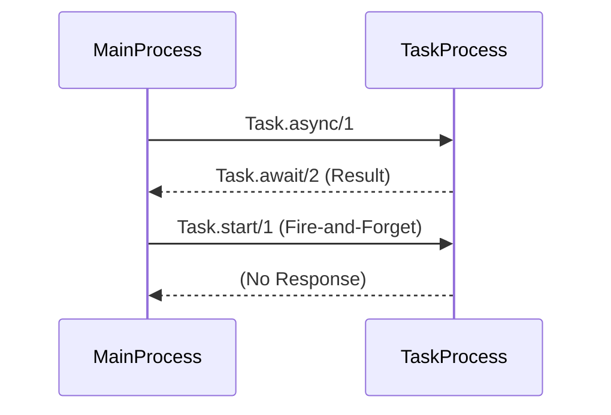

## 11.4. Task and Async Patterns

In the realm of concurrent programming, Elixir shines with its robust support for asynchronous operations. The **Task module** is a powerful tool for managing concurrency, allowing developers to execute tasks in parallel, manage their lifecycle, and handle errors gracefully. In this section, we'll delve deep into the Task and Async patterns, providing you with the knowledge to harness these capabilities effectively.

### Simplifying Concurrency with Task Module

The Task module in Elixir is designed to simplify the execution of concurrent processes. It abstracts the complexity of spawning and managing processes, offering a straightforward API for running asynchronous tasks. Let's explore the core functions of the Task module and how they can be used to run operations concurrently.

#### Running Asynchronous Operations with `Task.async/1` and `Task.await/2`

The `Task.async/1` function is used to spawn a new process that executes a given function asynchronously. This is particularly useful when you want to perform operations that can run independently of the main process, such as fetching data from multiple sources concurrently.

```elixir
defmodule AsyncExample do
  def fetch_data do
    task = Task.async(fn -> perform_heavy_computation() end)
    result = Task.await(task, 5000) # Waits for 5 seconds for the task to complete
    IO.puts("Computation result: #{result}")
  end

  defp perform_heavy_computation do
    # Simulate a heavy computation task
    :timer.sleep(2000)
    "Computation Complete"
  end
end
```

In this example, `Task.async/1` is used to start a new process that runs `perform_heavy_computation/0`. The `Task.await/2` function blocks the calling process until the task completes or the timeout is reached. This pattern is ideal for operations where you need to wait for the result before proceeding.

#### Fire-and-Forget Tasks with `Task.start/1`

Sometimes, you may want to execute a task without waiting for its result. This is known as a "fire-and-forget" task, and it can be achieved using `Task.start/1`. This function starts a task and immediately returns, allowing the main process to continue execution.

```elixir
defmodule FireAndForgetExample do
  def run do
    Task.start(fn -> log_message() end)
    IO.puts("Task started, continuing with other operations...")
  end

  defp log_message do
    :timer.sleep(1000)
    IO.puts("Logged message after 1 second")
  end
end
```

In the above code, `Task.start/1` is used to log a message after a delay. The main process does not wait for the task to complete, demonstrating a non-blocking operation.

### Error Handling in Asynchronous Tasks

Handling errors in asynchronous tasks is crucial to building robust applications. The Task module provides mechanisms to manage failures and ensure that exceptions in tasks do not crash the main process.

#### Managing Failures with `Task.await/2`

When using `Task.await/2`, if the task process crashes, an exception is raised in the calling process. This behavior allows you to handle errors using standard try-rescue blocks.

```elixir
defmodule ErrorHandlingExample do
  def run do
    task = Task.async(fn -> risky_operation() end)

    try do
      Task.await(task, 5000)
    rescue
      e in RuntimeError -> IO.puts("Caught an error: #{e.message}")
    end
  end

  defp risky_operation do
    raise "Something went wrong!"
  end
end
```

In this example, if `risky_operation/0` raises an error, it is caught in the rescue block, allowing you to handle the error gracefully.

#### Using `Task.Supervisor` for Supervised Tasks

For more complex applications, using a `Task.Supervisor` is recommended to manage tasks. A `Task.Supervisor` allows you to start tasks under a supervision tree, providing fault-tolerance and automatic restarts.

```elixir
defmodule SupervisedTaskExample do
  def start_link do
    Task.Supervisor.start_link(name: MyApp.TaskSupervisor)
  end

  def run_supervised_task do
    Task.Supervisor.async(MyApp.TaskSupervisor, fn -> supervised_operation() end)
    |> Task.await(5000)
  end

  defp supervised_operation do
    :timer.sleep(2000)
    "Supervised operation complete"
  end
end
```

Here, a `Task.Supervisor` is started with a name, and tasks are spawned under its supervision. If a task fails, the supervisor can restart it according to the defined strategy.

### Visualizing Task and Async Patterns

To better understand how tasks and async operations work in Elixir, let's visualize the process flow using a Mermaid.js diagram.


```mermaid
sequenceDiagram
    participant MainProcess
    participant TaskProcess
    MainProcess->>TaskProcess: Task.async/1
    TaskProcess-->>MainProcess: Task.await/2 (Result)
    MainProcess->>TaskProcess: Task.start/1 (Fire-and-Forget)
    TaskProcess-->>MainProcess: (No Response)
```

**Diagram Description:** This sequence diagram illustrates the interaction between the main process and task processes. `Task.async/1` spawns a new task, and `Task.await/2` waits for its result. `Task.start/1` demonstrates a fire-and-forget pattern where no response is expected.

### Elixir Unique Features

Elixir's concurrency model is built on the BEAM VM, which provides lightweight processes with low overhead. This makes Elixir particularly well-suited for concurrent applications. The Task module leverages these capabilities, offering a simple yet powerful API for asynchronous programming.

### Design Considerations

When using Task and Async patterns, consider the following:

- **Timeouts:** Always specify a timeout for `Task.await/2` to prevent indefinite blocking.
- **Error Handling:** Use try-rescue blocks to manage exceptions in tasks.
- **Supervision:** For critical tasks, use `Task.Supervisor` to ensure fault tolerance.
- **Resource Management:** Be mindful of system resources when spawning multiple tasks.

### Try It Yourself

Experiment with the provided code examples by modifying the functions or adding new tasks. For instance, try changing the delay in `perform_heavy_computation/0` or add additional tasks to see how the system handles multiple concurrent operations.

### Knowledge Check

- Can you explain the difference between `Task.async/1` and `Task.start/1`?
- How would you handle errors in a task without crashing the main process?
- What are the benefits of using a `Task.Supervisor`?

### Summary

In this section, we've explored the Task and Async patterns in Elixir, focusing on simplifying concurrency with the Task module. We've covered running asynchronous operations, fire-and-forget tasks, and error handling, providing you with the tools to build robust, concurrent applications.

Remember, mastering concurrency in Elixir opens up a world of possibilities for building scalable, fault-tolerant systems. Keep experimenting, stay curious, and enjoy the journey!

## Quiz Time!



### What function is used to start an asynchronous task in Elixir?

- [x] Task.async/1
- [ ] Task.start/1
- [ ] Task.run/1
- [ ] Task.execute/1

> **Explanation:** `Task.async/1` is used to start an asynchronous task that runs in a separate process.

### What is the purpose of `Task.await/2`?

- [x] To wait for the result of an asynchronous task
- [ ] To start a new task
- [ ] To handle errors in tasks
- [ ] To supervise tasks

> **Explanation:** `Task.await/2` is used to wait for the completion of an asynchronous task and retrieve its result.

### How can you handle errors in a task without crashing the main process?

- [x] Use try-rescue blocks
- [ ] Use Task.run/1
- [ ] Use Task.await/1
- [ ] Use Task.start/1

> **Explanation:** Errors in tasks can be handled using try-rescue blocks to catch exceptions and prevent them from crashing the main process.

### What is a fire-and-forget task?

- [x] A task that runs without waiting for its result
- [ ] A task that waits for a result
- [ ] A task that handles errors
- [ ] A task that is supervised

> **Explanation:** A fire-and-forget task is one that runs in the background without the main process waiting for its result.

### Why is it important to specify a timeout for `Task.await/2`?

- [x] To prevent indefinite blocking
- [ ] To ensure the task starts
- [ ] To handle errors
- [ ] To supervise the task

> **Explanation:** Specifying a timeout for `Task.await/2` prevents the main process from blocking indefinitely if the task takes too long to complete.

### What is the role of a `Task.Supervisor`?

- [x] To manage and supervise tasks
- [ ] To start tasks
- [ ] To handle task errors
- [ ] To execute tasks

> **Explanation:** A `Task.Supervisor` manages and supervises tasks, providing fault tolerance and automatic restarts.

### Which function is used for non-blocking background work?

- [x] Task.start/1
- [ ] Task.async/1
- [ ] Task.await/2
- [ ] Task.run/1

> **Explanation:** `Task.start/1` is used to start a task that runs in the background without blocking the main process.

### How does Elixir's concurrency model benefit from the BEAM VM?

- [x] Lightweight processes with low overhead
- [ ] Heavyweight processes with high overhead
- [ ] Single-threaded execution
- [ ] Limited concurrency support

> **Explanation:** Elixir's concurrency model benefits from the BEAM VM's lightweight processes, which have low overhead and support high concurrency.

### What should you consider when spawning multiple tasks?

- [x] Resource management
- [ ] Task naming
- [ ] Task ordering
- [ ] Task color

> **Explanation:** When spawning multiple tasks, it's important to manage system resources to avoid overloading the system.

### True or False: `Task.await/2` can be used without specifying a timeout.

- [ ] True
- [x] False

> **Explanation:** It's recommended to specify a timeout for `Task.await/2` to prevent indefinite blocking of the main process.


