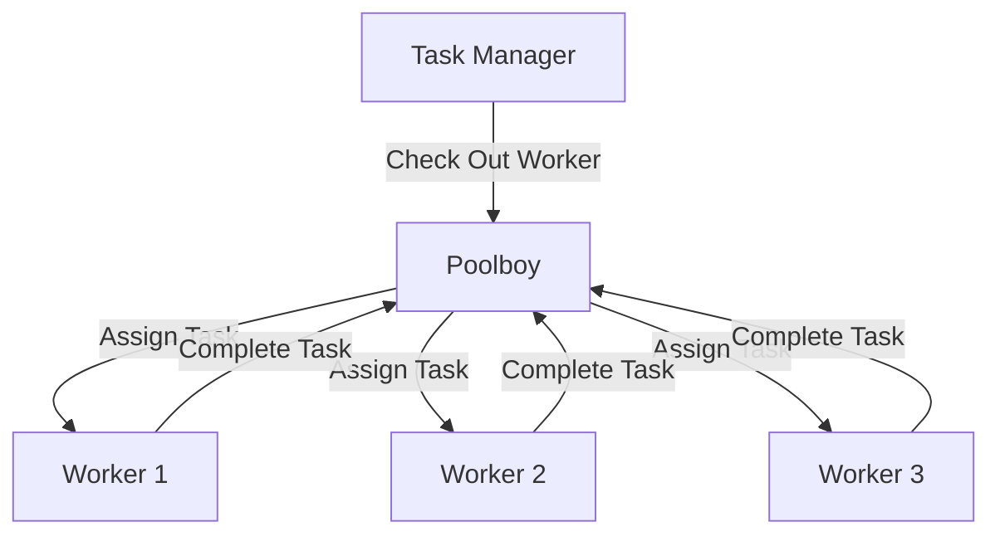

## 11.5. Process Pools and `Poolboy`

In the world of concurrent programming, managing resources efficiently is crucial. Elixir, with its robust concurrency model, provides powerful tools to handle concurrent tasks. One such tool is the concept of process pools, which allows developers to manage a pool of worker processes to handle tasks efficiently. In this section, we will delve into the intricacies of process pools in Elixir, focusing on the `Poolboy` library, which is widely used for managing worker processes.

### Reusing Processes Efficiently

In any system where tasks are performed concurrently, there is often a need to manage resources efficiently. This is particularly true when dealing with limited resources such as database connections, external API calls, or any other resource that cannot be easily scaled. Process pools provide a way to manage these resources by reusing a fixed number of worker processes to handle tasks.

#### Why Use Process Pools?

- **Resource Management**: By limiting the number of concurrent processes, you can control resource usage and prevent overloading the system.
- **Performance Optimization**: Reusing processes can reduce the overhead of creating and destroying processes, leading to better performance.
- **Fault Tolerance**: Process pools can be designed to handle failures gracefully, ensuring that the system remains stable even when individual processes fail.

### Implementing Process Pools

Elixir provides several libraries for implementing process pools, with `Poolboy` being one of the most popular. `Poolboy` is a lightweight, generic pooling library that can be used to manage a pool of worker processes efficiently.

#### Key Features of `Poolboy`

- **Dynamic Pool Size**: `Poolboy` allows you to configure the size of the pool dynamically, making it easy to adjust to changing workloads.
- **Timeouts and Limits**: You can set timeouts and limits on how long processes can be checked out, ensuring that resources are not held indefinitely.
- **Fault Tolerance**: `Poolboy` is designed to handle process failures gracefully, restarting processes as needed to maintain the pool size.

#### Setting Up `Poolboy`

To use `Poolboy` in your Elixir application, you need to add it as a dependency in your `mix.exs` file:

```elixir
defp deps do
  [
    {:poolboy, "~> 1.5"}
  ]
end
```

After adding the dependency, run `mix deps.get` to fetch the library.

#### Configuring a Pool

To configure a pool using `Poolboy`, you need to define a pool specification. This includes the pool size, maximum overflow, and the worker module that will handle tasks.

```elixir
defmodule MyApp.Pool do
  use Supervisor

  def start_link(_) do
    Supervisor.start_link(__MODULE__, :ok, name: __MODULE__)
  end

  def init(:ok) do
    poolboy_config = [
      {:name, {:local, :my_worker_pool}},
      {:worker_module, MyApp.Worker},
      {:size, 5},
      {:max_overflow, 2}
    ]

    children = [
      :poolboy.child_spec(:my_worker_pool, poolboy_config, [])
    ]

    Supervisor.init(children, strategy: :one_for_one)
  end
end
```

In this example, we define a pool named `:my_worker_pool` with a size of 5 and a maximum overflow of 2. The `MyApp.Worker` module will be used to handle tasks.

#### Implementing a Worker Module

The worker module is responsible for performing the tasks assigned by the pool. It should implement a `start_link/1` function and any other functions needed to perform the tasks.

```elixir
defmodule MyApp.Worker do
  def start_link(_) do
    Task.start_link(fn -> loop() end)
  end

  defp loop do
    receive do
      {:work, task} ->
        perform_task(task)
        loop()
    end
  end

  defp perform_task(task) do
    # Perform the task
  end
end
```

In this example, the worker module listens for `{:work, task}` messages and performs the task using the `perform_task/1` function.

### Using the Pool

Once the pool is set up, you can use it to perform tasks by checking out a worker from the pool and sending it a message.

```elixir
defmodule MyApp.TaskManager do
  def perform_task(task) do
    :poolboy.transaction(:my_worker_pool, fn pid ->
      send(pid, {:work, task})
    end)
  end
end
```

In this example, we use `:poolboy.transaction/2` to check out a worker from the pool and send it a `{:work, task}` message.

### Use Cases for Process Pools

Process pools are useful in a variety of scenarios where resources are limited or expensive to create. Some common use cases include:

- **Database Connections**: Managing a pool of database connections to ensure that the database is not overwhelmed by too many concurrent requests.
- **External API Calls**: Limiting the number of concurrent API calls to prevent hitting rate limits or overwhelming the external service.
- **File I/O**: Managing a pool of file handles to ensure that the file system is not overwhelmed by too many concurrent reads or writes.

### Visualizing Process Pools with `Poolboy`

To better understand how process pools work, let's visualize the architecture using a Mermaid.js diagram.



**Diagram Description**: This diagram illustrates the flow of tasks from the Task Manager to the Poolboy-managed worker pool. Tasks are assigned to available workers, and once completed, the workers return to the pool, ready for new tasks.

### Design Considerations

When implementing process pools, there are several design considerations to keep in mind:

- **Pool Size**: The size of the pool should be carefully chosen based on the available resources and expected workload. A pool that is too small may lead to bottlenecks, while a pool that is too large may waste resources.
- **Timeouts**: Setting appropriate timeouts for checking out workers can prevent tasks from hanging indefinitely if a worker is not available.
- **Error Handling**: Ensure that the system can handle worker failures gracefully, restarting workers as needed to maintain the pool size.

### Elixir Unique Features

Elixir's concurrency model, based on the Erlang VM (BEAM), provides several unique features that make it well-suited for implementing process pools:

- **Lightweight Processes**: Elixir processes are lightweight and can be created and destroyed quickly, making them ideal for use in process pools.
- **Fault Tolerance**: The BEAM VM is designed for fault tolerance, allowing processes to fail and be restarted without affecting the overall system.
- **Message Passing**: Elixir's message-passing model makes it easy to communicate between processes, which is essential for managing process pools.

### Differences and Similarities with Other Patterns

Process pools are often compared to other concurrency patterns, such as:

- **Task Queues**: While both process pools and task queues manage tasks, process pools focus on managing a fixed number of worker processes, while task queues focus on managing the order and execution of tasks.
- **Actor Model**: The actor model, which underlies Elixir's concurrency model, is similar to process pools in that both involve managing processes. However, process pools specifically focus on reusing a fixed number of processes to handle tasks.

### Try It Yourself

To get hands-on experience with process pools and `Poolboy`, try modifying the code examples provided. Experiment with different pool sizes, timeouts, and worker modules to see how they affect the performance and behavior of the system.

### Knowledge Check

- What are the benefits of using process pools in a concurrent system?
- How does `Poolboy` help manage worker processes in Elixir?
- What are some common use cases for process pools?
- How can you configure a pool using `Poolboy`?
- What are some design considerations when implementing process pools?

### Embrace the Journey

Remember, mastering process pools and `Poolboy` is just one step in your journey to becoming an expert in Elixir concurrency patterns. As you continue to explore and experiment, you'll gain a deeper understanding of how to build efficient, fault-tolerant systems. Keep experimenting, stay curious, and enjoy the journey!

## Quiz: Process Pools and `Poolboy`



### What is the primary purpose of using process pools in Elixir?

- [x] To manage a fixed number of worker processes efficiently
- [ ] To increase the number of processes indefinitely
- [ ] To replace the need for concurrency
- [ ] To eliminate the need for fault tolerance

> **Explanation:** Process pools are used to manage a fixed number of worker processes efficiently, optimizing resource usage and performance.

### Which library is commonly used for implementing process pools in Elixir?

- [x] Poolboy
- [ ] GenServer
- [ ] Task
- [ ] Supervisor

> **Explanation:** `Poolboy` is a popular library used for implementing process pools in Elixir.

### What is a key feature of `Poolboy`?

- [x] Dynamic pool size configuration
- [ ] Eliminating the need for worker processes
- [ ] Automatic code generation
- [ ] Replacing the need for supervisors

> **Explanation:** `Poolboy` allows for dynamic pool size configuration, making it adaptable to changing workloads.

### What is a common use case for process pools?

- [x] Managing database connections
- [ ] Increasing the number of processes indefinitely
- [ ] Replacing the need for concurrency
- [ ] Eliminating the need for fault tolerance

> **Explanation:** Process pools are commonly used for managing database connections to prevent overwhelming the database with too many concurrent requests.

### How do you configure a pool using `Poolboy`?

- [x] By defining a pool specification with size and worker module
- [ ] By eliminating the need for worker processes
- [ ] By using automatic code generation
- [ ] By replacing the need for supervisors

> **Explanation:** A pool is configured in `Poolboy` by defining a pool specification, including the size and worker module.

### What is a design consideration when implementing process pools?

- [x] Choosing an appropriate pool size
- [ ] Eliminating the need for worker processes
- [ ] Automatic code generation
- [ ] Replacing the need for supervisors

> **Explanation:** Choosing an appropriate pool size is crucial to ensure efficient resource usage and prevent bottlenecks.

### What is a unique feature of Elixir that makes it well-suited for process pools?

- [x] Lightweight processes
- [ ] Eliminating the need for worker processes
- [ ] Automatic code generation
- [ ] Replacing the need for supervisors

> **Explanation:** Elixir's lightweight processes make it ideal for implementing process pools, as they can be created and destroyed quickly.

### How does `Poolboy` handle worker failures?

- [x] By restarting workers as needed
- [ ] By eliminating the need for worker processes
- [ ] By using automatic code generation
- [ ] By replacing the need for supervisors

> **Explanation:** `Poolboy` is designed to handle worker failures gracefully, restarting workers as needed to maintain the pool size.

### What is the relationship between process pools and the actor model?

- [x] Both involve managing processes
- [ ] Both eliminate the need for worker processes
- [ ] Both use automatic code generation
- [ ] Both replace the need for supervisors

> **Explanation:** Both process pools and the actor model involve managing processes, but process pools specifically focus on reusing a fixed number of processes to handle tasks.

### True or False: Process pools can help optimize resource usage in a concurrent system.

- [x] True
- [ ] False

> **Explanation:** True. Process pools help optimize resource usage by managing a fixed number of worker processes efficiently.




