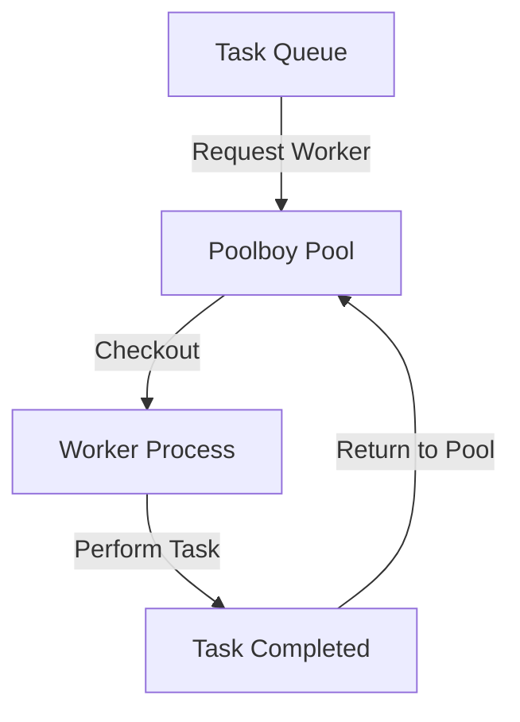

## 11.5. Process Pools and `Poolboy`

In the world of Elixir, managing concurrency efficiently is crucial for building robust and scalable applications. One of the key techniques to achieve this is through the use of process pools. In this section, we will delve into the concept of process pools, explore the `Poolboy` library, and illustrate how these tools can be leveraged for efficient resource management in Elixir applications.

### Reusing Processes Efficiently

Elixir, built on the Erlang VM, provides lightweight processes that are ideal for concurrent operations. However, creating and destroying processes can be costly when dealing with high-load systems. This is where process pools come into play. By reusing a fixed number of processes to handle tasks, we can optimize resource utilization and improve application performance.

#### Key Concepts

- **Process Pool**: A collection of pre-spawned processes that are reused to handle multiple tasks. This avoids the overhead of creating and destroying processes frequently.
- **Worker Process**: A process within the pool that performs the actual work or task assigned to it.
- **Task Queue**: A queue that holds tasks waiting to be processed by available worker processes in the pool.

### Implementing Process Pools

To implement process pools in Elixir, we can use libraries like `Poolboy`, which provide a robust and efficient mechanism to manage pools of worker processes. `Poolboy` is a widely used library in the Elixir ecosystem, known for its simplicity and performance.

#### Getting Started with `Poolboy`

To start using `Poolboy`, you first need to add it to your project's dependencies. Open your `mix.exs` file and add `:poolboy` to the list of dependencies:

```elixir
defp deps do
  [
    {:poolboy, "~> 1.5"}
  ]
end
```

Run `mix deps.get` to fetch the dependency.

#### Configuring a Pool

Next, configure a pool by defining the pool size and worker module. Here is an example configuration:

```elixir
# Define the worker module
defmodule MyApp.Worker do
  use GenServer

  def start_link(_) do
    GenServer.start_link(__MODULE__, :ok, [])
  end

  def init(:ok) do
    {:ok, %{}}
  end

  def handle_call(:work, _from, state) do
    # Perform some work
    {:reply, :ok, state}
  end
end

# Define the pool configuration
defmodule MyApp.Pool do
  def start_pool do
    :poolboy.child_spec(
      :my_pool,
      [
        {:name, {:local, :my_pool}},
        {:worker_module, MyApp.Worker},
        {:size, 5},
        {:max_overflow, 2}
      ]
    )
  end
end
```

#### Using the Pool

Once the pool is configured, you can use it to perform tasks. Here's how you can check out a worker from the pool and perform a task:

```elixir
defmodule MyApp.Task do
  def perform_task do
    :poolboy.transaction(:my_pool, fn pid ->
      GenServer.call(pid, :work)
    end)
  end
end
```

In this example, `:poolboy.transaction/2` is used to check out a worker process from the pool, perform the task, and then return the worker to the pool.

### Use Cases for Process Pools

Process pools are particularly useful in scenarios where you have limited resources or need to manage connections efficiently. Here are some common use cases:

- **Database Connections**: Managing a pool of database connections to avoid the overhead of opening and closing connections frequently.
- **External API Calls**: Handling a pool of HTTP clients for making requests to external services.
- **Limited Resources**: Managing access to limited resources such as file handles or network sockets.

### Visualizing Process Pools with `Poolboy`

To better understand how `Poolboy` manages process pools, let's visualize the interaction between tasks, the pool, and worker processes.


```mermaid
graph TD;
    A[Task Queue] -->|Request Worker| B[Poolboy Pool];
    B -->|Checkout| C[Worker Process];
    C -->|Perform Task| D[Task Completed];
    D -->|Return to Pool| B;
```

**Diagram Explanation**: This diagram shows how tasks are queued and processed by worker processes managed by `Poolboy`. Tasks request a worker from the pool, and once a worker is available, it performs the task and returns to the pool for reuse.

### Design Considerations

When implementing process pools, consider the following:

- **Pool Size**: Choose an appropriate pool size based on the expected load and available system resources.
- **Overflow**: Configure the maximum overflow to allow additional temporary workers during peak load.
- **Timeouts**: Implement timeouts to handle cases where tasks take too long to complete.

### Elixir Unique Features

Elixir's lightweight processes and message-passing capabilities make it an excellent choice for implementing process pools. The `Poolboy` library leverages these features to provide efficient resource management.

### Differences and Similarities

Process pools in Elixir are similar to thread pools in other languages, but they benefit from Elixir's lightweight processes and fault-tolerant design. Unlike traditional thread pools, Elixir's process pools can handle failures gracefully without crashing the entire application.

### Try It Yourself

To get hands-on experience with process pools and `Poolboy`, try modifying the example code to:

- Increase the pool size and observe the effect on performance.
- Implement a new worker module that performs a different task.
- Experiment with different overflow settings and timeouts.

### Knowledge Check

Before moving on, let's test your understanding of process pools and `Poolboy`.

- What are the benefits of using process pools in Elixir?
- How does `Poolboy` manage worker processes?
- What are some common use cases for process pools?

### Embrace the Journey

Remember, mastering process pools and `Poolboy` is just one step in building efficient and scalable Elixir applications. Keep experimenting, stay curious, and enjoy the journey of learning Elixir's concurrency patterns!

## Quiz Time!



### What is the primary benefit of using process pools in Elixir?

- [x] Efficient resource management
- [ ] Increased code complexity
- [ ] Faster process creation
- [ ] Reduced code readability

> **Explanation:** Process pools help manage resources efficiently by reusing processes, reducing the overhead of creating and destroying processes frequently.

### Which library is commonly used for managing process pools in Elixir?

- [ ] GenServer
- [ ] Ecto
- [x] Poolboy
- [ ] Phoenix

> **Explanation:** `Poolboy` is a popular library used for managing process pools in Elixir.

### What does the `:size` option in `Poolboy` configuration specify?

- [ ] The maximum number of tasks
- [x] The number of worker processes in the pool
- [ ] The timeout for tasks
- [ ] The priority of tasks

> **Explanation:** The `:size` option specifies the number of worker processes in the pool.

### How does `Poolboy` handle peak loads?

- [x] By allowing overflow workers
- [ ] By increasing the pool size permanently
- [ ] By rejecting tasks
- [ ] By reducing worker processes

> **Explanation:** `Poolboy` can handle peak loads by allowing overflow workers temporarily.

### What is a common use case for process pools in Elixir?

- [ ] Rendering HTML templates
- [x] Managing database connections
- [ ] Compiling code
- [ ] Logging messages

> **Explanation:** Process pools are commonly used for managing database connections efficiently.

### In the `Poolboy` configuration, what does the `:worker_module` option specify?

- [ ] The number of worker processes
- [ ] The type of tasks
- [x] The module that implements the worker logic
- [ ] The pool name

> **Explanation:** The `:worker_module` option specifies the module that implements the worker logic.

### What is the role of a worker process in a process pool?

- [ ] To manage the pool configuration
- [x] To perform tasks assigned by the pool
- [ ] To log messages
- [ ] To handle errors

> **Explanation:** A worker process performs tasks assigned by the pool.

### How can you check out a worker from a `Poolboy` pool?

- [ ] Using `GenServer.call/2`
- [x] Using `:poolboy.transaction/2`
- [ ] Using `Task.async/1`
- [ ] Using `Supervisor.start_link/2`

> **Explanation:** You can check out a worker from a `Poolboy` pool using `:poolboy.transaction/2`.

### What should you consider when choosing a pool size for `Poolboy`?

- [x] Expected load and system resources
- [ ] The number of CPU cores
- [ ] The size of the codebase
- [ ] The number of developers

> **Explanation:** When choosing a pool size, consider the expected load and available system resources.

### True or False: Elixir's process pools can handle failures without crashing the entire application.

- [x] True
- [ ] False

> **Explanation:** Elixir's process pools can handle failures gracefully, leveraging the fault-tolerant design of the Erlang VM.


