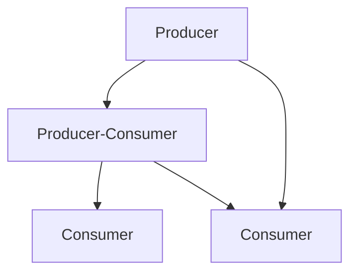

## 11.6. GenStage and Flow for Backpressure Handling

In the world of concurrent programming, managing data flow efficiently is crucial to building scalable and responsive applications. Elixir, with its robust concurrency model, provides powerful tools like GenStage and Flow to handle backpressure and parallel data processing. In this section, we will explore how to design efficient pipelines using GenStage and Flow, manage backpressure, and leverage Elixir's capabilities for parallel data processing.

### GenStage: Producer-Consumer Model

GenStage is a specification and a set of behaviors for exchanging data between Elixir processes with backpressure. It allows you to build concurrent data pipelines where data is produced, transformed, and consumed in a controlled manner. Let's break down the components of GenStage:

- **Producer**: A process that emits data. It can be a simple data source or a complex data generator.
- **Consumer**: A process that receives and processes data. It can perform operations like filtering, transformation, or aggregation.
- **Producer-Consumer**: A process that acts both as a consumer and a producer. It receives data, processes it, and then emits new data.

#### Designing Pipelines with GenStage

To design a pipeline using GenStage, you need to define the roles of each stage in the pipeline. Here's a simple example of a GenStage pipeline:

```elixir
defmodule Producer do
  use GenStage

  def start_link(initial) do
    GenStage.start_link(__MODULE__, initial, name: __MODULE__)
  end

  def init(initial) do
    {:producer, initial}
  end

  def handle_demand(demand, state) when demand > 0 do
    events = Enum.to_list(state..(state + demand - 1))
    {:noreply, events, state + demand}
  end
end

defmodule Consumer do
  use GenStage

  def start_link() do
    GenStage.start_link(__MODULE__, :ok, name: __MODULE__)
  end

  def init(:ok) do
    {:consumer, :ok}
  end

  def handle_events(events, _from, state) do
    Enum.each(events, fn event ->
      IO.inspect(event, label: "Consumed")
    end)
    {:noreply, [], state}
  end
end

{:ok, producer} = Producer.start_link(0)
{:ok, consumer} = Consumer.start_link()

GenStage.sync_subscribe(consumer, to: producer)
```

In this example, the `Producer` generates a sequence of numbers, and the `Consumer` prints each number. The `handle_demand/2` function in the producer controls how many events are generated based on the demand from the consumer.

### Managing Backpressure

Backpressure is a mechanism to control the flow of data in a system to prevent overwhelming downstream processes. In GenStage, backpressure is managed by controlling the demand for data. Consumers request data from producers, and producers only send data when there is demand.

#### Controlling Data Flow

To effectively manage backpressure, you need to balance the rate of data production with the rate of data consumption. This can be achieved by:

- **Adjusting Demand**: Consumers can control the amount of data they request from producers. By adjusting the demand, you can prevent consumers from being overwhelmed.
- **Buffering**: Introducing buffers between stages can help smooth out variations in data flow. However, excessive buffering can lead to increased memory usage.
- **Rate Limiting**: Implementing rate limiting can prevent producers from generating data too quickly.

### Flow for Parallel Data Processing

Flow is built on top of GenStage and provides a higher-level abstraction for parallel data processing. It allows you to define data processing pipelines that can leverage multiple cores for concurrent execution.

#### Leveraging Multiple Cores

Flow automatically partitions data and distributes it across multiple stages, allowing you to take advantage of all available CPU cores. Here's an example of using Flow for parallel data processing:

```elixir
alias Experimental.Flow

Flow.from_enumerable(1..1000)
|> Flow.map(&(&1 * 2))
|> Flow.filter(&rem(&1, 3) == 0)
|> Flow.reduce(fn -> 0 end, &(&1 + &2))
|> Enum.to_list()
```

In this example, Flow processes a range of numbers in parallel, doubling each number, filtering out those not divisible by 3, and then summing the results.

### Use Cases

GenStage and Flow are ideal for scenarios where you need to process large volumes of data concurrently. Some common use cases include:

- **ETL Pipelines**: Extract, Transform, Load (ETL) processes can benefit from GenStage and Flow by efficiently handling data extraction, transformation, and loading in parallel.
- **Real-Time Data Analytics**: Processing and analyzing data in real-time requires efficient data flow management, which can be achieved using GenStage and Flow.
- **Event Processing**: Systems that need to process streams of events, such as IoT applications or financial systems, can leverage GenStage and Flow for scalable event processing.

### Visualizing GenStage and Flow

To better understand the flow of data in a GenStage pipeline, let's visualize the producer-consumer model:



In this diagram, the producer generates data, which is then processed by a producer-consumer stage. The processed data is consumed by multiple consumers, demonstrating parallel processing.

### Key Participants

- **Producer**: Initiates the data flow by generating events.
- **Consumer**: Receives and processes events, requesting more data as needed.
- **Producer-Consumer**: Acts as both a consumer and a producer, transforming data before passing it downstream.

### Applicability

GenStage and Flow are applicable in scenarios where you need to manage data flow efficiently, especially when dealing with high volumes of data or real-time processing requirements. They are particularly useful in distributed systems where backpressure management is crucial to maintaining system stability.

### Sample Code Snippet

Here's a more complex example of a GenStage pipeline with multiple stages:

```elixir
defmodule DataProducer do
  use GenStage

  def start_link(initial) do
    GenStage.start_link(__MODULE__, initial, name: __MODULE__)
  end

  def init(initial) do
    {:producer, initial}
  end

  def handle_demand(demand, state) when demand > 0 do
    events = Enum.to_list(state..(state + demand - 1))
    {:noreply, events, state + demand}
  end
end

defmodule DataTransformer do
  use GenStage

  def start_link() do
    GenStage.start_link(__MODULE__, :ok, name: __MODULE__)
  end

  def init(:ok) do
    {:producer_consumer, :ok}
  end

  def handle_events(events, _from, state) do
    transformed_events = Enum.map(events, &(&1 * 2))
    {:noreply, transformed_events, state}
  end
end

defmodule DataConsumer do
  use GenStage

  def start_link() do
    GenStage.start_link(__MODULE__, :ok, name: __MODULE__)
  end

  def init(:ok) do
    {:consumer, :ok}
  end

  def handle_events(events, _from, state) do
    Enum.each(events, fn event ->
      IO.inspect(event, label: "Final Consumed")
    end)
    {:noreply, [], state}
  end
end

{:ok, producer} = DataProducer.start_link(0)
{:ok, transformer} = DataTransformer.start_link()
{:ok, consumer} = DataConsumer.start_link()

GenStage.sync_subscribe(transformer, to: producer)
GenStage.sync_subscribe(consumer, to: transformer)
```

In this example, the `DataProducer` generates numbers, the `DataTransformer` doubles each number, and the `DataConsumer` prints the final result.

### Design Considerations

When designing a GenStage pipeline, consider the following:

- **Stage Roles**: Clearly define the role of each stage in the pipeline (producer, consumer, or producer-consumer).
- **Demand Management**: Implement demand management strategies to control data flow and prevent bottlenecks.
- **Error Handling**: Ensure robust error handling to maintain system stability in case of failures.

### Elixir Unique Features

Elixir's concurrency model, built on the BEAM virtual machine, provides unique advantages for implementing GenStage and Flow:

- **Lightweight Processes**: Elixir processes are lightweight and can handle millions of concurrent operations, making them ideal for building scalable pipelines.
- **Fault Tolerance**: The "let it crash" philosophy allows you to build resilient systems that can recover from failures.
- **Hot Code Swapping**: Elixir supports hot code swapping, enabling you to update running systems without downtime.

### Differences and Similarities

GenStage and Flow are often compared to other concurrency models like Akka Streams or Kafka Streams. While they share similarities in managing data flow and backpressure, GenStage and Flow are tightly integrated with Elixir's concurrency model, providing seamless integration with other Elixir features.

### Try It Yourself

To get hands-on experience with GenStage and Flow, try modifying the code examples provided:

- **Change the Data Source**: Modify the `Producer` to generate different types of data, such as strings or complex data structures.
- **Add More Stages**: Introduce additional stages to the pipeline, such as filtering or aggregation stages.
- **Experiment with Demand**: Adjust the demand in the `Consumer` to see how it affects the data flow.

### Knowledge Check

- What is the role of a producer-consumer in a GenStage pipeline?
- How does backpressure help in managing data flow?
- What are some common use cases for GenStage and Flow?

### Embrace the Journey

Remember, mastering GenStage and Flow is just the beginning of building efficient and scalable applications in Elixir. As you continue to explore Elixir's concurrency model, you'll discover new ways to optimize data flow and leverage parallel processing. Keep experimenting, stay curious, and enjoy the journey!

## Quiz: GenStage and Flow for Backpressure Handling



### What is the primary purpose of GenStage in Elixir?

- [x] To manage data flow between processes with backpressure
- [ ] To handle HTTP requests
- [ ] To manage database connections
- [ ] To perform mathematical calculations

> **Explanation:** GenStage is designed to manage data flow between processes with backpressure, ensuring efficient data processing.

### How does a consumer control data flow in a GenStage pipeline?

- [x] By adjusting the demand for data
- [ ] By increasing the number of producers
- [ ] By reducing the number of consumers
- [ ] By changing the data source

> **Explanation:** Consumers control data flow by adjusting the demand for data, which helps manage backpressure.

### What is the role of a producer-consumer in a GenStage pipeline?

- [x] To receive, process, and emit data
- [ ] To only produce data
- [ ] To only consume data
- [ ] To manage database connections

> **Explanation:** A producer-consumer acts as both a consumer and a producer, receiving data, processing it, and emitting new data.

### What is a common use case for Flow in Elixir?

- [x] Parallel data processing
- [ ] Managing database transactions
- [ ] Handling HTTP requests
- [ ] Performing mathematical calculations

> **Explanation:** Flow is commonly used for parallel data processing, leveraging multiple cores for concurrent execution.

### How does Flow leverage multiple cores for data processing?

- [x] By partitioning data and distributing it across stages
- [ ] By increasing the number of consumers
- [ ] By reducing the number of producers
- [ ] By changing the data source

> **Explanation:** Flow partitions data and distributes it across multiple stages, allowing for concurrent execution on multiple cores.

### What is backpressure in the context of GenStage?

- [x] A mechanism to control data flow and prevent overwhelm
- [ ] A method for increasing data production
- [ ] A technique for reducing data consumption
- [ ] A strategy for managing database connections

> **Explanation:** Backpressure is a mechanism to control data flow and prevent downstream processes from being overwhelmed.

### What is the "let it crash" philosophy in Elixir?

- [x] A fault tolerance strategy that allows processes to fail and recover
- [ ] A method for increasing data production
- [ ] A technique for reducing data consumption
- [ ] A strategy for managing database connections

> **Explanation:** The "let it crash" philosophy is a fault tolerance strategy that allows processes to fail and recover, ensuring system stability.

### What is a key advantage of using GenStage and Flow in Elixir?

- [x] Efficient management of data flow and backpressure
- [ ] Increased memory usage
- [ ] Reduced processing speed
- [ ] Complex error handling

> **Explanation:** GenStage and Flow efficiently manage data flow and backpressure, making them ideal for scalable applications.

### What is the role of a buffer in a GenStage pipeline?

- [x] To smooth out variations in data flow
- [ ] To increase data production
- [ ] To reduce data consumption
- [ ] To manage database connections

> **Explanation:** Buffers help smooth out variations in data flow, preventing bottlenecks and ensuring efficient processing.

### True or False: GenStage can only be used for real-time data analytics.

- [ ] True
- [x] False

> **Explanation:** GenStage is versatile and can be used for various applications, including ETL pipelines, event processing, and more.


