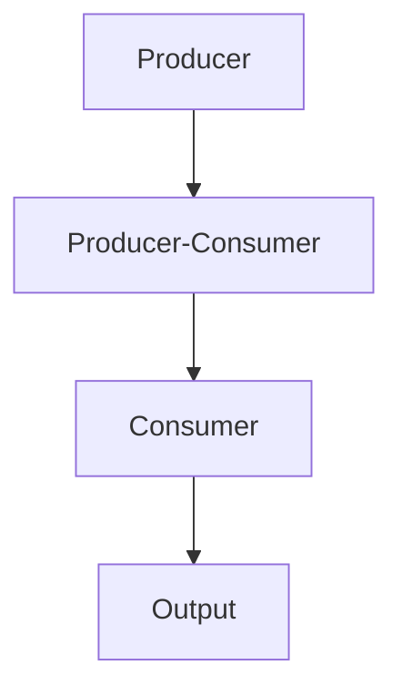

## 11.6. GenStage and Flow for Backpressure Handling

In the world of concurrent programming, managing data flow efficiently is crucial to building scalable and responsive systems. Elixir, with its robust ecosystem, offers powerful tools like GenStage and Flow to handle backpressure, ensuring that your applications can process data efficiently without overwhelming system resources. This section will delve into how you can leverage these tools to create effective and resilient data processing pipelines.

### Understanding GenStage: Producer-Consumer Model

GenStage is a specification and computational flow framework in Elixir that allows you to build concurrent data processing pipelines. It introduces a producer-consumer model where data flows through a series of stages, each responsible for a specific part of the processing.

#### Key Concepts

- **Producer**: Generates data and sends it downstream.
- **Consumer**: Receives data and processes it.
- **Producer-Consumer**: Acts as both a producer and a consumer, receiving data from upstream and sending processed data downstream.

#### Designing Pipelines with GenStage

When designing a GenStage pipeline, you typically start by defining the stages of your pipeline. Each stage can be a producer, consumer, or producer-consumer. Here’s a simple example:

```elixir
defmodule Producer do
  use GenStage

  def start_link(initial) do
    GenStage.start_link(__MODULE__, initial, name: __MODULE__)
  end

  def init(initial) do
    {:producer, initial}
  end

  def handle_demand(demand, state) when demand > 0 do
    events = Enum.to_list(state..(state + demand - 1))
    {:noreply, events, state + demand}
  end
end

defmodule Consumer do
  use GenStage

  def start_link() do
    GenStage.start_link(__MODULE__, :ok, name: __MODULE__)
  end

  def init(:ok) do
    {:consumer, :the_state_does_not_matter}
  end

  def handle_events(events, _from, state) do
    for event <- events do
      IO.inspect(event, label: "Consumed")
    end
    {:noreply, [], state}
  end
end

{:ok, producer} = Producer.start_link(0)
{:ok, consumer} = Consumer.start_link()

GenStage.sync_subscribe(consumer, to: producer)
```

In this example, the `Producer` generates a sequence of numbers, and the `Consumer` processes these numbers by printing them. The `GenStage.sync_subscribe/2` function is used to connect the consumer to the producer.

### Managing Backpressure

Backpressure is a mechanism to control the flow of data and prevent a system from being overwhelmed by too much data at once. In GenStage, backpressure is managed by the demand-driven model, where consumers request data from producers.

#### Controlling Data Flow

- **Demand-Driven**: Consumers request a specific amount of data from producers, allowing them to control the rate at which they receive data.
- **Buffering**: Producers can buffer data until consumers are ready to process it.
- **Rate Limiting**: Control the rate of data flow to match the processing capacity of consumers.

By controlling the demand, you can ensure that your application remains responsive and does not consume more resources than necessary.

### Flow for Parallel Data Processing

Flow is built on top of GenStage and provides a higher-level abstraction for parallel data processing. It allows you to leverage multiple cores for concurrent data processing, making it ideal for CPU-bound tasks.

#### Leveraging Multiple Cores

Flow automatically partitions data across available cores, allowing you to process data in parallel without having to manage the details of concurrency manually.

```elixir
alias Experimental.Flow

Flow.from_enumerable(1..1000)
|> Flow.map(&(&1 * 2))
|> Flow.filter(&rem(&1, 2) == 0)
|> Flow.reduce(fn -> 0 end, &(&1 + &2))
|> Enum.to_list()
```

In this example, `Flow.from_enumerable/1` creates a flow from a range of numbers. The flow is then transformed using `Flow.map/2` and `Flow.filter/2`, and finally reduced to a single value using `Flow.reduce/3`.

### Use Cases for GenStage and Flow

GenStage and Flow are versatile tools that can be applied to a variety of use cases, including:

- **ETL Pipelines**: Extract, transform, and load data efficiently by processing data in stages.
- **Real-Time Data Analytics**: Process and analyze data in real-time, ensuring that your system can handle high volumes of data without bottlenecks.
- **Event-Driven Architectures**: Build systems that react to events in real-time, processing data as it arrives.

### Visualizing GenStage and Flow

To better understand how GenStage and Flow work, let's visualize a typical data processing pipeline using Mermaid.js:


```mermaid
graph TD;
    A[Producer] --> B[Producer-Consumer];
    B --> C[Consumer];
    C --> D[Output];
```

In this diagram, data flows from the `Producer` to the `Producer-Consumer`, which processes the data and sends it to the `Consumer`. The `Consumer` then outputs the final result.

### Design Considerations

When using GenStage and Flow, consider the following:

- **Scalability**: Ensure that your pipeline can scale with increasing data volumes.
- **Fault Tolerance**: Design your stages to handle failures gracefully.
- **Performance**: Optimize your pipeline for performance, leveraging parallel processing where possible.

### Elixir Unique Features

Elixir’s concurrency model, based on the BEAM virtual machine, provides unique advantages for building concurrent systems. The actor model, lightweight processes, and message passing make it easy to build scalable and fault-tolerant systems.

### Differences and Similarities

While GenStage and Flow are similar in that they both enable concurrent data processing, they differ in their level of abstraction. GenStage provides a lower-level API, giving you more control over the stages, while Flow provides a higher-level API for stream processing.

### Try It Yourself

Experiment with the provided code examples by modifying the range of numbers or changing the transformation functions. Try adding additional stages to the pipeline or implementing custom backpressure strategies.

### Knowledge Check

- How does GenStage manage backpressure?
- What are the key differences between GenStage and Flow?
- How can Flow be used to leverage multiple cores for parallel processing?

### Embrace the Journey

Remember, mastering GenStage and Flow is just the beginning. As you continue to explore Elixir’s powerful concurrency model, you’ll discover new ways to build efficient and scalable systems. Keep experimenting, stay curious, and enjoy the journey!

## Quiz Time!



### What is the primary purpose of GenStage in Elixir?

- [x] To build concurrent data processing pipelines
- [ ] To manage database connections
- [ ] To create web applications
- [ ] To handle user authentication

> **Explanation:** GenStage is designed to build concurrent data processing pipelines using a producer-consumer model.

### How does GenStage manage backpressure?

- [x] Through a demand-driven model where consumers request data
- [ ] By buffering all data in memory
- [ ] By using a fixed data rate
- [ ] By prioritizing certain data packets

> **Explanation:** GenStage manages backpressure by allowing consumers to request a specific amount of data, controlling the flow.

### What is a key feature of Flow in Elixir?

- [x] It provides parallel data processing
- [ ] It manages database transactions
- [ ] It handles HTTP requests
- [ ] It generates random numbers

> **Explanation:** Flow is built on top of GenStage and provides parallel data processing capabilities.

### In a GenStage pipeline, what role does a Producer-Consumer play?

- [x] It acts as both a producer and a consumer
- [ ] It only generates data
- [ ] It only processes data
- [ ] It stores data

> **Explanation:** A Producer-Consumer in GenStage receives data from upstream and sends processed data downstream.

### Which of the following is a use case for GenStage and Flow?

- [x] Real-time data analytics
- [ ] Static website hosting
- [ ] User interface design
- [ ] Email marketing

> **Explanation:** GenStage and Flow are ideal for real-time data analytics due to their ability to handle high volumes of data efficiently.

### What does Flow leverage for concurrent data processing?

- [x] Multiple cores
- [ ] Single-threaded execution
- [ ] Network bandwidth
- [ ] Disk space

> **Explanation:** Flow leverages multiple cores to process data in parallel, enhancing concurrency.

### What is the difference between GenStage and Flow?

- [x] GenStage offers a lower-level API, while Flow provides a higher-level abstraction
- [ ] GenStage is used for web development, and Flow is for database management
- [ ] GenStage is faster than Flow
- [ ] Flow is more suitable for mobile applications

> **Explanation:** GenStage offers more control with a lower-level API, whereas Flow simplifies stream processing with a higher-level abstraction.

### What should be considered when designing a GenStage pipeline?

- [x] Scalability, fault tolerance, and performance
- [ ] User interface design
- [ ] Database schema
- [ ] Color scheme

> **Explanation:** When designing a GenStage pipeline, consider scalability, fault tolerance, and performance to ensure efficiency.

### How can you experiment with GenStage and Flow?

- [x] By modifying code examples and trying different configurations
- [ ] By changing the color scheme of your IDE
- [ ] By using a different programming language
- [ ] By adjusting your monitor settings

> **Explanation:** Experimenting with code examples and configurations allows you to understand and optimize GenStage and Flow.

### True or False: Flow can only be used for CPU-bound tasks.

- [ ] True
- [x] False

> **Explanation:** While Flow is ideal for CPU-bound tasks, it can also be used for other types of data processing.




