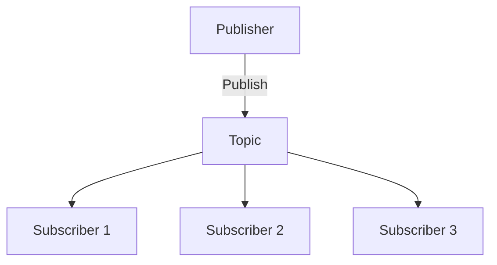

## 11.7. PubSub Patterns and Message Broadcasting

In the realm of distributed systems and real-time applications, the Publish-Subscribe (PubSub) pattern is a cornerstone for decoupling message senders from receivers. This pattern allows for scalable, flexible, and efficient communication between different parts of a system. In Elixir, the PubSub pattern is often implemented using tools like `Phoenix.PubSub` and `Registry`, which provide robust solutions for topic-based message passing. This section delves into the intricacies of PubSub patterns and message broadcasting in Elixir, exploring their implementation, use cases, and best practices.

### Publish-Subscribe Mechanism

The Publish-Subscribe mechanism is a messaging pattern where senders (publishers) do not send messages directly to specific receivers (subscribers). Instead, messages are published to a topic, and subscribers express interest in one or more topics. This decoupling of publishers and subscribers enhances scalability and flexibility, allowing systems to evolve without tightly coupling components.

#### Key Concepts

- **Publisher**: An entity that sends messages to a topic.
- **Subscriber**: An entity that receives messages from a topic it has subscribed to.
- **Topic**: A named channel through which messages are transmitted.
- **Broker**: An intermediary that manages topics and routes messages from publishers to subscribers.

### Implementing PubSub in Elixir

Elixir provides powerful tools for implementing PubSub patterns, notably through `Phoenix.PubSub` and `Registry`. These libraries facilitate efficient message broadcasting and subscription management.

#### Phoenix.PubSub

`Phoenix.PubSub` is a distributed PubSub system that supports both local and distributed message broadcasting. It is highly scalable and can be used in various scenarios, from simple local message passing to complex distributed systems.

##### Setting Up Phoenix.PubSub

To use `Phoenix.PubSub`, you need to add it to your application's dependencies and configure it in your supervision tree.

```elixir
# Add to mix.exs
defp deps do
  [
    {:phoenix_pubsub, "~> 2.0"}
  ]
end
```

```elixir
# Add to your application supervision tree
children = [
  {Phoenix.PubSub, name: MyApp.PubSub}
]

opts = [strategy: :one_for_one, name: MyApp.Supervisor]
Supervisor.start_link(children, opts)
```

##### Publishing and Subscribing

Once set up, you can publish messages to a topic and subscribe to them using the following functions:

```elixir
# Publish a message
Phoenix.PubSub.broadcast(MyApp.PubSub, "topic_name", {:event, "Hello, World!"})

# Subscribe to a topic
Phoenix.PubSub.subscribe(MyApp.PubSub, "topic_name")

# Handle incoming messages
def handle_info({:event, message}, state) do
  IO.puts("Received message: #{message}")
  {:noreply, state}
end
```

#### Registry

Elixir's `Registry` module can also be used to implement a PubSub system, especially for local message passing. It provides a lightweight alternative to `Phoenix.PubSub` for scenarios where distributed messaging is not required.

##### Setting Up Registry

To use `Registry`, you need to define it in your supervision tree:

```elixir
# Define a registry
children = [
  {Registry, keys: :duplicate, name: MyApp.Registry}
]

opts = [strategy: :one_for_one, name: MyApp.Supervisor]
Supervisor.start_link(children, opts)
```

##### Publishing and Subscribing

With `Registry`, you can register processes to receive messages for specific keys (topics):

```elixir
# Register a process for a topic
Registry.register(MyApp.Registry, "topic_name", [])

# Send a message to all processes registered under a topic
Registry.dispatch(MyApp.Registry, "topic_name", fn entries ->
  for {pid, _} <- entries do
    send(pid, {:event, "Hello, World!"})
  end
end)

# Handle incoming messages
def handle_info({:event, message}, state) do
  IO.puts("Received message: #{message}")
  {:noreply, state}
end
```

### Use Cases for PubSub Patterns

PubSub patterns are versatile and can be applied in various scenarios, including:

- **Real-Time Notifications**: Delivering instant updates to users, such as alerts or messages.
- **Chat Applications**: Facilitating communication between users in chat rooms.
- **Event Systems**: Broadcasting events to multiple subscribers, such as in a microservices architecture.

### Visualizing PubSub Architecture

To better understand the flow of messages in a PubSub system, consider the following diagram:



**Diagram Description**: This diagram illustrates a basic PubSub architecture where a publisher sends messages to a topic, and multiple subscribers receive those messages.

### Design Considerations

When implementing PubSub patterns, consider the following:

- **Scalability**: Ensure the system can handle an increasing number of publishers and subscribers.
- **Fault Tolerance**: Design the system to gracefully handle failures and ensure message delivery.
- **Latency**: Minimize the time it takes for messages to reach subscribers.

### Elixir Unique Features

Elixir's concurrency model, based on the BEAM VM, provides unique advantages for implementing PubSub systems:

- **Lightweight Processes**: Elixir processes are lightweight and can be spawned in large numbers, making them ideal for handling concurrent message passing.
- **Fault Tolerance**: The "let it crash" philosophy and supervision trees ensure robust error handling and recovery.
- **Distributed Capabilities**: Elixir's native support for distributed systems allows for seamless scaling across nodes.

### Differences and Similarities with Other Patterns

PubSub patterns are often compared to other messaging patterns, such as:

- **Message Queues**: Unlike PubSub, message queues typically involve point-to-point communication, where each message is consumed by a single receiver.
- **Observer Pattern**: Similar to PubSub, but usually implemented within a single application without a broker.

### Try It Yourself

Experiment with the provided code examples by modifying the topics and messages. Try implementing a simple chat application using `Phoenix.PubSub` or `Registry` to solidify your understanding.

### Knowledge Check

- **What are the key components of a PubSub system?**
- **How does `Phoenix.PubSub` differ from `Registry` in Elixir?**
- **What are some common use cases for PubSub patterns?**

### Summary

In this section, we've explored the PubSub pattern and its implementation in Elixir using `Phoenix.PubSub` and `Registry`. We've discussed the benefits of decoupling message senders from receivers and provided practical examples and use cases. By leveraging Elixir's unique features, you can build scalable, real-time applications that efficiently handle message broadcasting.

Remember, this is just the beginning. As you progress, you'll discover more advanced techniques and optimizations for implementing PubSub patterns in Elixir. Keep experimenting, stay curious, and enjoy the journey!

## Quiz: PubSub Patterns and Message Broadcasting



### What is the primary purpose of the PubSub pattern?

- [x] To decouple message senders from receivers
- [ ] To ensure messages are sent to a single receiver
- [ ] To prioritize message delivery based on importance
- [ ] To encrypt messages for secure transmission

> **Explanation:** The PubSub pattern is designed to decouple message senders from receivers, allowing for scalable and flexible communication.

### Which Elixir library is commonly used for distributed PubSub systems?

- [x] Phoenix.PubSub
- [ ] Ecto
- [ ] Plug
- [ ] ExUnit

> **Explanation:** Phoenix.PubSub is a distributed PubSub system commonly used in Elixir for message broadcasting.

### How does `Registry` differ from `Phoenix.PubSub` in Elixir?

- [x] `Registry` is typically used for local message passing, while `Phoenix.PubSub` supports distributed messaging.
- [ ] `Registry` is used for database interactions, while `Phoenix.PubSub` is for HTTP requests.
- [ ] `Registry` is a testing framework, while `Phoenix.PubSub` is a web server.
- [ ] `Registry` is for encryption, while `Phoenix.PubSub` is for compression.

> **Explanation:** `Registry` is often used for local message passing, whereas `Phoenix.PubSub` is designed for distributed messaging.

### What is a common use case for PubSub patterns?

- [x] Real-time notifications
- [ ] Data encryption
- [ ] File storage
- [ ] Image processing

> **Explanation:** Real-time notifications are a common use case for PubSub patterns, allowing instant updates to users.

### In a PubSub system, what is a "topic"?

- [x] A named channel through which messages are transmitted
- [ ] A database table for storing messages
- [ ] A function that processes messages
- [ ] A security protocol for message encryption

> **Explanation:** A topic is a named channel through which messages are transmitted in a PubSub system.

### What advantage does Elixir's concurrency model provide for PubSub systems?

- [x] Lightweight processes for handling concurrent message passing
- [ ] Built-in encryption for secure messaging
- [ ] Automatic message prioritization
- [ ] Guaranteed message delivery

> **Explanation:** Elixir's concurrency model allows for lightweight processes, making it ideal for handling concurrent message passing.

### What is the "let it crash" philosophy in Elixir?

- [x] A philosophy that encourages designing systems to gracefully handle failures
- [ ] A method for optimizing code performance
- [ ] A strategy for encrypting messages
- [ ] A technique for prioritizing messages

> **Explanation:** The "let it crash" philosophy encourages designing systems to gracefully handle failures and ensure robust error handling.

### What is the role of a broker in a PubSub system?

- [x] An intermediary that manages topics and routes messages
- [ ] A database for storing messages
- [ ] A function for encrypting messages
- [ ] A server for hosting web applications

> **Explanation:** A broker is an intermediary that manages topics and routes messages from publishers to subscribers.

### Which of the following is NOT a component of a PubSub system?

- [ ] Publisher
- [ ] Subscriber
- [ ] Topic
- [x] Database

> **Explanation:** A database is not a component of a PubSub system, which typically includes publishers, subscribers, and topics.

### True or False: PubSub patterns are only used in distributed systems.

- [ ] True
- [x] False

> **Explanation:** PubSub patterns can be used in both local and distributed systems, providing flexibility in message passing.


