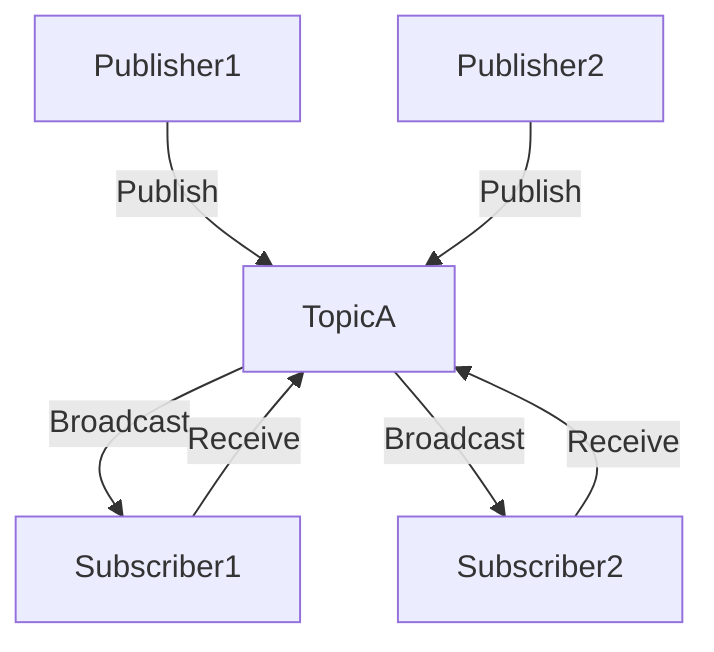

## 11.7. PubSub Patterns and Message Broadcasting

In the realm of concurrent programming, the Publish-Subscribe (PubSub) pattern stands out as a powerful mechanism for decoupling message senders from receivers. This pattern is particularly useful in building scalable, real-time applications where multiple components need to communicate asynchronously. In Elixir, the PubSub pattern is implemented using libraries like `Phoenix.PubSub` and `Registry`, which provide robust solutions for topic-based message passing.

### Publish-Subscribe Mechanism

The Publish-Subscribe mechanism is a messaging pattern where senders (publishers) do not send messages directly to specific receivers (subscribers). Instead, messages are published to a topic, and subscribers interested in that topic receive the messages. This decoupling of publishers and subscribers allows for greater flexibility and scalability in system design.

#### Key Concepts

- **Topics**: A named channel to which messages are published. Subscribers express interest in specific topics to receive relevant messages.
- **Publishers**: Components that send messages to a topic without knowing the subscribers.
- **Subscribers**: Components that receive messages from topics they have subscribed to.
- **Decoupling**: Publishers and subscribers operate independently, enhancing modularity and scalability.

### Implementing PubSub in Elixir

Elixir provides several tools for implementing the PubSub pattern, with `Phoenix.PubSub` and `Registry` being the most prominent. These libraries facilitate efficient message broadcasting and subscription management.

#### Using Phoenix.PubSub

`Phoenix.PubSub` is a distributed, scalable PubSub system used in the Phoenix framework. It allows for real-time message broadcasting across distributed nodes, making it ideal for applications requiring high availability and low latency.

##### Setting Up Phoenix.PubSub

To get started with `Phoenix.PubSub`, add it to your project dependencies:

```elixir
defp deps do
  [
    {:phoenix_pubsub, "~> 2.0"}
  ]
end
```

Next, configure `Phoenix.PubSub` in your application:

```elixir
# In your application supervisor
def start(_type, _args) do
  children = [
    {Phoenix.PubSub, name: MyApp.PubSub}
  ]

  opts = [strategy: :one_for_one, name: MyApp.Supervisor]
  Supervisor.start_link(children, opts)
end
```

##### Publishing and Subscribing

To publish a message to a topic:

```elixir
Phoenix.PubSub.broadcast(MyApp.PubSub, "topic_name", {:new_message, "Hello, world!"})
```

To subscribe to a topic:

```elixir
Phoenix.PubSub.subscribe(MyApp.PubSub, "topic_name")
```

Subscribers will receive messages via the `handle_info/2` callback:

```elixir
def handle_info({:new_message, message}, state) do
  IO.puts("Received message: #{message}")
  {:noreply, state}
end
```

#### Using Registry for PubSub

The `Registry` module in Elixir provides a lightweight alternative for implementing PubSub. It is suitable for local, in-memory message passing.

##### Setting Up Registry

To use `Registry`, add it to your supervision tree:

```elixir
def start(_type, _args) do
  children = [
    {Registry, keys: :unique, name: MyApp.Registry}
  ]

  opts = [strategy: :one_for_one, name: MyApp.Supervisor]
  Supervisor.start_link(children, opts)
end
```

##### Publishing and Subscribing with Registry

Publish a message to a topic:

```elixir
Registry.dispatch(MyApp.Registry, "topic_name", fn entries ->
  for {pid, _} <- entries do
    send(pid, {:new_message, "Hello, Registry!"})
  end
end)
```

Subscribe to a topic:

```elixir
Registry.register(MyApp.Registry, "topic_name", nil)
```

Subscribers handle messages similarly to `Phoenix.PubSub`:

```elixir
def handle_info({:new_message, message}, state) do
  IO.puts("Received message via Registry: #{message}")
  {:noreply, state}
end
```

### Use Cases for PubSub Patterns

The PubSub pattern is versatile and applicable in various scenarios, including:

- **Real-time Notifications**: Deliver instant updates to users, such as alerts or status changes.
- **Chat Applications**: Enable real-time messaging between users or groups.
- **Event Systems**: Implement event-driven architectures where components react to specific events.

### Visualizing PubSub Architecture

To better understand the flow of messages in a PubSub system, consider the following diagram:


```mermaid
graph TD;
    Publisher1 -->|Publish| TopicA;
    Publisher2 -->|Publish| TopicA;
    TopicA -->|Broadcast| Subscriber1;
    TopicA -->|Broadcast| Subscriber2;
    Subscriber1 -->|Receive| TopicA;
    Subscriber2 -->|Receive| TopicA;
```

**Diagram Description:** This diagram illustrates the PubSub architecture, where multiple publishers send messages to a common topic, and subscribers receive those messages.

### Design Considerations

When implementing PubSub patterns, consider the following:

- **Scalability**: Ensure your system can handle the expected load and scale horizontally if necessary.
- **Fault Tolerance**: Design for resilience, ensuring that message delivery is reliable even in the face of failures.
- **Latency**: Minimize latency to maintain a responsive user experience.

### Elixir Unique Features

Elixir's concurrency model, based on the BEAM VM, provides unique advantages for implementing PubSub patterns:

- **Lightweight Processes**: Elixir processes are lightweight, allowing for efficient concurrent message handling.
- **Fault Tolerance**: The "let it crash" philosophy and supervision trees enhance system reliability.
- **Distributed Capabilities**: Elixir's built-in support for distributed systems enables seamless message broadcasting across nodes.

### Differences and Similarities with Other Patterns

The PubSub pattern is often compared to other messaging patterns, such as:

- **Observer Pattern**: Both involve notifying subscribers of changes, but PubSub decouples publishers and subscribers more effectively.
- **Message Queues**: While message queues focus on reliable delivery, PubSub emphasizes real-time broadcasting.

### Try It Yourself

To deepen your understanding, try modifying the code examples:

- Change the topic names and observe how messages are routed.
- Implement additional subscribers to see how they receive messages.
- Experiment with different message payloads and handling logic.

### Knowledge Check

- **What are the key components of the PubSub pattern?**
- **How does `Phoenix.PubSub` differ from `Registry`?**
- **What are some common use cases for PubSub patterns?**

### Embrace the Journey

Remember, mastering PubSub patterns is just one step in building robust, real-time applications. As you continue exploring Elixir's capabilities, you'll unlock new possibilities for creating scalable, fault-tolerant systems. Keep experimenting, stay curious, and enjoy the journey!

## Quiz Time!



### What is the primary purpose of the PubSub pattern?

- [x] Decoupling message senders from receivers
- [ ] Ensuring message delivery reliability
- [ ] Optimizing data storage
- [ ] Enhancing user interface design

> **Explanation:** The PubSub pattern is designed to decouple message senders from receivers, allowing for greater flexibility and scalability.

### Which Elixir library is commonly used for distributed PubSub systems?

- [x] Phoenix.PubSub
- [ ] Ecto
- [ ] Plug
- [ ] Cowboy

> **Explanation:** Phoenix.PubSub is a distributed, scalable PubSub system used in the Phoenix framework.

### How does the Registry module in Elixir differ from Phoenix.PubSub?

- [x] Registry is suitable for local, in-memory message passing
- [ ] Registry is used for database management
- [ ] Registry provides built-in authentication
- [ ] Registry is a web server

> **Explanation:** The Registry module is a lightweight alternative for local, in-memory message passing, while Phoenix.PubSub is used for distributed systems.

### What is a common use case for the PubSub pattern?

- [x] Real-time notifications
- [ ] Data encryption
- [ ] File storage
- [ ] Image processing

> **Explanation:** Real-time notifications are a common use case for the PubSub pattern, allowing for instant updates to users.

### In the PubSub pattern, what is a "topic"?

- [x] A named channel for message publishing
- [ ] A type of database table
- [ ] A user interface component
- [ ] A network protocol

> **Explanation:** A topic is a named channel to which messages are published, and subscribers express interest in specific topics.

### What is the "let it crash" philosophy in Elixir?

- [x] Designing systems to recover from failures automatically
- [ ] Encouraging frequent application crashes
- [ ] Avoiding error handling
- [ ] Prioritizing performance over reliability

> **Explanation:** The "let it crash" philosophy involves designing systems to recover from failures automatically, enhancing fault tolerance.

### How can you subscribe to a topic using Phoenix.PubSub?

- [x] Phoenix.PubSub.subscribe(MyApp.PubSub, "topic_name")
- [ ] Phoenix.PubSub.register(MyApp.PubSub, "topic_name")
- [ ] Phoenix.PubSub.listen(MyApp.PubSub, "topic_name")
- [ ] Phoenix.PubSub.connect(MyApp.PubSub, "topic_name")

> **Explanation:** You can subscribe to a topic using the `Phoenix.PubSub.subscribe/2` function.

### What is a key advantage of using Elixir's lightweight processes?

- [x] Efficient concurrent message handling
- [ ] Improved graphical rendering
- [ ] Enhanced file compression
- [ ] Simplified user authentication

> **Explanation:** Elixir's lightweight processes allow for efficient concurrent message handling, making them ideal for PubSub patterns.

### Which of the following is NOT a component of the PubSub pattern?

- [ ] Topics
- [x] Databases
- [ ] Publishers
- [ ] Subscribers

> **Explanation:** Databases are not a component of the PubSub pattern, which involves topics, publishers, and subscribers.

### True or False: The Observer pattern and PubSub pattern are identical.

- [ ] True
- [x] False

> **Explanation:** The Observer pattern and PubSub pattern are similar but not identical. PubSub decouples publishers and subscribers more effectively.


