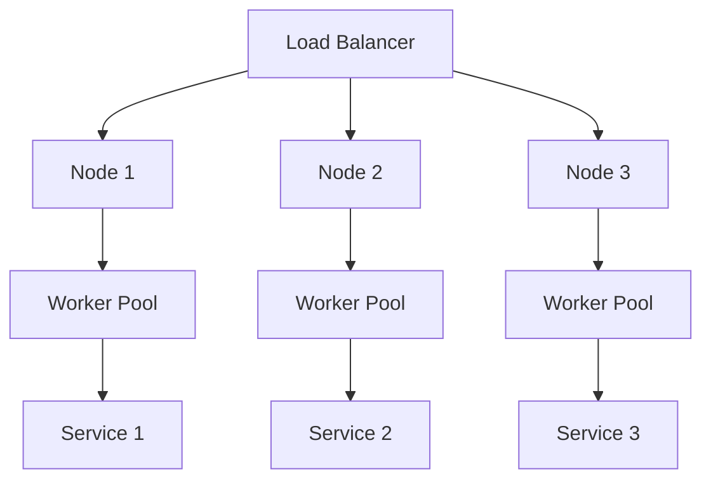

## 11.8. Designing for Scalability and Fault Tolerance

In the world of software engineering, designing systems that can scale and tolerate faults is crucial for building robust applications. Elixir, with its inherent concurrency model and the powerful OTP (Open Telecom Platform) framework, provides a solid foundation for creating scalable and fault-tolerant systems. In this section, we will explore the key concepts and strategies for achieving scalability and fault tolerance in Elixir applications.

### Horizontal Scaling

Horizontal scaling involves distributing the workload across multiple nodes or machines to handle increased demand. This approach is essential for applications that need to support a growing number of users or process large volumes of data. Let's delve into the strategies and considerations for implementing horizontal scaling in Elixir.

#### Distributed Systems with Elixir

Elixir's ability to run on the BEAM (Bogdan/Björn's Erlang Abstract Machine) virtual machine allows it to leverage Erlang's robust distributed computing capabilities. This makes Elixir an excellent choice for building distributed systems.

- **Node Communication**: Elixir nodes can communicate with each other using message passing. This is achieved through the `Node` module, which provides functions for connecting and interacting with remote nodes.

```elixir
# Connect to a remote node
Node.connect(:'node_name@hostname')

# Send a message to a process on a remote node
send({:process_name, :'node_name@hostname'}, {:hello, "world"})
```

- **Distributed Task Execution**: Use libraries like `Task` and `Task.Supervisor` to distribute tasks across nodes. This allows you to offload work to other nodes, improving the system's scalability.

```elixir
# Define a task to be executed on a remote node
Task.Supervisor.async({MyApp.TaskSupervisor, :'node_name@hostname'}, fn ->
  # Task logic here
end)
```

#### Load Balancing

Load balancing is the process of distributing incoming requests or tasks evenly across multiple nodes or processes. This ensures that no single node becomes a bottleneck, improving the system's overall performance and reliability.

- **Using a Load Balancer**: Deploy a load balancer in front of your Elixir nodes to distribute incoming HTTP requests. Popular choices include Nginx, HAProxy, and AWS Elastic Load Balancing.

- **Process Load Balancing**: Within an Elixir application, use process registries and pools to balance the load among processes. Libraries like `Poolboy` can help manage pools of worker processes.

```elixir
# Define a pool of worker processes
:poolboy.child_spec(:worker_pool, pool_size: 10, max_overflow: 5)

# Use a worker from the pool
:poolboy.transaction(:worker_pool, fn worker ->
  # Perform work with the worker
end)
```

### Fault Tolerance Strategies

Fault tolerance is the ability of a system to continue operating in the event of a failure. Elixir's "let it crash" philosophy, combined with OTP's supervision trees, provides a robust framework for building fault-tolerant systems.

#### Supervision Trees

Supervision trees are a core concept in OTP, allowing you to define a hierarchy of processes where supervisors monitor and restart child processes in case of failure.

- **Defining a Supervisor**: Use the `Supervisor` module to define a supervision tree. Specify the child processes and their restart strategies.

```elixir
defmodule MyApp.Supervisor do
  use Supervisor

  def start_link(_) do
    Supervisor.start_link(__MODULE__, :ok, name: __MODULE__)
  end

  def init(:ok) do
    children = [
      {MyApp.Worker, []}
    ]

    Supervisor.init(children, strategy: :one_for_one)
  end
end
```

- **Restart Strategies**: Choose from different restart strategies (`:one_for_one`, `:one_for_all`, `:rest_for_one`, `:simple_one_for_one`) based on the desired fault tolerance behavior.

#### Isolating Failures

Isolating failures involves designing your system in a way that prevents a failure in one component from affecting others. This can be achieved through:

- **Process Isolation**: Each Elixir process runs in its own isolated memory space. Use processes to encapsulate state and logic, ensuring that a crash in one process does not impact others.

- **Service Isolation**: In a microservices architecture, deploy services independently to isolate failures. Use tools like Docker and Kubernetes to manage service deployments.

#### Graceful Degradation

Graceful degradation is the ability of a system to maintain partial functionality when some components fail. This ensures that users can still access core features even during failures.

- **Fallback Mechanisms**: Implement fallback mechanisms to provide alternative functionality when a service is unavailable. For example, cache data locally if a remote service is down.

- **Circuit Breaker Pattern**: Use the circuit breaker pattern to detect failures and prevent repeated attempts to access a failing service. Libraries like `Fuse` can help implement this pattern in Elixir.

```elixir
# Define a circuit breaker
{:ok, breaker} = Fuse.start_link(name: :my_service_breaker)

# Use the circuit breaker to protect a service call
Fuse.run(:my_service_breaker, fn ->
  # Service call logic here
end)
```

### Visualizing Scalability and Fault Tolerance

To better understand the concepts of scalability and fault tolerance, let's visualize a typical architecture using Mermaid.js diagrams.



**Diagram Description**: This diagram illustrates a load-balanced architecture with multiple nodes, each containing a pool of worker processes. The workers handle requests and interact with various services, ensuring scalability and fault tolerance.

### Elixir Unique Features

Elixir's unique features, such as lightweight processes, message passing, and the OTP framework, make it particularly well-suited for building scalable and fault-tolerant systems. Here are some key features to leverage:

- **Lightweight Processes**: Elixir processes are lightweight and can be created in large numbers, allowing for efficient concurrency and parallelism.

- **Message Passing**: Processes communicate through message passing, enabling distributed and fault-tolerant architectures.

- **OTP Framework**: The OTP framework provides tools and libraries for building robust applications, including supervision trees, GenServers, and more.

### Differences and Similarities

When designing for scalability and fault tolerance, it's important to understand the differences and similarities between Elixir and other languages or frameworks:

- **Compared to Object-Oriented Languages**: Elixir's functional paradigm and process-based concurrency model differ significantly from object-oriented languages that rely on threads and shared state.

- **Compared to Other Functional Languages**: While Elixir shares some similarities with other functional languages like Haskell, its focus on concurrency and fault tolerance through OTP sets it apart.

### Try It Yourself

To solidify your understanding of scalability and fault tolerance in Elixir, try modifying the code examples provided. Experiment with different supervision strategies, implement a circuit breaker, or set up a simple distributed system with multiple nodes.

### Knowledge Check

- Explain how horizontal scaling can improve the performance of an Elixir application.
- Describe the role of supervision trees in achieving fault tolerance.
- What are the benefits of using a load balancer in a distributed system?
- How does the circuit breaker pattern contribute to graceful degradation?

### Embrace the Journey

Remember, designing for scalability and fault tolerance is an ongoing journey. As you build more complex systems, continue to explore new patterns and techniques. Stay curious, experiment, and enjoy the process of creating resilient applications with Elixir.

## Quiz: Designing for Scalability and Fault Tolerance



### What is horizontal scaling in Elixir?

- [x] Distributing workload across multiple nodes
- [ ] Increasing the capacity of a single node
- [ ] Using a single node to handle all requests
- [ ] Reducing the number of nodes in a system

> **Explanation:** Horizontal scaling involves distributing the workload across multiple nodes to handle increased demand.

### Which module is used for node communication in Elixir?

- [x] Node
- [ ] Supervisor
- [ ] GenServer
- [ ] Task

> **Explanation:** The `Node` module provides functions for connecting and interacting with remote nodes in Elixir.

### What is the purpose of a load balancer?

- [x] Ensuring even distribution of tasks
- [ ] Increasing the speed of a single node
- [ ] Reducing the number of requests
- [ ] Isolating failures

> **Explanation:** A load balancer distributes incoming requests or tasks evenly across multiple nodes or processes.

### What is a supervision tree?

- [x] A hierarchy of processes for fault tolerance
- [ ] A method for scaling horizontally
- [ ] A technique for load balancing
- [ ] A way to isolate failures

> **Explanation:** A supervision tree is a hierarchy of processes where supervisors monitor and restart child processes in case of failure.

### Which pattern helps in graceful degradation?

- [x] Circuit Breaker Pattern
- [ ] Singleton Pattern
- [ ] Factory Pattern
- [ ] Observer Pattern

> **Explanation:** The circuit breaker pattern helps detect failures and prevent repeated attempts to access a failing service, contributing to graceful degradation.

### What is the "let it crash" philosophy?

- [x] Allowing processes to fail and be restarted
- [ ] Preventing any process from crashing
- [ ] Ensuring all processes run without errors
- [ ] Avoiding the use of supervision trees

> **Explanation:** The "let it crash" philosophy involves allowing processes to fail and be restarted by supervisors, ensuring fault tolerance.

### How does Elixir achieve process isolation?

- [x] Each process runs in its own isolated memory space
- [ ] By using shared memory between processes
- [ ] Through global variables
- [ ] By avoiding the use of processes

> **Explanation:** Each Elixir process runs in its own isolated memory space, ensuring that a crash in one process does not impact others.

### What is the role of the OTP framework in Elixir?

- [x] Providing tools for building robust applications
- [ ] Increasing the speed of Elixir code
- [ ] Reducing the number of processes
- [ ] Preventing any process from crashing

> **Explanation:** The OTP framework provides tools and libraries for building robust applications, including supervision trees and GenServers.

### What is the benefit of using lightweight processes in Elixir?

- [x] Efficient concurrency and parallelism
- [ ] Increased memory usage
- [ ] Slower execution of tasks
- [ ] Reduced fault tolerance

> **Explanation:** Elixir processes are lightweight and can be created in large numbers, allowing for efficient concurrency and parallelism.

### True or False: Elixir's functional paradigm is similar to object-oriented languages.

- [ ] True
- [x] False

> **Explanation:** Elixir's functional paradigm and process-based concurrency model differ significantly from object-oriented languages that rely on threads and shared state.


