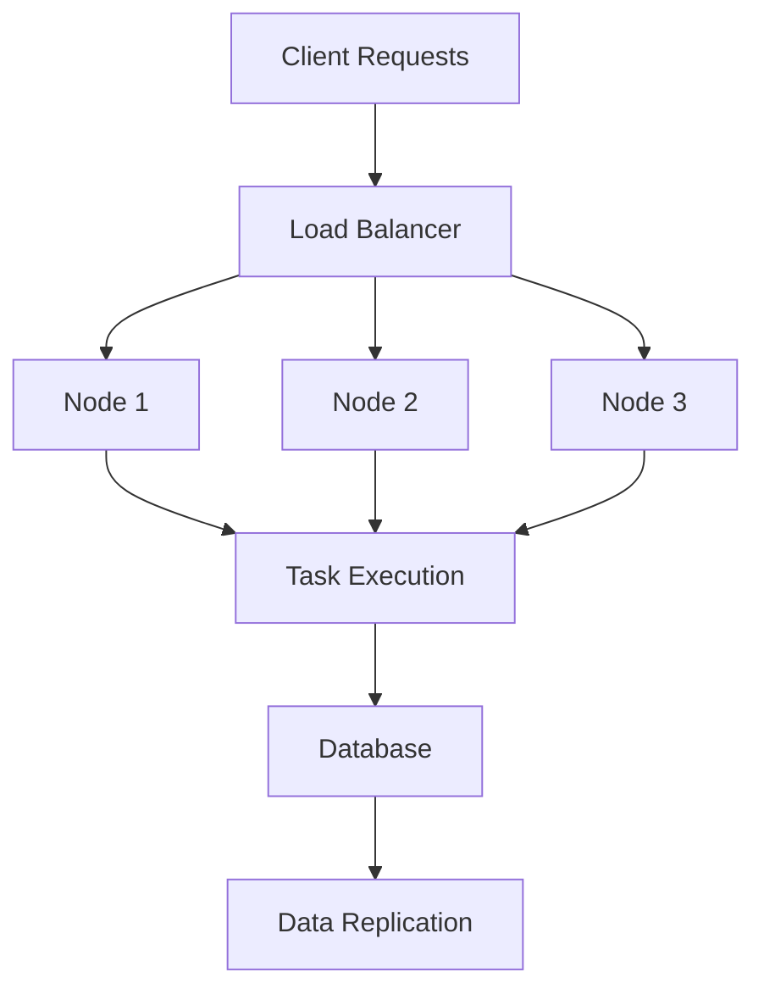

## 11.8. Designing for Scalability and Fault Tolerance

In the world of software engineering, designing systems that can gracefully handle increased loads and recover from failures is crucial. Elixir, with its concurrency model and robust ecosystem, provides powerful tools for building scalable and fault-tolerant applications. In this section, we'll explore the key concepts and techniques for achieving these goals in Elixir.

### Horizontal Scaling

Horizontal scaling, often referred to as scale-out, involves adding more nodes to a system to handle increased load. This approach is essential for building distributed systems that can grow with demand. Here's how you can implement horizontal scaling in Elixir:

#### Distributing Workload Across Multiple Nodes

1. **Node Communication**: Elixir's ability to run on the BEAM VM allows for seamless communication between nodes. Use `Node.connect/1` to establish connections between nodes and `Node.list/0` to manage them.

2. **Distributed Task Execution**: Leverage libraries like [Task.Supervisor](https://hexdocs.pm/elixir/Task.Supervisor.html) to distribute tasks across nodes. This approach ensures that tasks are executed where resources are available.

3. **Service Discovery**: Implement service discovery mechanisms to dynamically locate and connect to available nodes. Tools like [Libcluster](https://hex.pm/packages/libcluster) can automate this process, ensuring that nodes are aware of each other.

4. **Data Consistency**: Consider eventual consistency models for distributed data. Use [Mnesia](https://erlang.org/doc/man/mnesia.html) or [Cassandra](https://cassandra.apache.org/) for distributed databases that support horizontal scaling.

```elixir
# Example of using Task.Supervisor to distribute tasks
defmodule DistributedTask do
  def start_task(node, task_fun) do
    Task.Supervisor.async({MyApp.TaskSupervisor, node}, task_fun)
  end
end

# Usage
DistributedTask.start_task(:node1@hostname, fn -> IO.puts("Task executed on node1") end)
```

### Fault Tolerance Strategies

Fault tolerance is the ability of a system to continue operating in the event of a failure. Elixir's "let it crash" philosophy and OTP framework provide robust mechanisms for building fault-tolerant systems.

#### Isolating Failures

1. **Supervision Trees**: Use supervision trees to isolate failures. Supervisors monitor worker processes and restart them if they fail, ensuring that the system remains operational.

2. **Process Isolation**: Each process in Elixir runs in its own memory space, preventing failures from cascading. Design your system to leverage this isolation by breaking down tasks into independent processes.

3. **Circuit Breakers**: Implement circuit breakers to detect and respond to failures. Libraries like [Fuse](https://hex.pm/packages/fuse) provide mechanisms to prevent cascading failures by temporarily halting operations when errors are detected.

```elixir
# Example of a simple supervisor
defmodule MyApp.Supervisor do
  use Supervisor

  def start_link(opts) do
    Supervisor.start_link(__MODULE__, :ok, opts)
  end

  def init(:ok) do
    children = [
      {MyApp.Worker, []} # Define worker processes here
    ]

    Supervisor.init(children, strategy: :one_for_one)
  end
end
```

#### Designing for Graceful Degradation

1. **Fallback Mechanisms**: Design systems with fallback mechanisms to handle failures gracefully. For instance, if a primary service fails, switch to a backup service.

2. **Timeouts and Retries**: Implement timeouts and retry logic to handle transient failures. Use `:timer` and `:retry` libraries to automate these processes.

3. **Load Shedding**: In high-load scenarios, prioritize critical tasks and shed non-essential ones. This approach ensures that essential services remain available.

### Load Balancing

Load balancing ensures even distribution of tasks across nodes, preventing bottlenecks and ensuring optimal resource utilization.

#### Ensuring Even Distribution of Tasks

1. **Round Robin Load Balancing**: Implement round-robin algorithms to distribute tasks evenly across nodes. This approach is simple and effective for stateless tasks.

2. **Consistent Hashing**: Use consistent hashing for stateful tasks to ensure that related tasks are processed by the same node. This technique minimizes data transfer and improves cache hit rates.

3. **Dynamic Load Balancing**: Monitor system load and dynamically adjust task distribution. Use tools like [Horde](https://hex.pm/packages/horde) to manage distributed processes and balance load in real-time.

```elixir
# Example of a simple round-robin load balancer
defmodule LoadBalancer do
  def distribute_task(nodes, task_fun) do
    node = Enum.random(nodes)
    Task.Supervisor.async({MyApp.TaskSupervisor, node}, task_fun)
  end
end

# Usage
nodes = [:node1@hostname, :node2@hostname, :node3@hostname]
LoadBalancer.distribute_task(nodes, fn -> IO.puts("Task executed on a random node") end)
```

### Visualizing System Architecture

To better understand the architecture of scalable and fault-tolerant systems in Elixir, let's visualize a typical setup using a Mermaid.js diagram.


```mermaid
graph TD;
    A[Client Requests] --> B[Load Balancer];
    B --> C[Node 1];
    B --> D[Node 2];
    B --> E[Node 3];
    C --> F[Task Execution];
    D --> F;
    E --> F;
    F --> G[Database];
    G --> H[Data Replication];
```

**Diagram Description**: This diagram illustrates a scalable system architecture where client requests are distributed by a load balancer to multiple nodes. Each node executes tasks and interacts with a distributed database, ensuring data consistency through replication.

### Elixir Unique Features

Elixir's unique features, such as its lightweight processes, robust concurrency model, and seamless integration with Erlang's OTP, make it an ideal choice for building scalable and fault-tolerant systems. Here are some key aspects to consider:

- **Lightweight Processes**: Elixir's processes are extremely lightweight, allowing you to run millions of them concurrently. This capability is crucial for handling high loads and achieving scalability.

- **OTP Framework**: The OTP framework provides battle-tested tools for building concurrent and fault-tolerant applications. Supervisors, GenServers, and other OTP components are essential for managing process lifecycles and handling failures.

- **Hot Code Upgrades**: Elixir supports hot code upgrades, allowing you to update your system without downtime. This feature is invaluable for maintaining high availability in production environments.

### Differences and Similarities with Other Patterns

When designing for scalability and fault tolerance, it's important to distinguish between similar patterns and approaches:

- **Horizontal vs. Vertical Scaling**: Horizontal scaling involves adding more nodes, while vertical scaling involves adding more resources to existing nodes. Elixir excels at horizontal scaling due to its distributed nature.

- **Fault Tolerance vs. High Availability**: Fault tolerance focuses on recovering from failures, while high availability focuses on minimizing downtime. Elixir's OTP framework supports both by providing tools for process recovery and system monitoring.

### Try It Yourself

To solidify your understanding of these concepts, try experimenting with the code examples provided. Modify the load balancer to use different algorithms, or implement a simple circuit breaker using the `Fuse` library. Observe how these changes affect the system's scalability and fault tolerance.

### Knowledge Check

- Explain how Elixir's lightweight processes contribute to scalability.
- Describe the role of supervision trees in fault tolerance.
- How does load balancing prevent bottlenecks in a distributed system?
- What are the benefits of using consistent hashing for task distribution?
- How can you implement service discovery in an Elixir application?

### Embrace the Journey

Remember, designing scalable and fault-tolerant systems is an ongoing process. As you gain experience, you'll discover new techniques and optimizations. Keep experimenting, stay curious, and enjoy the journey of mastering Elixir's powerful concurrency model.

## Quiz Time!



### What is horizontal scaling?

- [x] Adding more nodes to a system to handle increased load
- [ ] Adding more resources to existing nodes
- [ ] Reducing the number of nodes
- [ ] Increasing the memory of a single node

> **Explanation:** Horizontal scaling involves adding more nodes to a system to distribute the workload and handle increased demand.

### Which Elixir feature supports fault tolerance?

- [x] Supervision trees
- [ ] Vertical scaling
- [ ] Load balancing
- [ ] Data replication

> **Explanation:** Supervision trees are a key feature of Elixir's OTP framework that help in isolating and recovering from process failures.

### What is the purpose of a load balancer?

- [x] Ensuring even distribution of tasks across nodes
- [ ] Increasing the memory of nodes
- [ ] Reducing the number of nodes
- [ ] Decreasing the CPU usage of a single node

> **Explanation:** Load balancers distribute tasks evenly across nodes to prevent bottlenecks and ensure optimal resource utilization.

### How does consistent hashing benefit task distribution?

- [x] Ensures related tasks are processed by the same node
- [ ] Randomly distributes tasks across nodes
- [ ] Increases the number of nodes
- [ ] Decreases the memory usage of nodes

> **Explanation:** Consistent hashing ensures that related tasks are processed by the same node, minimizing data transfer and improving cache hit rates.

### What is a key benefit of using Elixir's lightweight processes?

- [x] Ability to run millions of processes concurrently
- [ ] Increased memory usage
- [ ] Decreased CPU performance
- [ ] Reduced fault tolerance

> **Explanation:** Elixir's lightweight processes allow for running millions of them concurrently, which is crucial for handling high loads and achieving scalability.

### What is the role of service discovery in a distributed system?

- [x] Dynamically locating and connecting to available nodes
- [ ] Increasing the memory of nodes
- [ ] Reducing the number of nodes
- [ ] Decreasing the CPU usage of a single node

> **Explanation:** Service discovery helps in dynamically locating and connecting to available nodes, ensuring that nodes are aware of each other in a distributed system.

### What is the "let it crash" philosophy in Elixir?

- [x] Allowing processes to fail and restart automatically
- [ ] Preventing any process from failing
- [ ] Reducing the number of processes
- [ ] Increasing the memory usage of processes

> **Explanation:** The "let it crash" philosophy involves allowing processes to fail and restart automatically, ensuring that the system remains operational.

### What is the benefit of using hot code upgrades in Elixir?

- [x] Updating the system without downtime
- [ ] Increasing the memory of nodes
- [ ] Reducing the number of nodes
- [ ] Decreasing the CPU usage of a single node

> **Explanation:** Hot code upgrades allow you to update the system without downtime, maintaining high availability in production environments.

### What is the difference between fault tolerance and high availability?

- [x] Fault tolerance focuses on recovering from failures, while high availability minimizes downtime
- [ ] Fault tolerance increases memory usage, while high availability decreases it
- [ ] Fault tolerance reduces the number of nodes, while high availability increases it
- [ ] Fault tolerance decreases CPU usage, while high availability increases it

> **Explanation:** Fault tolerance focuses on recovering from failures, while high availability focuses on minimizing downtime.

### What is the purpose of a circuit breaker in a distributed system?

- [x] Detecting and responding to failures
- [ ] Increasing the memory of nodes
- [ ] Reducing the number of nodes
- [ ] Decreasing the CPU usage of a single node

> **Explanation:** Circuit breakers detect and respond to failures, preventing cascading failures by temporarily halting operations when errors are detected.


