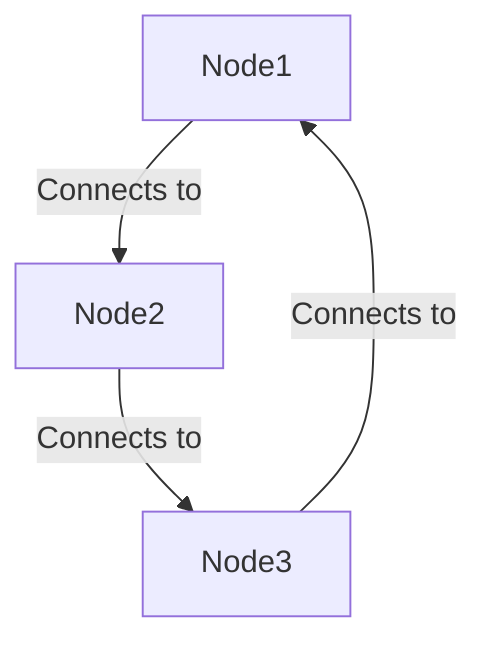
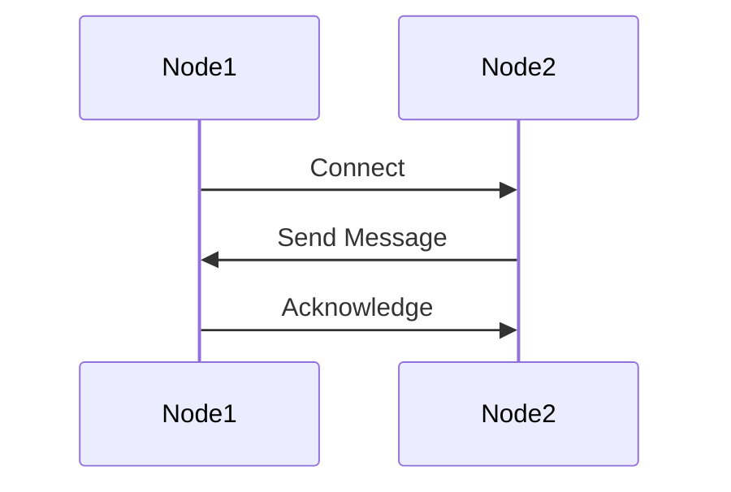

## 11.9. Distributed Systems with Multiple Nodes

In the world of distributed systems, Elixir stands out due to its robust concurrency model and the power of the BEAM virtual machine. This section delves into the intricacies of building distributed systems with multiple nodes in Elixir, focusing on node connections, global process registration, data consistency, and the challenges faced in distributed environments.

### Connecting Nodes

To build a distributed system in Elixir, the first step is to establish connections between nodes. Nodes in Elixir are instances of the Erlang runtime system, and they can communicate with each other over a network.

#### Establishing Connections Using Node Names and Cookies

Nodes are identified by names, which are typically in the format `name@hostname`. To connect nodes, they must share a common secret known as a "cookie." This cookie acts as a password, ensuring that only authorized nodes can communicate with each other.

Here's how you can connect nodes:

1. **Start the Nodes**: Launch the nodes with unique names and the same cookie.

```elixir
# Start the first node
iex --sname node1 --cookie secret_cookie

# Start the second node
iex --sname node2 --cookie secret_cookie
```

2. **Connect the Nodes**: Use the `Node.connect/1` function to establish a connection.

```elixir
# On node1
Node.connect(:node2@hostname)
```

3. **Verify the Connection**: Check the list of connected nodes using `Node.list/0`.

```elixir
# On node1
Node.list() # Should return [:node2@hostname]
```

#### Visualizing Node Connections



*Diagram: A simple representation of node connections in a distributed Elixir system.*

### Global Process Registration

In a distributed system, processes running on different nodes need to communicate seamlessly. Global process registration allows processes to be identified by a unique name across nodes.

#### Sharing Process Names Across Nodes

Elixir provides the `:global` module to register processes globally. This ensures that a process can be accessed by its name from any node in the system.

```elixir
# Register a process globally
:global.register_name(:my_process, self())

# Access the process from another node
pid = :global.whereis_name(:my_process)
```

#### Considerations for Global Registration

- **Uniqueness**: Ensure that process names are unique across the entire system to avoid conflicts.
- **Performance**: Global registration can introduce overhead, so use it judiciously.

### Data Consistency and Replication

In distributed systems, maintaining data consistency is a significant challenge. Elixir offers various strategies to handle data consistency and replication.

#### Handling Eventual Consistency

Eventual consistency is a model where updates to a data store are propagated to all nodes, but not necessarily immediately. This model is suitable for systems where availability is prioritized over immediate consistency.

- **Use Case**: Social media feeds, where eventual consistency is acceptable.
- **Implementation**: Use distributed databases like Riak or Cassandra that support eventual consistency.

#### Choosing Appropriate Data Stores

Selecting the right data store is crucial for achieving the desired consistency model. Consider the following options:

- **Riak**: A distributed NoSQL database that offers high availability and eventual consistency.
- **Cassandra**: Known for its linear scalability and eventual consistency.
- **Mnesia**: An Erlang-based distributed database that supports both strong and eventual consistency.

### Challenges in Distributed Systems

Building distributed systems comes with its own set of challenges. Understanding these challenges is essential for designing robust systems.

#### Network Partitioning

Network partitioning occurs when nodes in a distributed system are unable to communicate due to network failures. This can lead to data inconsistency and availability issues.

- **Solution**: Implement partition-tolerant algorithms and use databases that handle partitions gracefully.

#### Latency

Latency is the delay in communication between nodes. It can affect the performance and responsiveness of a distributed system.

- **Solution**: Optimize network configurations and use caching to reduce latency.

#### Distributed Consensus

Achieving consensus in a distributed system is challenging due to the possibility of node failures and network partitions.

- **Solution**: Use consensus algorithms like Paxos or Raft to ensure agreement among nodes.

### Code Example: A Simple Distributed System

Let's build a simple distributed system where nodes communicate and share data.

```elixir
defmodule DistributedSystem do
  def start do
    # Start a process and register it globally
    pid = spawn(fn -> loop() end)
    :global.register_name(:shared_process, pid)
  end

  defp loop do
    receive do
      {:message, msg} ->
        IO.puts("Received message: #{msg}")
        loop()
    end
  end

  def send_message(node, msg) do
    # Send a message to the globally registered process
    :rpc.call(node, :global, :whereis_name, [:shared_process])
    |> send({:message, msg})
  end
end

# Start the system on node1
DistributedSystem.start()

# Send a message from node2
DistributedSystem.send_message(:node1@hostname, "Hello from node2!")
```

### Try It Yourself

Experiment with the code example by modifying the message content or adding more nodes to the system. Observe how messages are passed between nodes and how global process registration facilitates communication.

### Visualizing the Distributed System



*Diagram: Sequence of interactions between nodes in a distributed Elixir system.*

### References and Further Reading

- [Elixir Node Documentation](https://hexdocs.pm/elixir/Node.html)
- [Erlang Global Module](http://erlang.org/doc/man/global.html)
- [Distributed Systems Concepts](https://en.wikipedia.org/wiki/Distributed_computing)

### Knowledge Check

- What is the role of a cookie in connecting Elixir nodes?
- How does global process registration facilitate communication in a distributed system?
- What are the challenges of maintaining data consistency in distributed systems?

### Embrace the Journey

Building distributed systems is a complex yet rewarding endeavor. As you explore the capabilities of Elixir in this domain, remember that each challenge is an opportunity to learn and grow. Keep experimenting, stay curious, and enjoy the journey!

## Quiz: Distributed Systems with Multiple Nodes



### What is the primary purpose of a cookie in Elixir's distributed systems?

- [x] To authenticate and authorize node connections
- [ ] To encrypt data between nodes
- [ ] To store session data
- [ ] To manage node resources

> **Explanation:** Cookies in Elixir are used to authenticate and authorize connections between nodes, ensuring that only nodes with the same cookie can communicate.

### How can you register a process globally in Elixir?

- [x] Using the `:global` module
- [ ] Using the `:local` module
- [ ] Using the `:distributed` module
- [ ] Using the `:network` module

> **Explanation:** The `:global` module in Elixir allows processes to be registered globally, making them accessible by name across nodes.

### Which of the following is a challenge in distributed systems?

- [x] Network partitioning
- [ ] High CPU usage
- [ ] Memory leaks
- [ ] Slow disk I/O

> **Explanation:** Network partitioning is a significant challenge in distributed systems, where nodes may become isolated due to network failures.

### What is eventual consistency?

- [x] A model where updates are propagated to all nodes eventually
- [ ] A model where updates are immediately consistent across nodes
- [ ] A model where updates are never consistent
- [ ] A model where updates are consistent only during network partitions

> **Explanation:** Eventual consistency is a model where updates are propagated to all nodes eventually, but not necessarily immediately.

### Which database is known for supporting eventual consistency?

- [x] Riak
- [ ] MySQL
- [x] Cassandra
- [ ] PostgreSQL

> **Explanation:** Both Riak and Cassandra are known for supporting eventual consistency, making them suitable for distributed systems.

### What is the role of the `Node.connect/1` function?

- [x] To establish a connection between nodes
- [ ] To disconnect nodes
- [ ] To register a node globally
- [ ] To send messages between nodes

> **Explanation:** The `Node.connect/1` function is used to establish a connection between nodes in a distributed Elixir system.

### Which algorithm is used for distributed consensus?

- [x] Paxos
- [ ] Dijkstra's
- [x] Raft
- [ ] Bellman-Ford

> **Explanation:** Paxos and Raft are algorithms used for achieving distributed consensus, ensuring agreement among nodes.

### What is a common solution to reduce latency in distributed systems?

- [x] Caching
- [ ] Increasing CPU speed
- [ ] Adding more RAM
- [ ] Using SSDs

> **Explanation:** Caching is a common solution to reduce latency in distributed systems by storing frequently accessed data closer to the nodes.

### What does the `Node.list/0` function return?

- [x] A list of connected nodes
- [ ] A list of registered processes
- [ ] A list of available cookies
- [ ] A list of network interfaces

> **Explanation:** The `Node.list/0` function returns a list of nodes that are currently connected to the local node.

### True or False: Global process registration can introduce overhead in a distributed system.

- [x] True
- [ ] False

> **Explanation:** Global process registration can introduce overhead due to the need to maintain and synchronize process names across nodes.


