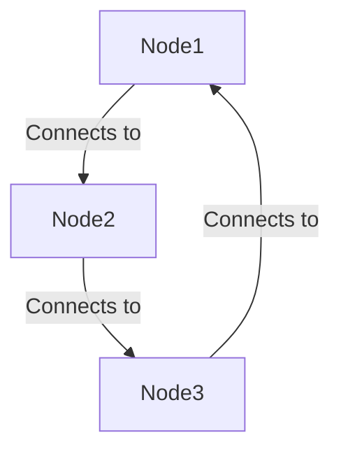
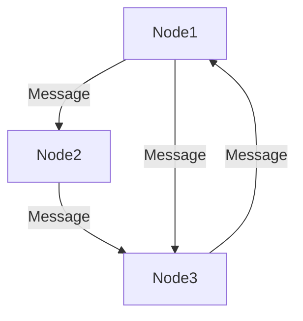

## 11.9. Distributed Systems with Multiple Nodes

In the realm of modern computing, distributed systems have become a cornerstone for building scalable, resilient, and efficient applications. Elixir, with its robust concurrency model and the underlying BEAM VM, provides an excellent platform for developing distributed systems. In this section, we will delve into the intricacies of building distributed systems with multiple nodes using Elixir. We will cover key concepts such as connecting nodes, global process registration, data consistency, replication, and address the challenges faced in distributed environments.

### Connecting Nodes

One of the foundational aspects of a distributed system is the ability to connect multiple nodes. In Elixir, nodes are essentially instances of the Erlang VM that can communicate with each other. This communication is facilitated using node names and cookies, which ensure secure and authenticated connections.

#### Establishing Connections

To establish a connection between nodes, you need to assign each node a unique name and a shared secret called a cookie. The node name is typically in the format of `name@hostname`. Here's how you can set up a basic connection between two nodes:

```elixir
# Start the first node
iex --sname node1 --cookie secret_cookie

# Start the second node
iex --sname node2 --cookie secret_cookie

# Connect node2 to node1
Node.connect(:'node1@hostname')
```

- **Node Names**: Ensure that each node has a unique name within the cluster.
- **Cookies**: Cookies act as a shared secret for authentication. Nodes with different cookies cannot connect to each other.

#### Visualizing Node Connections

To better understand how nodes connect in a distributed system, consider the following diagram:


```mermaid
graph TD;
    A[Node1] -- Connects to --> B[Node2];
    B -- Connects to --> C[Node3];
    C -- Connects to --> A;
```

*This diagram illustrates a simple three-node cluster where each node is connected to the others.*

### Global Process Registration

In a distributed system, it's often necessary to share process names across nodes for easier access and coordination. Elixir provides mechanisms for global process registration, allowing processes to be identified uniquely across the entire cluster.

#### Sharing Process Names

The `:global` module in Elixir can be used to register processes globally. This enables any node in the cluster to send messages to a registered process, regardless of its location.

```elixir
# Register a process globally
:global.register_name(:my_process, self())

# Access the globally registered process from another node
pid = :global.whereis_name(:my_process)
send(pid, :hello)
```

- **Global Registration**: Use the `:global` module to register processes that need to be accessed across nodes.
- **Process Lookup**: Use `:global.whereis_name/1` to find the PID of a globally registered process.

### Data Consistency and Replication

Data consistency and replication are critical aspects of distributed systems. In Elixir, handling eventual consistency and choosing appropriate data stores are essential for maintaining system integrity and performance.

#### Handling Eventual Consistency

In distributed systems, achieving strong consistency can be challenging due to network latency and partitioning. Instead, many systems opt for eventual consistency, where updates are propagated asynchronously, and consistency is achieved over time.

- **Eventual Consistency**: Accept that data may be temporarily inconsistent but will converge to a consistent state eventually.
- **Conflict Resolution**: Implement mechanisms to resolve conflicts that arise from concurrent updates.

#### Choosing Appropriate Data Stores

Selecting the right data store is crucial for achieving the desired consistency and replication strategy. Elixir developers often use distributed databases like Riak, Cassandra, or even PostgreSQL with replication.

- **Riak**: A key-value store designed for high availability and eventual consistency.
- **Cassandra**: A wide-column store that provides tunable consistency levels.
- **PostgreSQL**: A relational database that supports replication and can be configured for eventual consistency.

### Challenges in Distributed Systems

Building distributed systems comes with its own set of challenges. Understanding these challenges is key to designing robust and resilient systems.

#### Network Partitioning

Network partitioning occurs when nodes in a distributed system become isolated from each other due to network failures. This can lead to inconsistencies and requires careful handling.

- **Partition Tolerance**: Design your system to tolerate network partitions without losing data or availability.
- **CAP Theorem**: Understand the trade-offs between Consistency, Availability, and Partition tolerance.

#### Latency

Latency is the time taken for data to travel across the network. High latency can degrade system performance and user experience.

- **Minimizing Latency**: Use techniques like data locality and caching to reduce latency.
- **Asynchronous Communication**: Design your system to handle latency by using asynchronous message passing.

#### Distributed Consensus

Achieving consensus in a distributed system is challenging due to the possibility of node failures and network partitions. Consensus algorithms like Paxos and Raft are used to ensure agreement among nodes.

- **Paxos**: A consensus algorithm that ensures consistency in distributed systems.
- **Raft**: A simpler alternative to Paxos, designed for understandability and ease of implementation.

### Code Example: Building a Simple Distributed System

Let's build a simple distributed system using Elixir, where nodes can communicate and share data.

```elixir
# Start the first node
iex --sname node1 --cookie secret_cookie

# Define a module to handle messages
defmodule Messenger do
  def start_link do
    pid = spawn_link(fn -> loop() end)
    :global.register_name(:messenger, pid)
    {:ok, pid}
  end

  defp loop do
    receive do
      {:message, from, msg} ->
        IO.puts("Received message from #{inspect(from)}: #{msg}")
        loop()
    end
  end

  def send_message(to, msg) do
    pid = :global.whereis_name(to)
    send(pid, {:message, self(), msg})
  end
end

# Start the Messenger process on node1
{:ok, _pid} = Messenger.start_link()

# Start the second node
iex --sname node2 --cookie secret_cookie

# Send a message from node2 to node1
Messenger.send_message(:messenger, "Hello from node2!")
```

*In this example, we define a simple `Messenger` module that registers a process globally and allows nodes to send messages to each other.*

### Try It Yourself

To experiment with the code example, try the following modifications:

- **Add More Nodes**: Start additional nodes and test communication between them.
- **Handle More Messages**: Extend the `Messenger` module to handle different types of messages.
- **Implement Error Handling**: Add error handling to manage network failures and process crashes.

### Visualizing Distributed System Architecture

To visualize the architecture of a distributed system, consider the following diagram:


```mermaid
graph TD;
    A[Node1] -- Message --> B[Node2];
    B -- Message --> C[Node3];
    C -- Message --> A;
    A -- Message --> C;
```

*This diagram represents a distributed system where nodes communicate with each other by sending messages.*

### Key Takeaways

- **Node Connectivity**: Establish secure connections between nodes using node names and cookies.
- **Global Process Registration**: Use the `:global` module to share process names across nodes.
- **Data Consistency**: Choose appropriate data stores and handle eventual consistency.
- **Challenges**: Address network partitioning, latency, and distributed consensus in your design.

### References and Further Reading

- [Elixir Official Documentation](https://elixir-lang.org/docs.html)
- [Erlang Distributed Systems](https://erlang.org/doc/design_principles/distributed.html)
- [CAP Theorem](https://en.wikipedia.org/wiki/CAP_theorem)
- [Paxos Algorithm](https://lamport.azurewebsites.net/pubs/paxos-simple.pdf)
- [Raft Consensus Algorithm](https://raft.github.io/)

## Quiz Time!



### What is a node in Elixir?

- [x] An instance of the Erlang VM that can communicate with other nodes.
- [ ] A process that runs within the Erlang VM.
- [ ] A module that defines functions in Elixir.
- [ ] A data structure used for storing information.

> **Explanation:** In Elixir, a node is an instance of the Erlang VM that can communicate with other nodes in a distributed system.

### How do you establish a connection between nodes in Elixir?

- [x] By using node names and cookies.
- [ ] By sharing process IDs.
- [ ] By using the `Node.connect/1` function alone.
- [ ] By registering processes globally.

> **Explanation:** Connections between nodes are established using node names and cookies, which ensure secure and authenticated communication.

### What is the purpose of global process registration?

- [x] To share process names across nodes for easier access.
- [ ] To improve the performance of processes.
- [ ] To store data globally across nodes.
- [ ] To handle errors in distributed systems.

> **Explanation:** Global process registration allows processes to be identified uniquely across the entire cluster, enabling easier access and communication.

### Which of the following is a challenge in distributed systems?

- [x] Network partitioning
- [ ] Process spawning
- [ ] Function composition
- [ ] Pattern matching

> **Explanation:** Network partitioning is a common challenge in distributed systems, where nodes become isolated due to network failures.

### What is eventual consistency?

- [x] A consistency model where updates are propagated asynchronously, and consistency is achieved over time.
- [ ] A consistency model where updates are immediately consistent across all nodes.
- [ ] A consistency model that ensures data is never lost.
- [ ] A consistency model that does not allow concurrent updates.

> **Explanation:** Eventual consistency is a model where data may be temporarily inconsistent but will converge to a consistent state eventually.

### Which algorithm is used for distributed consensus?

- [x] Paxos
- [ ] Dijkstra's
- [ ] QuickSort
- [ ] A* Search

> **Explanation:** Paxos is a consensus algorithm used to ensure consistency in distributed systems.

### What is the role of cookies in node connections?

- [x] To act as a shared secret for authentication.
- [ ] To store data across nodes.
- [ ] To improve the performance of node communication.
- [ ] To register processes globally.

> **Explanation:** Cookies act as a shared secret for authentication, ensuring that only nodes with the same cookie can connect to each other.

### How can latency be minimized in distributed systems?

- [x] By using data locality and caching.
- [ ] By increasing the number of nodes.
- [ ] By using synchronous communication.
- [ ] By reducing the number of processes.

> **Explanation:** Latency can be minimized by using techniques like data locality and caching, which reduce the time taken for data to travel across the network.

### What is the CAP theorem?

- [x] A theorem that describes the trade-offs between Consistency, Availability, and Partition tolerance in distributed systems.
- [ ] A theorem that describes the performance of algorithms.
- [ ] A theorem that explains the behavior of concurrent processes.
- [ ] A theorem that defines the structure of data in databases.

> **Explanation:** The CAP theorem describes the trade-offs between Consistency, Availability, and Partition tolerance in distributed systems.

### True or False: Elixir's `:global` module can be used to register processes locally.

- [ ] True
- [x] False

> **Explanation:** Elixir's `:global` module is used to register processes globally, not locally, allowing them to be accessed across different nodes in a distributed system.



Remember, building distributed systems is a journey of continuous learning and experimentation. Embrace the challenges, explore the possibilities, and enjoy the process of creating resilient and scalable applications with Elixir!
