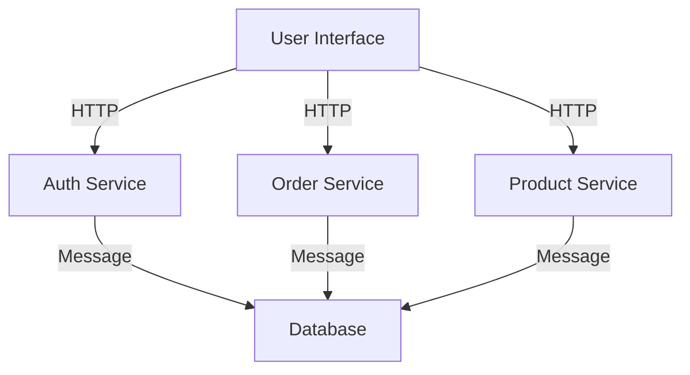

## 12.1. Introduction to Microservices Architecture

Microservices architecture is a modern approach to software development where applications are built as a suite of small, independently deployable services. Each service runs a unique process and communicates through a well-defined, lightweight mechanism, often HTTP or messaging queues. This architectural style has gained popularity due to its ability to improve modularity, scalability, and maintainability of complex applications.

### Understanding Microservices

Microservices architecture breaks down a monolithic application into smaller, manageable pieces. Each microservice is responsible for a specific business function and can be developed, deployed, and scaled independently. This separation of concerns allows teams to work on different services simultaneously, using different technologies and languages if necessary.

#### Key Characteristics of Microservices

1. **Independence**: Each microservice can be developed, deployed, and scaled independently.
2. **Decentralization**: Microservices promote decentralized data management and governance.
3. **Resilience**: Failure in one service does not affect the entire system.
4. **Polyglotism**: Different services can be written in different programming languages.
5. **Continuous Delivery**: Microservices facilitate continuous integration and deployment.

### Benefits of Microservices

Microservices offer several advantages over traditional monolithic architectures:

- **Scalability**: Services can be scaled independently based on demand.
- **Flexibility**: Teams can choose the best technology stack for each service.
- **Faster Time to Market**: Independent deployment reduces time to market for new features.
- **Improved Fault Isolation**: Failures are contained within individual services.
- **Easier Maintenance**: Smaller codebases are easier to manage and understand.

### Challenges of Microservices

Despite their benefits, microservices come with their own set of challenges:

- **Complexity in Orchestration**: Managing multiple services requires sophisticated orchestration tools.
- **Inter-Service Communication**: Ensuring reliable communication between services can be difficult.
- **Data Management**: Maintaining data consistency across services is challenging.
- **Security**: Each service needs to be secured individually.
- **Deployment**: Coordinating deployments across multiple services can be complex.

### Implementing Microservices in Elixir

Elixir, with its concurrency model and fault-tolerant design, is well-suited for building microservices. The language's features, such as lightweight processes and the OTP framework, provide a robust foundation for developing scalable and resilient microservices.

#### Key Elixir Features for Microservices

- **Concurrency**: Elixir's lightweight processes allow for efficient handling of concurrent requests.
- **Fault Tolerance**: The OTP framework provides tools for building resilient systems.
- **Scalability**: Elixir's architecture supports horizontal scaling across distributed systems.
- **Interoperability**: Elixir can easily integrate with other languages and technologies.

### Code Example: A Simple Microservice in Elixir

Let's create a simple microservice in Elixir that handles user authentication. This service will expose a RESTful API for user login and registration.

```elixir
defmodule AuthService do
  use Plug.Router

  plug :match
  plug :dispatch

  post "/register" do
    {:ok, body, _conn} = Plug.Conn.read_body(conn)
    user_data = Jason.decode!(body)
    # Simulate user registration logic
    send_resp(conn, 201, "User registered successfully")
  end

  post "/login" do
    {:ok, body, _conn} = Plug.Conn.read_body(conn)
    credentials = Jason.decode!(body)
    # Simulate authentication logic
    send_resp(conn, 200, "User logged in successfully")
  end

  match _ do
    send_resp(conn, 404, "Not Found")
  end
end

# Start the Plug server
{:ok, _} = Plug.Cowboy.http(AuthService, [])
```

In this example, we use the `Plug` library to create a simple HTTP server. The service provides endpoints for user registration and login, simulating the logic for these operations.

### Visualizing Microservices Architecture

Below is a diagram illustrating a typical microservices architecture. Each service is independent and communicates with others through a message broker or HTTP.



**Diagram Description**: This diagram shows a user interface interacting with three microservices: Auth Service, Order Service, and Product Service. Each service communicates with a shared database through a message broker.

### Best Practices for Microservices

1. **Service Boundaries**: Clearly define the boundaries of each service to avoid overlap.
2. **API Design**: Design APIs that are intuitive and consistent across services.
3. **Monitoring and Logging**: Implement centralized logging and monitoring for all services.
4. **Security**: Secure each service with authentication and authorization mechanisms.
5. **Testing**: Use automated testing to ensure the reliability of each service.

### Try It Yourself

Experiment with the provided code example by adding new endpoints or integrating a database for persistent storage. Consider implementing additional features such as password hashing or token-based authentication.

### Knowledge Check

- What are the key benefits of microservices architecture?
- How does Elixir's concurrency model support microservices?
- What are some challenges associated with microservices?

### Conclusion

Microservices architecture offers a powerful way to build scalable and maintainable applications. While it introduces complexity, the benefits of modularity, flexibility, and resilience make it an attractive choice for modern software development. Elixir's features, such as concurrency and fault tolerance, make it an excellent choice for implementing microservices.

## Quiz: Introduction to Microservices Architecture



### What is a key characteristic of microservices architecture?

- [x] Independence of services
- [ ] Centralized data management
- [ ] Monolithic design
- [ ] Single technology stack

> **Explanation:** Microservices architecture emphasizes the independence of services, allowing each to be developed, deployed, and scaled independently.

### Which of the following is a benefit of microservices?

- [x] Improved fault isolation
- [ ] Increased complexity
- [ ] Centralized deployment
- [ ] Single point of failure

> **Explanation:** Microservices improve fault isolation, meaning a failure in one service does not affect the entire system.

### What is a challenge of microservices?

- [x] Inter-service communication
- [ ] Monolithic codebase
- [ ] Lack of scalability
- [ ] Single language support

> **Explanation:** Ensuring reliable communication between services is a challenge in microservices architecture.

### How does Elixir support microservices?

- [x] Through lightweight processes
- [ ] By enforcing a monolithic structure
- [ ] With centralized data management
- [ ] By limiting concurrency

> **Explanation:** Elixir's lightweight processes allow for efficient handling of concurrent requests, supporting microservices architecture.

### What is a best practice for microservices?

- [x] Clearly define service boundaries
- [ ] Use a single database for all services
- [ ] Avoid monitoring and logging
- [ ] Implement services with a single technology

> **Explanation:** Clearly defining service boundaries helps avoid overlap and ensures each service has a distinct responsibility.

### Which Elixir feature is particularly beneficial for microservices?

- [x] Fault tolerance
- [ ] Centralized control
- [ ] Single-threaded execution
- [ ] Lack of scalability

> **Explanation:** Elixir's fault tolerance, provided by the OTP framework, is beneficial for building resilient microservices.

### What is a common tool used for inter-service communication in microservices?

- [x] Message queues
- [ ] Direct database access
- [ ] Shared memory
- [ ] Local function calls

> **Explanation:** Message queues are commonly used for reliable inter-service communication in microservices architecture.

### What is a typical challenge when deploying microservices?

- [x] Coordinating deployments across services
- [ ] Single deployment pipeline
- [ ] Lack of modularity
- [ ] Centralized logging

> **Explanation:** Coordinating deployments across multiple services can be complex in microservices architecture.

### What is a benefit of using Elixir for microservices?

- [x] Concurrency model
- [ ] Lack of fault tolerance
- [ ] Centralized architecture
- [ ] Single-threaded execution

> **Explanation:** Elixir's concurrency model supports efficient handling of concurrent requests, making it suitable for microservices.

### True or False: Microservices architecture allows for polyglotism.

- [x] True
- [ ] False

> **Explanation:** Microservices architecture allows different services to be written in different programming languages, supporting polyglotism.



Remember, this is just the beginning. As you progress, you'll build more complex and interactive systems. Keep experimenting, stay curious, and enjoy the journey!
