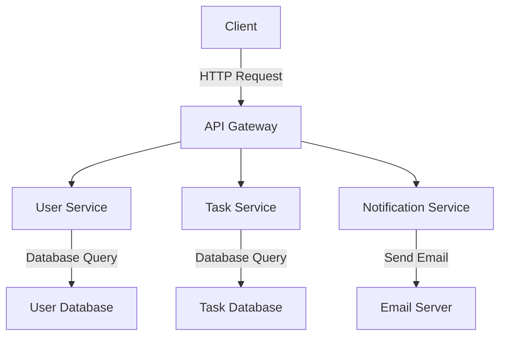

## 12.1. Introduction to Microservices Architecture

Microservices architecture is a modern approach to designing software applications as a collection of loosely coupled, independently deployable services. This architectural style has gained popularity due to its ability to address the limitations of traditional monolithic architectures by promoting modularity, scalability, and maintainability. In this section, we will delve into the core concepts of microservices architecture, explore its benefits and challenges, and discuss how Elixir, with its unique features, can be an excellent choice for implementing microservices.

### Understanding Microservices

Microservices architecture is a design paradigm where an application is built as a suite of small, autonomous services, each running in its own process and communicating with lightweight mechanisms, often HTTP or messaging queues. These services are organized around business capabilities and can be developed, deployed, and scaled independently.

#### Key Characteristics of Microservices

1. **Autonomy**: Each microservice operates independently, allowing teams to develop, deploy, and scale them without affecting others.
2. **Decentralized Data Management**: Microservices often have their own databases, promoting data autonomy and reducing dependencies.
3. **Polyglot Programming**: Teams can choose the best technology stack for each service, allowing for flexibility and innovation.
4. **Resilience**: Microservices are designed to handle failures gracefully, often incorporating patterns like circuit breakers and retries.
5. **Scalability**: Services can be scaled independently based on demand, optimizing resource usage.

### Benefits of Microservices Architecture

Microservices offer several advantages over traditional monolithic architectures:

- **Improved Modularity**: By breaking down applications into smaller services, microservices enhance modularity, making it easier to understand, develop, and maintain each component.
- **Scalability**: Services can be scaled independently, allowing for efficient resource allocation and improved performance under varying loads.
- **Faster Time to Market**: Teams can work on different services simultaneously, reducing development cycles and accelerating delivery.
- **Technology Agility**: Teams can adopt new technologies and frameworks for individual services without affecting the entire system.
- **Fault Isolation**: Failures in one service do not necessarily impact others, improving overall system resilience.

### Challenges of Microservices Architecture

While microservices offer numerous benefits, they also introduce complexities:

- **Increased Complexity**: Managing multiple services requires sophisticated orchestration and coordination tools.
- **Inter-Service Communication**: Ensuring reliable communication between services, often over unreliable networks, can be challenging.
- **Data Consistency**: Maintaining data consistency across distributed services requires careful design and implementation.
- **Deployment and Monitoring**: Deploying and monitoring numerous services can be cumbersome without proper tools and practices.
- **Security**: Securing each service individually can increase the attack surface and requires robust security practices.

### Implementing Microservices with Elixir

Elixir, with its concurrency model and fault-tolerant design, is well-suited for building microservices. Let's explore how Elixir's features can be leveraged in a microservices architecture.

#### Concurrency and Fault Tolerance

Elixir runs on the BEAM virtual machine, which provides excellent support for concurrency and fault tolerance. This makes Elixir an ideal choice for building resilient microservices that can handle high loads and recover from failures gracefully.

#### Lightweight Processes

Elixir's lightweight processes enable efficient resource utilization, allowing microservices to handle numerous concurrent requests without significant overhead.

#### OTP Framework

The OTP (Open Telecom Platform) framework in Elixir provides a set of libraries and design principles for building robust applications. It includes features like GenServer for managing state and Supervisor trees for fault recovery, which are essential for microservices.

#### Example: Building a Simple Microservice in Elixir

Let's build a simple microservice in Elixir that provides a RESTful API for managing a list of tasks. We will use the Phoenix framework, which is built on top of Elixir, to handle HTTP requests.

```elixir
# lib/task_manager.ex
defmodule TaskManager do
  use GenServer

  # Client API
  def start_link(initial_tasks \\ []) do
    GenServer.start_link(__MODULE__, initial_tasks, name: __MODULE__)
  end

  def add_task(task) do
    GenServer.call(__MODULE__, {:add_task, task})
  end

  def list_tasks do
    GenServer.call(__MODULE__, :list_tasks)
  end

  # Server Callbacks
  def init(initial_tasks) do
    {:ok, initial_tasks}
  end

  def handle_call({:add_task, task}, _from, state) do
    {:reply, :ok, [task | state]}
  end

  def handle_call(:list_tasks, _from, state) do
    {:reply, state, state}
  end
end
```

In this example, we define a `TaskManager` module that uses a GenServer to manage a list of tasks. The `add_task/1` function adds a new task to the list, and the `list_tasks/0` function returns the current list of tasks. This module can be used as a microservice to manage tasks.

#### Try It Yourself

Experiment with the `TaskManager` module by adding tasks and listing them. You can extend this example by implementing additional functionalities, such as removing tasks or persisting them to a database.

### Visualizing Microservices Architecture

To better understand how microservices interact, let's visualize a simple microservices architecture using Mermaid.js.


```mermaid
graph TD;
    A[Client] -->|HTTP Request| B[API Gateway];
    B --> C[User Service];
    B --> D[Task Service];
    B --> E[Notification Service];
    C -->|Database Query| F[User Database];
    D -->|Database Query| G[Task Database];
    E -->|Send Email| H[Email Server];
```

In this diagram, the client sends an HTTP request to the API Gateway, which routes the request to the appropriate microservice (User Service, Task Service, or Notification Service). Each service can interact with its own database or external systems, such as an email server.

### References and Further Reading

- [Microservices - Wikipedia](https://en.wikipedia.org/wiki/Microservices)
- [Building Microservices with Elixir](https://pragprog.com/titles/egmicro/building-microservices-with-elixir/)
- [The Twelve-Factor App](https://12factor.net/)

### Knowledge Check

- What are the key characteristics of microservices?
- How does Elixir's concurrency model benefit microservices?
- What challenges are associated with microservices architecture?

### Embrace the Journey

As you explore microservices architecture, remember that it's a journey of continuous learning and improvement. Each service you build will enhance your understanding and skills. Keep experimenting, stay curious, and enjoy the process of building scalable and resilient applications with Elixir.

## Quiz Time!



### Which of the following is a key characteristic of microservices?

- [x] Autonomy
- [ ] Monolithic design
- [ ] Centralized data management
- [ ] Single technology stack

> **Explanation:** Autonomy is a key characteristic of microservices, allowing services to be developed and deployed independently.

### What is a major benefit of microservices architecture?

- [x] Improved scalability
- [ ] Increased complexity
- [ ] Centralized data management
- [ ] Single point of failure

> **Explanation:** Microservices architecture improves scalability by allowing services to be scaled independently.

### Which Elixir feature is particularly beneficial for microservices?

- [x] Concurrency model
- [ ] Single-threaded execution
- [ ] Centralized state management
- [ ] Lack of fault tolerance

> **Explanation:** Elixir's concurrency model is beneficial for microservices, enabling efficient handling of concurrent requests.

### What is a common challenge in microservices architecture?

- [x] Inter-service communication
- [ ] Lack of modularity
- [ ] Single point of failure
- [ ] Centralized data management

> **Explanation:** Inter-service communication is a common challenge in microservices architecture, requiring reliable communication mechanisms.

### How can microservices handle failures gracefully?

- [x] Using circuit breakers
- [ ] Ignoring failures
- [ ] Centralized error handling
- [ ] Single-threaded execution

> **Explanation:** Circuit breakers are used in microservices to handle failures gracefully by preventing cascading failures.

### Which tool is commonly used for building RESTful APIs in Elixir?

- [x] Phoenix framework
- [ ] GenServer
- [ ] Supervisor
- [ ] Mix

> **Explanation:** The Phoenix framework is commonly used for building RESTful APIs in Elixir.

### What is a benefit of using Elixir for microservices?

- [x] Fault tolerance
- [ ] Single-threaded execution
- [ ] Centralized data management
- [ ] Lack of scalability

> **Explanation:** Elixir's fault tolerance is a benefit for microservices, allowing them to recover from failures gracefully.

### Which pattern is often used to improve resilience in microservices?

- [x] Circuit breaker
- [ ] Single point of failure
- [ ] Centralized data management
- [ ] Lack of modularity

> **Explanation:** The circuit breaker pattern is used to improve resilience in microservices by preventing cascading failures.

### How does Elixir's OTP framework support microservices?

- [x] By providing libraries for building robust applications
- [ ] By enforcing monolithic design
- [ ] By centralizing data management
- [ ] By limiting scalability

> **Explanation:** Elixir's OTP framework supports microservices by providing libraries and design principles for building robust applications.

### True or False: Microservices architecture allows for polyglot programming.

- [x] True
- [ ] False

> **Explanation:** True. Microservices architecture allows teams to use different technology stacks for different services, enabling polyglot programming.


