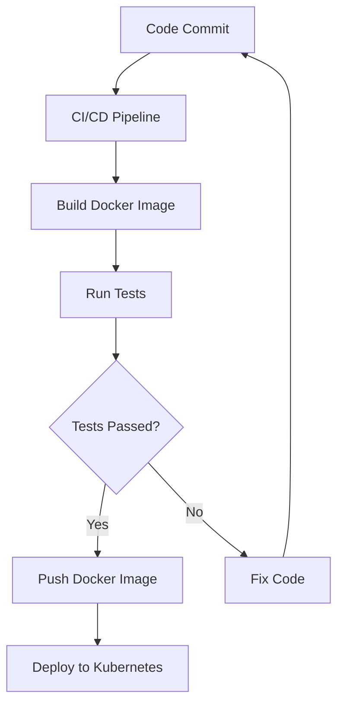

## 12.10. Deploying Elixir Microservices

Deploying Elixir microservices involves several key components, including containerization, orchestration platforms, and continuous integration/continuous deployment (CI/CD) pipelines. This guide will walk you through each of these components, providing detailed explanations, code examples, and best practices to ensure your microservices are scalable, reliable, and efficient.

### Introduction to Microservices Deployment

Microservices architecture allows for the development of small, independent services that can be deployed and scaled independently. This architecture is particularly well-suited for Elixir, given its strengths in concurrency and fault tolerance. However, deploying microservices presents unique challenges, such as managing dependencies, ensuring consistent environments, and orchestrating multiple services.

### Containerization

Containerization is the process of packaging software and its dependencies into a single, lightweight container. This ensures that the software runs consistently across different environments. Docker is the most popular tool for containerization.

#### Docker Basics

Docker allows you to create, deploy, and run applications in containers. A Docker container is a lightweight, standalone, executable package that includes everything needed to run a piece of software, including the code, runtime, libraries, and system tools.

##### Creating a Dockerfile

A Dockerfile is a text document that contains all the commands to assemble an image. Here's an example Dockerfile for an Elixir application:

```dockerfile
# Use the official Elixir image
FROM elixir:1.14

# Set the working directory
WORKDIR /app

# Copy the mix.exs and mix.lock files
COPY mix.exs mix.lock ./

# Install dependencies
RUN mix do deps.get, deps.compile

# Copy the application code
COPY . .

# Compile the application
RUN mix compile

# Run the application
CMD ["mix", "phx.server"]
```

This Dockerfile starts with an official Elixir image, sets the working directory, copies the necessary files, installs dependencies, compiles the application, and finally runs the Phoenix server.

##### Building and Running the Docker Image

To build and run the Docker image, use the following commands:

```bash
# Build the Docker image
docker build -t my_elixir_app .

# Run the Docker container
docker run -p 4000:4000 my_elixir_app
```

This will build the Docker image and run it, exposing port 4000 to the host machine.

#### Best Practices for Dockerizing Elixir Applications

- **Use Multi-Stage Builds**: This reduces the size of the final image by separating the build environment from the runtime environment.
- **Minimize Layers**: Combine commands where possible to reduce the number of layers in the image.
- **Use .dockerignore**: Exclude unnecessary files from the Docker image to keep it lightweight.

### Orchestration Platforms

Orchestration platforms manage the deployment, scaling, and operation of containerized applications. Kubernetes and Docker Swarm are two popular orchestration platforms.

#### Kubernetes

Kubernetes is an open-source platform for automating the deployment, scaling, and management of containerized applications. It provides a robust set of features for managing microservices.

##### Key Concepts in Kubernetes

- **Pods**: The smallest deployable units in Kubernetes, which can contain one or more containers.
- **Services**: Abstractions that define a logical set of Pods and a policy to access them.
- **Deployments**: Manage the deployment and scaling of Pods.

##### Deploying Elixir Microservices with Kubernetes

To deploy an Elixir microservice with Kubernetes, you need to create a deployment and a service. Here's an example configuration:

```yaml
apiVersion: apps/v1
kind: Deployment
metadata:
  name: elixir-app
spec:
  replicas: 3
  selector:
    matchLabels:
      app: elixir-app
  template:
    metadata:
      labels:
        app: elixir-app
    spec:
      containers:
      - name: elixir-app
        image: my_elixir_app:latest
        ports:
        - containerPort: 4000
---
apiVersion: v1
kind: Service
metadata:
  name: elixir-app-service
spec:
  selector:
    app: elixir-app
  ports:
    - protocol: TCP
      port: 80
      targetPort: 4000
  type: LoadBalancer
```

This configuration creates a deployment with three replicas of the Elixir application and a service to expose it.

##### Managing Kubernetes Deployments

- **Scaling**: Use the `kubectl scale` command to adjust the number of replicas.
- **Rolling Updates**: Kubernetes supports rolling updates to update applications without downtime.
- **Monitoring**: Use tools like Prometheus and Grafana for monitoring Kubernetes clusters.

#### Docker Swarm

Docker Swarm is a native clustering and orchestration tool for Docker. It is simpler than Kubernetes but offers fewer features.

##### Deploying Elixir Microservices with Docker Swarm

To deploy with Docker Swarm, you need to create a service. Here's an example:

```bash
# Initialize Docker Swarm
docker swarm init

# Deploy the service
docker service create --name elixir-app --replicas 3 -p 4000:4000 my_elixir_app
```

This command initializes Docker Swarm and deploys the Elixir application with three replicas.

### Continuous Integration/Continuous Deployment (CI/CD)

CI/CD automates the process of building, testing, and deploying applications. This ensures that code changes are automatically tested and deployed, reducing the risk of errors.

#### Setting Up a CI/CD Pipeline

A typical CI/CD pipeline involves the following stages:

1. **Build**: Compile the code and create a Docker image.
2. **Test**: Run automated tests to ensure the code is working as expected.
3. **Deploy**: Deploy the application to a staging or production environment.

##### Using GitHub Actions for CI/CD

GitHub Actions is a popular tool for setting up CI/CD pipelines. Here's an example workflow for an Elixir application:

```yaml
name: CI/CD Pipeline

on:
  push:
    branches:
      - main

jobs:
  build:
    runs-on: ubuntu-latest

    steps:
    - name: Checkout code
      uses: actions/checkout@v2

    - name: Set up Elixir
      uses: actions/setup-elixir@v1
      with:
        elixir-version: '1.14'
        otp-version: '24'

    - name: Install dependencies
      run: mix deps.get

    - name: Run tests
      run: mix test

    - name: Build Docker image
      run: docker build -t my_elixir_app .

    - name: Push Docker image
      run: docker push my_elixir_app
```

This workflow checks out the code, sets up Elixir, installs dependencies, runs tests, builds a Docker image, and pushes it to a Docker registry.

#### Best Practices for CI/CD

- **Automate Everything**: Automate as much of the build, test, and deployment process as possible.
- **Use Environment Variables**: Store sensitive information in environment variables to keep it secure.
- **Monitor Pipelines**: Use monitoring tools to track the performance and reliability of your CI/CD pipelines.

### Visualizing the Deployment Process

To better understand the deployment process, let's visualize it using a flowchart.



This flowchart illustrates the steps involved in deploying an Elixir microservice, from code commit to deployment on Kubernetes.

### Knowledge Check

Before we wrap up, let's reinforce what we've learned with a few questions:

- What is the purpose of containerization in microservices deployment?
- How does Kubernetes help manage containerized applications?
- What are the key stages of a CI/CD pipeline?

### Try It Yourself

Now that you have a solid understanding of deploying Elixir microservices, try modifying the Dockerfile or Kubernetes configuration to add new features or optimize performance. Experiment with different CI/CD tools to find the best fit for your workflow.

### Conclusion

Deploying Elixir microservices involves a combination of containerization, orchestration, and automation. By leveraging tools like Docker, Kubernetes, and GitHub Actions, you can create a robust deployment pipeline that ensures your applications are scalable, reliable, and efficient. Remember, this is just the beginning. As you continue to explore and experiment, you'll discover new ways to optimize and enhance your deployment process. Keep learning, stay curious, and enjoy the journey!

## Quiz: Deploying Elixir Microservices



### What is the primary purpose of containerization in microservices deployment?

- [x] To ensure consistent environments across different deployment stages
- [ ] To increase the size of the application
- [ ] To reduce the need for orchestration
- [ ] To eliminate the need for CI/CD pipelines

> **Explanation:** Containerization packages software and its dependencies into a single, consistent environment, ensuring it runs the same across different stages.

### Which tool is most commonly used for containerization?

- [x] Docker
- [ ] Kubernetes
- [ ] GitHub Actions
- [ ] Prometheus

> **Explanation:** Docker is the most popular tool for containerization, allowing applications to be packaged into containers.

### What is a Pod in Kubernetes?

- [x] The smallest deployable unit that can contain one or more containers
- [ ] A tool for monitoring Kubernetes clusters
- [ ] A type of CI/CD pipeline
- [ ] A Docker image

> **Explanation:** In Kubernetes, a Pod is the smallest deployable unit and can contain one or more containers.

### What is the role of a Service in Kubernetes?

- [x] To define a logical set of Pods and a policy to access them
- [ ] To build Docker images
- [ ] To automate CI/CD pipelines
- [ ] To manage environment variables

> **Explanation:** A Service in Kubernetes defines a logical set of Pods and a policy to access them, providing a stable endpoint for applications.

### Which command is used to scale a deployment in Kubernetes?

- [x] kubectl scale
- [ ] kubectl deploy
- [ ] docker scale
- [ ] docker deploy

> **Explanation:** The `kubectl scale` command is used to adjust the number of replicas in a Kubernetes deployment.

### What is the main advantage of using CI/CD pipelines?

- [x] Automating the build, test, and deployment process
- [ ] Increasing the complexity of deployments
- [ ] Reducing the need for testing
- [ ] Eliminating the need for Docker

> **Explanation:** CI/CD pipelines automate the build, test, and deployment process, ensuring consistent and reliable application delivery.

### Which tool is used for setting up CI/CD pipelines in the example provided?

- [x] GitHub Actions
- [ ] Docker Swarm
- [ ] Kubernetes
- [ ] Prometheus

> **Explanation:** GitHub Actions is used in the example to set up CI/CD pipelines for the Elixir application.

### What is the purpose of using environment variables in CI/CD pipelines?

- [x] To store sensitive information securely
- [ ] To increase the complexity of the pipeline
- [ ] To automate the deployment process
- [ ] To reduce the need for testing

> **Explanation:** Environment variables are used to store sensitive information securely, keeping it out of the codebase.

### What is a key benefit of using Kubernetes for microservices deployment?

- [x] Automating the deployment, scaling, and management of containerized applications
- [ ] Increasing the size of Docker images
- [ ] Reducing the need for CI/CD pipelines
- [ ] Eliminating the need for monitoring

> **Explanation:** Kubernetes automates the deployment, scaling, and management of containerized applications, making it ideal for microservices.

### True or False: Docker Swarm offers more features than Kubernetes.

- [ ] True
- [x] False

> **Explanation:** Docker Swarm is simpler than Kubernetes and offers fewer features, making Kubernetes more suitable for complex microservices deployments.


