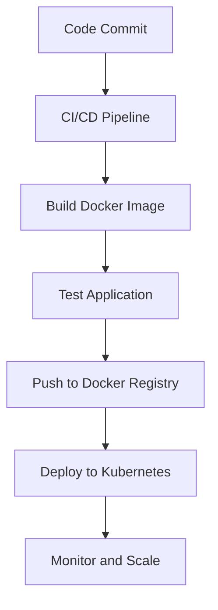

## 12.10. Deploying Elixir Microservices

Deploying Elixir microservices involves a series of steps and best practices that ensure your services are scalable, resilient, and maintainable. This section will guide you through the key aspects of deploying Elixir microservices, focusing on containerization, orchestration platforms, and continuous integration/continuous deployment (CI/CD) pipelines.

### Containerization

Containerization is a crucial step in deploying microservices as it allows you to package your application and its dependencies into a single, portable unit. This ensures consistency across different environments, from development to production.

#### Packaging Services Using Docker

Docker is a popular tool for containerization. It allows you to create lightweight, portable, and self-sufficient containers from any application. Here's how you can package an Elixir microservice using Docker:

1. **Create a Dockerfile**: This file contains instructions on how to build the Docker image for your Elixir application.

    ```dockerfile
    # Use the official Elixir image as the base image
    FROM elixir:1.14

    # Set environment variables
    ENV MIX_ENV=prod

    # Install Hex and Rebar
    RUN mix local.hex --force && \
        mix local.rebar --force

    # Set the working directory
    WORKDIR /app

    # Copy the mix.exs and mix.lock files
    COPY mix.exs mix.lock ./

    # Install dependencies
    RUN mix deps.get && mix deps.compile

    # Copy the application code
    COPY . .

    # Compile the application
    RUN mix compile

    # Expose the port the app runs on
    EXPOSE 4000

    # Start the application
    CMD ["mix", "phx.server"]
    ```

2. **Build the Docker Image**: Run the following command in the terminal to build the Docker image.

    ```bash
    docker build -t my_elixir_app .
    ```

3. **Run the Docker Container**: Use the command below to run your application inside a Docker container.

    ```bash
    docker run -p 4000:4000 my_elixir_app
    ```

#### Key Considerations

- **Environment Variables**: Use environment variables for configuration to ensure your application is flexible and can adapt to different environments.
- **Minimize Image Size**: Use multi-stage builds to keep your Docker images as small as possible. This improves performance and reduces the attack surface.
- **Security**: Regularly update your base images and dependencies to include the latest security patches.

### Orchestration Platforms

Once your services are containerized, you need a way to manage them. This is where orchestration platforms like Kubernetes and Docker Swarm come into play.

#### Managing Containers with Kubernetes

Kubernetes is a powerful orchestration platform that automates the deployment, scaling, and management of containerized applications.

1. **Define a Kubernetes Deployment**: Create a YAML file to define your deployment.

    ```yaml
    apiVersion: apps/v1
    kind: Deployment
    metadata:
      name: elixir-app
    spec:
      replicas: 3
      selector:
        matchLabels:
          app: elixir-app
      template:
        metadata:
          labels:
            app: elixir-app
        spec:
          containers:
          - name: elixir-app
            image: my_elixir_app:latest
            ports:
            - containerPort: 4000
    ```

2. **Deploy to Kubernetes**: Apply the configuration to your Kubernetes cluster.

    ```bash
    kubectl apply -f deployment.yaml
    ```

3. **Expose the Service**: Create a service to expose your application.

    ```yaml
    apiVersion: v1
    kind: Service
    metadata:
      name: elixir-service
    spec:
      type: LoadBalancer
      ports:
      - port: 80
        targetPort: 4000
      selector:
        app: elixir-app
    ```

    Apply the service configuration:

    ```bash
    kubectl apply -f service.yaml
    ```

#### Key Considerations

- **Scaling**: Use Kubernetes to scale your services up or down based on demand.
- **Monitoring**: Integrate with monitoring tools like Prometheus to keep track of your application's performance.
- **Networking**: Use Kubernetes networking features to manage communication between your services.

### Continuous Integration/Continuous Deployment (CI/CD)

Automating your build, test, and deployment processes is essential for maintaining a fast and reliable development workflow.

#### Automating Build, Test, and Deployment Pipelines

Implementing a CI/CD pipeline ensures that your code is automatically built, tested, and deployed whenever changes are made. Here's how you can set up a basic CI/CD pipeline for Elixir microservices:

1. **Use a CI/CD Tool**: Tools like GitHub Actions, GitLab CI, or Jenkins can automate your pipeline.

2. **Define a Pipeline Configuration**: Create a configuration file to define your pipeline steps. Here's an example using GitHub Actions:

    ```yaml
    name: Elixir CI

    on:
      push:
        branches:
          - main

    jobs:
      build:
        runs-on: ubuntu-latest

        steps:
        - uses: actions/checkout@v2

        - name: Set up Elixir
          uses: actions/setup-elixir@v1
          with:
            elixir-version: '1.14'
            otp-version: '24'

        - name: Install dependencies
          run: mix deps.get

        - name: Run tests
          run: mix test

        - name: Build Docker image
          run: docker build -t my_elixir_app .

        - name: Push Docker image
          env:
            DOCKER_USERNAME: ${{ secrets.DOCKER_USERNAME }}
            DOCKER_PASSWORD: ${{ secrets.DOCKER_PASSWORD }}
          run: |
            echo $DOCKER_PASSWORD | docker login -u $DOCKER_USERNAME --password-stdin
            docker push my_elixir_app
    ```

3. **Deploy Automatically**: Configure your CI/CD tool to deploy your application to your orchestration platform after a successful build and test.

#### Key Considerations

- **Testing**: Ensure your pipeline includes comprehensive tests to catch issues early.
- **Security**: Use secrets management to protect sensitive information like API keys and passwords.
- **Rollback**: Implement rollback strategies to revert to a previous version in case of deployment failures.

### Visualizing the Deployment Process

To better understand the deployment process, let's visualize it using a Mermaid.js flowchart:


```mermaid
graph TD;
    A[Code Commit] --> B[CI/CD Pipeline];
    B --> C[Build Docker Image];
    C --> D[Test Application];
    D --> E[Push to Docker Registry];
    E --> F[Deploy to Kubernetes];
    F --> G[Monitor and Scale];
```

**Diagram Description:** This flowchart illustrates the deployment process of Elixir microservices. It starts with a code commit, followed by a CI/CD pipeline that builds and tests the application, pushes the Docker image to a registry, and finally deploys it to a Kubernetes cluster for monitoring and scaling.

### Try It Yourself

Now that you've learned the basics, try setting up your own Elixir microservice deployment. Experiment with different configurations and tools to find what works best for your application.

- **Modify the Dockerfile**: Try using a different base image or adding additional build steps.
- **Experiment with Kubernetes**: Deploy your application in different environments or with different scaling configurations.
- **Enhance the CI/CD Pipeline**: Add additional steps, such as running static code analysis or deploying to a staging environment.

### References and Links

- [Docker Documentation](https://docs.docker.com/)
- [Kubernetes Documentation](https://kubernetes.io/docs/home/)
- [GitHub Actions Documentation](https://docs.github.com/en/actions)
- [Prometheus Monitoring](https://prometheus.io/docs/introduction/overview/)

### Knowledge Check

- What are the benefits of using containerization for microservices?
- How does Kubernetes help in managing containerized applications?
- What are the key components of a CI/CD pipeline?

### Embrace the Journey

Deploying Elixir microservices is a journey that involves learning and adapting to new tools and technologies. Remember, this is just the beginning. As you progress, you'll build more complex and resilient systems. Keep experimenting, stay curious, and enjoy the journey!

## Quiz Time!



### What is the primary benefit of containerizing microservices with Docker?

- [x] Consistent deployment across environments
- [ ] Improved application performance
- [ ] Reduced code complexity
- [ ] Enhanced security

> **Explanation:** Containerizing microservices with Docker ensures consistent deployment across different environments, making it easier to manage and scale applications.

### Which tool is commonly used for orchestrating containerized applications?

- [x] Kubernetes
- [ ] GitHub Actions
- [ ] Prometheus
- [ ] Docker Compose

> **Explanation:** Kubernetes is a popular orchestration platform used to automate the deployment, scaling, and management of containerized applications.

### What is a key feature of a CI/CD pipeline?

- [x] Automating build, test, and deployment processes
- [ ] Manual code review
- [ ] Static code analysis
- [ ] Real-time monitoring

> **Explanation:** A CI/CD pipeline automates the build, test, and deployment processes to ensure fast and reliable software delivery.

### How does Kubernetes help in scaling applications?

- [x] By automatically adjusting the number of running instances based on demand
- [ ] By optimizing the code for performance
- [ ] By integrating with monitoring tools
- [ ] By managing network configurations

> **Explanation:** Kubernetes helps in scaling applications by automatically adjusting the number of running instances based on demand, ensuring optimal resource utilization.

### What is a common practice for managing sensitive information in CI/CD pipelines?

- [x] Using secrets management
- [ ] Storing them in environment variables
- [ ] Hardcoding them in the application
- [ ] Encrypting them in the source code

> **Explanation:** Using secrets management is a common practice for managing sensitive information in CI/CD pipelines to ensure security.

### What is the purpose of a Dockerfile?

- [x] To define the instructions for building a Docker image
- [ ] To configure the Kubernetes deployment
- [ ] To automate the CI/CD pipeline
- [ ] To monitor application performance

> **Explanation:** A Dockerfile contains the instructions for building a Docker image, specifying the base image, dependencies, and application code.

### Which command is used to deploy a Kubernetes configuration?

- [x] `kubectl apply -f`
- [ ] `docker build`
- [ ] `mix phx.server`
- [ ] `git push`

> **Explanation:** The `kubectl apply -f` command is used to deploy a Kubernetes configuration file to a cluster.

### What does the `EXPOSE` instruction in a Dockerfile do?

- [x] It specifies the port on which the application listens
- [ ] It starts the application server
- [ ] It installs dependencies
- [ ] It copies application code

> **Explanation:** The `EXPOSE` instruction in a Dockerfile specifies the port on which the application listens, making it accessible to other services.

### How can you ensure your Docker images are secure?

- [x] By regularly updating base images and dependencies
- [ ] By using the latest version of Docker
- [ ] By minimizing the number of layers in the image
- [ ] By using a private Docker registry

> **Explanation:** Regularly updating base images and dependencies ensures that your Docker images include the latest security patches.

### True or False: Kubernetes can automatically rollback a deployment if it fails.

- [x] True
- [ ] False

> **Explanation:** Kubernetes can automatically rollback a deployment if it fails, ensuring that the application remains stable.


