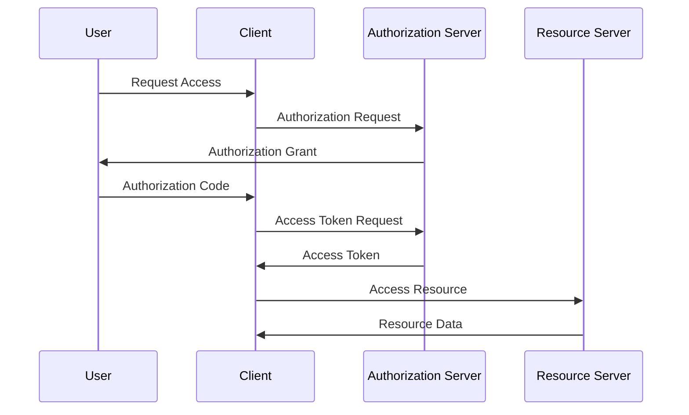
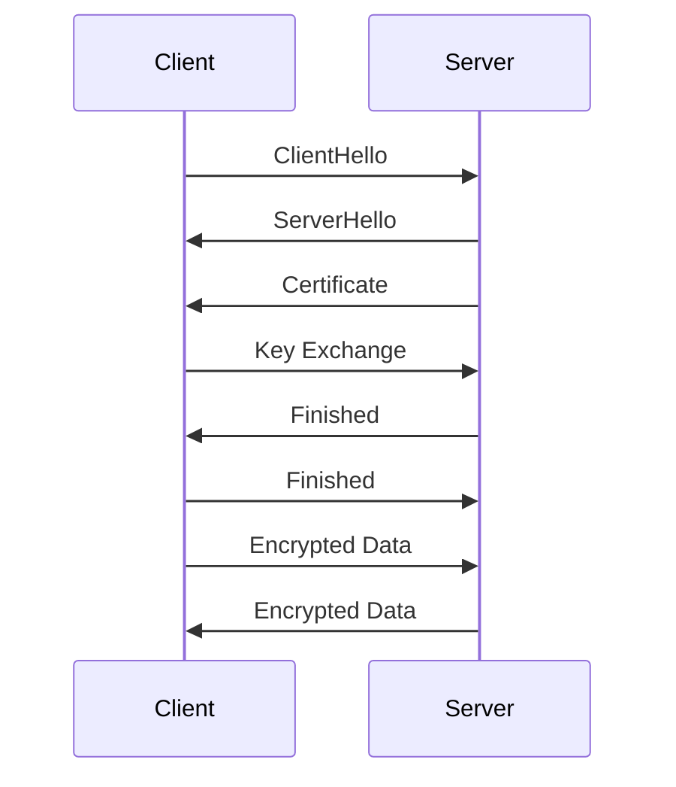

## 12.11. Security Considerations in Microservices

In the realm of microservices architecture, security is a paramount concern. As systems become more distributed, the attack surface increases, necessitating robust security measures. In this section, we will delve into key security considerations for microservices, focusing on authentication and authorization, networking security, and secrets management. By the end of this guide, you will have a comprehensive understanding of how to secure your Elixir-based microservices effectively.

### Authentication and Authorization

Authentication and authorization are critical components of microservices security. They ensure that only legitimate users and services can access your system and perform actions they are authorized to do.

#### Implementing OAuth2

OAuth2 is a widely used protocol for authorization, providing secure delegated access. It allows users to grant third-party applications access to their resources without sharing their credentials.

**Key Concepts of OAuth2:**

- **Resource Owner:** The user who owns the data.
- **Client:** The application requesting access to the resource owner's data.
- **Authorization Server:** The server issuing access tokens to the client after successful authentication.
- **Resource Server:** The server hosting the protected resources.

**OAuth2 Flow:**

1. **Authorization Request:** The client requests authorization from the resource owner.
2. **Authorization Grant:** The resource owner provides an authorization grant to the client.
3. **Access Token Request:** The client requests an access token from the authorization server using the authorization grant.
4. **Access Token Response:** The authorization server issues an access token to the client.
5. **Access Resource:** The client uses the access token to request resources from the resource server.

**Example: Implementing OAuth2 in Elixir**

```elixir
defmodule MyAppWeb.AuthController do
  use MyAppWeb, :controller

  alias MyApp.Auth

  def authorize(conn, %{"client_id" => client_id, "redirect_uri" => redirect_uri}) do
    # Validate client_id and redirect_uri
    case Auth.validate_client(client_id, redirect_uri) do
      :ok ->
        # Generate authorization code
        auth_code = Auth.generate_authorization_code(client_id)
        redirect(conn, external: "#{redirect_uri}?code=#{auth_code}")

      :error ->
        conn
        |> put_status(:unauthorized)
        |> json(%{error: "Invalid client"})
    end
  end

  def token(conn, %{"grant_type" => "authorization_code", "code" => code}) do
    # Exchange authorization code for access token
    case Auth.exchange_code_for_token(code) do
      {:ok, token} ->
        json(conn, %{access_token: token})

      :error ->
        conn
        |> put_status(:unauthorized)
        |> json(%{error: "Invalid authorization code"})
    end
  end
end
```

In this example, we define an `AuthController` that handles OAuth2 authorization and token exchange. The `authorize` function validates the client and generates an authorization code, while the `token` function exchanges the authorization code for an access token.

#### Using JWT Tokens for Secure Access

JSON Web Tokens (JWT) are a compact, URL-safe means of representing claims to be transferred between two parties. They are commonly used in microservices for stateless authentication.

**Key Components of JWT:**

- **Header:** Contains metadata about the token, such as the type of token and the hashing algorithm used.
- **Payload:** Contains the claims, which are statements about an entity (typically, the user) and additional data.
- **Signature:** Ensures that the token hasn't been altered.

**Example: Generating and Validating JWT in Elixir**

```elixir
defmodule MyApp.Auth do
  @secret "super_secret_key"

  def generate_jwt(user_id) do
    claims = %{"sub" => user_id, "exp" => :os.system_time(:seconds) + 3600}
    {:ok, token} = Joken.encode_and_sign(claims, @secret)
    token
  end

  def validate_jwt(token) do
    case Joken.decode_and_verify(token, @secret) do
      {:ok, claims} -> {:ok, claims}
      {:error, _reason} -> :error
    end
  end
end
```

In this example, we use the `Joken` library to generate and validate JWTs. The `generate_jwt` function creates a token with a user ID and expiration time, while the `validate_jwt` function verifies the token's integrity and extracts the claims.

### Networking Security

Securing communication between microservices is crucial to prevent unauthorized access and data breaches. Transport Layer Security (TLS) and Secure Sockets Layer (SSL) are protocols that provide encryption and secure communication over a network.

#### Securing Communication with TLS/SSL

TLS/SSL encrypts data transmitted between clients and servers, ensuring confidentiality and integrity. It also provides authentication, allowing clients to verify the server's identity.

**Steps to Implement TLS/SSL in Elixir:**

1. **Obtain a Certificate:** Acquire an SSL/TLS certificate from a trusted Certificate Authority (CA).
2. **Configure the Server:** Set up your Elixir application to use the certificate for secure communication.
3. **Enforce HTTPS:** Redirect all HTTP traffic to HTTPS to ensure secure communication.

**Example: Configuring TLS in Phoenix**

```elixir
# In config/prod.exs
config :my_app, MyAppWeb.Endpoint,
  https: [
    port: 443,
    cipher_suite: :strong,
    keyfile: System.get_env("SSL_KEY_PATH"),
    certfile: System.get_env("SSL_CERT_PATH")
  ]
```

In this example, we configure a Phoenix application to use TLS by specifying the port, cipher suite, and paths to the SSL key and certificate files.

#### Network Segmentation and Firewalls

Network segmentation involves dividing a network into smaller, isolated segments to limit access and reduce the attack surface. Firewalls can be used to control traffic between these segments, allowing only authorized communication.

**Best Practices for Network Security:**

- **Use Virtual Private Networks (VPNs):** Secure communication between services by routing traffic through a VPN.
- **Implement Network Access Control Lists (ACLs):** Define rules to allow or deny traffic based on IP addresses and ports.
- **Regularly Update and Patch Systems:** Keep your systems up-to-date with the latest security patches to protect against vulnerabilities.

### Secrets Management

Secrets management involves securely storing and accessing sensitive information, such as API keys, passwords, and certificates. Proper secrets management is essential to prevent unauthorized access and data breaches.

#### Safely Storing and Accessing Sensitive Information

**Tools for Secrets Management:**

- **HashiCorp Vault:** A tool for securely storing and accessing secrets.
- **AWS Secrets Manager:** A service for managing secrets in AWS.
- **Azure Key Vault:** A cloud service for managing cryptographic keys and secrets.

**Example: Using HashiCorp Vault with Elixir**

```elixir
defmodule MyApp.Secrets do
  @vault_url "https://vault.example.com"
  @token System.get_env("VAULT_TOKEN")

  def get_secret(secret_path) do
    headers = [{"X-Vault-Token", @token}]
    url = "#{@vault_url}/v1/#{secret_path}"

    case HTTPoison.get(url, headers) do
      {:ok, %HTTPoison.Response{status_code: 200, body: body}} ->
        {:ok, Jason.decode!(body)["data"]}

      {:error, %HTTPoison.Error{reason: reason}} ->
        {:error, reason}
    end
  end
end
```

In this example, we define a `Secrets` module that retrieves secrets from HashiCorp Vault using the `HTTPoison` library. The `get_secret` function sends a request to the Vault server and returns the secret data.

#### Environment Variables and Configuration Files

Environment variables and configuration files are commonly used to store sensitive information. However, they must be handled with care to prevent exposure.

**Best Practices for Secrets Management:**

- **Use Environment Variables:** Store secrets in environment variables instead of hardcoding them in your application.
- **Encrypt Configuration Files:** Encrypt configuration files containing sensitive information and decrypt them at runtime.
- **Rotate Secrets Regularly:** Regularly change secrets to minimize the impact of a potential breach.

### Visualizing Security in Microservices

To better understand the security considerations in microservices, let's visualize the architecture and data flow using Mermaid.js diagrams.

#### Diagram: OAuth2 Authorization Flow



**Caption:** This diagram illustrates the OAuth2 authorization flow, showing the interaction between the user, client, authorization server, and resource server.

#### Diagram: Secure Communication with TLS



**Caption:** This diagram depicts the TLS handshake process, ensuring secure communication between the client and server.

### Knowledge Check

Before we wrap up, let's reinforce what we've learned with a few questions:

1. What is the primary purpose of OAuth2 in microservices?
2. How do JWT tokens enhance security in distributed systems?
3. Why is TLS/SSL important for network security?
4. What are some tools for secrets management in Elixir applications?

### Embrace the Journey

Remember, security is an ongoing process. As you implement these security measures, continue to monitor and update your systems to protect against emerging threats. Keep experimenting, stay curious, and enjoy the journey of building secure microservices with Elixir!

### References and Links

- [OAuth2 Specification](https://oauth.net/2/)
- [JSON Web Tokens (JWT)](https://jwt.io/)
- [Transport Layer Security (TLS)](https://tools.ietf.org/html/rfc5246)
- [HashiCorp Vault](https://www.vaultproject.io/)
- [Phoenix Framework](https://www.phoenixframework.org/)

## Quiz: Security Considerations in Microservices



### What is the primary purpose of OAuth2 in microservices?

- [x] To provide secure delegated access to resources
- [ ] To encrypt data in transit
- [ ] To manage microservices deployment
- [ ] To store secrets securely

> **Explanation:** OAuth2 is a protocol that allows users to grant third-party applications access to their resources without sharing their credentials, providing secure delegated access.

### How do JWT tokens enhance security in distributed systems?

- [x] By providing a compact, URL-safe means of representing claims
- [ ] By encrypting all data in the system
- [ ] By managing network segmentation
- [ ] By storing secrets securely

> **Explanation:** JWT tokens are used for stateless authentication, representing claims between two parties securely and compactly.

### Why is TLS/SSL important for network security?

- [x] It encrypts data transmitted between clients and servers
- [ ] It manages microservices deployment
- [ ] It provides a means of storing secrets
- [ ] It handles authentication and authorization

> **Explanation:** TLS/SSL encrypts data in transit, ensuring confidentiality and integrity, and provides authentication to verify server identities.

### What are some tools for secrets management in Elixir applications?

- [x] HashiCorp Vault
- [x] AWS Secrets Manager
- [ ] Phoenix Framework
- [ ] Joken Library

> **Explanation:** HashiCorp Vault and AWS Secrets Manager are tools used for securely storing and accessing secrets in applications.

### Which of the following is a best practice for network security?

- [x] Use Virtual Private Networks (VPNs)
- [ ] Store secrets in code
- [ ] Disable firewalls
- [ ] Use unencrypted communication

> **Explanation:** Using VPNs is a best practice for securing communication between services by routing traffic through a secure network.

### What is a key component of JWT?

- [x] Header
- [x] Payload
- [x] Signature
- [ ] Firewall

> **Explanation:** JWT consists of a header, payload, and signature, which together ensure the token's integrity and authenticity.

### What is the role of the authorization server in OAuth2?

- [x] To issue access tokens to the client
- [ ] To store secrets securely
- [ ] To encrypt data in transit
- [ ] To manage microservices deployment

> **Explanation:** The authorization server is responsible for issuing access tokens to clients after successful authentication in the OAuth2 flow.

### How can you enforce HTTPS in a Phoenix application?

- [x] By configuring the server to redirect HTTP traffic to HTTPS
- [ ] By disabling TLS/SSL
- [ ] By storing secrets in code
- [ ] By using JWT tokens

> **Explanation:** Enforcing HTTPS involves configuring the server to redirect all HTTP traffic to HTTPS, ensuring secure communication.

### What is the benefit of network segmentation?

- [x] It limits access and reduces the attack surface
- [ ] It encrypts data in transit
- [ ] It manages microservices deployment
- [ ] It stores secrets securely

> **Explanation:** Network segmentation divides a network into smaller, isolated segments, limiting access and reducing the attack surface.

### True or False: Environment variables are a secure way to store secrets.

- [x] True
- [ ] False

> **Explanation:** Environment variables are a secure way to store secrets, as they can be managed outside of the application's codebase.




