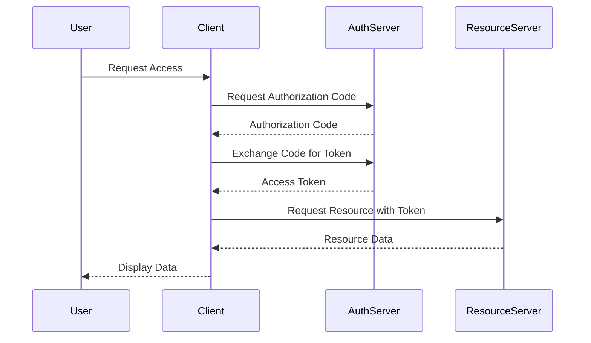

## 12.11. Security Considerations in Microservices

In the realm of microservices architecture, security is a paramount concern. As systems become more distributed, the attack surface increases, necessitating robust security measures. This section delves into critical security considerations in microservices, focusing on authentication and authorization, networking security, and secrets management. By mastering these areas, you can build secure, resilient applications using Elixir.

### Authentication and Authorization

Authentication and authorization are foundational to securing microservices. They ensure that only legitimate users can access your services and that they have the appropriate permissions to perform actions.

#### Implementing OAuth2

OAuth2 is a widely adopted framework for handling authentication in distributed systems. It allows users to grant applications limited access to their resources without exposing credentials.

- **OAuth2 Flow**: In a typical OAuth2 flow, a client application requests authorization from the user, receives an authorization code, and exchanges it for an access token. This token is then used to access protected resources.

- **Elixir Libraries**: Elixir offers several libraries for implementing OAuth2, such as `ueberauth` for authentication and `guardian` for token management.

```elixir
# Example of using Guardian for JWT authentication
defmodule MyAppWeb.AuthPipeline do
  use Guardian.Plug.Pipeline, otp_app: :my_app,
                              module: MyApp.Guardian,
                              error_handler: MyAppWeb.ErrorHandler

  plug Guardian.Plug.VerifyHeader, realm: "Bearer"
  plug Guardian.Plug.EnsureAuthenticated
  plug Guardian.Plug.LoadResource
end
```

- **Configuring OAuth2**: Proper configuration of OAuth2 involves setting up client IDs, secrets, redirect URIs, and scopes. Ensure these are securely stored and managed.

#### JWT Tokens

JSON Web Tokens (JWT) are a compact, URL-safe means of representing claims to be transferred between two parties. They are commonly used for authentication in microservices.

- **Structure**: A JWT consists of three parts: a header, a payload, and a signature. The payload contains claims about the user and the token's validity.

- **Security Considerations**: When using JWTs, ensure the tokens are signed with a strong algorithm (e.g., RS256) and are transmitted over secure channels (HTTPS).

```elixir
# Generating a JWT token with Guardian
{:ok, token, _claims} = MyApp.Guardian.encode_and_sign(user, %{"role" => "admin"})
```

- **Token Expiry**: Set appropriate expiry times for tokens to reduce the risk of misuse. Implement token revocation mechanisms for enhanced security.

### Networking Security

Securing communication between microservices is crucial to prevent data interception and tampering.

#### Securing Communication with TLS/SSL

Transport Layer Security (TLS) and its predecessor, Secure Sockets Layer (SSL), are protocols that provide communication security over a computer network.

- **TLS/SSL in Elixir**: Use libraries like `Plug.SSL` to enforce HTTPS connections in your Elixir applications.

```elixir
# Enforcing HTTPS in a Phoenix application
config :my_app, MyAppWeb.Endpoint,
  https: [port: 443,
          cipher_suite: :strong,
          keyfile: System.get_env("SSL_KEY_PATH"),
          certfile: System.get_env("SSL_CERT_PATH")]
```

- **Certificate Management**: Regularly update and manage SSL/TLS certificates. Consider using automated tools like Let's Encrypt for certificate issuance and renewal.

- **Mutual TLS**: Implement mutual TLS (mTLS) for added security, where both the client and server authenticate each other. This is particularly useful in service-to-service communication.

#### Network Segmentation and Firewalls

- **Segmentation**: Divide your network into segments to limit access and reduce the impact of a potential breach.

- **Firewalls**: Use firewalls to control incoming and outgoing traffic based on predetermined security rules.

- **Zero Trust Architecture**: Adopt a zero trust approach, where every request is authenticated and authorized, regardless of its origin within the network.

### Secrets Management

Managing secrets such as API keys, passwords, and certificates is critical to maintaining the security of microservices.

#### Safely Storing and Accessing Sensitive Information

- **Environment Variables**: Use environment variables to store sensitive information, ensuring they are not hardcoded in your application code.

- **Secret Management Tools**: Utilize secret management tools like HashiCorp Vault or AWS Secrets Manager to securely store and access secrets.

```elixir
# Accessing a secret from an environment variable
db_password = System.get_env("DB_PASSWORD")
```

- **Encryption**: Encrypt sensitive data at rest and in transit. Use libraries like `Comeonin` for password hashing and `Jose` for encryption in Elixir.

#### Rotating Secrets

- **Regular Rotation**: Regularly rotate secrets to minimize the risk of exposure. Implement automated processes for key rotation where possible.

- **Audit and Monitoring**: Continuously audit and monitor access to secrets to detect unauthorized access and potential breaches.

### Visualizing Security in Microservices

To better understand the flow of security in microservices, let's visualize a typical authentication and authorization process using a sequence diagram.


```mermaid
sequenceDiagram
    participant User
    participant Client
    participant AuthServer
    participant ResourceServer

    User->>Client: Request Access
    Client->>AuthServer: Request Authorization Code
    AuthServer-->>Client: Authorization Code
    Client->>AuthServer: Exchange Code for Token
    AuthServer-->>Client: Access Token
    Client->>ResourceServer: Request Resource with Token
    ResourceServer-->>Client: Resource Data
    Client-->>User: Display Data
```

**Diagram Explanation**: This sequence diagram illustrates the OAuth2 flow, where a user requests access through a client, which then interacts with an authorization server to obtain an access token. This token is used to request resources from a resource server.

### Best Practices for Security in Microservices

- **Principle of Least Privilege**: Ensure that users and services have the minimum level of access necessary to perform their functions.

- **Regular Security Audits**: Conduct regular security audits and penetration testing to identify and mitigate vulnerabilities.

- **Logging and Monitoring**: Implement comprehensive logging and monitoring to detect and respond to security incidents promptly.

- **Patch Management**: Keep your software and dependencies up to date with the latest security patches.

### Try It Yourself

Experiment with the code examples provided by implementing a simple authentication system in your Elixir application. Modify the JWT token generation to include custom claims, and set up a secure HTTPS connection using TLS. Explore using a secret management tool to store sensitive information and practice rotating secrets regularly.

### Key Takeaways

- Authentication and authorization are critical for securing microservices, with OAuth2 and JWT being popular solutions.
- Secure network communications using TLS/SSL and consider mutual TLS for service-to-service communication.
- Proper secrets management is essential, involving secure storage, access, and regular rotation of sensitive information.

### Embrace the Journey

Remember, security is an ongoing process. As you build and scale your microservices, continually evaluate and enhance your security measures. Stay informed about the latest security practices and technologies, and never hesitate to seek help from the community. Keep experimenting, stay vigilant, and enjoy the journey of building secure microservices with Elixir!

## Quiz Time!



### What is the primary purpose of OAuth2 in microservices?

- [x] To handle authentication and authorization
- [ ] To manage database connections
- [ ] To optimize network performance
- [ ] To provide data encryption

> **Explanation:** OAuth2 is primarily used for handling authentication and authorization in distributed systems.

### Which Elixir library is commonly used for JWT token management?

- [x] Guardian
- [ ] Plug
- [ ] Ecto
- [ ] Phoenix

> **Explanation:** Guardian is a popular Elixir library for JWT token management.

### What protocol is recommended for securing communication between microservices?

- [x] TLS/SSL
- [ ] FTP
- [ ] HTTP
- [ ] SMTP

> **Explanation:** TLS/SSL is recommended for securing communication between microservices.

### What is mutual TLS (mTLS)?

- [x] A security protocol where both client and server authenticate each other
- [ ] A method for encrypting data at rest
- [ ] A technique for optimizing database queries
- [ ] A tool for managing microservices

> **Explanation:** Mutual TLS (mTLS) is a security protocol where both the client and server authenticate each other.

### How should sensitive information like API keys be stored in Elixir applications?

- [x] Using environment variables
- [ ] Hardcoded in the application code
- [ ] In plain text files
- [ ] In the database

> **Explanation:** Sensitive information should be stored using environment variables to enhance security.

### What is a key benefit of regular secret rotation?

- [x] It minimizes the risk of exposure
- [ ] It improves application performance
- [ ] It reduces network latency
- [ ] It simplifies code maintenance

> **Explanation:** Regular secret rotation minimizes the risk of exposure.

### Which tool can be used for managing secrets in Elixir applications?

- [x] HashiCorp Vault
- [ ] Phoenix
- [ ] Ecto
- [ ] Plug

> **Explanation:** HashiCorp Vault is a tool that can be used for managing secrets in Elixir applications.

### What is the principle of least privilege?

- [x] Ensuring users and services have the minimum access necessary
- [ ] Providing maximum access to all users
- [ ] Allowing unrestricted access to all services
- [ ] Granting full administrative rights to all users

> **Explanation:** The principle of least privilege ensures users and services have the minimum access necessary to perform their functions.

### Why is logging and monitoring important in microservices security?

- [x] To detect and respond to security incidents promptly
- [ ] To increase application speed
- [ ] To reduce server load
- [ ] To simplify code deployment

> **Explanation:** Logging and monitoring are important for detecting and responding to security incidents promptly.

### True or False: OAuth2 is used for data encryption in microservices.

- [ ] True
- [x] False

> **Explanation:** OAuth2 is used for authentication and authorization, not data encryption.


