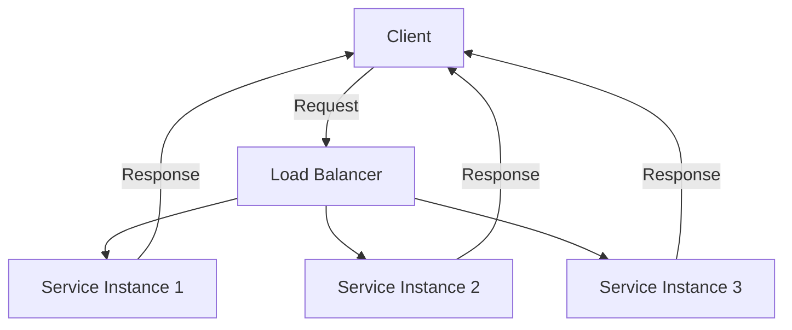

## 12.12. Scaling Microservices

In the world of microservices, scaling is a critical aspect that ensures your application can handle increased loads and maintain performance. Elixir, with its inherent concurrency model and the power of the BEAM VM, provides unique advantages for scaling microservices. In this section, we will explore advanced strategies for scaling microservices in Elixir, focusing on horizontal scaling, auto-scaling, and load balancing.

### Introduction to Scaling Microservices

Scaling microservices involves adjusting the resources allocated to your services to meet demand. This can be achieved through various strategies, each with its own benefits and challenges. Let's delve into the core concepts of scaling microservices.

### Horizontal Scaling

Horizontal scaling, also known as scaling out, involves adding more instances of a service to handle increased load. This approach is particularly effective in microservices architectures, where services are designed to be stateless and independently deployable.

#### Key Concepts

- **Stateless Services**: Ensure that your services are stateless, meaning they do not store any session data locally. This allows any instance of the service to handle any request, facilitating easy scaling.
- **Service Discovery**: Implement service discovery mechanisms to automatically detect and route traffic to new instances as they are added.
- **Data Consistency**: Consider eventual consistency models to handle data synchronization across multiple instances.

#### Code Example: Spawning Multiple Instances

```elixir
defmodule MyApp.Worker do
  use GenServer

  def start_link(_) do
    GenServer.start_link(__MODULE__, %{}, name: __MODULE__)
  end

  def init(state) do
    {:ok, state}
  end

  # Define worker functions here
end

# Supervisor to manage worker instances
defmodule MyApp.WorkerSupervisor do
  use Supervisor

  def start_link(_) do
    Supervisor.start_link(__MODULE__, :ok, name: __MODULE__)
  end

  def init(:ok) do
    children = for _ <- 1..System.schedulers_online() do
      %{
        id: MyApp.Worker,
        start: {MyApp.Worker, :start_link, [[]]},
        restart: :permanent
      }
    end

    Supervisor.init(children, strategy: :one_for_one)
  end
end
```

In this example, we define a `Worker` module and a `WorkerSupervisor` to manage multiple instances of the worker. The number of instances is determined by the number of available CPU cores, allowing us to scale horizontally by leveraging all available resources.

#### Design Considerations

- **Network Latency**: As you add more instances, consider the impact of network latency on performance. Use distributed tracing to monitor and optimize latency.
- **Resource Allocation**: Ensure that your infrastructure can support the additional instances, both in terms of computing resources and network bandwidth.

### Auto-Scaling

Auto-scaling is the process of dynamically adjusting the number of service instances based on demand. This ensures that your application can handle varying loads without manual intervention.

#### Key Concepts

- **Metrics and Monitoring**: Use metrics such as CPU usage, memory consumption, and request latency to trigger scaling events.
- **Thresholds and Policies**: Define thresholds and policies for scaling up and down to prevent over-provisioning or under-provisioning.
- **Integration with Cloud Providers**: Leverage cloud provider tools like AWS Auto Scaling or Google Cloud's Autoscaler for seamless integration.

#### Code Example: Auto-Scaling with Kubernetes

```yaml
apiVersion: autoscaling/v2beta2
kind: HorizontalPodAutoscaler
metadata:
  name: myapp-worker
spec:
  scaleTargetRef:
    apiVersion: apps/v1
    kind: Deployment
    name: myapp-worker
  minReplicas: 1
  maxReplicas: 10
  metrics:
  - type: Resource
    resource:
      name: cpu
      target:
        type: Utilization
        averageUtilization: 50
```

In this Kubernetes configuration, we define a `HorizontalPodAutoscaler` for our `myapp-worker` deployment. The autoscaler adjusts the number of replicas based on CPU utilization, maintaining an average utilization of 50%.

#### Design Considerations

- **Scaling Lag**: Be aware of the time it takes for new instances to start and become operational. Design your system to handle sudden spikes in load gracefully.
- **Cost Management**: Monitor and manage the cost implications of auto-scaling, especially in cloud environments where resources are billed based on usage.

### Load Balancing

Load balancing is the process of distributing incoming traffic evenly across multiple service instances. This ensures that no single instance is overwhelmed, improving performance and reliability.

#### Key Concepts

- **Reverse Proxies**: Use reverse proxies like Nginx or HAProxy to distribute traffic across instances.
- **Round Robin and Least Connections**: Implement load balancing algorithms such as round robin or least connections to optimize traffic distribution.
- **Health Checks**: Regularly perform health checks on instances to ensure they are operational and capable of handling requests.

#### Code Example: Load Balancing with Nginx

```nginx
http {
  upstream myapp {
    server 192.168.1.101;
    server 192.168.1.102;
    server 192.168.1.103;
  }

  server {
    listen 80;

    location / {
      proxy_pass http://myapp;
    }
  }
}
```

In this Nginx configuration, we define an upstream block with multiple server instances. Incoming requests are distributed across these instances, ensuring balanced load.

#### Design Considerations

- **Session Persistence**: If your application requires session persistence, consider using sticky sessions or external session storage.
- **Failover and Redundancy**: Implement failover mechanisms to reroute traffic in case of instance failure, ensuring high availability.

### Visualizing Scaling Strategies

To better understand the scaling strategies discussed, let's visualize the architecture of a scaled microservices system.



**Diagram Description**: This diagram illustrates a basic load balancing setup where a client sends requests to a load balancer, which then distributes the requests across multiple service instances. Each instance processes the request and sends a response back to the client.

### Elixir's Unique Features for Scaling

Elixir offers several unique features that make it particularly well-suited for scaling microservices:

- **Concurrency Model**: Elixir's lightweight processes and message-passing model enable efficient handling of concurrent requests.
- **Fault Tolerance**: The "let it crash" philosophy and OTP's supervision trees ensure that services can recover from failures gracefully.
- **Hot Code Upgrades**: Elixir supports hot code upgrades, allowing you to update services without downtime.

### Differences and Similarities with Other Languages

While many of the scaling strategies discussed are applicable to other languages, Elixir's concurrency model and fault tolerance features provide distinct advantages. Unlike traditional object-oriented languages, Elixir's functional paradigm encourages immutability and statelessness, which are ideal for microservices architectures.

### Knowledge Check

- **Question**: What is the primary advantage of horizontal scaling in microservices?
- **Answer**: It allows for increased capacity by adding more instances, improving fault tolerance and load distribution.

- **Question**: How does auto-scaling benefit microservices architectures?
- **Answer**: It dynamically adjusts resources based on demand, optimizing performance and cost.

- **Question**: Why is load balancing important in a microservices architecture?
- **Answer**: It ensures even distribution of traffic, preventing any single instance from being overwhelmed.

### Try It Yourself

Experiment with the code examples provided by:

- Modifying the number of worker instances in the `WorkerSupervisor` to see how it affects performance.
- Adjusting the CPU utilization threshold in the Kubernetes autoscaler configuration.
- Adding more server instances in the Nginx configuration and observing the impact on load distribution.

### Conclusion

Scaling microservices is a complex but essential aspect of building robust, high-performance applications. By leveraging Elixir's unique features and implementing strategies such as horizontal scaling, auto-scaling, and load balancing, you can ensure that your microservices architecture is prepared to handle any demand.

Remember, this is just the beginning. As you progress, you'll discover more advanced techniques and tools to optimize your microservices architecture. Keep experimenting, stay curious, and enjoy the journey!

## Quiz: Scaling Microservices



### What is the primary advantage of horizontal scaling in microservices?

- [x] It allows for increased capacity by adding more instances.
- [ ] It reduces the number of service instances.
- [ ] It eliminates the need for load balancing.
- [ ] It simplifies the architecture.

> **Explanation:** Horizontal scaling increases capacity by adding more instances, improving fault tolerance and load distribution.

### How does auto-scaling benefit microservices architectures?

- [x] It dynamically adjusts resources based on demand.
- [ ] It statically allocates resources.
- [ ] It reduces the number of service instances.
- [ ] It eliminates the need for monitoring.

> **Explanation:** Auto-scaling dynamically adjusts resources based on demand, optimizing performance and cost.

### Why is load balancing important in a microservices architecture?

- [x] It ensures even distribution of traffic.
- [ ] It reduces the number of service instances.
- [ ] It eliminates the need for auto-scaling.
- [ ] It simplifies the architecture.

> **Explanation:** Load balancing ensures even distribution of traffic, preventing any single instance from being overwhelmed.

### What is a key consideration when implementing horizontal scaling?

- [x] Ensuring services are stateless.
- [ ] Reducing the number of instances.
- [ ] Eliminating network latency.
- [ ] Simplifying the architecture.

> **Explanation:** Ensuring services are stateless allows any instance to handle any request, facilitating easy scaling.

### What tool can be used for auto-scaling in cloud environments?

- [x] AWS Auto Scaling
- [ ] Nginx
- [ ] Docker
- [ ] Git

> **Explanation:** AWS Auto Scaling is a tool used for auto-scaling in cloud environments.

### What is a common load balancing algorithm?

- [x] Round Robin
- [ ] FIFO
- [ ] LIFO
- [ ] Bubble Sort

> **Explanation:** Round Robin is a common load balancing algorithm that distributes traffic evenly across instances.

### What is the role of a reverse proxy in load balancing?

- [x] Distributing traffic across instances.
- [ ] Reducing the number of instances.
- [ ] Eliminating network latency.
- [ ] Simplifying the architecture.

> **Explanation:** A reverse proxy distributes traffic across instances, ensuring balanced load.

### What is a benefit of using Elixir for scaling microservices?

- [x] Efficient handling of concurrent requests.
- [ ] Simplifying the architecture.
- [ ] Reducing the number of instances.
- [ ] Eliminating network latency.

> **Explanation:** Elixir's concurrency model enables efficient handling of concurrent requests.

### What is a key feature of Elixir's concurrency model?

- [x] Lightweight processes and message-passing.
- [ ] Heavyweight threads and shared memory.
- [ ] Static resource allocation.
- [ ] Simplified architecture.

> **Explanation:** Elixir's concurrency model uses lightweight processes and message-passing for efficient concurrency.

### True or False: Elixir supports hot code upgrades.

- [x] True
- [ ] False

> **Explanation:** Elixir supports hot code upgrades, allowing updates without downtime.


