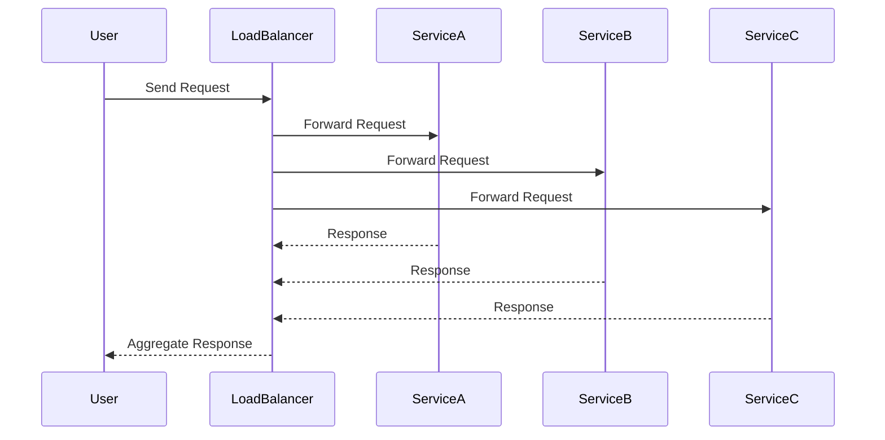

## 12.12. Scaling Microservices

Scaling microservices is a critical aspect of building robust, high-performance applications that can handle varying loads efficiently. In this section, we will explore the fundamental concepts and techniques for scaling microservices, particularly in the context of Elixir. We'll delve into horizontal scaling, auto-scaling, and load balancing, providing you with the knowledge and tools to design scalable systems.

### Introduction to Microservices Scaling

Microservices architecture is inherently designed to support scalability. By breaking down a monolithic application into smaller, independent services, each service can be scaled independently based on its specific needs. This approach allows for more efficient resource utilization and can lead to significant improvements in performance and resilience.

**Key Concepts:**
- **Scalability** refers to the ability of a system to handle increased load by adding resources.
- **Horizontal Scaling** involves adding more instances of a service.
- **Vertical Scaling** involves increasing the resources (CPU, RAM) of existing instances.
- **Load Balancing** ensures that traffic is distributed evenly across service instances.

### Horizontal Scaling

Horizontal scaling, also known as scaling out, involves adding more instances of a service to handle increased load. This approach is often preferred over vertical scaling because it offers better fault tolerance and can be more cost-effective.

#### Benefits of Horizontal Scaling
- **Fault Tolerance**: If one instance fails, others can continue to serve requests.
- **Cost Efficiency**: Adding more instances can be cheaper than upgrading hardware.
- **Flexibility**: Easily adjust the number of instances based on demand.

#### Implementing Horizontal Scaling in Elixir

Elixir, running on the BEAM virtual machine, is well-suited for horizontal scaling due to its lightweight process model and excellent support for concurrency.

**Steps to Implement Horizontal Scaling:**
1. **Containerization**: Use Docker to containerize your Elixir applications, making it easy to deploy multiple instances.
2. **Orchestration**: Use Kubernetes or Docker Swarm to manage and orchestrate your containers.
3. **Service Discovery**: Implement service discovery to allow instances to find each other. Tools like Consul or Kubernetes' built-in service discovery can be used.

```elixir
# Example of a simple Elixir application setup for horizontal scaling
defmodule MyApp do
  use Application

  def start(_type, _args) do
    children = [
      # Start the endpoint when the application starts
      MyAppWeb.Endpoint,
      # Start a worker by calling: MyApp.Worker.start_link(arg)
      # {MyApp.Worker, arg}
    ]

    # See https://hexdocs.pm/elixir/Supervisor.html
    # for other strategies and supported options
    opts = [strategy: :one_for_one, name: MyApp.Supervisor]
    Supervisor.start_link(children, opts)
  end
end
```

### Auto-Scaling

Auto-scaling is the process of dynamically adjusting the number of instances based on the current load. This ensures that resources are used efficiently and that the system can handle sudden spikes in traffic.

#### Benefits of Auto-Scaling
- **Resource Optimization**: Automatically scale down during low demand to save costs.
- **Performance**: Scale up quickly to handle increased load, maintaining performance.
- **Resilience**: Automatically recover from failures by replacing failed instances.

#### Implementing Auto-Scaling in Elixir

To implement auto-scaling, you can use cloud provider features like AWS Auto Scaling or Kubernetes' Horizontal Pod Autoscaler.

**Steps to Implement Auto-Scaling:**
1. **Metrics Collection**: Use tools like Prometheus to collect metrics on CPU, memory, and request rates.
2. **Define Policies**: Set thresholds for scaling up or down based on collected metrics.
3. **Configure Auto-Scaler**: Use your cloud provider's auto-scaling tools to adjust the number of instances based on defined policies.

```yaml
# Kubernetes Horizontal Pod Autoscaler configuration
apiVersion: autoscaling/v2beta2
kind: HorizontalPodAutoscaler
metadata:
  name: myapp-hpa
spec:
  scaleTargetRef:
    apiVersion: apps/v1
    kind: Deployment
    name: myapp
  minReplicas: 1
  maxReplicas: 10
  metrics:
  - type: Resource
    resource:
      name: cpu
      target:
        type: Utilization
        averageUtilization: 50
```

### Load Balancing

Load balancing is essential for distributing incoming traffic evenly across multiple service instances. This ensures that no single instance becomes a bottleneck, improving both performance and availability.

#### Benefits of Load Balancing
- **Improved Performance**: Distributes load evenly, preventing any single instance from becoming overloaded.
- **High Availability**: Redirects traffic from failed instances to healthy ones.
- **Scalability**: Supports horizontal scaling by distributing traffic across all available instances.

#### Implementing Load Balancing in Elixir

Elixir applications can leverage various load balancing solutions, such as NGINX, HAProxy, or cloud provider load balancers.

**Steps to Implement Load Balancing:**
1. **Choose a Load Balancer**: Select a load balancer that fits your architecture and requirements.
2. **Configure Load Balancer**: Set up rules to distribute traffic based on IP, URL, or other criteria.
3. **Integrate with Service Discovery**: Ensure the load balancer is aware of new instances as they are added or removed.

```nginx
# Example NGINX configuration for load balancing Elixir applications
upstream myapp {
  server app1.example.com;
  server app2.example.com;
  server app3.example.com;
}

server {
  listen 80;

  location / {
    proxy_pass http://myapp;
  }
}
```

### Visualizing the Scaling Process

To better understand how these components work together, let's visualize the scaling process using a sequence diagram.


```mermaid
sequenceDiagram
    participant User
    participant LoadBalancer
    participant ServiceA
    participant ServiceB
    participant ServiceC

    User->>LoadBalancer: Send Request
    LoadBalancer->>ServiceA: Forward Request
    LoadBalancer->>ServiceB: Forward Request
    LoadBalancer->>ServiceC: Forward Request
    ServiceA-->>LoadBalancer: Response
    ServiceB-->>LoadBalancer: Response
    ServiceC-->>LoadBalancer: Response
    LoadBalancer-->>User: Aggregate Response
```

### Challenges in Scaling Microservices

Scaling microservices is not without its challenges. Here are some common issues you may encounter:

- **State Management**: Stateless services are easier to scale. For stateful services, consider using distributed data stores.
- **Network Latency**: As services are distributed, network latency can become a bottleneck. Optimize communication between services.
- **Consistency and Coordination**: Ensure data consistency across services, especially when scaling databases.
- **Monitoring and Logging**: Implement comprehensive monitoring and logging to track performance and troubleshoot issues.

### Best Practices for Scaling Microservices

1. **Design for Scalability**: Build services with scalability in mind from the start.
2. **Use Asynchronous Communication**: Reduce coupling and improve resilience by using message queues or event streams.
3. **Implement Circuit Breakers**: Protect services from cascading failures by using circuit breakers.
4. **Optimize Resource Utilization**: Regularly review and optimize resource usage to reduce costs.
5. **Automate Everything**: Use automation tools for deployment, scaling, and monitoring to reduce manual intervention.

### Elixir's Unique Features for Scaling

Elixir's concurrency model, based on the Actor model, provides unique advantages for scaling microservices:

- **Lightweight Processes**: Elixir processes are lightweight and can handle thousands of concurrent connections.
- **Fault Tolerance**: The "let it crash" philosophy and supervision trees make it easier to build resilient systems.
- **Hot Code Swapping**: Elixir supports hot code swapping, allowing you to update running services without downtime.

### Conclusion

Scaling microservices effectively requires a combination of architectural design, automation, and monitoring. By leveraging Elixir's strengths and following best practices, you can build scalable, resilient systems that can handle varying loads efficiently.

Remember, this is just the beginning. As you progress, you'll build more complex and interactive systems. Keep experimenting, stay curious, and enjoy the journey!

## Quiz Time!



### What is horizontal scaling?

- [x] Adding more instances of a service to handle increased load
- [ ] Increasing the resources of existing instances
- [ ] Distributing traffic evenly across service instances
- [ ] Dynamically adjusting resources based on demand

> **Explanation:** Horizontal scaling involves adding more instances of a service to handle increased load, as opposed to vertical scaling, which increases the resources of existing instances.

### What is the main advantage of auto-scaling?

- [x] Automatically adjusting resources based on demand
- [ ] Distributing traffic evenly across service instances
- [ ] Increasing the resources of existing instances
- [ ] Adding more instances of a service to handle increased load

> **Explanation:** Auto-scaling automatically adjusts resources based on demand, ensuring efficient resource utilization and maintaining performance during traffic spikes.

### Which tool is commonly used for container orchestration?

- [x] Kubernetes
- [ ] NGINX
- [ ] Prometheus
- [ ] Consul

> **Explanation:** Kubernetes is a popular tool for container orchestration, managing the deployment, scaling, and operation of application containers.

### What is the purpose of load balancing?

- [x] Distributing traffic evenly across service instances
- [ ] Automatically adjusting resources based on demand
- [ ] Increasing the resources of existing instances
- [ ] Adding more instances of a service to handle increased load

> **Explanation:** Load balancing distributes traffic evenly across service instances to prevent any single instance from becoming a bottleneck.

### What is a benefit of using Elixir's lightweight processes?

- [x] Handling thousands of concurrent connections
- [ ] Automatically adjusting resources based on demand
- [ ] Increasing the resources of existing instances
- [ ] Distributing traffic evenly across service instances

> **Explanation:** Elixir's lightweight processes can handle thousands of concurrent connections, making it ideal for building scalable systems.

### What is the "let it crash" philosophy in Elixir?

- [x] Building resilient systems by allowing processes to fail and recover
- [ ] Distributing traffic evenly across service instances
- [ ] Automatically adjusting resources based on demand
- [ ] Increasing the resources of existing instances

> **Explanation:** The "let it crash" philosophy in Elixir involves building resilient systems by allowing processes to fail and recover, often using supervision trees.

### What is a common challenge when scaling microservices?

- [x] State management
- [ ] Automatically adjusting resources based on demand
- [ ] Distributing traffic evenly across service instances
- [ ] Increasing the resources of existing instances

> **Explanation:** State management is a common challenge when scaling microservices, especially for stateful services.

### What is a best practice for scaling microservices?

- [x] Use asynchronous communication
- [ ] Automatically adjusting resources based on demand
- [ ] Distributing traffic evenly across service instances
- [ ] Increasing the resources of existing instances

> **Explanation:** Using asynchronous communication reduces coupling and improves resilience, making it a best practice for scaling microservices.

### What is a benefit of using hot code swapping in Elixir?

- [x] Updating running services without downtime
- [ ] Automatically adjusting resources based on demand
- [ ] Distributing traffic evenly across service instances
- [ ] Increasing the resources of existing instances

> **Explanation:** Hot code swapping in Elixir allows for updating running services without downtime, enhancing system availability.

### True or False: Vertical scaling is preferred over horizontal scaling for microservices.

- [ ] True
- [x] False

> **Explanation:** Horizontal scaling is often preferred over vertical scaling for microservices because it offers better fault tolerance and can be more cost-effective.


