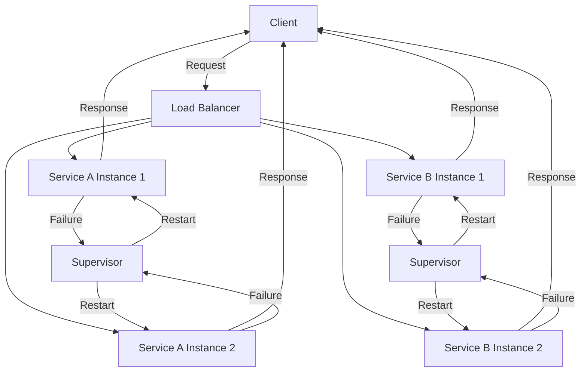

## 12.13. Fault Tolerance and Resilience

In the world of microservices, fault tolerance and resilience are crucial for building robust systems that can withstand failures and continue to operate smoothly. Elixir, with its inherent strengths in concurrency and the actor model, provides a powerful platform for implementing these patterns. In this section, we will delve into the key concepts and strategies for achieving fault tolerance and resilience in Elixir microservices, focusing on redundancy, bulkheads, and timeouts with retries.

### Understanding Fault Tolerance and Resilience

**Fault Tolerance** refers to the ability of a system to continue operating properly in the event of the failure of some of its components. It involves designing systems that can detect failures and recover from them without affecting the overall system performance.

**Resilience**, on the other hand, is the capacity of a system to absorb disturbances and still retain its basic function and structure. It involves not just handling failures but also adapting to changing conditions and recovering quickly.

### Key Concepts in Fault Tolerance and Resilience

#### Redundancy

Redundancy involves having backup components or systems that can take over in case of a failure. This can be achieved through:

- **Active Redundancy**: Running multiple instances of a service simultaneously, where one instance can take over if another fails.
- **Passive Redundancy**: Having standby components that are activated only when the primary component fails.

#### Bulkheads

The bulkhead pattern involves isolating different parts of a system to prevent a failure in one part from cascading to others. This is akin to compartments in a ship, where a breach in one compartment does not flood the entire vessel.

#### Timeouts and Retries

Configuring appropriate timeouts and implementing intelligent retries are essential for handling transient failures. This involves:

- **Timeouts**: Setting limits on how long a service should wait for a response before considering it a failure.
- **Retries**: Attempting to perform an operation again after a failure, often with exponential backoff to avoid overwhelming the system.

### Implementing Fault Tolerance and Resilience in Elixir

#### Redundancy in Elixir

Elixir's concurrency model, based on the Erlang VM (BEAM), makes it well-suited for implementing redundancy. Let's explore how to achieve redundancy using Elixir processes and supervisors.

```elixir
defmodule RedundantService do
  use GenServer

  def start_link(_) do
    GenServer.start_link(__MODULE__, %{}, name: __MODULE__)
  end

  def init(state) do
    {:ok, state}
  end

  def handle_call(:perform_task, _from, state) do
    # Simulate task execution
    result = perform_task()
    {:reply, result, state}
  end

  defp perform_task do
    # Task logic here
    :ok
  end
end

defmodule RedundantSupervisor do
  use Supervisor

  def start_link(_) do
    Supervisor.start_link(__MODULE__, :ok, name: __MODULE__)
  end

  def init(:ok) do
    children = [
      {RedundantService, []},
      {RedundantService, []} # Multiple instances for redundancy
    ]

    Supervisor.init(children, strategy: :one_for_one)
  end
end
```

In this example, we define a `RedundantService` module that performs a task. The `RedundantSupervisor` starts multiple instances of this service, ensuring redundancy. If one instance fails, the supervisor can restart it, maintaining service availability.

#### Bulkheads in Elixir

The bulkhead pattern can be implemented in Elixir by isolating different parts of the system into separate processes or nodes. This prevents a failure in one part from affecting others.

```elixir
defmodule BulkheadService do
  use GenServer

  def start_link(name) do
    GenServer.start_link(__MODULE__, %{}, name: name)
  end

  def init(state) do
    {:ok, state}
  end

  def handle_call(:perform_task, _from, state) do
    # Simulate task execution
    result = perform_task()
    {:reply, result, state}
  end

  defp perform_task do
    # Task logic here
    :ok
  end
end

defmodule BulkheadSupervisor do
  use Supervisor

  def start_link(_) do
    Supervisor.start_link(__MODULE__, :ok, name: __MODULE__)
  end

  def init(:ok) do
    children = [
      {BulkheadService, :service_a},
      {BulkheadService, :service_b} # Isolated services
    ]

    Supervisor.init(children, strategy: :one_for_one)
  end
end
```

In this example, we create isolated services `service_a` and `service_b`, each running in its own process. This isolation ensures that a failure in one service does not impact the other.

#### Timeouts and Retries in Elixir

Implementing timeouts and retries in Elixir can be done using libraries like `:timer` and `Task`. Let's explore how to configure timeouts and retries for a service call.

```elixir
defmodule TimeoutRetryService do
  use GenServer

  def start_link(_) do
    GenServer.start_link(__MODULE__, %{}, name: __MODULE__)
  end

  def init(state) do
    {:ok, state}
  end

  def handle_call(:perform_task, _from, state) do
    result = with_timeout(fn -> perform_task() end, 5000)
    {:reply, result, state}
  end

  defp perform_task do
    # Simulate task execution
    :ok
  end

  defp with_timeout(fun, timeout) do
    Task.async(fun)
    |> Task.await(timeout)
    |> handle_result()
  rescue
    _ -> {:error, :timeout}
  end

  defp handle_result({:ok, result}), do: {:ok, result}
  defp handle_result({:error, _} = error), do: error
end
```

In this example, we use `Task.async` and `Task.await` to execute a task with a timeout. If the task does not complete within the specified time, it returns a timeout error. This pattern can be extended with retries using a recursive function or a library like `retry`.

### Visualizing Fault Tolerance and Resilience

To better understand the concepts of fault tolerance and resilience, let's visualize the architecture of a resilient Elixir microservice system using Mermaid.js.



**Diagram Description:** This diagram illustrates a resilient microservice architecture with redundancy and bulkheads. The load balancer distributes requests to multiple instances of services A and B. Each service instance is supervised, allowing for automatic restarts in case of failure.

### Best Practices for Fault Tolerance and Resilience

1. **Design for Failure**: Assume that components will fail and design your system to handle these failures gracefully.
2. **Use Supervisors**: Leverage Elixir's supervisor trees to manage process lifecycles and recover from failures.
3. **Implement Circuit Breakers**: Use circuit breaker patterns to prevent cascading failures and allow systems to recover.
4. **Monitor and Alert**: Continuously monitor system health and set up alerts for failures to enable quick response.
5. **Test for Resilience**: Regularly test your system's resilience through chaos engineering practices.

### Try It Yourself

Experiment with the code examples provided by:

- Modifying the number of redundant service instances and observing the system's behavior during failures.
- Implementing a retry mechanism with exponential backoff for the `TimeoutRetryService`.
- Creating additional isolated services using the bulkhead pattern and testing their independence.

### Further Reading

- [Elixir's Supervisor and GenServer Documentation](https://hexdocs.pm/elixir/Supervisor.html)
- [Designing for Resilience in Microservices](https://martinfowler.com/articles/microservices.html)
- [The Circuit Breaker Pattern](https://martinfowler.com/bliki/CircuitBreaker.html)

### Knowledge Check

- What is the difference between fault tolerance and resilience?
- How does the bulkhead pattern prevent cascading failures?
- Why is it important to configure timeouts and retries in microservices?

### Summary

In this section, we explored the concepts of fault tolerance and resilience in Elixir microservices. We learned how to implement redundancy, bulkheads, and timeouts with retries to build robust systems. By leveraging Elixir's concurrency model and OTP features, we can create microservices that are not only fault-tolerant but also resilient to changing conditions.

Remember, this is just the beginning. As you progress, you'll build more complex and resilient systems. Keep experimenting, stay curious, and enjoy the journey!

## Quiz: Fault Tolerance and Resilience



### What is the primary goal of fault tolerance in microservices?

- [x] To ensure the system continues to operate despite component failures
- [ ] To improve the performance of the system
- [ ] To reduce the cost of system maintenance
- [ ] To increase the complexity of the system

> **Explanation:** Fault tolerance aims to keep the system operational even when some components fail.

### How does the bulkhead pattern contribute to system resilience?

- [x] By isolating failures to prevent them from affecting the entire system
- [ ] By increasing the speed of service responses
- [ ] By reducing the number of services needed
- [ ] By simplifying the system architecture

> **Explanation:** The bulkhead pattern isolates failures, preventing them from cascading across the system.

### What is the purpose of setting timeouts in microservices?

- [x] To limit how long a service waits for a response before considering it a failure
- [ ] To increase the time a service takes to respond
- [ ] To reduce the number of requests a service can handle
- [ ] To simplify the service logic

> **Explanation:** Timeouts prevent services from waiting indefinitely for responses, allowing them to handle failures gracefully.

### Which Elixir feature is particularly useful for implementing redundancy?

- [x] Supervisors
- [ ] Protocols
- [ ] Macros
- [ ] Structs

> **Explanation:** Supervisors manage process lifecycles and can restart failed processes, providing redundancy.

### What is a common strategy for implementing retries in microservices?

- [x] Exponential backoff
- [ ] Immediate retry
- [ ] Random retry intervals
- [ ] No retries

> **Explanation:** Exponential backoff gradually increases the wait time between retries, reducing the load on the system.

### Why is monitoring important in resilient systems?

- [x] To detect failures and enable quick response
- [ ] To increase the complexity of the system
- [ ] To reduce the number of services
- [ ] To simplify the architecture

> **Explanation:** Monitoring helps identify failures and allows for timely intervention to maintain system resilience.

### What role do supervisors play in Elixir's fault tolerance?

- [x] They manage process lifecycles and restart failed processes
- [ ] They simplify the system architecture
- [ ] They increase the speed of service responses
- [ ] They reduce the number of services needed

> **Explanation:** Supervisors oversee processes and ensure they are restarted if they fail, maintaining system operation.

### How can chaos engineering help in building resilient systems?

- [x] By testing the system's ability to withstand failures
- [ ] By simplifying the system architecture
- [ ] By reducing the number of services
- [ ] By increasing the speed of service responses

> **Explanation:** Chaos engineering involves deliberately introducing failures to test and improve system resilience.

### What is the benefit of using the circuit breaker pattern?

- [x] It prevents cascading failures and allows systems to recover
- [ ] It increases the complexity of the system
- [ ] It reduces the number of services needed
- [ ] It simplifies the system architecture

> **Explanation:** The circuit breaker pattern helps isolate failures and prevent them from spreading, allowing systems to recover.

### True or False: Resilience only involves handling failures, not adapting to changing conditions.

- [ ] True
- [x] False

> **Explanation:** Resilience involves both handling failures and adapting to changing conditions to maintain system functionality.




