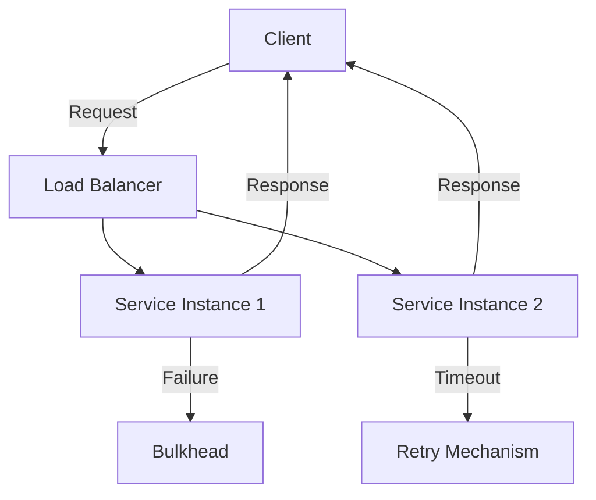

## 12.13. Fault Tolerance and Resilience

In the realm of microservices, fault tolerance and resilience are paramount to building systems that can withstand failures and continue to operate effectively. In this section, we will delve into various design patterns and strategies that can be employed in Elixir to achieve these goals. We will explore concepts such as redundancy, bulkheads, timeouts, and retries, providing both theoretical insights and practical implementations.

### Introduction to Fault Tolerance and Resilience

Fault tolerance refers to the ability of a system to continue functioning in the event of a failure of some of its components. Resilience, on the other hand, is the capacity of a system to recover quickly from difficulties. In microservices architecture, these concepts are crucial because services are often distributed across multiple nodes and are subject to network failures, resource exhaustion, and other issues.

#### Key Concepts

- **Redundancy**: Having multiple instances of a service or component so that if one fails, others can take over.
- **Bulkheads**: Isolating parts of the system to prevent a failure in one area from affecting the entire system.
- **Timeouts and Retries**: Implementing mechanisms to handle slow or unresponsive services by setting timeouts and retrying operations.

### Redundancy

Redundancy is a fundamental principle in fault-tolerant systems. By having multiple instances of a service, you can ensure that if one instance fails, others are available to handle requests. In Elixir, this can be achieved using various techniques such as load balancing and process supervision.

#### Implementing Redundancy in Elixir

Elixir's OTP (Open Telecom Platform) provides robust tools for implementing redundancy. Supervisors, a core component of OTP, can be used to manage multiple instances of a service.

```elixir
defmodule MyApp.Supervisor do
  use Supervisor

  def start_link(init_arg) do
    Supervisor.start_link(__MODULE__, init_arg, name: __MODULE__)
  end

  def init(_init_arg) do
    children = [
      {MyApp.Worker, []},
      {MyApp.Worker, []}
    ]

    Supervisor.init(children, strategy: :one_for_one)
  end
end
```

In this example, we define a supervisor that starts two instances of `MyApp.Worker`. The `:one_for_one` strategy ensures that if one worker crashes, only that worker is restarted, maintaining redundancy.

#### Load Balancing

Load balancing is another way to achieve redundancy. By distributing requests across multiple instances, you can ensure that no single instance becomes a bottleneck or point of failure. In Elixir, libraries like `Phoenix.PubSub` can be used to implement load balancing.

### Bulkheads

The bulkhead pattern is inspired by the design of ships, where compartments are isolated to prevent water from flooding the entire vessel. In software, bulkheads isolate different parts of a system to prevent a failure in one area from cascading.

#### Implementing Bulkheads

In Elixir, you can implement bulkheads by isolating processes and services. This can be done using separate supervision trees for different parts of your application.

```elixir
defmodule MyApp.Application do
  use Application

  def start(_type, _args) do
    children = [
      {MyApp.ServiceA.Supervisor, []},
      {MyApp.ServiceB.Supervisor, []}
    ]

    opts = [strategy: :one_for_one, name: MyApp.Supervisor]
    Supervisor.start_link(children, opts)
  end
end
```

Here, `ServiceA` and `ServiceB` are isolated under separate supervisors, ensuring that a failure in one does not affect the other.

### Timeouts and Retries

Timeouts and retries are essential for handling slow or unresponsive services. By setting appropriate timeouts, you can prevent your system from hanging indefinitely. Retries allow your system to attempt an operation multiple times before giving up.

#### Implementing Timeouts and Retries

In Elixir, you can use the `Task` module to implement timeouts and retries.

```elixir
defmodule MyApp.Retry do
  def with_retry(fun, attempts \\ 3) do
    try do
      Task.await(Task.async(fun), 5000)
    rescue
      _ -> if attempts > 1, do: with_retry(fun, attempts - 1)
    end
  end
end
```

This function attempts to execute a given function with a timeout of 5000 milliseconds. If the function fails, it retries up to a specified number of attempts.

### Visualizing Fault Tolerance Patterns

Below is a diagram illustrating the interaction between redundancy, bulkheads, and timeouts in a microservices architecture.


```mermaid
graph TD;
    A[Client] -->|Request| B[Load Balancer];
    B --> C[Service Instance 1];
    B --> D[Service Instance 2];
    C -->|Response| A;
    D -->|Response| A;
    C -->|Failure| E[Bulkhead];
    D -->|Timeout| F[Retry Mechanism];
```

**Diagram Description:** This diagram shows a client sending requests to a load balancer, which distributes them to multiple service instances. Bulkheads and retry mechanisms are in place to handle failures and timeouts.

### Elixir Unique Features

Elixir's concurrency model, based on the Actor model, makes it particularly well-suited for building fault-tolerant systems. Processes in Elixir are lightweight and isolated, allowing for easy implementation of redundancy and bulkheads. Additionally, Elixir's pattern matching and functional programming paradigm simplify the implementation of retry logic.

### Differences and Similarities

Fault tolerance patterns in Elixir share similarities with those in other languages, such as Java or Python, but Elixir's unique features, like lightweight processes and OTP, provide more efficient and elegant solutions. Unlike object-oriented languages, where exceptions are often used for error handling, Elixir leverages pattern matching and tuples, such as `{:ok, result}` and `{:error, reason}`, to handle errors gracefully.

### Design Considerations

When implementing fault tolerance patterns, consider the following:

- **Performance Overhead**: Redundancy and retries can introduce performance overhead. Ensure that the benefits outweigh the costs.
- **Complexity**: Implementing bulkheads and retries can add complexity to your system. Use these patterns judiciously.
- **Testing**: Thoroughly test your fault tolerance mechanisms to ensure they work as expected under different failure scenarios.

### Try It Yourself

To experiment with these concepts, try modifying the code examples to:

- Increase the number of redundant instances and observe the system's behavior under load.
- Implement a more sophisticated retry mechanism that includes exponential backoff.
- Create a more complex supervision tree with multiple levels of bulkheads.

### Knowledge Check

- What is the primary purpose of redundancy in a fault-tolerant system?
- How does the bulkhead pattern prevent system-wide failures?
- Why are timeouts important in microservices architecture?

### Summary

Fault tolerance and resilience are critical components of robust microservices architectures. By leveraging Elixir's unique features, such as OTP, lightweight processes, and functional programming paradigms, you can build systems that are not only fault-tolerant but also efficient and maintainable. Remember, the journey to mastering these concepts is ongoing. Keep experimenting, stay curious, and enjoy the process!

## Quiz Time!



### What is the primary purpose of redundancy in a fault-tolerant system?

- [x] To ensure service availability in case of failure
- [ ] To improve system performance
- [ ] To reduce system complexity
- [ ] To increase data storage capacity

> **Explanation:** Redundancy ensures that if one instance of a service fails, others are available to take over, maintaining service availability.

### How does the bulkhead pattern prevent system-wide failures?

- [x] By isolating failures to specific parts of the system
- [ ] By increasing the number of service instances
- [ ] By reducing the number of dependencies
- [ ] By optimizing resource usage

> **Explanation:** The bulkhead pattern isolates different parts of a system, preventing a failure in one area from affecting the entire system.

### Why are timeouts important in microservices architecture?

- [x] To prevent the system from hanging indefinitely
- [ ] To increase data throughput
- [ ] To enhance data security
- [ ] To simplify code logic

> **Explanation:** Timeouts prevent the system from waiting indefinitely for a response, allowing it to handle slow or unresponsive services gracefully.

### What is a key benefit of using Elixir's OTP for fault tolerance?

- [x] It provides robust tools for process supervision
- [ ] It simplifies database integration
- [ ] It enhances UI development
- [ ] It reduces code verbosity

> **Explanation:** Elixir's OTP provides robust tools for process supervision, making it easier to implement fault-tolerant systems.

### Which Elixir feature is particularly useful for implementing retries?

- [x] Task module
- [ ] GenServer
- [x] Pattern matching
- [ ] Phoenix framework

> **Explanation:** The Task module and pattern matching are useful for implementing retries by handling asynchronous tasks and error conditions.

### What is the role of a load balancer in a redundant system?

- [x] To distribute requests across multiple service instances
- [ ] To store data persistently
- [ ] To execute business logic
- [ ] To manage user authentication

> **Explanation:** A load balancer distributes requests across multiple service instances, ensuring no single instance becomes a bottleneck.

### How can you implement a bulkhead pattern in Elixir?

- [x] By using separate supervision trees for different services
- [ ] By increasing the number of worker processes
- [ ] By reducing the number of service dependencies
- [ ] By optimizing resource allocation

> **Explanation:** In Elixir, you can implement a bulkhead pattern by using separate supervision trees for different services, isolating failures.

### What is a potential drawback of implementing redundancy?

- [x] Increased performance overhead
- [ ] Reduced system reliability
- [ ] Decreased code readability
- [ ] Limited scalability

> **Explanation:** Implementing redundancy can introduce performance overhead, as multiple instances of a service consume more resources.

### Why is it important to test fault tolerance mechanisms?

- [x] To ensure they work as expected under different failure scenarios
- [ ] To improve the user interface
- [ ] To enhance code readability
- [ ] To simplify deployment processes

> **Explanation:** Testing fault tolerance mechanisms ensures they function correctly and handle failures gracefully under various scenarios.

### True or False: Elixir's lightweight processes make it particularly well-suited for building fault-tolerant systems.

- [x] True
- [ ] False

> **Explanation:** True. Elixir's lightweight processes allow for efficient implementation of fault tolerance patterns, making it well-suited for building robust systems.


