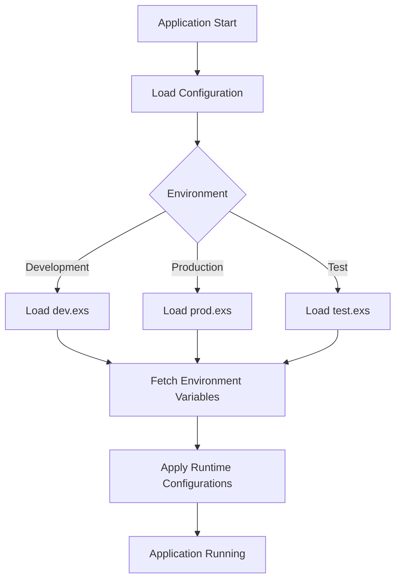

## 12.14. Configuration Management

In the realm of microservices architecture, configuration management is a critical aspect that ensures your applications run smoothly across various environments. Elixir, with its robust ecosystem, provides several tools and patterns to manage configurations effectively. In this section, we'll explore how to handle configurations in Elixir microservices, focusing on externalized configurations, configuration servers, and environment-specific settings.

### Understanding Configuration Management

Configuration management involves maintaining the consistency of a system's performance, functional, and physical attributes with its requirements, design, and operational information throughout its life. In microservices, configurations can include database credentials, API keys, feature flags, and more. Proper configuration management ensures that these settings are easily adjustable without altering the codebase, enhancing both security and flexibility.

### Externalized Configurations

**Externalized configurations** refer to the practice of storing configuration data outside the application code. This approach offers several benefits, such as:

- **Separation of Concerns**: By externalizing configurations, you separate configuration data from your codebase, making it easier to manage and update without redeploying the application.
- **Security**: Sensitive information like API keys and database credentials can be stored securely, reducing the risk of exposing them in version control systems.
- **Flexibility**: Different configurations can be applied for different environments (development, testing, production) without changing the code.

#### Implementing Externalized Configurations in Elixir

Elixir provides various ways to implement externalized configurations. Let's explore some common methods:

1. **Environment Variables**: One of the simplest ways to externalize configurations is by using environment variables. Elixir's `System` module allows you to read environment variables easily.

   ```elixir
   defmodule MyApp.Config do
     def database_url do
       System.get_env("DATABASE_URL")
     end
   end
   ```

   In this example, the `DATABASE_URL` is fetched from the environment variables, allowing you to change it without modifying the code.

2. **Configuration Files**: Elixir applications often use configuration files (`config/config.exs`) to manage settings. These files can be dynamically loaded based on the environment.

   ```elixir
   import Config

   config :my_app, MyApp.Repo,
     username: System.get_env("DB_USERNAME"),
     password: System.get_env("DB_PASSWORD"),
     database: System.get_env("DB_NAME"),
     hostname: System.get_env("DB_HOST"),
     pool_size: 10
   ```

   This approach allows you to define configurations in a structured manner, making it easier to manage complex settings.

3. **Runtime Configuration**: Elixir 1.9 introduced runtime configuration, which allows you to set configurations at runtime using `config/releases.exs`.

   ```elixir
   import Config

   config :my_app, MyApp.Repo,
     url: System.get_env("DATABASE_URL"),
     pool_size: String.to_integer(System.get_env("POOL_SIZE") || "10")
   ```

   This method is particularly useful for releases, where configurations can be adjusted without recompiling the code.

### Configuration Servers

**Configuration servers** provide a centralized way to manage configurations across multiple services. They offer features like versioning, access control, and dynamic updates, making them ideal for microservices architectures.

#### Using Configuration Servers with Elixir

Several tools can be integrated with Elixir applications to manage configurations centrally:

1. **Consul**: HashiCorp's Consul is a popular choice for service discovery and configuration management. It provides a key-value store that can be used to store configuration data.

   - **Integration with Elixir**: You can use libraries like `consul_ex` to interact with Consul from your Elixir application.

     ```elixir
     {:ok, value} = Consul.KV.get("my_app/config/database_url")
     ```

   - **Dynamic Configuration**: Consul allows you to update configurations dynamically without restarting your services.

2. **Vault**: Also from HashiCorp, Vault is designed for managing secrets and protecting sensitive data. It can be used to store configuration data securely.

   - **Integration with Elixir**: Libraries like `vault` can be used to fetch secrets from Vault.

     ```elixir
     {:ok, secret} = Vault.read("secret/my_app/database")
     ```

   - **Access Control**: Vault provides robust access control mechanisms, ensuring that only authorized services can access specific configurations.

3. **Etcd**: Etcd is a distributed key-value store that can be used for configuration management in Elixir applications.

   - **Integration with Elixir**: Libraries like `etcd_ex` can be used to interact with Etcd.

     ```elixir
     {:ok, value} = Etcd.get("my_app/config/database_url")
     ```

   - **High Availability**: Etcd is designed for high availability, making it suitable for distributed systems.

### Environment-Specific Settings

In microservices, it's common to have different configurations for various environments such as development, staging, and production. Managing these settings effectively is crucial for the smooth operation of your services.

#### Handling Environment-Specific Settings

1. **Configuration Files**: Elixir's configuration files can be environment-specific. You can create separate configuration files for each environment, such as `config/dev.exs`, `config/test.exs`, and `config/prod.exs`.

   ```elixir
   # config/dev.exs
   import Config

   config :my_app, MyApp.Repo,
     database: "my_app_dev",
     pool_size: 10
   ```

   ```elixir
   # config/prod.exs
   import Config

   config :my_app, MyApp.Repo,
     database: "my_app_prod",
     pool_size: 20
   ```

   This approach ensures that each environment has its own configurations, reducing the risk of deploying incorrect settings.

2. **Environment Variables**: As mentioned earlier, environment variables can be used to manage environment-specific settings. This method is particularly useful for cloud deployments where environment variables are often used to configure services.

3. **Release Configurations**: With Elixir releases, you can define environment-specific configurations in `config/releases.exs`, which are applied at runtime.

   ```elixir
   import Config

   config :my_app, MyApp.Repo,
     url: System.get_env("DATABASE_URL"),
     pool_size: String.to_integer(System.get_env("POOL_SIZE") || "10")
   ```

   This method allows you to adjust configurations without recompiling the code, making it ideal for production environments.

### Visualizing Configuration Management

To better understand the flow of configuration management in Elixir microservices, let's visualize the process using a diagram.


```mermaid
graph TD;
    A[Application Start] --> B[Load Configuration];
    B --> C{Environment};
    C -->|Development| D[Load dev.exs];
    C -->|Production| E[Load prod.exs];
    C -->|Test| F[Load test.exs];
    D --> G[Fetch Environment Variables];
    E --> G;
    F --> G;
    G --> H[Apply Runtime Configurations];
    H --> I[Application Running];
```

**Diagram Description**: This diagram illustrates the configuration management process in Elixir microservices. When the application starts, it loads the configuration based on the current environment (development, production, or test). It then fetches environment variables and applies runtime configurations before the application runs.

### Best Practices for Configuration Management

1. **Keep Configurations Out of Code**: Always externalize configurations to avoid hardcoding sensitive information in your codebase.

2. **Use Secure Storage for Sensitive Data**: Utilize tools like Vault to store sensitive configurations securely.

3. **Version Control Your Configuration Files**: Keep track of changes to your configuration files using version control systems like Git.

4. **Automate Configuration Management**: Use tools like Ansible or Terraform to automate the deployment and management of configurations.

5. **Regularly Review and Update Configurations**: Ensure that your configurations are up-to-date and reflect the current state of your application.

### Try It Yourself

To get hands-on experience with configuration management in Elixir, try modifying the code examples provided. Experiment with different methods of externalizing configurations and use configuration servers to manage settings dynamically. Consider setting up a small project with different environments and practice applying environment-specific configurations.

### Further Reading

For more information on configuration management, consider exploring the following resources:

- [Elixir Documentation on Configuration](https://hexdocs.pm/elixir/Config.html)
- [Consul by HashiCorp](https://www.consul.io/)
- [Vault by HashiCorp](https://www.vaultproject.io/)
- [Etcd Documentation](https://etcd.io/docs/)

### Knowledge Check

Before we wrap up, let's do a quick knowledge check. Try answering the following questions to test your understanding of configuration management in Elixir microservices.

## Quiz Time!



### What is the primary benefit of externalized configurations?

- [x] Separation of configuration data from codebase
- [ ] Improved application performance
- [ ] Easier code refactoring
- [ ] Reduced application size

> **Explanation:** Externalized configurations separate configuration data from the codebase, making it easier to manage and update without redeploying the application.

### Which tool is commonly used for managing secrets and sensitive data in Elixir applications?

- [ ] Consul
- [x] Vault
- [ ] Etcd
- [ ] Redis

> **Explanation:** Vault is designed for managing secrets and protecting sensitive data, making it ideal for handling configurations securely.

### How can you define environment-specific configurations in Elixir?

- [x] Using environment-specific configuration files like `dev.exs`, `prod.exs`
- [ ] Hardcoding values in the application code
- [ ] Using a single configuration file for all environments
- [ ] Storing configurations in a database

> **Explanation:** Elixir allows you to define environment-specific configurations using separate configuration files like `dev.exs` and `prod.exs`.

### What is the purpose of the `System` module in Elixir?

- [x] To read environment variables
- [ ] To manage application dependencies
- [ ] To compile Elixir code
- [ ] To handle HTTP requests

> **Explanation:** The `System` module in Elixir is used to read environment variables, which is useful for externalizing configurations.

### Which of the following is NOT a feature of configuration servers?

- [ ] Centralized configuration management
- [ ] Versioning of configurations
- [x] Automatic code deployment
- [ ] Dynamic updates to configurations

> **Explanation:** Configuration servers provide centralized management, versioning, and dynamic updates of configurations, but they do not handle code deployment.

### What is the advantage of using runtime configuration in Elixir?

- [x] Allows configuration changes without recompiling code
- [ ] Improves application startup time
- [ ] Reduces memory usage
- [ ] Simplifies code structure

> **Explanation:** Runtime configuration in Elixir allows you to change configurations without recompiling the code, which is beneficial for production environments.

### Which library can be used to interact with Consul from an Elixir application?

- [x] consul_ex
- [ ] ecto
- [ ] phoenix
- [ ] plug

> **Explanation:** The `consul_ex` library is used to interact with Consul from an Elixir application, allowing you to manage configurations centrally.

### What is the role of the `config/releases.exs` file in Elixir?

- [x] To define runtime configurations for releases
- [ ] To store application dependencies
- [ ] To manage database migrations
- [ ] To handle HTTP requests

> **Explanation:** The `config/releases.exs` file is used to define runtime configurations for Elixir releases, allowing for environment-specific settings.

### Which of the following is a best practice for managing configurations?

- [x] Keep configurations out of code
- [ ] Hardcode sensitive information in the codebase
- [ ] Use a single configuration file for all environments
- [ ] Avoid using version control for configuration files

> **Explanation:** A best practice for managing configurations is to keep them out of the codebase to enhance security and flexibility.

### True or False: Environment variables can be used to manage environment-specific settings in Elixir.

- [x] True
- [ ] False

> **Explanation:** True. Environment variables are commonly used to manage environment-specific settings in Elixir applications.



Remember, mastering configuration management is a continuous journey. As you gain more experience, you'll discover new patterns and tools that can further enhance your Elixir microservices. Keep experimenting, stay curious, and enjoy the journey!
