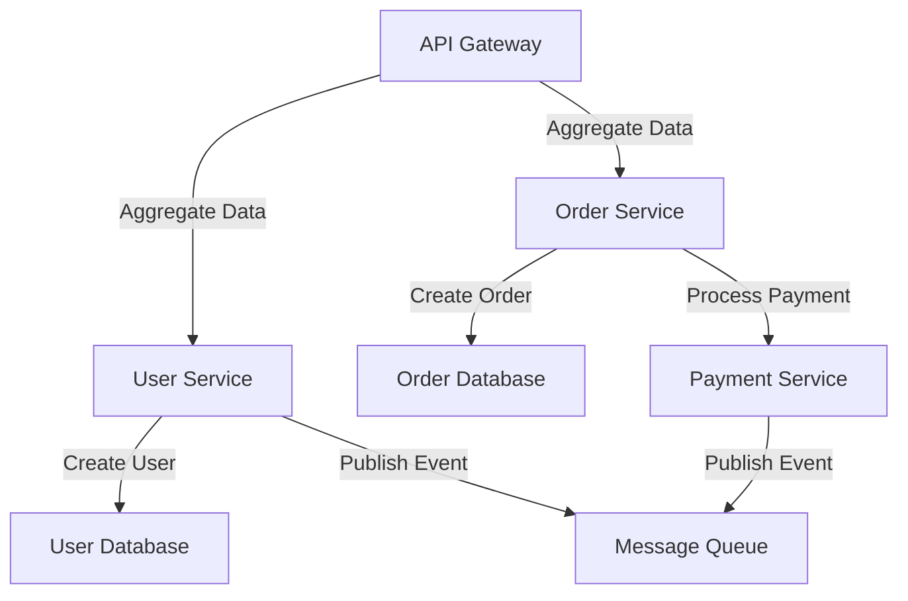

## 12.15. Data Management in Microservices

In the realm of microservices architecture, data management is a critical aspect that can significantly impact the scalability, reliability, and maintainability of your system. As expert software engineers and architects, understanding the nuances of data management in microservices is essential to building robust and efficient systems. In this section, we will delve into the key patterns and practices for managing data in microservices, with a focus on Elixir.

### Database per Service Pattern

The **Database per Service Pattern** is a fundamental principle in microservices architecture. It dictates that each microservice should have its own database. This pattern promotes loose coupling between services, allowing them to evolve independently. Let's explore the benefits and challenges of this pattern.

#### Benefits of Database per Service

1. **Loose Coupling**: By having a separate database for each service, you ensure that services are not tightly coupled. This allows for independent deployment and scaling of services.

2. **Autonomy**: Each service can choose the database technology that best suits its needs, whether it's a relational database, a NoSQL database, or an in-memory data store.

3. **Scalability**: Services can be scaled independently based on their specific load and performance requirements.

4. **Security**: Isolating databases enhances security by limiting the scope of data access to the service that owns it.

#### Challenges of Database per Service

1. **Data Consistency**: Maintaining consistency across distributed databases can be challenging, especially in systems that require strong consistency.

2. **Cross-Service Queries**: Direct queries across service databases are discouraged, leading to complexities in data retrieval and aggregation.

3. **Data Duplication**: Some data may need to be duplicated across services, leading to potential synchronization issues.

#### Implementing Database per Service in Elixir

In Elixir, implementing the Database per Service pattern involves setting up separate database connections for each service. Here's a simple example using Ecto, Elixir's database wrapper and query generator.

```elixir
# Define a Repo for each service
defmodule UserService.Repo do
  use Ecto.Repo,
    otp_app: :user_service,
    adapter: Ecto.Adapters.Postgres
end

defmodule OrderService.Repo do
  use Ecto.Repo,
    otp_app: :order_service,
    adapter: Ecto.Adapters.Postgres
end

# Configure each Repo in your config files
config :user_service, UserService.Repo,
  database: "user_service_db",
  username: "postgres",
  password: "postgres",
  hostname: "localhost"

config :order_service, OrderService.Repo,
  database: "order_service_db",
  username: "postgres",
  password: "postgres",
  hostname: "localhost"
```

### Data Consistency

In a microservices architecture, achieving data consistency is a complex task due to the distributed nature of the system. Let's explore strategies for managing data consistency.

#### Eventual Consistency

Eventual consistency is a consistency model used in distributed computing to achieve high availability. It ensures that, given enough time, all replicas of a data item will converge to the same value.

- **Use Cases**: Suitable for systems where immediate consistency is not critical, such as social media feeds or product catalogs.

- **Implementation**: Implement eventual consistency using message queues or event streams to propagate changes across services.

```elixir
# Example of publishing an event to a message queue
defmodule UserService do
  def create_user(attrs) do
    user = %User{}
    |> User.changeset(attrs)
    |> Repo.insert()

    case user do
      {:ok, user} ->
        # Publish an event to the message queue
        EventBus.publish(:user_created, user)
        {:ok, user}

      {:error, changeset} ->
        {:error, changeset}
    end
  end
end
```

#### Distributed Transactions

Distributed transactions are used to ensure atomicity across multiple services. However, they can be complex and may impact performance.

- **Two-Phase Commit (2PC)**: A protocol to ensure all or none of the operations are committed across distributed systems.

- **Saga Pattern**: An alternative to 2PC, where a series of compensating transactions are used to undo partial transactions in case of failure.

```elixir
# Example of a Saga pattern implementation
defmodule OrderSaga do
  def create_order(order_details) do
    with {:ok, order} <- OrderService.create_order(order_details),
         {:ok, payment} <- PaymentService.process_payment(order) do
      {:ok, order}
    else
      {:error, reason} ->
        # Compensate by canceling the order
        OrderService.cancel_order(order)
        {:error, reason}
    end
  end
end
```

### Cross-Service Queries

Cross-service queries can lead to tight coupling and performance bottlenecks. Instead, consider the following strategies:

#### API Composition

Use API composition to aggregate data from multiple services. This involves making multiple API calls and combining the results.

```elixir
defmodule ApiGateway do
  def get_user_orders(user_id) do
    user = UserService.get_user(user_id)
    orders = OrderService.get_orders_by_user(user_id)

    %{user: user, orders: orders}
  end
end
```

#### Command Query Responsibility Segregation (CQRS)

CQRS separates the read and write operations, allowing for optimized data retrieval.

- **Read Models**: Create specialized read models that aggregate data from multiple services for efficient querying.

- **Write Models**: Keep write models focused on handling commands and maintaining data integrity.

### Visualizing Data Management in Microservices

To better understand the flow of data in a microservices architecture, let's visualize the interactions between services, databases, and external systems.



**Diagram Description**: This diagram illustrates the flow of data in a microservices architecture. The User Service creates a user and publishes an event to a message queue. The Order Service creates an order and processes payment, also publishing an event. The API Gateway aggregates data from the User and Order Services.

### Best Practices for Data Management in Microservices

1. **Embrace Event-Driven Architecture**: Use event-driven architecture to decouple services and achieve eventual consistency.

2. **Design for Failure**: Implement compensating transactions and retries to handle failures gracefully.

3. **Optimize for Read and Write**: Use CQRS to separate read and write operations, optimizing each for its specific use case.

4. **Monitor and Log**: Implement robust monitoring and logging to track data flow and identify issues.

5. **Secure Data Access**: Ensure that only authorized services can access specific data, enhancing security.

### Elixir Unique Features

Elixir, with its functional programming paradigm and robust concurrency model, offers unique features that enhance data management in microservices:

- **Pattern Matching**: Use pattern matching to simplify data transformations and error handling.

- **Supervision Trees**: Leverage supervision trees to build fault-tolerant systems that can recover from failures.

- **GenStage and Flow**: Utilize GenStage and Flow for building data processing pipelines that handle backpressure and parallelism.

### Differences and Similarities with Other Patterns

- **Database per Service vs. Shared Database**: While the Database per Service pattern promotes autonomy, a shared database can simplify data consistency but at the cost of tight coupling.

- **Saga Pattern vs. Two-Phase Commit**: The Saga pattern offers a more flexible approach to distributed transactions compared to the rigid two-phase commit protocol.

### Try It Yourself

Experiment with the concepts discussed in this section by implementing a simple microservices architecture using Elixir. Create two services with separate databases and implement event-driven communication between them. Try modifying the code examples to suit your specific use case.

### Knowledge Check

- What are the benefits of the Database per Service pattern?
- How can eventual consistency be achieved in a microservices architecture?
- What is the difference between the Saga pattern and the Two-Phase Commit protocol?
- How can API composition be used to aggregate data from multiple services?

### Conclusion

Data management in microservices is a complex but rewarding endeavor. By understanding and implementing the patterns and practices discussed in this section, you can build scalable, reliable, and maintainable systems using Elixir. Remember, this is just the beginning. As you progress, you'll discover new challenges and opportunities in the world of microservices. Keep experimenting, stay curious, and enjoy the journey!

## Quiz: Data Management in Microservices



### What is the primary benefit of the Database per Service pattern?

- [x] Loose coupling between services
- [ ] Easier cross-service queries
- [ ] Simplified data consistency
- [ ] Reduced data duplication

> **Explanation:** The Database per Service pattern promotes loose coupling by allowing each service to have its own database, enabling independent deployment and scaling.

### How can eventual consistency be achieved in a microservices architecture?

- [x] Using message queues or event streams
- [ ] Direct database queries across services
- [ ] Two-Phase Commit protocol
- [ ] Shared database for all services

> **Explanation:** Eventual consistency can be achieved by using message queues or event streams to propagate changes across services asynchronously.

### What is the Saga pattern used for?

- [x] Managing distributed transactions
- [ ] Optimizing read operations
- [ ] Aggregating data from multiple services
- [ ] Ensuring immediate consistency

> **Explanation:** The Saga pattern is used to manage distributed transactions by executing a series of compensating transactions in case of failure.

### Which strategy is recommended for aggregating data from multiple services?

- [x] API Composition
- [ ] Direct database queries
- [ ] Shared database
- [ ] Two-Phase Commit

> **Explanation:** API Composition involves making multiple API calls and combining the results, avoiding direct database queries across services.

### What is a key feature of Elixir that enhances data management in microservices?

- [x] Pattern Matching
- [ ] Shared mutable state
- [ ] Tight coupling
- [ ] Synchronous communication

> **Explanation:** Elixir's pattern matching simplifies data transformations and error handling, enhancing data management in microservices.

### What is a challenge associated with the Database per Service pattern?

- [x] Data Consistency
- [ ] Loose coupling
- [ ] Independent scaling
- [ ] Security

> **Explanation:** Maintaining data consistency across distributed databases is a challenge with the Database per Service pattern.

### How does the Saga pattern differ from the Two-Phase Commit protocol?

- [x] Saga uses compensating transactions
- [ ] Saga ensures immediate consistency
- [ ] Two-Phase Commit is more flexible
- [ ] Saga requires a shared database

> **Explanation:** The Saga pattern uses compensating transactions to handle failures, offering more flexibility than the rigid Two-Phase Commit protocol.

### What is the role of supervision trees in Elixir?

- [x] Building fault-tolerant systems
- [ ] Ensuring data consistency
- [ ] Aggregating data from services
- [ ] Managing distributed transactions

> **Explanation:** Supervision trees in Elixir help build fault-tolerant systems by managing process lifecycles and recovering from failures.

### Which Elixir feature is used for building data processing pipelines?

- [x] GenStage and Flow
- [ ] Pattern Matching
- [ ] Two-Phase Commit
- [ ] API Composition

> **Explanation:** GenStage and Flow are used in Elixir for building data processing pipelines that handle backpressure and parallelism.

### True or False: Direct queries across service databases are encouraged in microservices architecture.

- [ ] True
- [x] False

> **Explanation:** Direct queries across service databases are discouraged in microservices architecture to maintain loose coupling and avoid performance bottlenecks.


