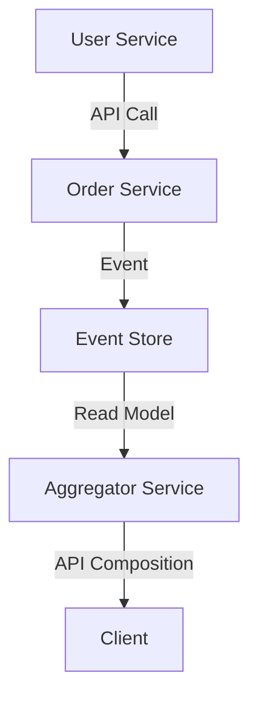

## 12.15. Data Management in Microservices

In the realm of microservices architecture, managing data effectively is crucial for building scalable, resilient, and maintainable systems. Unlike monolithic architectures, where a single database is often shared across the entire application, microservices advocate for decentralized data management. This section will delve into key strategies and patterns for data management in microservices, specifically focusing on the Database per Service pattern, data consistency, and cross-service queries.

### Database per Service Pattern

The Database per Service pattern is a cornerstone of microservices architecture. It prescribes that each microservice should have its own database, which it exclusively owns and manages. This approach offers several benefits:

- **Loose Coupling**: By decoupling the data layer, services can evolve independently without impacting others.
- **Autonomy**: Each service can choose the database technology that best suits its needs, whether it's a relational database, NoSQL, or a graph database.
- **Scalability**: Services can be scaled independently, allowing for more efficient resource utilization.

#### Implementing Database per Service in Elixir

In Elixir, implementing the Database per Service pattern involves setting up separate database connections for each microservice. This can be achieved using Ecto, Elixir's database wrapper and query generator.

```elixir
# Define a Repo for each service
defmodule UserService.Repo do
  use Ecto.Repo,
    otp_app: :user_service,
    adapter: Ecto.Adapters.Postgres
end

defmodule OrderService.Repo do
  use Ecto.Repo,
    otp_app: :order_service,
    adapter: Ecto.Adapters.Postgres
end

# Configurations in config.exs
config :user_service, UserService.Repo,
  database: "user_service_db",
  username: "postgres",
  password: "postgres",
  hostname: "localhost"

config :order_service, OrderService.Repo,
  database: "order_service_db",
  username: "postgres",
  password: "postgres",
  hostname: "localhost"
```

In this example, we define separate repositories for the `UserService` and `OrderService`, each connecting to its own database. This separation ensures that the services remain autonomous and can be developed, tested, and deployed independently.

#### Challenges and Considerations

While the Database per Service pattern offers numerous advantages, it also introduces challenges:

- **Data Duplication**: Some data might need to be duplicated across services, leading to potential inconsistencies.
- **Complex Queries**: Queries that span multiple services become more complex and may require additional logic to handle data aggregation.

### Data Consistency

Data consistency is a significant concern in microservices architectures due to the distributed nature of the system. Unlike monolithic systems where ACID transactions ensure strong consistency, microservices often have to deal with eventual consistency.

#### Eventual Consistency

Eventual consistency means that while data may not be immediately consistent across the system, it will become consistent over time. This approach is suitable for scenarios where immediate consistency is not critical.

##### Implementing Eventual Consistency with Elixir

Elixir's concurrency model and message-passing capabilities make it well-suited for implementing eventual consistency. One common approach is using event sourcing and CQRS (Command Query Responsibility Segregation).

```elixir
# Event Sourcing Example
defmodule OrderService do
  use GenServer

  def handle_cast({:place_order, order}, state) do
    # Persist the event
    EventStore.append_to_stream("orders", order)

    # Process the order
    {:noreply, process_order(order, state)}
  end

  defp process_order(order, state) do
    # Business logic to process order
    # ...
    state
  end
end
```

In this example, the `OrderService` uses event sourcing to persist order events. These events can then be processed asynchronously, allowing the system to remain responsive while ensuring eventual consistency.

#### Managing Distributed Transactions

Managing transactions across multiple services is challenging due to the lack of a global transaction manager. Two common patterns for handling distributed transactions are the Saga pattern and the Two-Phase Commit (2PC) protocol.

##### Saga Pattern

The Saga pattern decomposes a transaction into a series of smaller, independent transactions that are coordinated through a central orchestrator or a choreography-based approach.

```elixir
# Saga Orchestrator Example
defmodule OrderSaga do
  use GenServer

  def start_link(order_id) do
    GenServer.start_link(__MODULE__, order_id, name: via_tuple(order_id))
  end

  def init(order_id) do
    # Start the saga
    {:ok, %{order_id: order_id, state: :pending}}
  end

  def handle_cast({:next_step, step}, state) do
    # Execute the next step in the saga
    # ...
    {:noreply, %{state | state: :completed}}
  end
end
```

In this example, the `OrderSaga` orchestrates the steps involved in processing an order, ensuring that each step is completed successfully or compensating actions are taken if a step fails.

##### Two-Phase Commit (2PC)

The Two-Phase Commit protocol is a distributed algorithm that ensures all participants in a transaction agree to commit or abort the transaction. However, it is less commonly used in microservices due to its complexity and potential for blocking.

### Cross-Service Queries

Cross-service queries are often necessary when data from multiple services needs to be aggregated or analyzed. However, directly querying across service databases is discouraged as it violates the principle of service autonomy.

#### Strategies for Cross-Service Queries

1. **API Composition**: Aggregate data by calling the APIs of the involved services and combining the results.
2. **CQRS**: Use a separate read model that aggregates data from multiple services.
3. **Data Replication**: Replicate relevant data across services to reduce the need for cross-service queries.

##### API Composition Example

```elixir
defmodule AggregatorService do
  def get_user_order_summary(user_id) do
    user = UserService.get_user(user_id)
    orders = OrderService.get_orders_for_user(user_id)

    %{
      user: user,
      orders: orders
    }
  end
end
```

In this example, the `AggregatorService` composes data from the `UserService` and `OrderService` to provide a consolidated view of a user's order summary.

#### Considerations for Cross-Service Queries

- **Performance**: API composition can lead to increased latency due to multiple network calls.
- **Consistency**: Ensuring data consistency across services can be challenging, especially with eventual consistency.

### Visualizing Data Management in Microservices

To better understand the flow of data management in microservices, let's visualize the architecture using a Mermaid.js diagram.


```mermaid
graph TD;
    A[User Service] -->|API Call| B[Order Service];
    B -->|Event| C[Event Store];
    C -->|Read Model| D[Aggregator Service];
    D -->|API Composition| E[Client];
```

**Diagram Explanation:** This diagram illustrates the interaction between the User Service and Order Service through API calls and event-driven communication. The Aggregator Service composes data from multiple services to provide a unified view to the client.

### Key Takeaways

- **Database per Service**: Promotes loose coupling and autonomy but requires careful handling of data duplication and complex queries.
- **Data Consistency**: Eventual consistency is often necessary in microservices, with patterns like Saga and event sourcing helping manage distributed transactions.
- **Cross-Service Queries**: Avoid direct database queries across services; use API composition, CQRS, or data replication instead.

### Embrace the Journey

As we delve deeper into data management in microservices, remember that each system is unique. The patterns and strategies discussed here are guidelines, not strict rules. Experiment, adapt, and find what works best for your architecture. Keep exploring, stay curious, and enjoy the journey of mastering Elixir and microservices!

## Quiz Time!



### What is a key benefit of the Database per Service pattern?

- [x] Loose coupling between services
- [ ] Shared database resources
- [ ] Simplified cross-service queries
- [ ] Centralized data management

> **Explanation:** The Database per Service pattern promotes loose coupling by allowing each service to manage its own database independently.

### Which pattern helps manage distributed transactions in microservices?

- [x] Saga Pattern
- [ ] Singleton Pattern
- [ ] Adapter Pattern
- [ ] Bridge Pattern

> **Explanation:** The Saga pattern is used to manage distributed transactions by breaking them into smaller, independent transactions.

### How does eventual consistency differ from strong consistency?

- [x] Eventual consistency allows data to become consistent over time.
- [ ] Eventual consistency ensures immediate consistency.
- [ ] Eventual consistency is only used in monolithic architectures.
- [ ] Eventual consistency eliminates the need for data replication.

> **Explanation:** Eventual consistency allows data to become consistent over time, which is suitable for distributed systems like microservices.

### What is a disadvantage of cross-service queries?

- [x] Increased latency due to multiple network calls
- [ ] Simplified data aggregation
- [ ] Improved data consistency
- [ ] Reduced need for API composition

> **Explanation:** Cross-service queries can lead to increased latency because they involve multiple network calls to aggregate data.

### Which Elixir feature is well-suited for implementing eventual consistency?

- [x] Concurrency model and message-passing capabilities
- [ ] Shared mutable state
- [ ] Centralized database management
- [ ] Direct cross-service queries

> **Explanation:** Elixir's concurrency model and message-passing capabilities make it well-suited for implementing eventual consistency.

### What is a common challenge with the Database per Service pattern?

- [x] Data duplication across services
- [ ] Simplified data management
- [ ] Centralized database schema
- [ ] Reduced autonomy of services

> **Explanation:** Data duplication across services can lead to potential inconsistencies and is a common challenge with the Database per Service pattern.

### Which strategy is recommended for aggregating data from multiple services?

- [x] API Composition
- [ ] Direct database queries
- [ ] Shared database schema
- [ ] Centralized data warehouse

> **Explanation:** API Composition is recommended for aggregating data from multiple services by calling their APIs and combining results.

### What is the role of the Aggregator Service in cross-service queries?

- [x] Composes data from multiple services to provide a unified view
- [ ] Manages a shared database for all services
- [ ] Ensures strong consistency across services
- [ ] Reduces the need for eventual consistency

> **Explanation:** The Aggregator Service composes data from multiple services to provide a unified view to the client.

### True or False: The Two-Phase Commit protocol is commonly used in microservices.

- [ ] True
- [x] False

> **Explanation:** The Two-Phase Commit protocol is less commonly used in microservices due to its complexity and potential for blocking.

### Which pattern decomposes a transaction into smaller, independent transactions?

- [x] Saga Pattern
- [ ] Singleton Pattern
- [ ] Adapter Pattern
- [ ] Bridge Pattern

> **Explanation:** The Saga pattern decomposes a transaction into smaller, independent transactions, which are coordinated through a central orchestrator or choreography-based approach.




