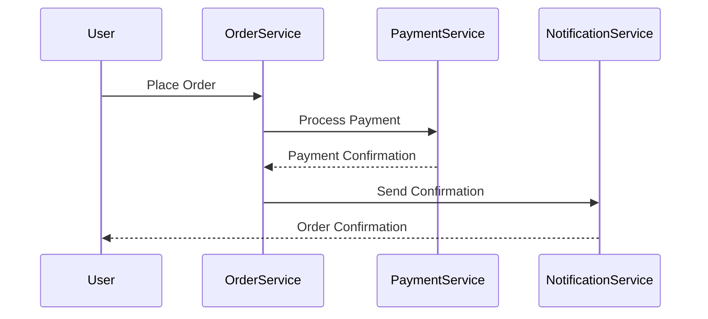

## 12.16. Testing Strategies for Microservices

In the realm of microservices, testing is not just a phase in the development lifecycle; it's an ongoing practice that ensures the reliability, scalability, and maintainability of your system. As Elixir developers, we have the advantage of leveraging the language's robust features to implement effective testing strategies. In this section, we'll explore various testing strategies tailored for microservices, including unit testing, integration testing, contract testing, and end-to-end testing.

### Understanding Microservices Testing

Before diving into specific testing strategies, it's crucial to understand the unique challenges that microservices architecture presents. Unlike monolithic applications, microservices are composed of multiple, independently deployable services that communicate over a network. This architecture introduces complexities such as network latency, service dependencies, and data consistency, which must be addressed through comprehensive testing.

### Unit Testing

**Unit Testing** focuses on testing individual components or functions in isolation. In Elixir, this often involves testing modules and functions to ensure they behave as expected. Unit tests are the foundation of any testing strategy, providing fast feedback and helping to catch bugs early in the development process.

#### Key Concepts

- **Isolation**: Unit tests should not depend on external systems or services. Use mocks or stubs to simulate dependencies.
- **Speed**: Unit tests should be fast to execute, allowing for rapid iteration and feedback.
- **Granularity**: Test small, specific pieces of functionality to pinpoint issues quickly.

#### Elixir Example

```elixir
defmodule Calculator do
  def add(a, b), do: a + b
  def subtract(a, b), do: a - b
end

defmodule CalculatorTest do
  use ExUnit.Case

  test "adds two numbers" do
    assert Calculator.add(1, 2) == 3
  end

  test "subtracts two numbers" do
    assert Calculator.subtract(5, 3) == 2
  end
end
```

In this example, we define a simple `Calculator` module and test its functions using ExUnit, Elixir's built-in testing framework.

### Integration Testing

**Integration Testing** involves testing the interactions between different services or components. In a microservices architecture, this means verifying that services can communicate and work together as expected.

#### Key Concepts

- **Inter-Service Communication**: Test the communication between services, including API calls and message passing.
- **Data Consistency**: Ensure data remains consistent across services.
- **Environment**: Use a staging or test environment that mirrors production as closely as possible.

#### Elixir Example

```elixir
defmodule OrderService do
  def place_order(order_details) do
    # Logic to place an order
  end
end

defmodule PaymentService do
  def process_payment(order_id) do
    # Logic to process payment
  end
end

defmodule IntegrationTest do
  use ExUnit.Case

  test "order placement and payment processing" do
    order_details = %{item: "book", quantity: 1}
    order_id = OrderService.place_order(order_details)

    assert PaymentService.process_payment(order_id) == :ok
  end
end
```

In this integration test, we simulate the interaction between an `OrderService` and a `PaymentService`, ensuring that an order can be placed and paid for successfully.

### Contract Testing

**Contract Testing** ensures that services adhere to agreed-upon interfaces or contracts. This is particularly important in microservices, where services are often developed and maintained by different teams.

#### Key Concepts

- **Consumer-Driven Contracts**: Define contracts based on the needs of the service consumers.
- **Versioning**: Manage changes to contracts over time to avoid breaking changes.
- **Automation**: Automate contract tests to run as part of the CI/CD pipeline.

#### Elixir Example

```elixir
defmodule UserService do
  def get_user(id) do
    # Logic to retrieve user
  end
end

defmodule UserServiceContractTest do
  use ExUnit.Case

  test "get_user contract" do
    user_id = 123
    expected_response = %{id: 123, name: "Alice"}

    assert UserService.get_user(user_id) == expected_response
  end
end
```

In this contract test, we verify that the `UserService` returns the expected response for a given user ID, ensuring that it adheres to the contract.

### End-to-End Testing

**End-to-End Testing** validates the entire system from start to finish. This type of testing simulates real-world scenarios to ensure that the system behaves as expected under realistic conditions.

#### Key Concepts

- **User Journeys**: Test complete user journeys, from start to finish.
- **Environment**: Use a production-like environment to catch issues that only occur in real-world conditions.
- **Automation**: Automate end-to-end tests to run regularly and catch regressions.

#### Elixir Example

```elixir
defmodule EndToEndTest do
  use ExUnit.Case

  test "user can place an order and receive confirmation" do
    # Simulate user placing an order
    order_details = %{item: "laptop", quantity: 1}
    order_id = OrderService.place_order(order_details)

    # Simulate payment processing
    assert PaymentService.process_payment(order_id) == :ok

    # Simulate order confirmation
    assert OrderService.confirm_order(order_id) == :confirmed
  end
end
```

In this end-to-end test, we simulate a complete user journey, from placing an order to receiving confirmation, ensuring that all components work together seamlessly.

### Visualizing Testing Strategies

To better understand the flow of testing strategies in a microservices architecture, let's visualize the process using a sequence diagram.



This sequence diagram illustrates the interactions between different services during an end-to-end test, highlighting the importance of testing each step in the process.

### Best Practices for Testing Microservices

- **Automate Tests**: Automate as many tests as possible to ensure consistent and reliable results.
- **Use Mocks and Stubs**: Use mocks and stubs to isolate components and simulate dependencies.
- **Monitor Test Coverage**: Regularly monitor test coverage to identify gaps and areas for improvement.
- **Run Tests in CI/CD**: Integrate tests into your CI/CD pipeline to catch issues early and often.
- **Test in Production**: Consider testing in production environments to catch issues that only occur under real-world conditions.

### Try It Yourself

Experiment with the code examples provided in this section. Try modifying the tests to simulate different scenarios, such as network failures or service outages. This will help you gain a deeper understanding of how to test microservices effectively.

### Knowledge Check

- What are the key differences between unit testing and integration testing?
- How can contract testing help prevent breaking changes in microservices?
- Why is it important to automate end-to-end tests?

### Embrace the Journey

Testing microservices can be challenging, but it's also an opportunity to build robust and reliable systems. Remember, this is just the beginning. As you progress, you'll develop more advanced testing strategies and tools. Keep experimenting, stay curious, and enjoy the journey!

## Quiz: Testing Strategies for Microservices



### What is the primary focus of unit testing in microservices?

- [x] Testing individual components in isolation
- [ ] Testing interactions between services
- [ ] Ensuring services adhere to interfaces
- [ ] Validating the entire system

> **Explanation:** Unit testing focuses on testing individual components or functions in isolation to ensure they behave as expected.

### What is the main goal of integration testing?

- [ ] Testing individual components
- [x] Testing interactions between services
- [ ] Ensuring services adhere to interfaces
- [ ] Validating the entire system

> **Explanation:** Integration testing involves testing the interactions between different services or components to ensure they work together as expected.

### What does contract testing ensure in microservices?

- [ ] Testing individual components
- [ ] Testing interactions between services
- [x] Ensuring services adhere to interfaces
- [ ] Validating the entire system

> **Explanation:** Contract testing ensures that services adhere to agreed-upon interfaces or contracts, preventing breaking changes.

### What is the purpose of end-to-end testing?

- [ ] Testing individual components
- [ ] Testing interactions between services
- [ ] Ensuring services adhere to interfaces
- [x] Validating the entire system

> **Explanation:** End-to-end testing validates the entire system from start to finish, simulating real-world scenarios.

### Which testing strategy is best for catching issues that occur under real-world conditions?

- [ ] Unit Testing
- [ ] Integration Testing
- [ ] Contract Testing
- [x] End-to-End Testing

> **Explanation:** End-to-end testing is best for catching issues that occur under real-world conditions, as it simulates complete user journeys.

### Why is it important to automate tests in microservices?

- [x] To ensure consistent and reliable results
- [ ] To reduce the number of tests
- [ ] To make tests more complex
- [ ] To avoid testing in production

> **Explanation:** Automating tests ensures consistent and reliable results, making it easier to catch issues early and often.

### What role do mocks and stubs play in testing microservices?

- [x] They isolate components and simulate dependencies
- [ ] They increase test complexity
- [ ] They replace end-to-end tests
- [ ] They are used only in production

> **Explanation:** Mocks and stubs are used to isolate components and simulate dependencies, making it easier to test individual parts of a system.

### How can contract testing help prevent breaking changes?

- [x] By ensuring services adhere to agreed-upon interfaces
- [ ] By testing individual components
- [ ] By validating the entire system
- [ ] By simulating real-world scenarios

> **Explanation:** Contract testing helps prevent breaking changes by ensuring services adhere to agreed-upon interfaces or contracts.

### What is a key benefit of running tests in a CI/CD pipeline?

- [x] Catching issues early and often
- [ ] Reducing the number of tests
- [ ] Making tests more complex
- [ ] Avoiding testing in production

> **Explanation:** Running tests in a CI/CD pipeline helps catch issues early and often, ensuring a more reliable system.

### True or False: Testing in production environments can help catch issues that only occur under real-world conditions.

- [x] True
- [ ] False

> **Explanation:** Testing in production environments can help catch issues that only occur under real-world conditions, providing valuable insights into system behavior.




