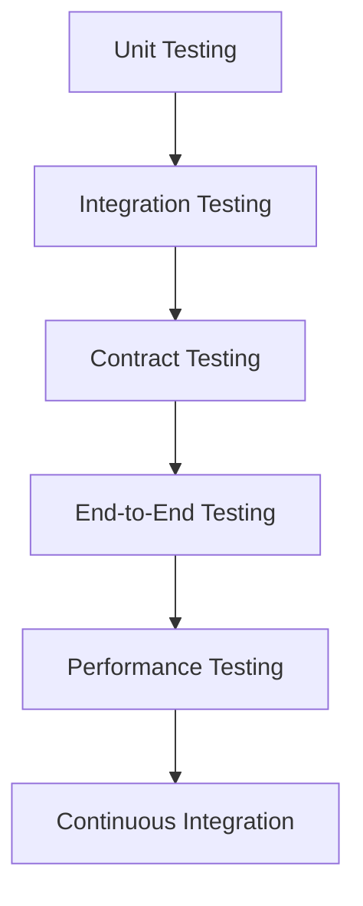

## 12.16. Testing Strategies for Microservices

As microservices architecture becomes increasingly popular for building scalable and maintainable systems, testing strategies must evolve to ensure the robustness and reliability of these distributed systems. In this section, we'll delve into various testing strategies tailored for microservices implemented in Elixir, focusing on unit testing, integration testing, contract testing, and end-to-end testing.

### Introduction to Microservices Testing

Microservices testing involves validating the functionality, performance, and reliability of individual services and their interactions within a distributed system. Testing microservices presents unique challenges due to their distributed nature, independent deployment, and the need for inter-service communication. Let's explore how we can address these challenges using Elixir's powerful features.

### Unit Testing

Unit testing is the foundation of any testing strategy. It involves testing individual components or functions in isolation to ensure they work as expected. In Elixir, unit tests are typically written using the ExUnit framework, which provides a robust set of tools for defining and running tests.

#### Key Concepts in Unit Testing

- **Isolation**: Each test should run independently of others, without relying on external systems or shared state.
- **Mocking and Stubbing**: Use mocks and stubs to simulate dependencies and isolate the unit under test.
- **Test Coverage**: Aim for high test coverage to ensure that most of the code is tested.

#### Writing Unit Tests in Elixir

Here's a simple example of a unit test in Elixir using ExUnit:

```elixir
defmodule MathTest do
  use ExUnit.Case

  test "addition of two numbers" do
    assert Math.add(1, 2) == 3
  end

  test "subtraction of two numbers" do
    assert Math.subtract(5, 3) == 2
  end
end
```

In this example, we're testing basic arithmetic functions. Notice how each test is independent and focuses on a specific function.

#### Try It Yourself

Experiment by adding more tests for multiplication and division. Consider edge cases, such as division by zero, to ensure robustness.

### Integration Testing

Integration testing focuses on testing the interactions between different services or components. In a microservices architecture, this often involves testing the communication between services over HTTP or other protocols.

#### Key Concepts in Integration Testing

- **Service Interaction**: Validate that services communicate correctly and handle responses as expected.
- **Data Consistency**: Ensure that data remains consistent across services.
- **Error Handling**: Test how services handle errors and failures in communication.

#### Writing Integration Tests in Elixir

Elixir's HTTP client libraries, such as HTTPoison, can be used to simulate service interactions. Here's an example of an integration test:

```elixir
defmodule UserServiceTest do
  use ExUnit.Case
  alias MyApp.UserService

  test "fetches user data from external service" do
    response = UserService.get_user_data(1)
    assert response.status_code == 200
    assert response.body["name"] == "John Doe"
  end
end
```

In this test, we're simulating a call to an external service to fetch user data. We verify the response status and content to ensure the interaction works as expected.

#### Try It Yourself

Modify the test to handle different response scenarios, such as a 404 error for a non-existent user.

### Contract Testing

Contract testing ensures that services adhere to agreed-upon interfaces. This is crucial in microservices, where services are developed and deployed independently.

#### Key Concepts in Contract Testing

- **Consumer-Driven Contracts**: Define contracts based on consumer expectations.
- **Versioning**: Handle changes in contracts gracefully to avoid breaking dependent services.
- **Automation**: Automate contract verification to ensure compliance.

#### Implementing Contract Tests in Elixir

Pact is a popular tool for contract testing. It allows you to define and verify contracts between services. Here's a basic example:

```elixir
defmodule UserServiceContractTest do
  use ExUnit.Case
  import PactElixir

  test "user service contract" do
    pact = Pact.new("UserService", "ConsumerService")
    |> Pact.given("User exists")
    |> Pact.upon_receiving("a request for user data")
    |> Pact.with_request(method: :get, path: "/user/1")
    |> Pact.will_respond_with(status: 200, body: %{name: "John Doe"})

    assert Pact.verify(pact)
  end
end
```

In this example, we're defining a contract for the `UserService` and verifying that it responds as expected when requested by the `ConsumerService`.

#### Try It Yourself

Create contracts for other services in your application. Consider scenarios where the service might return different data structures.

### End-to-End Testing

End-to-end testing validates the entire system from start to finish, ensuring that all components work together seamlessly. This involves testing the complete workflow of the application, from user input to final output.

#### Key Concepts in End-to-End Testing

- **System Integration**: Test the entire system, including all services and external dependencies.
- **User Scenarios**: Simulate real-world user interactions and workflows.
- **Performance and Scalability**: Assess the system's performance under load.

#### Writing End-to-End Tests in Elixir

Tools like Hound or Wallaby can be used for end-to-end testing in Elixir. Here's an example using Hound:

```elixir
defmodule UserFlowTest do
  use Hound.Helpers
  use ExUnit.Case

  hound_session()

  test "user registration flow" do
    navigate_to("http://localhost:4000/register")
    fill_field({:id, "username"}, "testuser")
    fill_field({:id, "password"}, "password123")
    click({:id, "submit"})

    assert page_title() == "Welcome, testuser!"
  end
end
```

This test simulates a user registration flow, navigating through the application and verifying the final outcome.

#### Try It Yourself

Expand the test to cover other user scenarios, such as login and profile updates. Test how the system behaves under different load conditions.

### Visualizing Microservices Testing Workflow

To better understand the testing workflow in a microservices architecture, let's visualize the process using a flowchart:


```mermaid
graph TD;
    A[Unit Testing] --> B[Integration Testing];
    B --> C[Contract Testing];
    C --> D[End-to-End Testing];
    D --> E[Performance Testing];
    E --> F[Continuous Integration];
```

**Figure 1**: Microservices Testing Workflow - This flowchart illustrates the progression from unit testing to end-to-end testing, highlighting the importance of continuous integration for maintaining quality.

### Continuous Integration and Testing

Continuous Integration (CI) plays a crucial role in microservices testing. By automating the testing process, CI ensures that code changes are continuously validated against existing tests, reducing the risk of introducing bugs.

#### Key Concepts in CI for Microservices

- **Automated Testing**: Integrate automated tests into the CI pipeline to catch issues early.
- **Parallel Testing**: Run tests in parallel to speed up the feedback loop.
- **Environment Management**: Use containerization to manage test environments consistently.

#### Implementing CI with Elixir

Tools like Jenkins, GitLab CI, or GitHub Actions can be used to set up CI pipelines for Elixir projects. Here's a basic example of a GitHub Actions workflow:

```yaml
name: Elixir CI

on: [push, pull_request]

jobs:
  build:
    runs-on: ubuntu-latest
    steps:
    - uses: actions/checkout@v2
    - name: Set up Elixir
      uses: actions/setup-elixir@v1
      with:
        elixir-version: '1.11'
    - name: Install dependencies
      run: mix deps.get
    - name: Run tests
      run: mix test
```

This workflow triggers on push and pull requests, setting up Elixir, installing dependencies, and running tests.

#### Try It Yourself

Customize the workflow to include additional steps, such as code coverage analysis or deployment.

### Best Practices for Microservices Testing

- **Test Independently**: Ensure that tests can run independently of each other and external systems.
- **Mock External Services**: Use mocks to simulate interactions with external services.
- **Focus on Critical Paths**: Prioritize testing of critical user flows and interactions.
- **Monitor Test Performance**: Regularly review test performance and optimize slow tests.
- **Maintain Test Environments**: Keep test environments up-to-date and consistent with production.

### Conclusion

Testing microservices in Elixir requires a comprehensive approach that covers unit, integration, contract, and end-to-end testing. By leveraging Elixir's powerful features and integrating testing into the CI pipeline, we can ensure robust, reliable, and scalable systems.

### References and Further Reading

- [ExUnit Documentation](https://hexdocs.pm/ex_unit/ExUnit.html)
- [Pact for Contract Testing](https://docs.pact.io/)
- [Hound for End-to-End Testing](https://hexdocs.pm/hound/readme.html)
- [GitHub Actions for CI/CD](https://docs.github.com/en/actions)

### Knowledge Check

- What are the key differences between unit and integration testing?
- How can contract testing help prevent breaking changes in microservices?
- What tools can be used for end-to-end testing in Elixir?
- Why is continuous integration important for microservices testing?

### Embrace the Journey

Remember, this is just the beginning. As you progress, you'll build more robust and reliable microservices systems. Keep experimenting, stay curious, and enjoy the journey!

## Quiz Time!



### What is the primary goal of unit testing in microservices?

- [x] To test individual components in isolation
- [ ] To validate the entire system
- [ ] To ensure services adhere to interfaces
- [ ] To test interactions between services

> **Explanation:** Unit testing focuses on testing individual components in isolation to ensure they work as expected.

### Which testing strategy focuses on validating the entire system from start to finish?

- [ ] Unit Testing
- [ ] Integration Testing
- [ ] Contract Testing
- [x] End-to-End Testing

> **Explanation:** End-to-end testing validates the entire system, ensuring all components work together seamlessly.

### What is the purpose of contract testing in microservices?

- [ ] To test individual components
- [x] To ensure services adhere to agreed-upon interfaces
- [ ] To validate the entire system
- [ ] To test interactions between services

> **Explanation:** Contract testing ensures that services adhere to agreed-upon interfaces, preventing breaking changes.

### Which tool is commonly used for contract testing in microservices?

- [ ] ExUnit
- [ ] Hound
- [x] Pact
- [ ] Wallaby

> **Explanation:** Pact is a popular tool for contract testing, allowing services to define and verify contracts.

### What is a key benefit of continuous integration in microservices testing?

- [x] Automated testing and validation of code changes
- [ ] Manual testing of code changes
- [ ] Delayed feedback loop
- [ ] Inconsistent test environments

> **Explanation:** Continuous integration automates testing and validation of code changes, providing quick feedback.

### How can integration tests be made more reliable in microservices?

- [ ] By ignoring external dependencies
- [x] By mocking external services
- [ ] By running tests manually
- [ ] By avoiding service interactions

> **Explanation:** Mocking external services can make integration tests more reliable by simulating interactions.

### What does the flowchart in the article illustrate?

- [ ] The structure of a microservice
- [x] The progression of testing strategies in microservices
- [ ] The architecture of a monolithic application
- [ ] The lifecycle of a software bug

> **Explanation:** The flowchart illustrates the progression of testing strategies in microservices, from unit testing to end-to-end testing.

### Which Elixir library can be used for end-to-end testing?

- [ ] ExUnit
- [x] Hound
- [ ] Pact
- [ ] HTTPoison

> **Explanation:** Hound is an Elixir library used for end-to-end testing, simulating user interactions with the application.

### What should be prioritized in microservices testing?

- [ ] Testing non-critical paths
- [x] Testing critical user flows and interactions
- [ ] Ignoring test performance
- [ ] Delaying test automation

> **Explanation:** Prioritizing testing of critical user flows and interactions ensures the reliability of essential features.

### Is it important to maintain test environments consistent with production?

- [x] True
- [ ] False

> **Explanation:** Maintaining test environments consistent with production ensures that tests accurately reflect real-world conditions.


