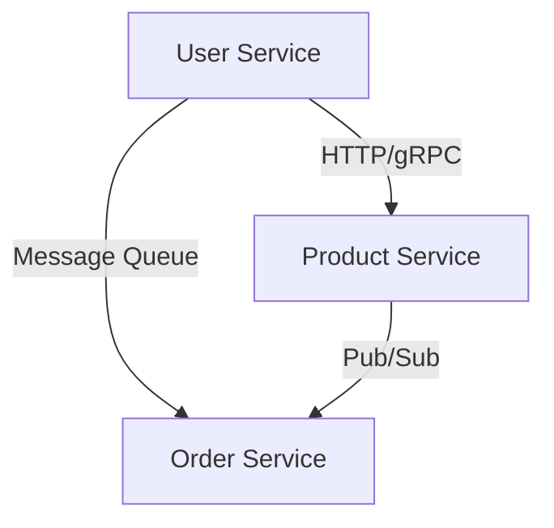

## 12.2. Designing Microservices with Elixir

Designing microservices with Elixir involves leveraging the language's strengths in concurrency, fault tolerance, and functional programming to build scalable and maintainable systems. In this section, we'll delve into the key aspects of designing microservices with Elixir, including defining service boundaries, using umbrella projects, and choosing appropriate communication methods between services.

### Service Boundaries

Defining clear service boundaries is crucial in microservices architecture. Each service should have a well-defined responsibility and operate independently. This separation allows for easier scaling, maintenance, and deployment.

#### Defining Clear Boundaries and Responsibilities

1. **Domain-Driven Design (DDD):** Use DDD principles to identify bounded contexts and define services around them. Each service should encapsulate a specific business capability.

2. **Single Responsibility Principle:** Ensure each service has a single responsibility, making it easier to manage and evolve over time.

3. **Data Ownership:** Each service should own its data, reducing dependencies and potential conflicts with other services.

4. **Autonomy:** Services should be autonomous, meaning they can operate independently without relying on other services.

5. **API Contracts:** Define clear API contracts for each service to ensure consistent communication and integration.

#### Example: Defining Service Boundaries

Consider an e-commerce application with the following services:

- **User Service:** Manages user accounts, authentication, and profiles.
- **Product Service:** Handles product catalog, inventory, and pricing.
- **Order Service:** Processes orders, payments, and shipping.

Each service has a distinct responsibility and operates independently, allowing for flexibility and scalability.

### Using Umbrella Projects

Elixir's umbrella projects provide a way to structure codebases with multiple applications in a single repository. This approach is beneficial for microservices, as it allows for shared dependencies and easier management of related services.

#### Structuring Codebases with Umbrella Projects

1. **Creating an Umbrella Project:** Use the `mix new` command with the `--umbrella` flag to create an umbrella project.

   ```bash
   mix new my_app --umbrella
   ```

2. **Adding Applications:** Add individual applications (services) within the umbrella project using the `mix new` command.

   ```bash
   cd apps
   mix new user_service
   mix new product_service
   mix new order_service
   ```

3. **Shared Dependencies:** Define shared dependencies in the umbrella's root `mix.exs` file, while application-specific dependencies go in each application's `mix.exs`.

4. **Inter-Application Communication:** Use Elixir's messaging capabilities or shared libraries for communication between applications within the umbrella.

5. **Deployment:** Deploy each application independently, allowing for flexibility and scalability.

#### Example: Umbrella Project Structure

```plaintext
my_app/
  ├── apps/
  │   ├── user_service/
  │   ├── product_service/
  │   └── order_service/
  ├── mix.exs
  └── README.md
```

### Communication Between Services

Choosing the right communication method between services is critical for performance and reliability. Elixir supports both synchronous and asynchronous communication methods.

#### Synchronous Communication

1. **HTTP:** Use HTTP for synchronous communication between services. Libraries like `Tesla` or `HTTPoison` can be used to make HTTP requests.

   ```elixir
   defmodule MyApp.HttpClient do
     use Tesla

     plug Tesla.Middleware.BaseUrl, "http://product_service"
     plug Tesla.Middleware.JSON

     def get_product(id) do
       get("/products/#{id}")
     end
   end
   ```

2. **gRPC:** Use gRPC for efficient, binary-based communication. The `grpc` library provides support for gRPC in Elixir.

#### Asynchronous Communication

1. **Message Queues:** Use message queues like RabbitMQ or Kafka for asynchronous communication. This approach decouples services and improves resilience.

   ```elixir
   defmodule MyApp.MessageQueue do
     use AMQP

     def publish_message(queue, message) do
       {:ok, connection} = Connection.open()
       {:ok, channel} = Channel.open(connection)
       Basic.publish(channel, "", queue, message)
       Connection.close(connection)
     end
   end
   ```

2. **Pub/Sub:** Use Pub/Sub systems like Phoenix.PubSub for broadcasting messages to multiple subscribers.

   ```elixir
   defmodule MyApp.PubSub do
     use Phoenix.PubSub

     def broadcast_event(event) do
       Phoenix.PubSub.broadcast(MyApp.PubSub, "events", event)
     end
   end
   ```

#### Choosing the Right Communication Method

- **Latency Requirements:** Use synchronous communication for low-latency requirements.
- **Decoupling:** Use asynchronous communication to decouple services and improve fault tolerance.
- **Scalability:** Consider the scalability requirements of your application when choosing a communication method.

### Visualizing Microservices Architecture

Below is a Mermaid.js diagram illustrating a simple microservices architecture with Elixir:



**Diagram Description:** This diagram shows the User Service communicating with the Product Service using HTTP/gRPC and with the Order Service using a message queue. The Product Service also communicates with the Order Service using Pub/Sub.

### Elixir Unique Features

Elixir offers unique features that make it well-suited for microservices architecture:

1. **Concurrency:** Elixir's lightweight processes and the BEAM VM provide excellent concurrency support, allowing services to handle many requests simultaneously.

2. **Fault Tolerance:** The "let it crash" philosophy and OTP's supervision trees ensure services are resilient to failures.

3. **Functional Programming:** Elixir's functional nature promotes immutability and pure functions, leading to more predictable and maintainable code.

4. **Hot Code Swapping:** Elixir supports hot code swapping, allowing services to be updated without downtime.

### Design Considerations

- **Service Granularity:** Determine the right level of granularity for your services to balance complexity and maintainability.
- **Data Consistency:** Consider eventual consistency and data synchronization strategies when designing services.
- **Security:** Implement security measures such as authentication, authorization, and data encryption.

### Try It Yourself

Experiment with the code examples provided in this section. Try modifying the HTTP client to use a different library or implement a new message queue system. Explore the impact of different communication methods on your application's performance and reliability.

### Knowledge Check

- What are the benefits of using umbrella projects in Elixir?
- How does Elixir's concurrency model support microservices architecture?
- What are the trade-offs between synchronous and asynchronous communication?

### Embrace the Journey

Designing microservices with Elixir is a rewarding journey that leverages the language's strengths to build scalable and maintainable systems. Remember, this is just the beginning. As you progress, you'll build more complex and resilient architectures. Keep experimenting, stay curious, and enjoy the journey!

## Quiz: Designing Microservices with Elixir



### What is a key benefit of using umbrella projects in Elixir?

- [x] Shared dependencies and easier management of related services
- [ ] Increased complexity and maintenance overhead
- [ ] Limited scalability and flexibility
- [ ] Reduced code reusability

> **Explanation:** Umbrella projects allow for shared dependencies and easier management of related services, making them beneficial for microservices architecture.

### Which communication method is best for low-latency requirements?

- [x] Synchronous communication
- [ ] Asynchronous communication
- [ ] Message queues
- [ ] Pub/Sub

> **Explanation:** Synchronous communication is best for low-latency requirements as it provides immediate responses.

### What is a characteristic of asynchronous communication?

- [x] Decouples services and improves fault tolerance
- [ ] Requires immediate responses
- [ ] Increases coupling between services
- [ ] Reduces resilience

> **Explanation:** Asynchronous communication decouples services and improves fault tolerance by allowing services to operate independently.

### What is the "let it crash" philosophy in Elixir?

- [x] A fault tolerance approach where processes are allowed to fail and restart
- [ ] A method for improving performance by crashing processes
- [ ] A technique for reducing code complexity
- [ ] A strategy for optimizing resource usage

> **Explanation:** The "let it crash" philosophy is a fault tolerance approach where processes are allowed to fail and restart, ensuring system resilience.

### How does Elixir's concurrency model benefit microservices?

- [x] Allows services to handle many requests simultaneously
- [ ] Increases resource consumption
- [ ] Limits the number of concurrent requests
- [ ] Reduces system reliability

> **Explanation:** Elixir's concurrency model allows services to handle many requests simultaneously, benefiting microservices architecture.

### What is a key consideration when defining service boundaries?

- [x] Ensuring each service has a single responsibility
- [ ] Maximizing the number of responsibilities per service
- [ ] Reducing the number of services
- [ ] Increasing inter-service dependencies

> **Explanation:** Ensuring each service has a single responsibility is a key consideration when defining service boundaries.

### Which Elixir feature supports hot code swapping?

- [x] The BEAM VM
- [ ] The pipe operator
- [ ] Pattern matching
- [ ] GenServer

> **Explanation:** The BEAM VM supports hot code swapping, allowing services to be updated without downtime.

### What is the purpose of API contracts in microservices?

- [x] To ensure consistent communication and integration
- [ ] To increase service complexity
- [ ] To reduce service autonomy
- [ ] To limit service scalability

> **Explanation:** API contracts ensure consistent communication and integration between services.

### What is a benefit of using message queues for communication?

- [x] Decouples services and improves resilience
- [ ] Requires synchronous communication
- [ ] Increases latency
- [ ] Reduces fault tolerance

> **Explanation:** Message queues decouple services and improve resilience by allowing asynchronous communication.

### True or False: Elixir's functional nature promotes immutability and pure functions.

- [x] True
- [ ] False

> **Explanation:** Elixir's functional nature promotes immutability and pure functions, leading to more predictable and maintainable code.




