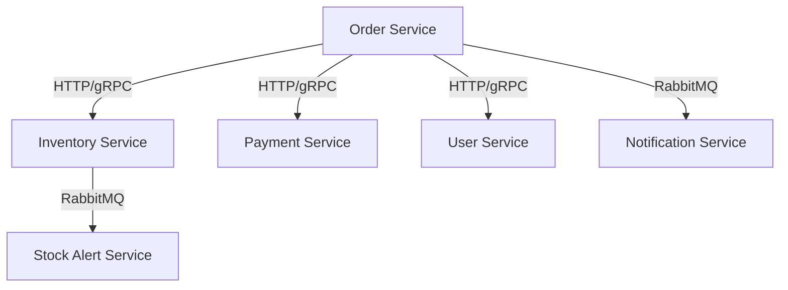

## 12.2. Designing Microservices with Elixir

Elixir, with its robust concurrency model and functional programming paradigm, is an excellent choice for building microservices. In this section, we will delve into the essential aspects of designing microservices with Elixir, focusing on defining service boundaries, utilizing umbrella projects, and establishing effective communication between services.

### Service Boundaries

**Defining clear boundaries and responsibilities for each service** is crucial in a microservices architecture. This ensures that each service is independent, scalable, and maintainable. Let's explore how to define these boundaries effectively:

#### Key Considerations

1. **Domain-Driven Design (DDD):** Use DDD principles to identify the core domains and subdomains of your application. Each microservice should represent a specific domain or subdomain, encapsulating its logic and data.

2. **Single Responsibility Principle (SRP):** Ensure that each service has a single responsibility. This makes it easier to manage, test, and deploy independently.

3. **Data Ownership:** Define which service owns which data. Services should manage their own data and expose APIs for other services to access it when necessary.

4. **Loose Coupling:** Design services to be loosely coupled, minimizing dependencies between them. This allows for easier changes and scaling.

5. **Inter-Service Communication:** Decide on the communication protocols (synchronous vs. asynchronous) based on the nature of the interaction and performance requirements.

#### Example: E-commerce Platform

Consider an e-commerce platform with the following services:

- **Order Service:** Manages order creation, updates, and status tracking.
- **Inventory Service:** Handles stock levels, product availability, and restocking.
- **Payment Service:** Processes payments and handles refunds.
- **User Service:** Manages user accounts, authentication, and profiles.

Each of these services has a clear responsibility, owns its data, and communicates with others through well-defined APIs.

### Using Umbrella Projects

**Structuring codebases with multiple applications in a single repository** is facilitated by Elixir's umbrella projects. Umbrella projects are a powerful way to manage multiple related applications within a single repository, promoting modularity and reusability.

#### Benefits of Umbrella Projects

1. **Code Organization:** Umbrella projects allow you to organize code into separate applications, each with its own dependencies and configuration.

2. **Modularity:** Each application can be developed, tested, and deployed independently, promoting modularity and reducing complexity.

3. **Shared Libraries:** Common libraries and utilities can be shared across applications, reducing duplication and improving consistency.

4. **Simplified Dependency Management:** Manage dependencies for each application separately, ensuring that changes in one application do not affect others.

#### Creating an Umbrella Project

To create an umbrella project in Elixir, follow these steps:

```bash
# Create a new umbrella project
mix new my_umbrella --umbrella

# Navigate to the umbrella directory
cd my_umbrella

# Create a new application within the umbrella
mix new apps/order_service

# Create additional applications as needed
mix new apps/inventory_service
mix new apps/payment_service
mix new apps/user_service
```

Each application within the umbrella can be developed independently, with its own configuration and dependencies.

#### Example: Order Service

```elixir
# In apps/order_service/lib/order_service.ex
defmodule OrderService do
  def create_order(order_details) do
    # Logic to create an order
  end

  def update_order(order_id, updates) do
    # Logic to update an order
  end

  def get_order_status(order_id) do
    # Logic to retrieve order status
  end
end
```

### Communication Between Services

**Choosing between synchronous (HTTP/gRPC) or asynchronous (message queues) communication** is a critical decision in microservices design. Each approach has its advantages and trade-offs.

#### Synchronous Communication

Synchronous communication involves direct requests and responses between services, typically using HTTP or gRPC.

- **HTTP:** A simple and widely used protocol for synchronous communication. Use HTTP when latency is not a critical concern, and services need immediate responses.

- **gRPC:** A high-performance, language-agnostic RPC framework. Use gRPC for low-latency, high-throughput communication, especially when services are written in different languages.

##### Example: HTTP Communication

```elixir
# Using HTTPoison to make an HTTP request
defmodule OrderService do
  def place_order(order_details) do
    response = HTTPoison.post("http://inventory_service/api/check_stock", order_details)
    handle_response(response)
  end

  defp handle_response({:ok, %HTTPoison.Response{status_code: 200, body: body}}) do
    {:ok, body}
  end

  defp handle_response({:error, %HTTPoison.Error{reason: reason}}) do
    {:error, reason}
  end
end
```

##### Example: gRPC Communication

```elixir
# Define a gRPC client using the gRPC library
defmodule InventoryServiceClient do
  use GRPC.Client, service: InventoryService

  def check_stock(product_id) do
    request = %CheckStockRequest{product_id: product_id}
    InventoryService.Stub.check_stock(request)
  end
end
```

#### Asynchronous Communication

Asynchronous communication involves message passing between services, often using message queues like RabbitMQ or Kafka.

- **Message Queues:** Use message queues for decoupled, reliable, and scalable communication. They are ideal for event-driven architectures and scenarios where immediate responses are not required.

##### Example: RabbitMQ Communication

```elixir
# Using the AMQP library to publish a message to RabbitMQ
defmodule OrderService do
  def place_order(order_details) do
    {:ok, connection} = AMQP.Connection.open()
    {:ok, channel} = AMQP.Channel.open(connection)

    AMQP.Basic.publish(channel, "order_exchange", "order_routing_key", order_details)

    AMQP.Connection.close(connection)
  end
end
```

### Visualizing Microservices Communication

Below is a diagram illustrating the communication flow between microservices in an e-commerce platform:


```mermaid
graph TD;
    A[Order Service] -->|HTTP/gRPC| B[Inventory Service];
    A -->|HTTP/gRPC| C[Payment Service];
    A -->|HTTP/gRPC| D[User Service];
    A -->|RabbitMQ| E[Notification Service];
    B -->|RabbitMQ| F[Stock Alert Service];
```

**Diagram Description:** The diagram shows the Order Service communicating synchronously with the Inventory, Payment, and User Services using HTTP/gRPC. It also communicates asynchronously with the Notification Service using RabbitMQ. The Inventory Service sends messages to the Stock Alert Service via RabbitMQ.

### Design Considerations

When designing microservices with Elixir, consider the following:

1. **Scalability:** Design services to scale independently based on load and usage patterns.

2. **Fault Tolerance:** Implement error handling and retries for communication failures. Use Elixir's "let it crash" philosophy and OTP's supervision trees to build resilient services.

3. **Security:** Secure communication between services using TLS/SSL. Implement authentication and authorization mechanisms.

4. **Monitoring and Logging:** Use tools like Prometheus and Grafana for monitoring, and ELK stack for centralized logging.

5. **Testing:** Test services independently and as part of an integrated system. Use ExUnit for unit tests and tools like Wallaby for integration tests.

### Elixir Unique Features

Elixir offers several unique features that make it well-suited for microservices:

- **Concurrency:** Leverage Elixir's lightweight processes and the BEAM VM's concurrency model for handling numerous simultaneous requests efficiently.

- **Fault Tolerance:** Use OTP's supervision trees to build fault-tolerant services that can recover from failures automatically.

- **Functional Programming:** Utilize Elixir's functional programming paradigm to write clean, maintainable, and testable code.

### Differences and Similarities

Microservices in Elixir share similarities with those in other languages, such as the need for clear service boundaries and effective communication. However, Elixir's concurrency model and fault-tolerance capabilities set it apart, providing unique advantages in building scalable and resilient systems.

### Try It Yourself

Experiment with the code examples provided by modifying them to suit different scenarios. For instance, try changing the communication protocol from HTTP to gRPC or RabbitMQ, and observe the differences in behavior and performance.

### Knowledge Check

- What are the benefits of using umbrella projects in Elixir for microservices?
- How does asynchronous communication differ from synchronous communication in microservices?
- What are the key considerations when defining service boundaries in a microservices architecture?

### Embrace the Journey

Designing microservices with Elixir is a rewarding journey that leverages the language's strengths in concurrency and fault tolerance. Remember, this is just the beginning. As you progress, you'll build more complex and scalable systems. Keep experimenting, stay curious, and enjoy the journey!

## Quiz Time!



### What is a key benefit of using umbrella projects in Elixir?

- [x] Code organization and modularity
- [ ] Increased performance
- [ ] Reduced memory usage
- [ ] Simplified syntax

> **Explanation:** Umbrella projects allow for better code organization by structuring related applications within a single repository, promoting modularity.

### Which protocol is typically used for synchronous communication between microservices?

- [x] HTTP
- [ ] RabbitMQ
- [ ] Kafka
- [ ] AMQP

> **Explanation:** HTTP is a common protocol for synchronous communication, where services directly request and respond to each other.

### What is the main advantage of using asynchronous communication in microservices?

- [x] Decoupled and reliable communication
- [ ] Faster response times
- [ ] Simpler implementation
- [ ] Reduced network traffic

> **Explanation:** Asynchronous communication, often using message queues, allows for decoupled and reliable communication, which is ideal for event-driven architectures.

### How does Elixir's "let it crash" philosophy contribute to fault tolerance?

- [x] By allowing processes to fail and restart automatically
- [ ] By preventing any process failures
- [ ] By logging errors without recovery
- [ ] By reducing the need for error handling

> **Explanation:** Elixir's "let it crash" philosophy leverages OTP's supervision trees to automatically restart failed processes, contributing to fault tolerance.

### What is a common tool used for monitoring Elixir microservices?

- [x] Prometheus
- [ ] RabbitMQ
- [ ] HTTPoison
- [ ] gRPC

> **Explanation:** Prometheus is commonly used for monitoring microservices, providing metrics and insights into system performance.

### Which Elixir feature is particularly beneficial for handling numerous simultaneous requests?

- [x] Concurrency model
- [ ] Macros
- [ ] Pattern matching
- [ ] Pipelines

> **Explanation:** Elixir's concurrency model, based on lightweight processes, is well-suited for handling numerous simultaneous requests efficiently.

### What is a primary consideration when defining service boundaries in microservices?

- [x] Single Responsibility Principle
- [ ] Code duplication
- [ ] Network latency
- [ ] Database schema design

> **Explanation:** The Single Responsibility Principle ensures that each service has a clear and focused responsibility, aiding in maintainability and scalability.

### Which library is used in Elixir for making HTTP requests?

- [x] HTTPoison
- [ ] ExUnit
- [ ] AMQP
- [ ] Phoenix

> **Explanation:** HTTPoison is a popular library in Elixir for making HTTP requests, facilitating communication between services.

### What is the role of supervision trees in Elixir?

- [x] To manage process lifecycles and ensure fault tolerance
- [ ] To optimize code performance
- [ ] To simplify syntax
- [ ] To handle network communications

> **Explanation:** Supervision trees manage process lifecycles, automatically restarting failed processes to ensure fault tolerance.

### True or False: Elixir's functional programming paradigm makes it difficult to write testable code.

- [ ] True
- [x] False

> **Explanation:** Elixir's functional programming paradigm encourages writing clean, maintainable, and testable code, contrary to the statement.


