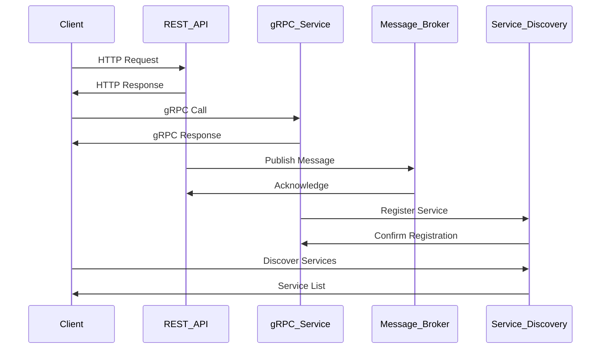

## 12.3. Communication Between Services

In the realm of microservices, effective communication between services is paramount. Elixir, known for its concurrency and fault tolerance, offers several robust patterns and tools to facilitate this communication. In this section, we will delve into four primary communication mechanisms: RESTful APIs, gRPC, message brokers, and service discovery. Each of these methods has its unique advantages and use cases, and understanding them will empower you to build scalable and maintainable systems.

### RESTful APIs

RESTful APIs are a cornerstone of web service communication. They leverage HTTP and JSON to create stateless services that are easy to consume and integrate with.

#### Building Stateless Services Using HTTP and JSON

REST (Representational State Transfer) is an architectural style that uses HTTP methods to perform CRUD (Create, Read, Update, Delete) operations. In Elixir, the Phoenix framework is often used to build RESTful services due to its simplicity and efficiency.

**Key Concepts:**
- **Statelessness**: Each request from a client must contain all the information needed to understand and process the request.
- **Resource-Based**: Everything is considered a resource, identified by URIs.
- **HTTP Methods**: Common methods include GET, POST, PUT, DELETE, etc.
- **JSON**: A lightweight data interchange format used for request and response bodies.

#### Implementing a RESTful API in Elixir

Let's walk through building a simple RESTful API using Phoenix.

```elixir
# In your Phoenix router, define the routes for your resources
defmodule MyAppWeb.Router do
  use MyAppWeb, :router

  scope "/api", MyAppWeb do
    pipe_through :api

    resources "/users", UserController, except: [:new, :edit]
  end
end

# Define a controller to handle the requests
defmodule MyAppWeb.UserController do
  use MyAppWeb, :controller

  alias MyApp.Accounts
  alias MyApp.Accounts.User

  def index(conn, _params) do
    users = Accounts.list_users()
    render(conn, "index.json", users: users)
  end

  def create(conn, %{"user" => user_params}) do
    with {:ok, %User{} = user} <- Accounts.create_user(user_params) do
      conn
      |> put_status(:created)
      |> put_resp_header("location", Routes.user_path(conn, :show, user))
      |> render("show.json", user: user)
    end
  end

  # Additional actions for show, update, delete
end
```

**Try It Yourself:** Modify the `UserController` to include error handling for invalid data and implement the `show`, `update`, and `delete` actions.

#### Benefits and Challenges

**Benefits:**
- **Simplicity**: Easy to understand and implement.
- **Interoperability**: Widely supported across different platforms and languages.
- **Scalability**: Stateless nature allows easy scaling.

**Challenges:**
- **Overhead**: HTTP can introduce overhead compared to binary protocols.
- **Versioning**: Managing API versions can become complex over time.

### gRPC

gRPC is a high-performance, open-source RPC framework that uses HTTP/2 and Protocol Buffers (Protobuf) for communication.

#### Implementing High-Performance RPC with Protobuf

gRPC is designed for high-performance communication, making it ideal for connecting microservices.

**Key Concepts:**
- **HTTP/2**: Enables multiplexing, allowing multiple requests and responses over a single connection.
- **Protobuf**: A language-neutral, platform-neutral extensible mechanism for serializing structured data.
- **RPC**: Remote Procedure Call, a method of invoking functions on a remote server.

#### Setting Up gRPC in Elixir

To use gRPC in Elixir, we can leverage the `grpc` library.

```elixir
# Define your Protobuf service and messages
syntax = "proto3";

package myapp;

service UserService {
  rpc GetUser (UserRequest) returns (UserResponse);
}

message UserRequest {
  string id = 1;
}

message UserResponse {
  string id = 1;
  string name = 2;
  string email = 3;
}

# Compile the Protobuf definition to Elixir code
# Use the protoc compiler with the Elixir plugin

# Implement the server in Elixir
defmodule MyApp.UserService.Server do
  use GRPC.Server, service: MyApp.UserService

  def get_user(%{id: id}, _stream) do
    user = MyApp.Accounts.get_user!(id)
    MyApp.UserResponse.new(id: user.id, name: user.name, email: user.email)
  end
end
```

**Try It Yourself:** Extend the `UserService` to include more RPC methods like `CreateUser` and `ListUsers`.

#### Benefits and Challenges

**Benefits:**
- **Performance**: Efficient binary serialization with Protobuf.
- **Streaming**: Supports client, server, and bidirectional streaming.
- **Strong Typing**: Enforces a contract between services.

**Challenges:**
- **Complexity**: Requires understanding of Protobuf and HTTP/2.
- **Tooling**: Limited tooling compared to REST.

### Message Brokers

Message brokers facilitate asynchronous communication between services, allowing them to decouple and scale independently.

#### Utilizing RabbitMQ, Kafka for Asynchronous Messaging

Message brokers like RabbitMQ and Kafka are popular choices for implementing asynchronous messaging patterns.

**Key Concepts:**
- **Asynchronous Communication**: Services communicate without waiting for an immediate response.
- **Decoupling**: Services are not directly dependent on each other.
- **Scalability**: Easily handle increased load by adding more consumers.

#### Implementing Asynchronous Messaging with RabbitMQ

RabbitMQ is a widely used message broker that supports various messaging patterns.

```elixir
# Define a producer to send messages
defmodule MyApp.Producer do
  use AMQP

  def send_message(queue, message) do
    {:ok, connection} = Connection.open()
    {:ok, channel} = Channel.open(connection)

    Basic.publish(channel, "", queue, message)
    IO.puts(" [x] Sent #{message}")

    Connection.close(connection)
  end
end

# Define a consumer to receive messages
defmodule MyApp.Consumer do
  use AMQP

  def start_link(queue) do
    {:ok, connection} = Connection.open()
    {:ok, channel} = Channel.open(connection)

    Queue.declare(channel, queue, durable: true)
    Basic.consume(channel, queue, nil, no_ack: true)

    receive do
      {:basic_deliver, payload, _meta} ->
        IO.puts(" [x] Received #{payload}")
    end

    Connection.close(connection)
  end
end
```

**Try It Yourself:** Modify the consumer to process messages and handle errors gracefully.

#### Benefits and Challenges

**Benefits:**
- **Reliability**: Ensures message delivery even if a service is temporarily unavailable.
- **Flexibility**: Supports various messaging patterns (e.g., publish-subscribe, work queues).
- **Scalability**: Easily scale consumers to handle increased load.

**Challenges:**
- **Complexity**: Requires managing message queues and brokers.
- **Latency**: Introduces potential delays in message delivery.

### Service Discovery

Service discovery is crucial in dynamic environments where services can scale up or down, and their locations can change.

#### Dynamically Locating Service Instances in a Distributed Environment

Service discovery helps locate service instances dynamically, ensuring reliable communication in distributed systems.

**Key Concepts:**
- **Dynamic Discovery**: Automatically find available service instances.
- **Load Balancing**: Distribute requests among multiple instances.
- **Health Checks**: Ensure only healthy instances are used.

#### Implementing Service Discovery with Consul

Consul is a popular tool for service discovery and health checking.

```elixir
# Register a service with Consul
defmodule MyApp.ServiceRegistry do
  @consul_url "http://localhost:8500"

  def register_service(service_name, service_id, address, port) do
    service = %{
      "ID" => service_id,
      "Name" => service_name,
      "Address" => address,
      "Port" => port
    }

    HTTPoison.put("#{@consul_url}/v1/agent/service/register", Jason.encode!(service))
  end

  def deregister_service(service_id) do
    HTTPoison.put("#{@consul_url}/v1/agent/service/deregister/#{service_id}")
  end
end

# Discover services
defmodule MyApp.ServiceDiscovery do
  @consul_url "http://localhost:8500"

  def discover(service_name) do
    {:ok, response} = HTTPoison.get("#{@consul_url}/v1/catalog/service/#{service_name}")
    Jason.decode!(response.body)
  end
end
```

**Try It Yourself:** Extend the service discovery to include health checks and load balancing.

#### Benefits and Challenges

**Benefits:**
- **Resilience**: Automatically adapts to changes in the environment.
- **Scalability**: Supports dynamic scaling of services.
- **Flexibility**: Integrates with various load balancers and orchestration tools.

**Challenges:**
- **Complexity**: Requires additional infrastructure and configuration.
- **Consistency**: Ensuring consistent service registration and discovery.

### Visualizing Service Communication

To better understand the communication patterns between services, let's visualize these interactions using Mermaid.js.


```mermaid
sequenceDiagram
    participant Client
    participant REST_API
    participant gRPC_Service
    participant Message_Broker
    participant Service_Discovery

    Client->>REST_API: HTTP Request
    REST_API->>Client: HTTP Response

    Client->>gRPC_Service: gRPC Call
    gRPC_Service->>Client: gRPC Response

    REST_API->>Message_Broker: Publish Message
    Message_Broker->>REST_API: Acknowledge

    gRPC_Service->>Service_Discovery: Register Service
    Service_Discovery->>gRPC_Service: Confirm Registration

    Client->>Service_Discovery: Discover Services
    Service_Discovery->>Client: Service List
```

**Diagram Description:** This diagram illustrates how a client interacts with various services using different communication patterns. It shows the flow of requests and responses between the client, REST API, gRPC service, message broker, and service discovery.

### Conclusion

In this section, we explored various communication patterns for Elixir microservices, including RESTful APIs, gRPC, message brokers, and service discovery. Each method offers unique benefits and challenges, and the choice of pattern depends on the specific requirements of your system. By understanding these patterns, you can design robust, scalable, and maintainable microservices architectures.

### Knowledge Check

- What are the key differences between RESTful APIs and gRPC?
- How does asynchronous messaging with message brokers improve scalability?
- Why is service discovery important in a microservices architecture?

### Embrace the Journey

Remember, mastering these communication patterns is just the beginning. As you progress, you'll be able to build more complex and efficient microservices architectures. Keep experimenting, stay curious, and enjoy the journey!

## Quiz Time!



### What is a primary benefit of using RESTful APIs?

- [x] Simplicity and wide support across platforms
- [ ] High-performance binary serialization
- [ ] Asynchronous messaging
- [ ] Service discovery

> **Explanation:** RESTful APIs are simple and widely supported across different platforms and languages, making them easy to implement and integrate.

### Which protocol does gRPC use for communication?

- [ ] HTTP
- [x] HTTP/2
- [ ] WebSocket
- [ ] MQTT

> **Explanation:** gRPC uses HTTP/2 for communication, enabling features like multiplexing and efficient binary serialization with Protobuf.

### What is a key advantage of using message brokers?

- [x] Decoupling of services
- [ ] Strong typing
- [ ] Statelessness
- [ ] HTTP-based communication

> **Explanation:** Message brokers allow services to communicate asynchronously, decoupling them and enabling independent scaling.

### What tool is commonly used for service discovery in Elixir microservices?

- [ ] RabbitMQ
- [ ] Kafka
- [x] Consul
- [ ] Phoenix

> **Explanation:** Consul is a popular tool for service discovery, providing dynamic service registration and health checks.

### What is a challenge of using RESTful APIs?

- [x] Overhead compared to binary protocols
- [ ] Lack of tooling
- [ ] Complexity in setup
- [ ] Limited scalability

> **Explanation:** RESTful APIs can introduce overhead due to their use of HTTP and text-based formats like JSON, compared to more efficient binary protocols.

### Which communication pattern supports client, server, and bidirectional streaming?

- [ ] RESTful APIs
- [x] gRPC
- [ ] Message Brokers
- [ ] Service Discovery

> **Explanation:** gRPC supports client, server, and bidirectional streaming, allowing for more flexible communication patterns.

### What is a benefit of using service discovery?

- [x] Resilience and dynamic adaptation to changes
- [ ] Simplified API versioning
- [ ] Strong typing
- [ ] Asynchronous messaging

> **Explanation:** Service discovery provides resilience by dynamically adapting to changes in the environment, such as scaling services up or down.

### How do message brokers handle increased load?

- [x] By adding more consumers
- [ ] By using HTTP/2
- [ ] By enforcing strong typing
- [ ] By using RESTful APIs

> **Explanation:** Message brokers can handle increased load by adding more consumers to process messages, allowing for scalable processing.

### What is a common challenge when using service discovery?

- [x] Complexity in infrastructure and configuration
- [ ] Limited support for HTTP methods
- [ ] Lack of binary serialization
- [ ] Difficulty in scaling

> **Explanation:** Service discovery requires additional infrastructure and configuration, which can add complexity to the system.

### True or False: gRPC requires understanding of Protobuf and HTTP/2.

- [x] True
- [ ] False

> **Explanation:** gRPC uses Protobuf for serialization and HTTP/2 for communication, requiring an understanding of both technologies.


