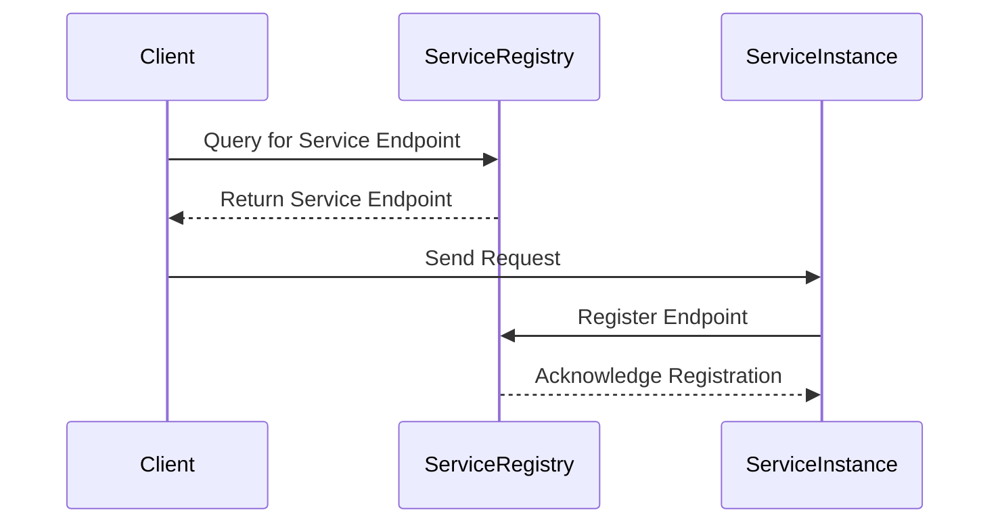

## 12.4. Service Discovery and Registration

In the realm of microservices, service discovery and registration are crucial components that ensure seamless communication between services. As systems scale, managing dynamic service endpoints becomes increasingly complex. This section delves into the intricacies of service discovery and registration in Elixir microservices, exploring dynamic service endpoints, implementing service discovery using tools like Consul and Etcd, and understanding registration mechanisms.

### Dynamic Service Endpoints

Dynamic service endpoints refer to the ability of services to change their network locations (IPs and ports) without disrupting the overall system. This flexibility is essential in a microservices architecture, where services can be scaled up or down, moved across different nodes, or updated independently.

#### Managing Changing IPs/Ports in a Scalable Environment

In a scalable environment, services are often deployed across multiple nodes, each with its own IP address and port configuration. Managing these dynamic endpoints requires a robust service discovery mechanism. Here are some strategies to handle dynamic service endpoints:

1. **DNS-Based Service Discovery**: Utilize DNS to resolve service names to IP addresses. This approach leverages existing DNS infrastructure but may not be suitable for rapidly changing environments due to DNS caching.

2. **Service Registries**: Implement a centralized service registry where services register their endpoints. Clients query the registry to discover service locations. Tools like Consul and Etcd are popular choices for this approach.

3. **Client-Side Load Balancing**: Clients maintain a list of service instances and perform load balancing. This approach reduces the dependency on external load balancers but requires clients to handle endpoint management.

4. **Reverse Proxies and API Gateways**: Use reverse proxies or API gateways to route requests to the appropriate service instances. This approach abstracts the complexity of endpoint management from clients.

#### Code Example: Dynamic Endpoint Management

Let's explore a simple Elixir example demonstrating dynamic endpoint management using a service registry pattern.

```elixir
defmodule ServiceRegistry do
  use GenServer

  # Starts the GenServer
  def start_link(_) do
    GenServer.start_link(__MODULE__, %{}, name: __MODULE__)
  end

  # Registers a service with its endpoint
  def register_service(service_name, endpoint) do
    GenServer.call(__MODULE__, {:register, service_name, endpoint})
  end

  # Retrieves the endpoint for a given service
  def get_service_endpoint(service_name) do
    GenServer.call(__MODULE__, {:get_endpoint, service_name})
  end

  # GenServer callbacks
  def init(state) do
    {:ok, state}
  end

  def handle_call({:register, service_name, endpoint}, _from, state) do
    new_state = Map.put(state, service_name, endpoint)
    {:reply, :ok, new_state}
  end

  def handle_call({:get_endpoint, service_name}, _from, state) do
    endpoint = Map.get(state, service_name, :not_found)
    {:reply, endpoint, state}
  end
end

# Usage
{:ok, _} = ServiceRegistry.start_link([])
ServiceRegistry.register_service(:user_service, "http://localhost:4000")
endpoint = ServiceRegistry.get_service_endpoint(:user_service)
IO.puts("User Service Endpoint: #{endpoint}")
```

In this example, we define a simple `ServiceRegistry` module using Elixir's `GenServer`. Services can register their endpoints, and clients can query the registry to discover service locations.

### Implementing Service Discovery

Service discovery is the process of automatically detecting and connecting to services within a network. In Elixir, we can implement service discovery using various tools and techniques.

#### Using Tools like Consul, Etcd, or Built-in DNS

1. **Consul**: Consul is a popular service discovery tool that provides a distributed, highly available service registry. It supports health checks, key-value storage, and multi-datacenter deployments.

2. **Etcd**: Etcd is a distributed key-value store that can be used for service discovery. It provides strong consistency and is often used in Kubernetes for storing configuration data.

3. **Built-in DNS**: For simpler setups, DNS can be used for service discovery. This approach leverages existing DNS infrastructure but may not be suitable for rapidly changing environments.

#### Code Example: Service Discovery with Consul

Let's explore how to integrate Consul for service discovery in an Elixir application.

```elixir
defmodule ConsulClient do
  @moduledoc """
  A simple client for interacting with Consul's service registry.
  """

  @consul_url "http://localhost:8500"

  # Registers a service with Consul
  def register_service(service_name, service_id, address, port) do
    service = %{
      "Name" => service_name,
      "ID" => service_id,
      "Address" => address,
      "Port" => port
    }

    HTTPoison.put("#{@consul_url}/v1/agent/service/register", Jason.encode!(service), [{"Content-Type", "application/json"}])
  end

  # Retrieves a list of services from Consul
  def get_services do
    {:ok, response} = HTTPoison.get("#{@consul_url}/v1/agent/services")
    Jason.decode!(response.body)
  end
end

# Usage
ConsulClient.register_service("user_service", "user_service_1", "localhost", 4000)
services = ConsulClient.get_services()
IO.inspect(services, label: "Registered Services")
```

In this example, we define a `ConsulClient` module that interacts with Consul's HTTP API to register services and retrieve a list of registered services.

### Registration Mechanisms

Service registration involves adding service instances to a service registry so that they can be discovered by clients. There are two primary registration mechanisms: self-registration and third-party registration.

#### Self-Registration vs. Third-Party Registration

1. **Self-Registration**: In self-registration, service instances register themselves with the service registry. This approach simplifies the deployment process but requires each service to include registration logic.

2. **Third-Party Registration**: In third-party registration, an external entity (such as a sidecar or an orchestrator) registers services on their behalf. This approach decouples registration logic from services but requires additional infrastructure.

#### Code Example: Self-Registration

Let's explore a self-registration example using Elixir.

```elixir
defmodule SelfRegisteringService do
  @moduledoc """
  A service that self-registers with a service registry.
  """

  def start_service do
    # Start the service
    IO.puts("Starting service...")

    # Register the service
    register_with_registry()
  end

  defp register_with_registry do
    # Simulate registration logic
    IO.puts("Registering service with registry...")
    :ok
  end
end

# Usage
SelfRegisteringService.start_service()
```

In this example, the `SelfRegisteringService` module includes logic to register itself with a service registry upon startup.

### Visualizing Service Discovery and Registration

To better understand the flow of service discovery and registration, let's visualize the process using a sequence diagram.



**Diagram Description**: This sequence diagram illustrates the interaction between a client, a service registry, and a service instance. The client queries the service registry for the service endpoint, sends a request to the service instance, and the service instance registers its endpoint with the registry.

### Design Considerations

When implementing service discovery and registration, consider the following design considerations:

- **Consistency and Availability**: Ensure that the service registry is highly available and consistent. Use distributed systems like Consul or Etcd to achieve this.

- **Scalability**: Design the service discovery mechanism to handle a large number of services and requests. Consider using caching and load balancing to improve performance.

- **Security**: Secure the service registry and communication channels to prevent unauthorized access and data breaches. Implement authentication and encryption where necessary.

- **Fault Tolerance**: Design the system to handle failures gracefully. Implement health checks and retries to ensure service availability.

### Elixir Unique Features

Elixir offers several unique features that make it well-suited for implementing service discovery and registration:

- **Concurrency**: Elixir's lightweight processes and message-passing model make it easy to implement concurrent service discovery mechanisms.

- **Fault Tolerance**: Elixir's "let it crash" philosophy and OTP framework provide robust fault tolerance, ensuring that services can recover from failures.

- **Scalability**: Elixir's ability to handle large numbers of concurrent connections makes it ideal for scalable service discovery solutions.

### Differences and Similarities

Service discovery and registration patterns can be confused with load balancing and API gateway patterns. While they share similarities, they serve different purposes:

- **Service Discovery vs. Load Balancing**: Service discovery focuses on locating service instances, while load balancing distributes requests among instances.

- **Service Discovery vs. API Gateway**: Service discovery provides service endpoints, while an API gateway routes requests and enforces policies.

### Try It Yourself

To deepen your understanding, try modifying the code examples provided:

- Implement a service registry using Etcd instead of Consul.
- Add health checks to the `ServiceRegistry` module to monitor service availability.
- Experiment with different registration mechanisms, such as third-party registration using a sidecar.

### Knowledge Check

- What are the benefits of using a service registry in a microservices architecture?
- How does self-registration differ from third-party registration?
- What are some tools commonly used for service discovery in Elixir?

### Embrace the Journey

Remember, mastering service discovery and registration is a journey. As you progress, you'll build more resilient and scalable microservices architectures. Keep experimenting, stay curious, and enjoy the journey!

## Quiz: Service Discovery and Registration



### What is the primary purpose of service discovery in microservices?

- [x] To locate service instances dynamically
- [ ] To balance the load among service instances
- [ ] To enforce security policies
- [ ] To manage service configurations

> **Explanation:** Service discovery is primarily used to locate service instances dynamically within a network.

### Which tool is commonly used for service discovery in Elixir microservices?

- [x] Consul
- [ ] Redis
- [ ] Postgres
- [ ] RabbitMQ

> **Explanation:** Consul is a popular tool for service discovery in Elixir microservices due to its distributed and highly available service registry.

### What is the difference between self-registration and third-party registration?

- [x] Self-registration involves services registering themselves, while third-party registration involves an external entity registering services.
- [ ] Self-registration is more secure than third-party registration.
- [ ] Third-party registration is faster than self-registration.
- [ ] Self-registration requires more infrastructure than third-party registration.

> **Explanation:** Self-registration involves services registering themselves with the registry, while third-party registration involves an external entity handling the registration.

### What is a key advantage of using DNS-based service discovery?

- [x] Leverages existing DNS infrastructure
- [ ] Provides strong consistency
- [ ] Supports multi-datacenter deployments
- [ ] Offers built-in load balancing

> **Explanation:** DNS-based service discovery leverages existing DNS infrastructure, making it easy to implement in simpler setups.

### Which Elixir feature is particularly beneficial for implementing service discovery?

- [x] Concurrency
- [ ] Object-oriented programming
- [ ] Inheritance
- [ ] Polymorphism

> **Explanation:** Elixir's concurrency model, with lightweight processes and message-passing, is beneficial for implementing service discovery.

### What is the role of a service registry in microservices?

- [x] To store and provide service endpoints
- [ ] To balance the load among service instances
- [ ] To enforce security policies
- [ ] To manage service configurations

> **Explanation:** A service registry stores and provides service endpoints, enabling clients to discover and connect to services.

### How does an API gateway differ from service discovery?

- [x] An API gateway routes requests and enforces policies, while service discovery provides service endpoints.
- [ ] An API gateway provides service endpoints, while service discovery routes requests.
- [ ] An API gateway is used for load balancing, while service discovery is used for security.
- [ ] An API gateway is faster than service discovery.

> **Explanation:** An API gateway routes requests and enforces policies, while service discovery focuses on providing service endpoints.

### What is a common challenge when using DNS-based service discovery?

- [x] DNS caching can delay updates
- [ ] It requires additional infrastructure
- [ ] It is not compatible with Elixir
- [ ] It does not support health checks

> **Explanation:** DNS caching can delay updates to service endpoints, making it less suitable for rapidly changing environments.

### What is the "let it crash" philosophy in Elixir?

- [x] A fault-tolerance approach where processes are allowed to fail and restart
- [ ] A method for optimizing performance
- [ ] A security strategy for handling errors
- [ ] A design pattern for managing state

> **Explanation:** The "let it crash" philosophy in Elixir is a fault-tolerance approach where processes are allowed to fail and restart, ensuring system resilience.

### True or False: Service discovery is only necessary in large-scale microservices architectures.

- [ ] True
- [x] False

> **Explanation:** Service discovery is beneficial in any microservices architecture, regardless of scale, to manage dynamic service endpoints and ensure seamless communication.


