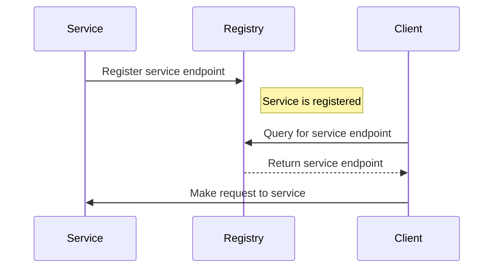

## 12.4. Service Discovery and Registration

In the world of microservices, service discovery and registration are crucial components that ensure seamless communication between services. As systems grow in complexity and scale, managing service endpoints dynamically becomes essential. This section delves into the concepts of service discovery and registration within the context of Elixir microservices, providing you with the knowledge to implement robust solutions.

### Dynamic Service Endpoints

In a microservices architecture, services are often distributed across multiple nodes and can be dynamically scaled. This dynamic nature means that service endpoints (such as IP addresses and ports) can change frequently. Managing these changes efficiently is vital to maintaining a scalable and resilient system.

#### Managing Changing IPs/Ports in a Scalable Environment

When services are deployed across a dynamic infrastructure, such as a cloud environment, IP addresses and ports can change due to scaling operations, failures, or redeployments. Without a robust mechanism to manage these changes, service communication can become unreliable.

**Strategies to Manage Dynamic Endpoints:**

1. **DNS-Based Discovery**: Utilize DNS to resolve service names to IP addresses. This approach is simple but may not be suitable for environments where IP addresses change frequently.

2. **Service Registries**: Use a centralized service registry to keep track of service instances and their endpoints. This registry acts as a directory that services can query to find other services.

3. **Client-Side Load Balancing**: Implement client-side logic to manage service endpoints and distribute requests among available instances.

4. **Environment Variables and Configuration Management**: Use environment variables or configuration management tools to dynamically update service endpoints.

5. **Service Mesh**: Employ a service mesh to abstract service discovery and manage communication between services.

### Implementing Service Discovery

Service discovery is the process by which services locate each other on a network. In Elixir, this can be achieved using various tools and techniques, each with its own advantages and trade-offs.

#### Using Tools like Consul, Etcd, or Built-in DNS

1. **Consul**: A popular service discovery tool that provides a distributed, highly available service registry. Consul supports health checking, key-value storage, and multi-datacenter support.

   - **Setup and Integration**: Consul can be integrated with Elixir applications using libraries such as `consul_ex`. This library provides an Elixir interface to interact with Consul's HTTP API.

   ```elixir
   # Example: Registering a service with Consul
   defmodule MyApp.Consul do
     def register_service do
       service = %{
         "ID" => "my-service",
         "Name" => "my-service",
         "Tags" => ["elixir"],
         "Address" => "127.0.0.1",
         "Port" => 4000
       }

       ConsulEx.Agent.Service.register(service)
     end
   end
   ```

   - **Health Checks**: Consul supports health checks to ensure that only healthy services are discoverable. This can be configured using HTTP, TCP, or script-based checks.

2. **Etcd**: A distributed key-value store that can be used for service discovery. Etcd is known for its strong consistency and high availability.

   - **Integration with Elixir**: Use libraries like `etcd_ex` to interact with Etcd from Elixir applications.

   ```elixir
   # Example: Registering a service with Etcd
   defmodule MyApp.Etcd do
     def register_service do
       key = "/services/my-service"
       value = "127.0.0.1:4000"

       EtcdEx.put(key, value)
     end
   end
   ```

3. **Built-in DNS**: For simpler setups, DNS can be used for service discovery. Services register their IP addresses with a DNS server, and other services resolve these addresses using standard DNS queries.

   - **Limitations**: DNS-based discovery may not be suitable for environments with rapid changes in service endpoints due to DNS caching and propagation delays.

#### Considerations for Choosing a Service Discovery Tool

- **Consistency and Availability**: Evaluate the consistency and availability guarantees provided by the tool. Strong consistency ensures that all clients see the same view of the service registry, while high availability ensures that the registry is accessible even in the presence of failures.

- **Scalability**: Consider the scalability of the tool. As the number of services and nodes increases, the service discovery tool should be able to handle the load without performance degradation.

- **Integration with Elixir**: Ensure that the tool can be easily integrated with Elixir applications. Look for existing libraries or APIs that facilitate this integration.

- **Operational Complexity**: Assess the operational complexity of deploying and managing the service discovery tool. Some tools may require additional infrastructure or configuration.

### Registration Mechanisms

Service registration is the process by which a service announces its availability and endpoint information to a service registry. There are various mechanisms to achieve this, each with its own benefits and challenges.

#### Self-Registration vs. Third-Party Registration

1. **Self-Registration**: In self-registration, the service instance is responsible for registering itself with the service registry. This approach is straightforward but can lead to tight coupling between the service and the registry.

   - **Advantages**: Simplifies the deployment process as the service manages its own registration.
   - **Disadvantages**: Increases the complexity of the service code and can lead to issues if the service fails to register correctly.

   ```elixir
   # Example: Self-registration in Elixir
   defmodule MyApp.Service do
     def start do
       register_with_registry()
       # Start the service logic
     end

     defp register_with_registry do
       # Logic to register with the service registry
     end
   end
   ```

2. **Third-Party Registration**: In this approach, an external agent or sidecar is responsible for registering the service with the registry. This decouples the service from the registration logic.

   - **Advantages**: Reduces the complexity of the service code and allows for more flexible registration strategies.
   - **Disadvantages**: Introduces additional components that need to be managed and monitored.

   ```elixir
   # Example: Third-party registration with a sidecar
   defmodule MyApp.Sidecar do
     def start do
       # Logic to monitor the service and register it with the registry
     end
   end
   ```

#### Choosing the Right Registration Mechanism

- **Complexity**: Consider the complexity of the service and the environment. For simple services, self-registration may be sufficient, while more complex environments may benefit from third-party registration.

- **Decoupling**: Evaluate the need for decoupling the service from the registration logic. Third-party registration can provide greater flexibility and reduce the impact of changes in the service registry.

- **Reliability**: Assess the reliability of the registration mechanism. Ensure that the chosen approach can handle failures and recover gracefully.

### Visualizing Service Discovery and Registration

To better understand the flow of service discovery and registration, let's visualize the process using a sequence diagram.


```mermaid
sequenceDiagram
    participant Service
    participant Registry
    participant Client

    Service->>Registry: Register service endpoint
    Note right of Registry: Service is registered

    Client->>Registry: Query for service endpoint
    Registry-->>Client: Return service endpoint

    Client->>Service: Make request to service
```

**Diagram Explanation:**

- The service registers its endpoint with the registry.
- The client queries the registry to discover the service endpoint.
- The client makes a request to the service using the discovered endpoint.

### Elixir Unique Features

Elixir, being a functional language built on the Erlang VM, provides unique features that can enhance service discovery and registration:

- **Concurrency and Fault Tolerance**: Elixir's lightweight processes and fault-tolerant design make it well-suited for building resilient service discovery mechanisms.

- **OTP Framework**: The OTP framework provides abstractions such as GenServer and Supervisor that can be used to implement service registration and discovery logic.

- **Hot Code Upgrades**: Elixir's support for hot code upgrades allows for seamless updates to service discovery components without downtime.

### Design Considerations

When implementing service discovery and registration in Elixir, consider the following:

- **Network Partitioning**: Design for scenarios where network partitions may occur, ensuring that the system can continue to operate in a degraded mode.

- **Security**: Implement security measures to protect the service registry from unauthorized access and ensure data integrity.

- **Performance**: Optimize the performance of the service discovery mechanism to minimize latency and ensure timely updates to service endpoints.

### Try It Yourself

To deepen your understanding, try modifying the provided code examples:

- Implement a health check mechanism in the Consul registration example to ensure that only healthy services are discoverable.
- Experiment with different service discovery tools and compare their performance and ease of integration with Elixir.
- Create a simple Elixir application that uses self-registration and then refactor it to use third-party registration.

### Knowledge Check

1. What are the benefits of using a service registry in a microservices architecture?
2. How does self-registration differ from third-party registration, and what are the trade-offs?
3. Why might DNS-based service discovery be unsuitable for rapidly changing environments?
4. How can Elixir's concurrency model enhance service discovery mechanisms?

### Summary

Service discovery and registration are foundational components of a microservices architecture. By leveraging tools like Consul and Etcd, and understanding the trade-offs between self-registration and third-party registration, you can build scalable and resilient systems. Elixir's unique features, such as its concurrency model and OTP framework, provide powerful tools for implementing these mechanisms effectively.

## Quiz Time!



### What is a primary benefit of using a service registry in microservices?

- [x] It provides a centralized directory for service endpoints.
- [ ] It eliminates the need for service health checks.
- [ ] It reduces the number of services needed.
- [ ] It simplifies the service codebase.

> **Explanation:** A service registry provides a centralized directory for service endpoints, making it easier for services to discover each other.

### How does self-registration differ from third-party registration?

- [x] Self-registration involves the service registering itself, while third-party registration uses an external agent.
- [ ] Self-registration uses DNS, while third-party registration uses a service registry.
- [ ] Self-registration is more secure than third-party registration.
- [ ] Self-registration is only used in monolithic architectures.

> **Explanation:** In self-registration, the service itself handles registration, whereas third-party registration relies on an external agent or sidecar.

### Why might DNS-based service discovery be unsuitable for rapidly changing environments?

- [x] DNS caching and propagation delays can lead to outdated information.
- [ ] DNS is not compatible with microservices.
- [ ] DNS requires manual updates for each service change.
- [ ] DNS does not support IP addresses.

> **Explanation:** DNS caching and propagation delays can result in outdated service endpoint information, making it less suitable for environments with frequent changes.

### Which Elixir feature enhances service discovery mechanisms?

- [x] Concurrency and fault tolerance
- [ ] Object-oriented programming
- [ ] Manual memory management
- [ ] Static typing

> **Explanation:** Elixir's concurrency and fault tolerance features make it well-suited for building resilient service discovery mechanisms.

### What is a key advantage of third-party registration?

- [x] It decouples the service from the registration logic.
- [ ] It requires no additional components.
- [ ] It simplifies the deployment process.
- [ ] It eliminates the need for a service registry.

> **Explanation:** Third-party registration decouples the service from the registration logic, allowing for more flexible registration strategies.

### Which tool is known for its strong consistency and high availability in service discovery?

- [x] Etcd
- [ ] DNS
- [ ] Redis
- [ ] PostgreSQL

> **Explanation:** Etcd is known for its strong consistency and high availability, making it suitable for service discovery.

### What is a potential disadvantage of self-registration?

- [x] It can lead to tight coupling between the service and the registry.
- [ ] It eliminates the need for health checks.
- [ ] It requires a service mesh.
- [ ] It is only suitable for large-scale systems.

> **Explanation:** Self-registration can lead to tight coupling between the service and the registry, increasing the complexity of the service code.

### Which diagram type is useful for visualizing service discovery and registration processes?

- [x] Sequence diagram
- [ ] Class diagram
- [ ] Pie chart
- [ ] Bar graph

> **Explanation:** Sequence diagrams are useful for visualizing the interactions between services, registries, and clients in service discovery and registration processes.

### What is an important consideration when choosing a service discovery tool?

- [x] Consistency and availability guarantees
- [ ] The color of the tool's logo
- [ ] The number of lines of code in the tool
- [ ] The tool's release date

> **Explanation:** Consistency and availability guarantees are important considerations when choosing a service discovery tool, as they affect the reliability and performance of the system.

### Elixir's support for hot code upgrades allows for what benefit?

- [x] Seamless updates to service discovery components without downtime
- [ ] Automatic scaling of services
- [ ] Elimination of service registries
- [ ] Conversion of Elixir code to Java

> **Explanation:** Elixir's support for hot code upgrades allows for seamless updates to service discovery components without downtime, enhancing system reliability.



Remember, mastering service discovery and registration is a journey. Keep exploring different tools and techniques, and apply what you've learned to build robust microservices architectures in Elixir. Happy coding!
