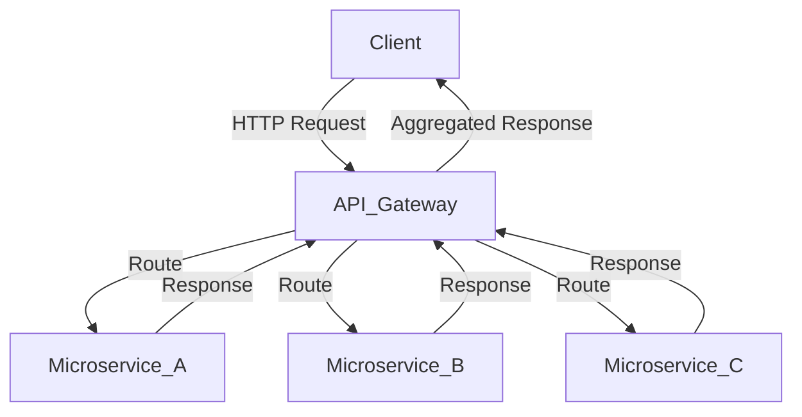

## 12.5. API Gateway Pattern

In the realm of microservices architecture, the API Gateway Pattern emerges as a pivotal design pattern that serves as a centralized entry point for client requests. This pattern is instrumental in routing requests to the appropriate microservices, thereby simplifying client interactions and enforcing security policies. In this section, we will delve into the intricacies of the API Gateway Pattern, explore its implementation using tools like Nginx and Kong, and discuss the benefits it brings to microservices architecture.

### Centralized Entry Point

The API Gateway acts as a single entry point for all client requests, effectively decoupling the client from the microservices. This centralization offers several advantages:

- **Routing**: The gateway routes incoming requests to the appropriate microservice based on the request path, headers, or other criteria.
- **Security**: It enforces security policies such as authentication, authorization, and rate limiting.
- **Aggregation**: The gateway can aggregate responses from multiple microservices into a single response, reducing the number of round trips between the client and the server.
- **Protocol Translation**: It can translate between different protocols, such as HTTP and WebSocket, or handle protocol-specific tasks like SSL termination.

#### Diagram: API Gateway as a Centralized Entry Point



*Figure 1: API Gateway routing client requests to various microservices.*

### Implementing API Gateway

Implementing an API Gateway can be achieved using various tools and technologies. Here, we will explore using Nginx, Kong, and building custom gateways in Elixir.

#### Using Nginx

Nginx is a high-performance web server that can be configured as an API Gateway. It is known for its robustness and scalability.

- **Configuration**: Nginx can be configured to route requests based on URL patterns, headers, or other request attributes.
- **Load Balancing**: It provides built-in load balancing capabilities to distribute traffic across multiple instances of a microservice.
- **SSL Termination**: Nginx can handle SSL termination, offloading this task from the microservices.

**Example Nginx Configuration:**

```nginx
http {
    upstream backend {
        server backend1.example.com;
        server backend2.example.com;
    }

    server {
        listen 80;
        server_name api.example.com;

        location /serviceA/ {
            proxy_pass http://backend/serviceA/;
        }

        location /serviceB/ {
            proxy_pass http://backend/serviceB/;
        }
    }
}
```

*In this configuration, requests to `/serviceA/` and `/serviceB/` are routed to different backends.*

#### Using Kong

Kong is an open-source API Gateway built on top of Nginx. It provides additional features such as plugins for authentication, logging, and monitoring.

- **Plugins**: Kong's plugin architecture allows for easy extension of its capabilities, including rate limiting, authentication, and logging.
- **Admin API**: Kong provides an Admin API for managing routes, services, and plugins programmatically.

**Example Kong Configuration:**

```bash
# Add a service
curl -i -X POST http://localhost:8001/services/ \
  --data "name=serviceA" \
  --data "url=http://backend/serviceA/"

# Add a route
curl -i -X POST http://localhost:8001/services/serviceA/routes \
  --data "paths[]=/serviceA"
```

*This example demonstrates adding a service and a route in Kong.*

#### Building Custom Gateways in Elixir

For those who prefer a more tailored solution, building a custom API Gateway in Elixir offers flexibility and integration with the Elixir ecosystem.

- **Plug and Cowboy**: Use the Plug library and Cowboy web server to build a lightweight gateway.
- **Custom Logic**: Implement custom routing, authentication, and aggregation logic in Elixir.

**Example Elixir Custom Gateway:**

```elixir
defmodule ApiGateway do
  use Plug.Router

  plug :match
  plug :dispatch

  get "/serviceA/*path" do
    forward(conn, path, "http://backend/serviceA/")
  end

  get "/serviceB/*path" do
    forward(conn, path, "http://backend/serviceB/")
  end

  defp forward(conn, path, url) do
    # Forward the request to the specified URL
    # Implement custom logic here
  end
end
```

*This Elixir module demonstrates a simple gateway using Plug.*

### Benefits of the API Gateway Pattern

The API Gateway Pattern offers several benefits that enhance the microservices architecture:

- **Simplification**: Clients interact with a single endpoint, reducing complexity and improving usability.
- **Security**: Centralized enforcement of security policies such as authentication and rate limiting.
- **Flexibility**: Ability to implement custom logic for routing, aggregation, and protocol translation.
- **Scalability**: Load balancing and caching capabilities improve performance and scalability.

### Design Considerations

When implementing an API Gateway, consider the following:

- **Performance**: Ensure the gateway does not become a bottleneck by optimizing routing and caching.
- **Fault Tolerance**: Implement retries and circuit breakers to handle failures gracefully.
- **Monitoring**: Use logging and monitoring tools to track performance and detect issues.
- **Scalability**: Plan for horizontal scaling to handle increased load.

### Elixir Unique Features

Elixir's concurrency model and lightweight processes make it well-suited for building custom API Gateways. The language's ability to handle a large number of concurrent connections efficiently is a significant advantage.

### Differences and Similarities

The API Gateway Pattern is often compared to the Backend for Frontend (BFF) pattern. While both serve as intermediaries between clients and microservices, the BFF pattern is typically tailored to a specific client or user interface, whereas the API Gateway is a more general-purpose solution.

### Try It Yourself

Experiment with the provided code examples by modifying the routing logic or adding new services. Try implementing additional features such as authentication or rate limiting in the Elixir custom gateway example.

### Knowledge Check

- What are the primary responsibilities of an API Gateway?
- How does the API Gateway Pattern simplify client interactions?
- What are the advantages of using Elixir to build a custom API Gateway?

### Summary

The API Gateway Pattern is a powerful tool in the microservices architecture, providing a centralized entry point for client requests. By implementing this pattern using tools like Nginx, Kong, or custom solutions in Elixir, developers can simplify client interactions, enforce security policies, and enhance the scalability and flexibility of their systems.

## Quiz: API Gateway Pattern



### What is the primary role of an API Gateway in microservices architecture?

- [x] Centralized entry point for client requests
- [ ] Database management
- [ ] User authentication
- [ ] Data storage

> **Explanation:** The API Gateway acts as a centralized entry point for routing client requests to appropriate microservices.

### Which tool is NOT typically used to implement an API Gateway?

- [ ] Nginx
- [ ] Kong
- [x] PostgreSQL
- [ ] Custom Elixir solutions

> **Explanation:** PostgreSQL is a database management system, not a tool for implementing API Gateways.

### What is a key benefit of using an API Gateway?

- [x] Simplifying client interactions
- [ ] Increasing database storage
- [ ] Enhancing user interface design
- [ ] Reducing code complexity

> **Explanation:** An API Gateway simplifies client interactions by providing a single entry point for requests.

### Which feature is commonly associated with API Gateways?

- [x] Load balancing
- [ ] Data encryption
- [ ] User interface design
- [ ] Database indexing

> **Explanation:** API Gateways often include load balancing to distribute traffic across multiple services.

### How does Elixir's concurrency model benefit API Gateway implementation?

- [x] Efficient handling of concurrent connections
- [ ] Improved user interface design
- [ ] Enhanced data encryption
- [ ] Simplified database queries

> **Explanation:** Elixir's concurrency model allows for efficient handling of a large number of concurrent connections.

### What is a common design consideration for API Gateways?

- [x] Performance optimization
- [ ] User interface design
- [ ] Database schema design
- [ ] Color scheme selection

> **Explanation:** Performance optimization is crucial to ensure the gateway does not become a bottleneck.

### Which pattern is often compared to the API Gateway Pattern?

- [x] Backend for Frontend (BFF)
- [ ] Singleton Pattern
- [ ] Factory Pattern
- [ ] Observer Pattern

> **Explanation:** The Backend for Frontend (BFF) pattern is often compared to the API Gateway Pattern.

### What is a potential pitfall of an API Gateway?

- [x] Becoming a bottleneck
- [ ] Improving performance
- [ ] Enhancing security
- [ ] Simplifying architecture

> **Explanation:** If not properly optimized, an API Gateway can become a bottleneck in the system.

### What is a common feature of Kong as an API Gateway?

- [x] Plugin architecture
- [ ] Built-in database management
- [ ] User interface design
- [ ] File storage

> **Explanation:** Kong's plugin architecture allows for easy extension of its capabilities.

### True or False: An API Gateway can handle protocol translation.

- [x] True
- [ ] False

> **Explanation:** An API Gateway can handle protocol translation, such as between HTTP and WebSocket.



Remember, this is just the beginning. As you progress, you'll build more complex and interactive systems. Keep experimenting, stay curious, and enjoy the journey!
