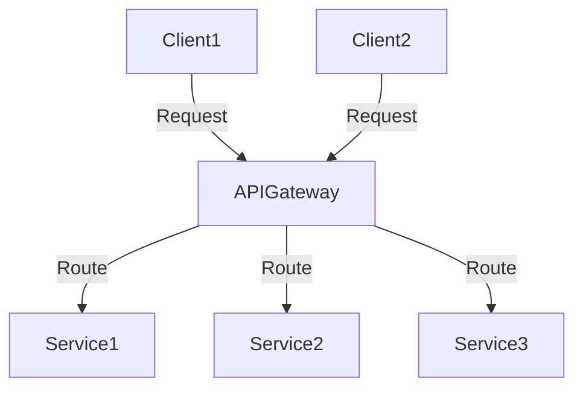

## 12.5. API Gateway Pattern

The API Gateway Pattern is a crucial architectural pattern in microservices design, acting as a centralized entry point that routes client requests to the appropriate microservices. In this section, we will delve into the API Gateway Pattern, explore its implementation using Elixir, and understand its benefits and considerations.

### Understanding the API Gateway Pattern

#### Centralized Entry Point

An API Gateway serves as a single entry point for all client requests to a microservices architecture. It abstracts the complexity of the underlying microservices and provides a unified interface for clients. This pattern is especially useful in large-scale systems where multiple services interact with each other.

#### Key Participants

- **Clients**: Entities that send requests to the API Gateway.
- **API Gateway**: The centralized entry point that handles client requests and routes them to the appropriate microservices.
- **Microservices**: Individual services that perform specific business functions and respond to requests from the API Gateway.

#### Intent

The primary intent of the API Gateway Pattern is to simplify client interactions with a microservices architecture by providing a single, consistent interface. It also enforces security policies, manages requests, and can perform additional functions such as request transformation and response aggregation.

### Implementing API Gateway

There are several approaches to implementing an API Gateway in Elixir, ranging from using existing solutions like Nginx and Kong to building custom gateways tailored to specific needs.

#### Using Nginx as an API Gateway

Nginx is a popular open-source web server that can be configured as an API Gateway. It is known for its high performance and scalability.

```nginx
# Sample Nginx configuration for API Gateway
http {
    upstream my_service {
        server service1.example.com;
        server service2.example.com;
    }

    server {
        listen 80;
        
        location /api/ {
            proxy_pass http://my_service;
            proxy_set_header Host $host;
            proxy_set_header X-Real-IP $remote_addr;
            proxy_set_header X-Forwarded-For $proxy_add_x_forwarded_for;
        }
    }
}
```

In this configuration, Nginx routes requests to the appropriate service based on the URL path. It also sets headers to maintain client information.

#### Using Kong as an API Gateway

Kong is an open-source API Gateway built on top of Nginx. It provides advanced features such as load balancing, authentication, and rate limiting.

```bash
# Install Kong
$ brew install kong

# Start Kong
$ kong start

# Configure a service and route
$ curl -i -X POST http://localhost:8001/services/ \
    --data "name=my_service" \
    --data "url=http://service1.example.com"

$ curl -i -X POST http://localhost:8001/services/my_service/routes \
    --data "hosts[]=example.com"
```

Kong allows you to manage your API Gateway through a RESTful interface, making it easy to configure and extend.

#### Building a Custom API Gateway in Elixir

For more control, you can build a custom API Gateway in Elixir using the Plug and Cowboy libraries.

```elixir
defmodule MyApiGateway do
  use Plug.Router

  plug :match
  plug :dispatch

  get "/api/service1" do
    conn
    |> put_resp_content_type("application/json")
    |> send_resp(200, "{\"message\": \"Service 1 response\"}")
  end

  get "/api/service2" do
    conn
    |> put_resp_content_type("application/json")
    |> send_resp(200, "{\"message\": \"Service 2 response\"}")
  end

  match _ do
    send_resp(conn, 404, "Not found")
  end
end

# Start the Cowboy server
{:ok, _} = Plug.Cowboy.http MyApiGateway, []
```

This example demonstrates a simple API Gateway built using Elixir's Plug and Cowboy libraries. It routes requests to different services based on the URL path.

### Benefits of the API Gateway Pattern

Implementing an API Gateway provides several benefits:

#### Simplifying Client Interactions

By providing a single entry point, the API Gateway abstracts the complexity of multiple microservices, allowing clients to interact with a unified interface.

#### Enforcing Security Policies

The API Gateway can enforce security policies such as authentication, authorization, and rate limiting, ensuring that only authorized requests are processed.

#### Request Transformation and Response Aggregation

The API Gateway can transform requests and aggregate responses from multiple services, reducing the number of client-server interactions and improving performance.

#### Load Balancing and Caching

An API Gateway can distribute incoming requests across multiple instances of a service, providing load balancing and caching capabilities to improve performance and reliability.

### Design Considerations

When implementing an API Gateway, consider the following:

#### Performance and Scalability

Ensure that the API Gateway can handle the expected load and scale as needed. Use load balancing and caching to improve performance.

#### Security

Implement robust security measures to protect against unauthorized access and attacks. Use HTTPS to encrypt communications and enforce authentication and authorization.

#### Fault Tolerance

Design the API Gateway to be fault-tolerant, ensuring that it can handle failures gracefully and provide a seamless experience for clients.

#### Monitoring and Logging

Implement monitoring and logging to track the performance and health of the API Gateway. Use tools like Prometheus and Grafana for real-time monitoring and alerts.

### Elixir Unique Features

Elixir offers several unique features that make it an excellent choice for building an API Gateway:

#### Concurrency and Fault Tolerance

Elixir's concurrency model, based on the BEAM virtual machine, allows you to build highly concurrent and fault-tolerant systems. This is ideal for handling large volumes of requests in an API Gateway.

#### Functional Programming

Elixir's functional programming paradigm encourages writing clean, maintainable code. This is beneficial when building complex systems like an API Gateway.

#### OTP Framework

Elixir's OTP framework provides tools and libraries for building robust, scalable applications. Use GenServer and Supervisor to manage processes and ensure fault tolerance.

### Differences and Similarities

The API Gateway Pattern is often compared to the Backend for Frontend (BFF) pattern. While both provide a centralized entry point, the BFF pattern is tailored to specific client needs, whereas the API Gateway provides a general interface for all clients.

### Try It Yourself

To experiment with the API Gateway Pattern, try modifying the Elixir code example to add new routes and services. Implement additional features such as authentication or rate limiting using Elixir libraries like Guardian or Hammer.

### Visualizing the API Gateway Pattern


```mermaid
graph TD;
    Client1 -->|Request| APIGateway;
    Client2 -->|Request| APIGateway;
    APIGateway -->|Route| Service1;
    APIGateway -->|Route| Service2;
    APIGateway -->|Route| Service3;
```

**Figure 1: API Gateway Pattern Architecture**  
This diagram illustrates the API Gateway Pattern, where multiple clients send requests to a centralized API Gateway, which routes them to the appropriate microservices.

### Knowledge Check

- What is the primary purpose of an API Gateway in a microservices architecture?
- How can you implement an API Gateway using Elixir?
- What are the benefits of using an API Gateway?
- What are some design considerations when implementing an API Gateway?

### Embrace the Journey

Remember, implementing an API Gateway is just the beginning of building robust microservices architectures. Keep exploring, experimenting, and applying what you've learned to create scalable, fault-tolerant systems. Stay curious and enjoy the journey!

## Quiz Time!



### What is the primary role of an API Gateway?

- [x] Centralized entry point for routing client requests to microservices.
- [ ] A database management tool.
- [ ] A client-side library for UI rendering.
- [ ] A tool for compiling Elixir code.

> **Explanation:** The API Gateway acts as a centralized entry point for routing client requests to the appropriate microservices.

### Which of the following is an advantage of using an API Gateway?

- [x] Simplifies client interactions.
- [x] Enforces security policies.
- [ ] Increases the complexity of client-side code.
- [ ] Reduces the need for microservices.

> **Explanation:** An API Gateway simplifies client interactions and enforces security policies, making it easier to manage microservices.

### Which tool can be used to implement an API Gateway in Elixir?

- [x] Plug and Cowboy
- [ ] Phoenix Framework
- [ ] Ecto
- [ ] ExUnit

> **Explanation:** Plug and Cowboy can be used to implement a custom API Gateway in Elixir.

### What is a key benefit of using Elixir for an API Gateway?

- [x] Concurrency and fault tolerance.
- [ ] Built-in UI components.
- [ ] Extensive database support.
- [ ] Native support for JavaScript.

> **Explanation:** Elixir's concurrency model and fault tolerance make it ideal for building an API Gateway.

### How does an API Gateway improve performance?

- [x] By caching responses and load balancing requests.
- [ ] By increasing the number of client requests.
- [ ] By reducing the number of microservices.
- [ ] By simplifying the database schema.

> **Explanation:** An API Gateway can cache responses and balance the load across services, improving performance.

### What is a design consideration for an API Gateway?

- [x] Fault tolerance
- [ ] UI design
- [ ] Database schema
- [ ] Client-side scripting

> **Explanation:** Fault tolerance is important to ensure the API Gateway can handle failures gracefully.

### Which Elixir feature is beneficial for building an API Gateway?

- [x] OTP Framework
- [ ] EEx Templates
- [ ] Phoenix Channels
- [ ] LiveView

> **Explanation:** The OTP Framework provides tools for building robust, scalable applications, which is beneficial for an API Gateway.

### What is the difference between an API Gateway and a BFF pattern?

- [x] An API Gateway provides a general interface for all clients, while BFF is tailored to specific client needs.
- [ ] Both are used for database management.
- [ ] An API Gateway is used for UI rendering, while BFF is for backend processing.
- [ ] There is no difference.

> **Explanation:** An API Gateway provides a general interface, while BFF is tailored to specific client needs.

### Which Elixir library can be used for authentication in an API Gateway?

- [x] Guardian
- [ ] Ecto
- [ ] Phoenix
- [ ] ExUnit

> **Explanation:** Guardian is an Elixir library used for authentication, which can be integrated into an API Gateway.

### True or False: An API Gateway is only useful for small-scale applications.

- [ ] True
- [x] False

> **Explanation:** An API Gateway is particularly useful for large-scale applications with multiple microservices.


