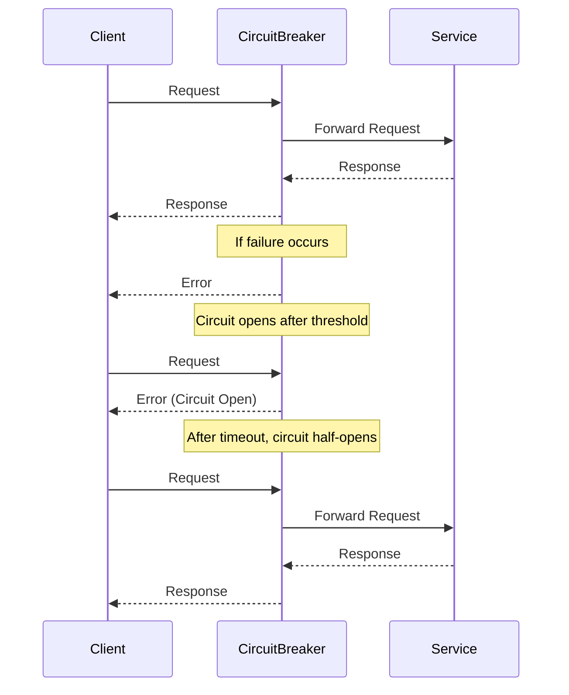

## 12.6. Circuit Breaker Pattern with `Fuse`

In the world of microservices, ensuring the reliability and resilience of your system is paramount. One of the key patterns used to achieve this is the Circuit Breaker Pattern. This pattern helps prevent cascade failures by halting requests to a failing service, allowing it time to recover. In this section, we'll explore how to implement the Circuit Breaker Pattern in Elixir using the `Fuse` library.

### Understanding the Circuit Breaker Pattern

The Circuit Breaker Pattern is a design pattern used to detect failures and encapsulate the logic of preventing a failure from constantly recurring during maintenance, temporary external system failure, or unexpected system difficulties. It acts as a proxy for operations that might fail, allowing the system to continue functioning even when a part of it is experiencing issues.

#### Key Concepts

- **Closed State**: The circuit breaker allows requests to pass through and monitors for failures.
- **Open State**: The circuit breaker halts requests and returns an error immediately to prevent further failures.
- **Half-Open State**: The circuit breaker allows a limited number of requests to test if the underlying issue has been resolved.

### Preventing Cascade Failures

Cascade failures occur when a failure in one part of the system leads to failures in other parts. The Circuit Breaker Pattern helps prevent this by stopping the flow of requests to a failing service, allowing it time to recover without overwhelming it with additional requests.

### Implementing Circuit Breakers with `Fuse`

`Fuse` is a popular Elixir library that provides a simple and effective way to implement circuit breakers. It allows you to monitor and control service calls, providing a robust mechanism to handle failures gracefully.

#### Installation

To get started with `Fuse`, add it to your `mix.exs` dependencies:

```elixir
defp deps do
  [
    {:fuse, "~> 2.4"}
  ]
end
```

Run `mix deps.get` to install the library.

#### Basic Usage

Here's a basic example of using `Fuse` to implement a circuit breaker:

```elixir
defmodule MyService do
  require Logger
  use Fuse

  def call_service do
    case Fuse.ask(:my_service, :sync) do
      :ok ->
        # Simulate a service call
        result = external_service_call()
        handle_result(result)

      :blown ->
        Logger.warn("Circuit breaker is open, skipping service call.")
        {:error, :service_unavailable}
    end
  end

  defp external_service_call do
    # Simulate a potential failure
    if :rand.uniform() > 0.7 do
      {:ok, "Success"}
    else
      {:error, "Failure"}
    end
  end

  defp handle_result({:ok, response}) do
    Logger.info("Service call succeeded: #{response}")
    {:ok, response}
  end

  defp handle_result({:error, _reason}) do
    Logger.error("Service call failed.")
    Fuse.melt(:my_service)
    {:error, :service_failed}
  end
end
```

In this example, we define a service call that uses `Fuse` to manage the circuit breaker state. If the service call fails, we "melt" the fuse, which can eventually lead to the circuit breaker opening if failures persist.

### Configuration

`Fuse` allows you to configure various parameters to fine-tune the behavior of your circuit breakers:

- **Thresholds**: Set the number of failures before the circuit breaker opens.
- **Timeouts**: Define how long the circuit breaker remains open before transitioning to the half-open state.
- **Fallback Strategies**: Implement fallback mechanisms to handle requests when the circuit breaker is open.

#### Setting Thresholds and Timeouts

You can configure `Fuse` with specific thresholds and timeouts:

```elixir
Fuse.install(:my_service, {{:standard, 2, 10_000}, {:reset, 60_000}})
```

In this configuration:

- The circuit breaker will open after 2 failures within a 10-second window.
- The circuit breaker will attempt to reset after 60 seconds.

### Visualizing the Circuit Breaker Pattern

To better understand the flow of the Circuit Breaker Pattern, let's visualize it using a sequence diagram:



This diagram illustrates the flow of requests through the circuit breaker, highlighting the transition between states.

### Design Considerations

When implementing the Circuit Breaker Pattern, consider the following:

- **Granularity**: Decide whether to use a circuit breaker per service, per endpoint, or per operation.
- **Fallback Mechanisms**: Implement strategies to handle requests when the circuit breaker is open, such as returning cached data or a default response.
- **Monitoring and Logging**: Ensure you have adequate logging and monitoring in place to track the state of your circuit breakers and diagnose issues.

### Elixir Unique Features

Elixir's concurrency model and lightweight processes make it particularly well-suited for implementing circuit breakers. The `Fuse` library leverages these features to provide efficient and scalable circuit breaker implementations.

### Differences and Similarities

The Circuit Breaker Pattern is often compared to the Retry Pattern. While both aim to handle failures gracefully, they differ in approach:

- **Circuit Breaker**: Prevents further requests to a failing service, allowing it time to recover.
- **Retry**: Attempts to retry failed requests, often with exponential backoff.

### Try It Yourself

To deepen your understanding of the Circuit Breaker Pattern, try modifying the code example to:

- Change the failure threshold and observe the behavior.
- Implement a fallback mechanism when the circuit breaker is open.
- Add logging to track the state transitions of the circuit breaker.

### References and Links

- [Elixir `Fuse` Library Documentation](https://hexdocs.pm/fuse/readme.html)
- [Microservices Patterns: Circuit Breaker](https://microservices.io/patterns/reliability/circuit-breaker.html)
- [Martin Fowler's Circuit Breaker Pattern](https://martinfowler.com/bliki/CircuitBreaker.html)

### Knowledge Check

- What are the three states of a circuit breaker?
- How does the Circuit Breaker Pattern prevent cascade failures?
- What is the role of the `Fuse` library in implementing circuit breakers in Elixir?

### Embrace the Journey

Remember, mastering the Circuit Breaker Pattern is just one step in building resilient microservices. As you continue to explore Elixir and its powerful features, you'll discover new ways to enhance the reliability and performance of your applications. Keep experimenting, stay curious, and enjoy the journey!

## Quiz: Circuit Breaker Pattern with `Fuse`



### What is the primary purpose of the Circuit Breaker Pattern?

- [x] To prevent cascade failures by halting requests to a failing service
- [ ] To retry failed requests indefinitely
- [ ] To enhance the speed of service calls
- [ ] To cache service responses

> **Explanation:** The Circuit Breaker Pattern is designed to prevent cascade failures by stopping requests to a failing service, allowing it time to recover.

### Which Elixir library is commonly used to implement the Circuit Breaker Pattern?

- [x] Fuse
- [ ] Phoenix
- [ ] Ecto
- [ ] Plug

> **Explanation:** The `Fuse` library is commonly used in Elixir to implement the Circuit Breaker Pattern.

### What happens when a circuit breaker is in the open state?

- [x] Requests are halted and an error is returned immediately
- [ ] Requests are retried with exponential backoff
- [ ] Requests are forwarded to a backup service
- [ ] Requests are cached for later processing

> **Explanation:** When a circuit breaker is open, requests are halted and an error is returned immediately to prevent further failures.

### How can you configure the `Fuse` library to open a circuit breaker?

- [x] By setting failure thresholds and timeouts
- [ ] By defining retry policies
- [ ] By implementing caching strategies
- [ ] By using load balancing techniques

> **Explanation:** The `Fuse` library allows you to configure circuit breakers by setting failure thresholds and timeouts.

### What is a common fallback strategy when a circuit breaker is open?

- [x] Returning cached data or a default response
- [ ] Retrying the request with exponential backoff
- [ ] Forwarding the request to another service
- [ ] Logging the request for later analysis

> **Explanation:** A common fallback strategy is to return cached data or a default response when a circuit breaker is open.

### What is the role of the half-open state in a circuit breaker?

- [x] To test if the underlying issue has been resolved by allowing limited requests
- [ ] To permanently halt all requests to the service
- [ ] To retry failed requests indefinitely
- [ ] To enhance the speed of service calls

> **Explanation:** The half-open state allows limited requests to test if the underlying issue has been resolved.

### How does Elixir's concurrency model benefit the implementation of circuit breakers?

- [x] By providing lightweight processes for efficient state management
- [ ] By enhancing the speed of service calls
- [ ] By caching service responses
- [ ] By retrying failed requests indefinitely

> **Explanation:** Elixir's concurrency model provides lightweight processes, which are ideal for managing the state of circuit breakers efficiently.

### What is the difference between the Circuit Breaker Pattern and the Retry Pattern?

- [x] Circuit Breaker halts requests; Retry attempts to retry failed requests
- [ ] Circuit Breaker caches responses; Retry enhances speed
- [ ] Circuit Breaker retries indefinitely; Retry halts requests
- [ ] Circuit Breaker enhances speed; Retry caches responses

> **Explanation:** The Circuit Breaker Pattern halts requests to a failing service, while the Retry Pattern attempts to retry failed requests.

### What should you consider when implementing a circuit breaker?

- [x] Granularity, fallback mechanisms, and monitoring
- [ ] Speed, caching, and retry policies
- [ ] Load balancing, caching, and speed
- [ ] Security, speed, and caching

> **Explanation:** When implementing a circuit breaker, consider granularity, fallback mechanisms, and monitoring.

### True or False: The Circuit Breaker Pattern is only applicable to microservices architectures.

- [ ] True
- [x] False

> **Explanation:** While the Circuit Breaker Pattern is commonly used in microservices architectures, it can be applied to any system where preventing cascade failures is important.


