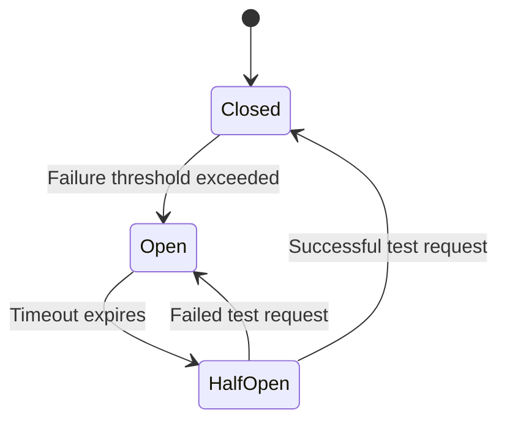

## 12.6. Circuit Breaker Pattern with `Fuse`

In the realm of microservices, ensuring system resilience and reliability is paramount. The Circuit Breaker pattern is a crucial design pattern that helps prevent cascade failures in distributed systems. In this section, we will explore how to implement the Circuit Breaker pattern in Elixir using the `Fuse` library. We will delve into the concepts, provide code examples, and discuss best practices for configuration and usage.

### Understanding the Circuit Breaker Pattern

The Circuit Breaker pattern is inspired by electrical circuit breakers, which trip to prevent damage when an electrical circuit is overloaded. Similarly, in software systems, a Circuit Breaker monitors the interactions between services and halts requests to a failing service to allow it time to recover. This pattern is particularly useful in microservices architectures where services are interdependent.

#### Key Concepts

- **Closed State**: The Circuit Breaker allows requests to pass through to the service. If the service call is successful, everything continues as normal. However, if failures occur and exceed a predefined threshold, the Circuit Breaker transitions to the Open state.
  
- **Open State**: In this state, the Circuit Breaker short-circuits the service calls, returning an error or a predefined fallback response immediately without attempting to call the service. This prevents the system from trying to call a service that is likely to fail.

- **Half-Open State**: After a certain timeout period, the Circuit Breaker transitions to a Half-Open state to test if the underlying problem has been resolved. It allows a limited number of test requests to pass through. If these requests succeed, the Circuit Breaker transitions back to the Closed state. If they fail, it returns to the Open state.

### Implementing Circuit Breakers in Elixir with `Fuse`

Elixir's `Fuse` library provides a robust implementation of the Circuit Breaker pattern. It allows developers to define fuses (circuit breakers) with configurable thresholds, timeouts, and fallback strategies. Let's explore how to set up and use `Fuse` to protect your Elixir applications.

#### Installation and Setup

To get started with `Fuse`, you need to add it to your project's dependencies. Open your `mix.exs` file and add `:fuse` to the list of dependencies:

```elixir
defp deps do
  [
    {:fuse, "~> 2.4"}
  ]
end
```

Then, run the following command to fetch the dependency:

```shell
mix deps.get
```

#### Creating a Fuse

To create a fuse, you need to define its parameters such as the number of allowed failures, the reset timeout, and the strategy for handling failures. Here's a simple example:

```elixir
# Import the Fuse module
import Fuse

# Define a fuse with a name, failure threshold, and reset timeout
fuse_name = :my_service_fuse
options = [
  {:strategy, :standard},  # Use the standard strategy
  {:max_failures, 5},      # Allow up to 5 failures
  {:reset, 10_000}         # Reset after 10 seconds
]

# Create the fuse
{:ok, _} = Fuse.install(fuse_name, options)
```

#### Using the Fuse

Once the fuse is installed, you can use it to protect your service calls. Wrap your service call logic with a check to see if the fuse is blown:

```elixir
def call_service do
  fuse_name = :my_service_fuse

  case Fuse.ask(fuse_name, :sync) do
    :ok ->
      # Proceed with the service call
      case make_service_call() do
        {:ok, result} ->
          {:ok, result}

        {:error, _reason} ->
          # Notify the fuse of a failure
          Fuse.melt(fuse_name)
          {:error, :service_unavailable}
      end

    :blown ->
      # Return an error or fallback response
      {:error, :circuit_open}
  end
end
```

In this example, the `Fuse.ask/2` function checks the state of the fuse. If the fuse is not blown (`:ok`), it proceeds with the service call. If the call fails, it notifies the fuse using `Fuse.melt/1`. If the fuse is blown (`:blown`), it returns an error immediately.

### Configuration and Best Practices

#### Setting Thresholds and Timeouts

The choice of thresholds and timeouts is critical for the effectiveness of the Circuit Breaker pattern. Here are some best practices:

- **Failure Threshold**: Set a reasonable threshold for failures. Too low, and the circuit will open too often; too high, and it may not open when needed.
  
- **Reset Timeout**: Choose a timeout period that gives the failing service enough time to recover. This period should be based on the average recovery time of the service.

- **Fallback Strategies**: Define fallback strategies for when the circuit is open. This could be returning cached data, a default response, or redirecting to an alternative service.

#### Monitoring and Logging

Monitoring and logging are essential for understanding the behavior of your Circuit Breakers. Use Elixir's logging facilities to track when fuses are blown and reset. This information can help you fine-tune your thresholds and timeouts.

#### Testing Circuit Breakers

Testing Circuit Breakers involves simulating failures and ensuring that the system behaves as expected. You can use tools like `ExUnit` to create tests that simulate service failures and check the state transitions of your fuses.

### Visualizing the Circuit Breaker Pattern

To better understand the Circuit Breaker pattern, let's visualize its state transitions using a Mermaid.js flowchart:


```mermaid
stateDiagram-v2
    [*] --> Closed
    Closed --> Open : Failure threshold exceeded
    Open --> HalfOpen : Timeout expires
    HalfOpen --> Closed : Successful test request
    HalfOpen --> Open : Failed test request
```

**Diagram Description**: This flowchart illustrates the state transitions of a Circuit Breaker. It starts in the Closed state, transitions to Open when failures exceed the threshold, and moves to Half-Open after a timeout. Depending on the success of test requests, it either returns to Closed or goes back to Open.

### Try It Yourself

To deepen your understanding, try modifying the code examples provided:

- **Change the Failure Threshold**: Experiment with different failure thresholds and observe how it affects the behavior of the Circuit Breaker.
  
- **Implement a Fallback Strategy**: Add a fallback strategy to the `call_service` function that returns a default response when the circuit is open.

- **Log Circuit Breaker Events**: Enhance the code to log when the circuit transitions between states. This will help you monitor its behavior in a real application.

### Key Takeaways

- The Circuit Breaker pattern is crucial for building resilient microservices by preventing cascade failures.
- Elixir's `Fuse` library provides a simple and effective way to implement Circuit Breakers.
- Proper configuration of thresholds, timeouts, and fallback strategies is essential for effective Circuit Breakers.
- Monitoring, logging, and testing are important for understanding and optimizing Circuit Breaker behavior.

### Further Reading

For more information on the Circuit Breaker pattern and its implementation in Elixir, consider the following resources:

- [Elixir `Fuse` Documentation](https://hexdocs.pm/fuse/readme.html)
- [Microservices Patterns by Chris Richardson](https://microservices.io/patterns/reliability/circuit-breaker.html)
- [Designing Data-Intensive Applications by Martin Kleppmann](https://dataintensive.net/)

## Quiz Time!



### What is the primary purpose of the Circuit Breaker pattern?

- [x] Prevent cascade failures in distributed systems
- [ ] Enhance data security
- [ ] Improve user interface design
- [ ] Optimize database queries

> **Explanation:** The Circuit Breaker pattern is designed to prevent cascade failures by halting requests to a failing service, allowing it to recover.

### In which state does the Circuit Breaker allow a limited number of test requests to pass through?

- [ ] Closed
- [x] Half-Open
- [ ] Open
- [ ] Blown

> **Explanation:** In the Half-Open state, the Circuit Breaker allows a limited number of test requests to determine if the underlying issue has been resolved.

### Which Elixir library is used to implement the Circuit Breaker pattern in this guide?

- [ ] Phoenix
- [ ] Ecto
- [x] Fuse
- [ ] Plug

> **Explanation:** The `Fuse` library is used to implement the Circuit Breaker pattern in Elixir.

### What function is used to check the state of a fuse in the `Fuse` library?

- [ ] Fuse.check/1
- [x] Fuse.ask/2
- [ ] Fuse.state/1
- [ ] Fuse.status/2

> **Explanation:** The `Fuse.ask/2` function is used to check the state of a fuse in the `Fuse` library.

### What should you do if a service call fails when using a Circuit Breaker?

- [ ] Ignore the failure
- [ ] Retry the call immediately
- [x] Notify the fuse of the failure using `Fuse.melt/1`
- [ ] Log the error and continue

> **Explanation:** If a service call fails, you should notify the fuse of the failure using `Fuse.melt/1` to help manage the Circuit Breaker's state.

### What is the default strategy used in the `Fuse` library for Circuit Breakers?

- [ ] Aggressive
- [x] Standard
- [ ] Passive
- [ ] Custom

> **Explanation:** The default strategy used in the `Fuse` library for Circuit Breakers is the standard strategy.

### How can you test the behavior of a Circuit Breaker in Elixir?

- [ ] By using manual testing
- [x] By simulating failures with `ExUnit`
- [ ] By deploying to production
- [ ] By using graphical testing tools

> **Explanation:** You can test the behavior of a Circuit Breaker in Elixir by simulating failures with `ExUnit`.

### What is a recommended practice for monitoring Circuit Breakers?

- [ ] Ignore monitoring
- [ ] Use manual logs
- [x] Use Elixir's logging facilities
- [ ] Monitor only in production

> **Explanation:** Using Elixir's logging facilities is a recommended practice for monitoring Circuit Breakers.

### What should be considered when setting the reset timeout for a Circuit Breaker?

- [ ] The average response time of the service
- [x] The average recovery time of the service
- [ ] The number of users
- [ ] The complexity of the service

> **Explanation:** The reset timeout should be based on the average recovery time of the service to allow it enough time to recover.

### The Circuit Breaker pattern is only applicable to microservices architectures.

- [ ] True
- [x] False

> **Explanation:** While the Circuit Breaker pattern is particularly useful in microservices architectures, it can be applied to any distributed system where service interactions need to be managed.



Remember, mastering the Circuit Breaker pattern is just one step towards building resilient and reliable systems. Keep exploring, experimenting, and enhancing your skills to become an expert in designing robust Elixir applications.
