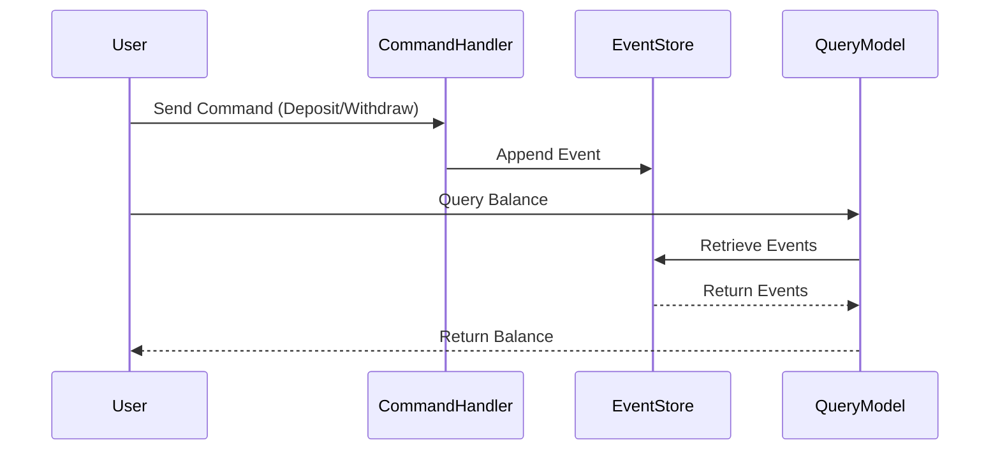

## 12.7. Event Sourcing and CQRS in Microservices

In the realm of microservices architecture, **Event Sourcing** and **Command Query Responsibility Segregation (CQRS)** are two powerful design patterns that can significantly enhance the scalability, auditability, and maintainability of your systems. In this section, we will delve into these concepts, explore their benefits, and demonstrate how to implement them in Elixir.

### Understanding Event Sourcing

**Event Sourcing** is a design pattern where state changes in a system are stored as a sequence of events. Instead of persisting the current state of an entity, you persist the sequence of events that led to the current state. This approach provides a complete audit trail of changes and allows you to reconstruct the state of the system at any point in time.

#### Key Concepts of Event Sourcing

- **Event Store**: A database or storage system that holds the sequence of events. Each event represents a state change in the system.
- **Event**: A record of a state change. Events are immutable and typically include a timestamp, type, and payload.
- **Rehydration**: The process of reconstructing the current state of an entity by replaying its events from the event store.

#### Benefits of Event Sourcing

- **Auditability**: Every change is recorded as an event, providing a complete history of state changes.
- **Scalability**: Events can be processed asynchronously, allowing for scalable read and write operations.
- **Flexibility**: You can easily add new features by replaying events to derive new insights or projections.

### Implementing Event Sourcing in Elixir

Let's explore how to implement Event Sourcing in Elixir using a simple example of a bank account system.

#### Step 1: Define Events

First, we define the events that represent state changes in our system.

```elixir
defmodule BankAccount.Events do
  defmodule Deposited do
    defstruct [:account_id, :amount, :timestamp]
  end

  defmodule Withdrawn do
    defstruct [:account_id, :amount, :timestamp]
  end
end
```

#### Step 2: Create an Event Store

Next, we create an event store to persist these events. For simplicity, we'll use an in-memory store.

```elixir
defmodule BankAccount.EventStore do
  use Agent

  def start_link(_) do
    Agent.start_link(fn -> %{} end, name: __MODULE__)
  end

  def append_event(account_id, event) do
    Agent.update(__MODULE__, fn events ->
      Map.update(events, account_id, [event], &[event | &1])
    end)
  end

  def get_events(account_id) do
    Agent.get(__MODULE__, fn events ->
      Map.get(events, account_id, [])
    end)
  end
end
```

#### Step 3: Rehydrate State

We need a function to rehydrate the state of a bank account by replaying its events.

```elixir
defmodule BankAccount do
  alias BankAccount.Events.{Deposited, Withdrawn}

  defstruct [:account_id, balance: 0]

  def rehydrate(account_id) do
    events = BankAccount.EventStore.get_events(account_id)
    Enum.reduce(events, %BankAccount{account_id: account_id}, &apply_event/2)
  end

  defp apply_event(%Deposited{amount: amount}, %BankAccount{balance: balance} = account) do
    %{account | balance: balance + amount}
  end

  defp apply_event(%Withdrawn{amount: amount}, %BankAccount{balance: balance} = account) do
    %{account | balance: balance - amount}
  end
end
```

### Understanding CQRS

**Command Query Responsibility Segregation (CQRS)** is a pattern that separates the read and write operations of a system into different models. This separation allows for optimized and scalable operations, as the read model can be tailored for efficient querying, while the write model focuses on processing commands.

#### Key Concepts of CQRS

- **Command Model**: Handles write operations and is responsible for processing commands that change the state of the system.
- **Query Model**: Handles read operations and is optimized for retrieving data.
- **Command**: An instruction to perform a specific action that changes the state.
- **Query**: A request to retrieve data without changing the state.

#### Benefits of CQRS

- **Scalability**: Read and write operations can be scaled independently.
- **Performance**: Queries can be optimized without affecting the write model.
- **Flexibility**: Different models can be used for different use cases, such as real-time analytics or reporting.

### Implementing CQRS in Elixir

Let's extend our bank account example to implement CQRS.

#### Step 1: Define Commands

We define commands for deposit and withdrawal operations.

```elixir
defmodule BankAccount.Commands do
  defmodule Deposit do
    defstruct [:account_id, :amount]
  end

  defmodule Withdraw do
    defstruct [:account_id, :amount]
  end
end
```

#### Step 2: Handle Commands

We create a command handler to process these commands and update the event store.

```elixir
defmodule BankAccount.CommandHandler do
  alias BankAccount.Commands.{Deposit, Withdraw}
  alias BankAccount.Events.{Deposited, Withdrawn}
  alias BankAccount.EventStore

  def handle(%Deposit{account_id: account_id, amount: amount}) do
    event = %Deposited{account_id: account_id, amount: amount, timestamp: DateTime.utc_now()}
    EventStore.append_event(account_id, event)
  end

  def handle(%Withdraw{account_id: account_id, amount: amount}) do
    event = %Withdrawn{account_id: account_id, amount: amount, timestamp: DateTime.utc_now()}
    EventStore.append_event(account_id, event)
  end
end
```

#### Step 3: Create a Query Model

We create a query model to retrieve the current state of a bank account.

```elixir
defmodule BankAccount.Query do
  alias BankAccount

  def get_balance(account_id) do
    account = BankAccount.rehydrate(account_id)
    account.balance
  end
end
```

### Visualizing Event Sourcing and CQRS

To better understand the flow of Event Sourcing and CQRS, let's visualize the architecture using a sequence diagram.



### Design Considerations

When implementing Event Sourcing and CQRS, consider the following:

- **Consistency**: Ensure eventual consistency between the command and query models.
- **Complexity**: Be aware of the increased complexity in managing two separate models.
- **Eventual Consistency**: Accept that the query model may not always reflect the latest state immediately.

### Elixir Unique Features

Elixir's concurrency model and lightweight processes make it an excellent choice for implementing Event Sourcing and CQRS. The language's immutable data structures and pattern matching capabilities also facilitate the handling of events and commands.

### Differences and Similarities

Event Sourcing and CQRS are often used together but can be implemented independently. Event Sourcing focuses on storing state changes as events, while CQRS separates read and write operations. Both patterns aim to improve scalability and maintainability.

### Try It Yourself

Experiment with the provided code examples by adding new types of events and commands. Consider implementing additional features, such as event replay for debugging or analytics.

### Knowledge Check

- What are the main benefits of using Event Sourcing?
- How does CQRS improve scalability in a system?
- What are some potential challenges when implementing these patterns?

### Embrace the Journey

Remember, mastering Event Sourcing and CQRS is a journey. As you continue to explore these patterns, you'll discover new ways to enhance your systems. Stay curious, keep experimenting, and enjoy the process!

## Quiz: Event Sourcing and CQRS in Microservices



### What is the primary purpose of Event Sourcing?

- [x] To store state changes as a sequence of events
- [ ] To separate read and write operations
- [ ] To optimize database queries
- [ ] To enhance user interface design

> **Explanation:** Event Sourcing focuses on storing state changes as events, providing a complete audit trail.

### How does CQRS improve system scalability?

- [x] By separating read and write operations into different models
- [ ] By using a single model for all operations
- [ ] By storing data in a single database
- [ ] By reducing the number of events

> **Explanation:** CQRS separates read and write operations, allowing them to be scaled independently.

### What is an Event Store?

- [x] A storage system that holds a sequence of events
- [ ] A database for storing user data
- [ ] A cache for temporary data
- [ ] A queue for processing commands

> **Explanation:** An Event Store is used to persist events that represent state changes.

### What is the role of a Command Handler in CQRS?

- [x] To process commands and update the event store
- [ ] To retrieve data for queries
- [ ] To manage user authentication
- [ ] To handle network requests

> **Explanation:** A Command Handler processes commands and updates the event store with new events.

### Which of the following is a benefit of Event Sourcing?

- [x] Auditability
- [x] Scalability
- [ ] Complexity
- [ ] Immediate consistency

> **Explanation:** Event Sourcing provides auditability and scalability, but it may introduce complexity and eventual consistency.

### What is rehydration in the context of Event Sourcing?

- [x] Reconstructing the current state by replaying events
- [ ] Storing events in a database
- [ ] Optimizing database queries
- [ ] Separating read and write operations

> **Explanation:** Rehydration involves replaying events to reconstruct the current state of an entity.

### What is a potential challenge of implementing CQRS?

- [x] Increased complexity in managing two separate models
- [ ] Lack of scalability
- [ ] Difficulty in processing commands
- [ ] Limited auditability

> **Explanation:** CQRS introduces complexity by requiring separate models for read and write operations.

### How can Elixir's concurrency model benefit Event Sourcing?

- [x] By efficiently handling concurrent event processing
- [ ] By simplifying user interface design
- [ ] By reducing the number of events
- [ ] By enhancing database performance

> **Explanation:** Elixir's concurrency model allows for efficient handling of concurrent event processing.

### What is the main focus of CQRS?

- [x] Separating read and write operations
- [ ] Storing state changes as events
- [ ] Optimizing user interface design
- [ ] Enhancing database performance

> **Explanation:** CQRS focuses on separating read and write operations into different models.

### True or False: Event Sourcing and CQRS must always be used together.

- [ ] True
- [x] False

> **Explanation:** Event Sourcing and CQRS can be used independently, although they are often used together to enhance system scalability and maintainability.


