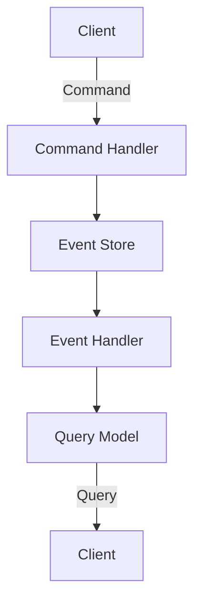

## 12.7. Event Sourcing and CQRS in Microservices

In the world of microservices, managing complex systems with high scalability and reliability is a significant challenge. Event Sourcing and Command Query Responsibility Segregation (CQRS) are two architectural patterns that help address these challenges by offering a structured approach to handle data and operations. In this section, we will delve into these patterns, their benefits, and how they can be effectively implemented in Elixir.

### Understanding Event Sourcing

**Event Sourcing** is a pattern where state changes are stored as a sequence of events. Instead of persisting the current state of an entity, you store a series of events that represent the changes to that state over time. This approach allows you to reconstruct the state at any point by replaying the events.

#### Key Concepts of Event Sourcing

- **Event Store:** A database or storage system that holds the sequence of events. Each event is immutable and represents a single change in the system.
- **Event Replay:** The process of rebuilding the current state by replaying the stored events from the event store.
- **Event Handlers:** Components that react to events to update the read model or trigger side effects.

#### Benefits of Event Sourcing

- **Auditability:** Every change is recorded as an event, providing a complete audit trail.
- **Scalability:** Events can be processed asynchronously, allowing for scalable read models.
- **System State Reconstruction:** The state can be reconstructed at any point in time by replaying events.

### Implementing Event Sourcing in Elixir

Elixir's concurrency model and immutable data structures make it an excellent fit for implementing Event Sourcing. Let's explore a basic implementation using Elixir.

#### Sample Code for Event Sourcing

```elixir
defmodule EventSourcingExample do
  defmodule EventStore do
    use Agent

    def start_link(_) do
      Agent.start_link(fn -> [] end, name: __MODULE__)
    end

    def store_event(event) do
      Agent.update(__MODULE__, fn events -> [event | events] end)
    end

    def get_events do
      Agent.get(__MODULE__, & &1)
    end
  end

  defmodule Account do
    defstruct [:id, :balance]

    def apply_event(%Account{} = account, {:deposit, amount}) do
      %Account{account | balance: account.balance + amount}
    end

    def apply_event(%Account{} = account, {:withdraw, amount}) do
      %Account{account | balance: account.balance - amount}
    end
  end

  defmodule AccountService do
    def deposit(account_id, amount) do
      EventStore.store_event({:deposit, account_id, amount})
    end

    def withdraw(account_id, amount) do
      EventStore.store_event({:withdraw, account_id, amount})
    end

    def get_account(account_id) do
      events = EventStore.get_events()
      Enum.reduce(events, %Account{id: account_id, balance: 0}, fn
        {:deposit, ^account_id, amount}, account -> Account.apply_event(account, {:deposit, amount})
        {:withdraw, ^account_id, amount}, account -> Account.apply_event(account, {:withdraw, amount})
        _, account -> account
      end)
    end
  end
end
```

In this example, we have an `EventStore` module to store events and an `Account` module to apply events to account state. The `AccountService` module provides functions to deposit and withdraw money, storing events in the event store.

### Command Query Responsibility Segregation (CQRS)

CQRS is a pattern that separates the responsibilities of reading and writing data into different models. This separation allows for optimizing each model for its specific purpose, improving performance and scalability.

#### Key Concepts of CQRS

- **Command Model:** Handles the write operations and is responsible for validating and processing commands.
- **Query Model:** Handles the read operations and is optimized for retrieving data.
- **Event Handlers:** Update the query model based on events generated by the command model.

#### Benefits of CQRS

- **Scalability:** Separate models can be scaled independently based on their load.
- **Optimized Queries:** The query model can be denormalized and optimized for read performance.
- **Simplified Logic:** Separating commands and queries simplifies the logic in each model.

### Implementing CQRS in Elixir

Let's implement a basic CQRS system in Elixir, using separate modules for command and query handling.

#### Sample Code for CQRS

```elixir
defmodule CQRSExample do
  defmodule CommandHandler do
    def handle_command({:create_account, account_id}) do
      # Business logic to create an account
      {:ok, event} = {:account_created, account_id}
      EventStore.store_event(event)
      event
    end

    def handle_command({:deposit, account_id, amount}) do
      # Business logic to deposit money
      {:ok, event} = {:money_deposited, account_id, amount}
      EventStore.store_event(event)
      event
    end
  end

  defmodule QueryHandler do
    def get_account_balance(account_id) do
      # Logic to query the account balance
      events = EventStore.get_events()
      Enum.reduce(events, 0, fn
        {:money_deposited, ^account_id, amount}, balance -> balance + amount
        _, balance -> balance
      end)
    end
  end
end
```

In this CQRS example, we have a `CommandHandler` module to process commands and generate events, and a `QueryHandler` module to retrieve data based on the events stored.

### Combining Event Sourcing and CQRS

Event Sourcing and CQRS complement each other well. Event Sourcing provides a way to store all changes as events, while CQRS separates the concerns of command and query handling. By combining these patterns, you can build a robust, scalable, and maintainable microservices architecture.

#### Architecture Diagram


```mermaid
graph TD;
    A[Client] -->|Command| B[Command Handler];
    B --> C[Event Store];
    C --> D[Event Handler];
    D --> E[Query Model];
    E -->|Query| F[Client];
```

* **Client:** Initiates commands and queries.
* **Command Handler:** Processes commands and generates events.
* **Event Store:** Stores events generated by command handlers.
* **Event Handler:** Updates the query model based on events.
* **Query Model:** Provides optimized data for queries.

### Design Considerations

- **Consistency:** Ensure eventual consistency between the command and query models.
- **Eventual Consistency:** Accept that the query model may not immediately reflect the latest changes.
- **Complexity:** Be aware of the added complexity in managing separate models and event handling.
- **Idempotency:** Ensure that event handlers are idempotent to handle duplicate events.

### Elixir Unique Features

Elixir's strengths in concurrency and fault-tolerance make it well-suited for implementing Event Sourcing and CQRS. The use of processes and message passing aligns with the event-driven nature of these patterns. Additionally, Elixir's immutable data structures simplify the handling of events and state changes.

### Differences and Similarities

- **Event Sourcing vs. CQRS:** Event Sourcing focuses on storing state changes as events, while CQRS separates read and write operations into different models.
- **Complementary Patterns:** These patterns are often used together to leverage their combined benefits.
- **Common Confusions:** Ensure clear separation of responsibilities to avoid confusion between command and query logic.

### Try It Yourself

Experiment with the provided code examples by modifying the event types and adding new command and query handlers. Try implementing additional features, such as event replay or snapshotting, to enhance the system's capabilities.

### References and Links

- [Martin Fowler on Event Sourcing](https://martinfowler.com/eaaDev/EventSourcing.html)
- [CQRS Documentation](https://martinfowler.com/bliki/CQRS.html)
- [Elixir Lang](https://elixir-lang.org/)
- [EventStore.org](https://eventstore.org/)

### Knowledge Check

- What are the main benefits of using Event Sourcing?
- How does CQRS improve system scalability?
- Describe how Elixir's features align with Event Sourcing and CQRS.

### Embrace the Journey

Remember, mastering Event Sourcing and CQRS is a journey. As you explore these patterns, you'll gain insights into building scalable and maintainable systems. Keep experimenting, stay curious, and enjoy the process!

## Quiz Time!



### What is the primary purpose of Event Sourcing?

- [x] To store changes as a sequence of events
- [ ] To separate read and write operations
- [ ] To optimize database queries
- [ ] To simplify user interfaces

> **Explanation:** Event Sourcing focuses on storing changes as a sequence of events, allowing for state reconstruction and auditability.

### Which pattern separates read and write operations into different models?

- [ ] Event Sourcing
- [x] CQRS
- [ ] Actor Model
- [ ] Singleton

> **Explanation:** CQRS (Command Query Responsibility Segregation) separates read and write operations into different models for scalability and optimization.

### What is the role of an Event Store in Event Sourcing?

- [x] To store a sequence of events
- [ ] To handle user authentication
- [ ] To manage database connections
- [ ] To optimize query performance

> **Explanation:** An Event Store is responsible for storing the sequence of events that represent state changes in Event Sourcing.

### How does CQRS contribute to system scalability?

- [x] By allowing separate scaling of read and write models
- [ ] By reducing the number of database queries
- [ ] By simplifying user interfaces
- [ ] By using a single data model

> **Explanation:** CQRS allows separate scaling of read and write models, optimizing each for its specific load and improving overall system scalability.

### What is a key benefit of combining Event Sourcing and CQRS?

- [x] Enhanced scalability and auditability
- [ ] Simplified user interfaces
- [ ] Reduced code complexity
- [ ] Improved security

> **Explanation:** Combining Event Sourcing and CQRS enhances scalability and auditability by leveraging the strengths of both patterns.

### Which Elixir feature aligns well with Event Sourcing?

- [x] Immutable data structures
- [ ] Dynamic typing
- [ ] Object-oriented programming
- [ ] Inheritance

> **Explanation:** Elixir's immutable data structures simplify handling events and state changes, aligning well with Event Sourcing.

### What is the purpose of Event Handlers in CQRS?

- [x] To update the query model based on events
- [ ] To store events in the database
- [ ] To handle user authentication
- [ ] To manage database connections

> **Explanation:** Event Handlers in CQRS update the query model based on events generated by the command model.

### What should be ensured for Event Handlers to handle duplicate events?

- [x] Idempotency
- [ ] Consistency
- [ ] Scalability
- [ ] Security

> **Explanation:** Ensuring idempotency in Event Handlers allows them to handle duplicate events without adverse effects.

### How can you reconstruct the system state in Event Sourcing?

- [x] By replaying the stored events
- [ ] By querying the database directly
- [ ] By using a single data model
- [ ] By optimizing database queries

> **Explanation:** In Event Sourcing, the system state can be reconstructed by replaying the stored events in the event store.

### True or False: Event Sourcing and CQRS are commonly used together.

- [x] True
- [ ] False

> **Explanation:** Event Sourcing and CQRS are commonly used together to leverage their combined benefits in building scalable and maintainable systems.


