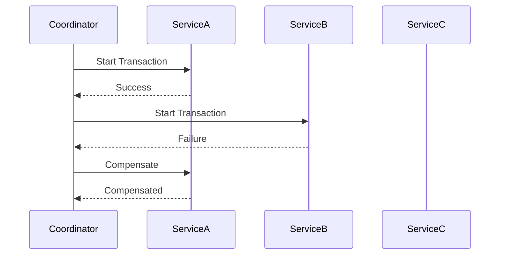

## 12.8. Saga Pattern for Distributed Transactions

In the world of microservices, managing distributed transactions is a complex yet crucial task. The Saga Pattern offers a robust solution for handling distributed transactions by breaking them into a series of smaller, manageable transactions. This section will delve into the intricacies of the Saga Pattern, its implementation in Elixir, and how it ensures data consistency across distributed systems.

### Managing Distributed Transactions

Distributed transactions involve multiple services, each with its own database, working together to complete a business process. Traditional ACID transactions are not feasible in such environments due to the distributed nature of microservices. Instead, we rely on the Saga Pattern to manage these transactions efficiently.

#### Orchestrating Complex Operations Across Multiple Services

The Saga Pattern orchestrates complex operations by dividing a large transaction into smaller, independent transactions. Each transaction updates a single service and publishes an event or message to trigger the next transaction. This approach ensures that each service can operate independently while still contributing to the overall business process.

### Implementing Sagas

Implementing the Saga Pattern involves two primary approaches: orchestration and choreography. Each approach has its own advantages and challenges, and the choice between them depends on the specific requirements of your system.

#### Orchestration

In the orchestration approach, a central coordinator manages the sequence of transactions. The coordinator is responsible for invoking each service in the correct order and handling any failures that occur. This approach provides a clear and centralized control flow, making it easier to manage complex transactions.

```elixir
defmodule OrderSaga do
  use GenServer

  def start_link(_) do
    GenServer.start_link(__MODULE__, %{}, name: __MODULE__)
  end

  def init(state) do
    {:ok, state}
  end

  def handle_call(:start, _from, state) do
    # Start the saga by invoking the first service
    case ServiceA.call() do
      :ok -> 
        # Proceed to the next step
        ServiceB.call()
      {:error, reason} -> 
        # Handle failure
        compensate()
    end
    {:reply, :ok, state}
  end

  defp compensate do
    # Define compensation actions
    IO.puts("Compensating for failed transaction")
  end
end
```

In this example, `OrderSaga` acts as the coordinator, managing the sequence of service calls and handling failures through compensation actions.

#### Choreography

In the choreography approach, each service is responsible for listening to events and deciding when to execute its transaction. This approach eliminates the need for a central coordinator, allowing services to operate more autonomously.

```elixir
defmodule ServiceA do
  def call do
    # Perform transaction
    :ok
  end

  def handle_event(:service_b_completed) do
    # Respond to event
    IO.puts("Service A received event: service_b_completed")
  end
end

defmodule ServiceB do
  def call do
    # Perform transaction
    :ok
  end

  def handle_event(:service_a_completed) do
    # Respond to event
    IO.puts("Service B received event: service_a_completed")
  end
end
```

Here, `ServiceA` and `ServiceB` listen for events and execute their transactions accordingly, without a central coordinator.

### Compensation Actions

Compensation actions are crucial for maintaining data consistency in the event of a failure. These actions are essentially the inverse of the original transactions, undoing any changes made by a failed transaction.

#### Defining Rollback Procedures for Failed Steps

When a transaction fails, the Saga Pattern triggers compensation actions to rollback any changes. This ensures that the system remains in a consistent state, even in the face of failures.

```elixir
defmodule Compensation do
  def rollback_service_a do
    # Undo changes made by Service A
    IO.puts("Rolling back Service A")
  end

  def rollback_service_b do
    # Undo changes made by Service B
    IO.puts("Rolling back Service B")
  end
end
```

In this example, `Compensation` defines rollback procedures for `ServiceA` and `ServiceB`, ensuring that any changes made by these services can be undone if necessary.

### Visualizing the Saga Pattern

To better understand the flow of the Saga Pattern, let's visualize the orchestration approach using a sequence diagram.



This diagram illustrates the sequence of transactions in an orchestrated saga, highlighting the compensation action triggered by a failure in `ServiceB`.

### Key Participants

- **Coordinator**: Manages the sequence of transactions and handles failures.
- **Services**: Execute individual transactions and communicate with the coordinator.
- **Compensation Actions**: Rollback procedures for failed transactions.

### Applicability

The Saga Pattern is particularly useful in the following scenarios:

- **Distributed Systems**: When transactions span multiple services and databases.
- **Microservices Architecture**: To maintain data consistency across independent services.
- **Complex Business Processes**: When a single business process involves multiple steps and services.

### Sample Code Snippet

Here's a complete example of implementing the Saga Pattern using orchestration in Elixir:

```elixir
defmodule OrderSaga do
  use GenServer

  def start_link(_) do
    GenServer.start_link(__MODULE__, %{}, name: __MODULE__)
  end

  def init(state) do
    {:ok, state}
  end

  def handle_call(:start, _from, state) do
    case ServiceA.call() do
      :ok -> 
        case ServiceB.call() do
          :ok -> 
            ServiceC.call()
          {:error, reason} -> 
            compensate()
        end
      {:error, reason} -> 
        compensate()
    end
    {:reply, :ok, state}
  end

  defp compensate do
    Compensation.rollback_service_a()
    Compensation.rollback_service_b()
  end
end

defmodule ServiceA do
  def call do
    # Perform transaction
    :ok
  end
end

defmodule ServiceB do
  def call do
    # Perform transaction
    {:error, :failed}
  end
end

defmodule ServiceC do
  def call do
    # Perform transaction
    :ok
  end
end

defmodule Compensation do
  def rollback_service_a do
    IO.puts("Rolling back Service A")
  end

  def rollback_service_b do
    IO.puts("Rolling back Service B")
  end
end
```

### Design Considerations

When implementing the Saga Pattern, consider the following:

- **Failure Handling**: Ensure that compensation actions are well-defined and tested.
- **Idempotency**: Design services to handle repeated requests without adverse effects.
- **Timeouts and Retries**: Implement timeouts and retries to handle transient failures.

### Elixir Unique Features

Elixir's concurrency model, based on the Actor Model, makes it particularly well-suited for implementing the Saga Pattern. The use of processes and message passing allows for efficient orchestration and communication between services.

### Differences and Similarities

The Saga Pattern is often compared to the Two-Phase Commit (2PC) protocol. While 2PC provides strong consistency guarantees, it is not suitable for distributed systems due to its blocking nature. The Saga Pattern, on the other hand, offers eventual consistency and is more resilient to failures.

### Try It Yourself

Experiment with the provided code examples by modifying the services and compensation actions. Try introducing failures at different stages and observe how the system responds. This hands-on approach will deepen your understanding of the Saga Pattern and its implementation in Elixir.

### Knowledge Check

- What are the two primary approaches to implementing the Saga Pattern?
- How do compensation actions contribute to data consistency?
- Why is the Saga Pattern preferred over traditional ACID transactions in distributed systems?

### Embrace the Journey

Remember, mastering the Saga Pattern is just one step in building robust distributed systems. As you continue your journey, explore other design patterns and techniques to enhance your skills and create resilient, scalable applications. Keep experimenting, stay curious, and enjoy the journey!

## Quiz: Saga Pattern for Distributed Transactions



### What is the primary purpose of the Saga Pattern in distributed systems?

- [x] To manage distributed transactions across multiple services
- [ ] To enforce strict ACID compliance
- [ ] To centralize all database operations
- [ ] To eliminate the need for compensation actions

> **Explanation:** The Saga Pattern is designed to manage distributed transactions by breaking them into smaller, manageable transactions across multiple services.

### Which approach involves a central coordinator in the Saga Pattern?

- [x] Orchestration
- [ ] Choreography
- [ ] Centralization
- [ ] Synchronization

> **Explanation:** Orchestration involves a central coordinator that manages the sequence of transactions and handles failures.

### What is the role of compensation actions in the Saga Pattern?

- [x] To rollback changes made by failed transactions
- [ ] To enforce strict consistency
- [ ] To optimize transaction performance
- [ ] To eliminate the need for retries

> **Explanation:** Compensation actions are used to rollback changes made by failed transactions, ensuring data consistency.

### In the choreography approach, how do services communicate?

- [x] By listening to events and executing transactions accordingly
- [ ] Through a central coordinator
- [ ] By sharing a common database
- [ ] By using direct service-to-service calls

> **Explanation:** In choreography, services listen to events and decide when to execute their transactions, eliminating the need for a central coordinator.

### What is a key advantage of using the Saga Pattern over Two-Phase Commit (2PC)?

- [x] It offers eventual consistency and is more resilient to failures
- [ ] It provides stronger consistency guarantees
- [ ] It eliminates the need for compensation actions
- [ ] It centralizes all transaction management

> **Explanation:** The Saga Pattern offers eventual consistency and is more resilient to failures, making it suitable for distributed systems.

### Which Elixir feature makes it well-suited for implementing the Saga Pattern?

- [x] Concurrency model based on the Actor Model
- [ ] Strong typing system
- [ ] Built-in database support
- [ ] Synchronous communication

> **Explanation:** Elixir's concurrency model, based on the Actor Model, allows for efficient orchestration and communication between services.

### What should be considered when designing compensation actions?

- [x] They should be well-defined and tested
- [ ] They should be avoided whenever possible
- [ ] They should only be used for critical transactions
- [ ] They should replace the need for retries

> **Explanation:** Compensation actions should be well-defined and tested to ensure they effectively rollback changes made by failed transactions.

### How does the Saga Pattern ensure eventual consistency?

- [x] By breaking transactions into smaller, independent transactions
- [ ] By enforcing strict ACID compliance
- [ ] By centralizing all database operations
- [ ] By eliminating the need for compensation actions

> **Explanation:** The Saga Pattern ensures eventual consistency by breaking a large transaction into smaller, independent transactions, each contributing to the overall business process.

### What is a potential challenge of using the choreography approach?

- [x] Managing complex dependencies between services
- [ ] Centralizing transaction management
- [ ] Handling compensation actions
- [ ] Implementing a central coordinator

> **Explanation:** In the choreography approach, managing complex dependencies between services can be challenging, as there is no central coordinator.

### True or False: The Saga Pattern is suitable for systems that require strict ACID compliance.

- [ ] True
- [x] False

> **Explanation:** The Saga Pattern is not suitable for systems that require strict ACID compliance, as it offers eventual consistency instead.




