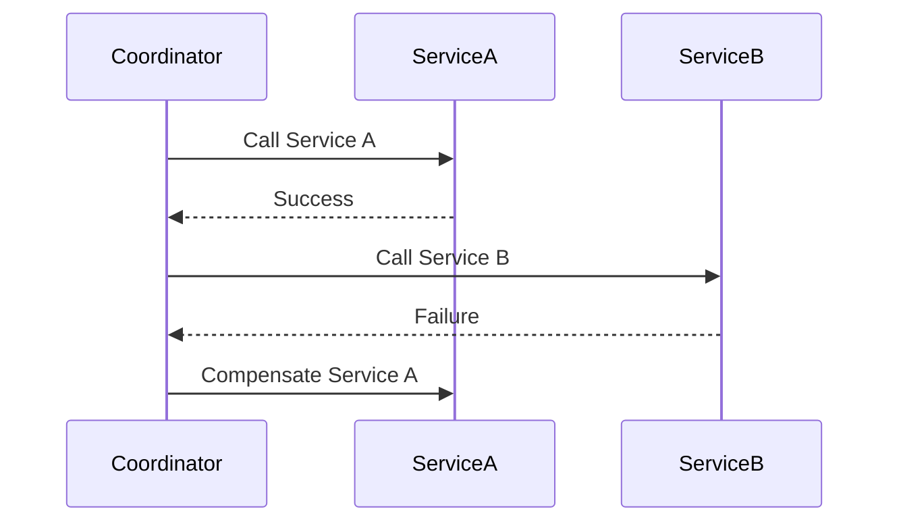

## 12.8. Saga Pattern for Distributed Transactions

In the world of microservices, managing distributed transactions can be a daunting task. Traditional ACID transactions are not feasible due to the distributed nature of microservices. This is where the Saga Pattern comes into play, providing a robust solution for managing distributed transactions by breaking them into a series of smaller, manageable transactions.

### Managing Distributed Transactions

Distributed transactions involve coordinating multiple services to achieve a single business operation. The challenge lies in ensuring data consistency across these services, especially when failures occur. The Saga Pattern addresses this by dividing a transaction into a series of steps, each with a corresponding compensation action to undo the step if necessary.

#### Key Concepts

- **Orchestration**: A central coordinator manages the sequence of transaction steps.
- **Choreography**: Each service listens for events and decides its actions independently.
- **Compensation Actions**: Rollback procedures for each step to maintain consistency.

### Implementing Sagas

Implementing the Saga Pattern involves defining the sequence of operations and their compensation actions. There are two primary approaches: orchestration and choreography.

#### Orchestration

In the orchestration approach, a central coordinator orchestrates the saga. This coordinator is responsible for invoking services and managing the workflow.

```elixir
defmodule OrderSaga do
  use GenServer

  def start_link(initial_state) do
    GenServer.start_link(__MODULE__, initial_state, name: __MODULE__)
  end

  def init(state) do
    {:ok, state}
  end

  def handle_call(:start, _from, state) do
    case call_service_a() do
      :ok -> 
        case call_service_b() do
          :ok -> {:reply, :success, state}
          :error -> 
            compensate_service_a()
            {:reply, :failure, state}
        end
      :error -> {:reply, :failure, state}
    end
  end

  defp call_service_a do
    # Simulate a service call
    :ok
  end

  defp call_service_b do
    # Simulate a service call
    :ok
  end

  defp compensate_service_a do
    # Define compensation logic
    :ok
  end
end
```

In this example, `OrderSaga` is a GenServer that coordinates the transaction steps. If any step fails, it triggers the compensation actions.

#### Choreography

In the choreography approach, there is no central coordinator. Instead, each service is responsible for listening to events and executing its part of the transaction.

```elixir
defmodule PaymentService do
  def handle_event(:order_created) do
    case process_payment() do
      :ok -> publish_event(:payment_successful)
      :error -> publish_event(:payment_failed)
    end
  end

  defp process_payment do
    # Simulate payment processing
    :ok
  end

  defp publish_event(event) do
    # Publish event to message broker
    :ok
  end
end
```

In this example, `PaymentService` listens for the `:order_created` event and processes the payment. It then publishes the result as a new event.

### Compensation Actions

Compensation actions are crucial for maintaining consistency in distributed transactions. They act as a rollback mechanism when a step fails.

#### Defining Compensation Actions

Each service should define compensation actions for its operations. These actions should be idempotent and reversible.

```elixir
defmodule InventoryService do
  def reserve_item(item_id) do
    # Logic to reserve an item
    :ok
  end

  def release_item(item_id) do
    # Logic to release an item reservation
    :ok
  end
end
```

In this example, `InventoryService` provides `reserve_item` and `release_item` functions. The latter serves as the compensation action for the former.

### Visualizing the Saga Pattern

To better understand the Saga Pattern, let's visualize the orchestration approach using a sequence diagram.


```mermaid
sequenceDiagram
    participant Coordinator
    participant ServiceA
    participant ServiceB

    Coordinator->>ServiceA: Call Service A
    ServiceA-->>Coordinator: Success
    Coordinator->>ServiceB: Call Service B
    ServiceB-->>Coordinator: Failure
    Coordinator->>ServiceA: Compensate Service A
```

This diagram illustrates how the coordinator interacts with services and triggers compensation actions upon failure.

### Elixir Unique Features

Elixir's concurrency model, based on the Actor Model, makes it well-suited for implementing the Saga Pattern. The use of GenServers for orchestration and PubSub for choreography are examples of leveraging Elixir's strengths.

#### GenServer for Orchestration

GenServer provides a robust way to manage state and handle asynchronous tasks, making it ideal for orchestrating sagas.

#### PubSub for Choreography

Elixir's PubSub system allows services to communicate via events, facilitating the choreography approach.

### Differences and Similarities

The Saga Pattern is often compared to the traditional two-phase commit protocol. However, unlike two-phase commit, sagas do not lock resources, making them more scalable in distributed systems.

### Design Considerations

When implementing the Saga Pattern, consider the following:

- **Idempotency**: Ensure compensation actions are idempotent to avoid inconsistencies.
- **Timeouts and Retries**: Implement timeouts and retries for service calls to handle transient failures.
- **Monitoring and Logging**: Track the progress of sagas and log failures for debugging.

### Sample Code Snippet

Here's a simple example of a saga using the orchestration approach in Elixir:

```elixir
defmodule OrderSaga do
  use GenServer

  def start_link(initial_state) do
    GenServer.start_link(__MODULE__, initial_state, name: __MODULE__)
  end

  def init(state) do
    {:ok, state}
  end

  def handle_call(:start, _from, state) do
    case call_service_a() do
      :ok -> 
        case call_service_b() do
          :ok -> {:reply, :success, state}
          :error -> 
            compensate_service_a()
            {:reply, :failure, state}
        end
      :error -> {:reply, :failure, state}
    end
  end

  defp call_service_a do
    # Simulate a service call
    :ok
  end

  defp call_service_b do
    # Simulate a service call
    :ok
  end

  defp compensate_service_a do
    # Define compensation logic
    :ok
  end
end
```

### Try It Yourself

Experiment with the provided code by adding additional services and compensation actions. Try implementing the choreography approach using Elixir's PubSub system.

### References and Links

- [Microservices Patterns](https://microservices.io/patterns/data/saga.html)
- [Elixir Lang](https://elixir-lang.org/)
- [Phoenix PubSub](https://hexdocs.pm/phoenix_pubsub/Phoenix.PubSub.html)

### Knowledge Check

- What are the two main approaches to implementing the Saga Pattern?
- How does the Saga Pattern differ from the traditional two-phase commit protocol?
- Why are compensation actions important in distributed transactions?

### Embrace the Journey

Implementing the Saga Pattern in Elixir is a rewarding endeavor that enhances your microservices architecture. Remember, this is just the beginning. As you progress, you'll build more complex and resilient distributed systems. Keep experimenting, stay curious, and enjoy the journey!

## Quiz Time!



### What is the primary purpose of the Saga Pattern in distributed transactions?

- [x] To manage distributed transactions by breaking them into smaller, manageable steps.
- [ ] To provide a locking mechanism for distributed resources.
- [ ] To enhance the speed of transaction processing.
- [ ] To eliminate the need for compensation actions.

> **Explanation:** The Saga Pattern manages distributed transactions by dividing them into smaller steps, each with a compensation action for rollback.

### Which approach involves a central coordinator in the Saga Pattern?

- [x] Orchestration
- [ ] Choreography
- [ ] Both Orchestration and Choreography
- [ ] Neither

> **Explanation:** Orchestration involves a central coordinator that manages the sequence of transaction steps.

### What is a compensation action in the context of the Saga Pattern?

- [x] A rollback procedure for a failed transaction step.
- [ ] A method to speed up transaction processing.
- [ ] A locking mechanism for distributed resources.
- [ ] A way to prevent transaction failures.

> **Explanation:** Compensation actions are rollback procedures for failed transaction steps to maintain consistency.

### How does the choreography approach differ from orchestration in the Saga Pattern?

- [x] Choreography involves services listening for events and acting independently.
- [ ] Choreography requires a central coordinator.
- [ ] Choreography locks resources during transactions.
- [ ] Choreography eliminates the need for compensation actions.

> **Explanation:** In choreography, services listen for events and decide their actions independently, without a central coordinator.

### Why is idempotency important for compensation actions?

- [x] To ensure consistency when actions are repeated.
- [ ] To speed up transaction processing.
- [ ] To eliminate the need for orchestration.
- [ ] To lock resources during transactions.

> **Explanation:** Idempotency ensures that compensation actions can be repeated without causing inconsistencies.

### Which Elixir feature is well-suited for implementing orchestration in the Saga Pattern?

- [x] GenServer
- [ ] PubSub
- [ ] ETS
- [ ] Ecto

> **Explanation:** GenServer is ideal for managing state and handling asynchronous tasks in orchestration.

### What is the role of PubSub in the choreography approach?

- [x] To facilitate communication via events between services.
- [ ] To act as a central coordinator.
- [ ] To lock resources during transactions.
- [ ] To eliminate the need for compensation actions.

> **Explanation:** PubSub allows services to communicate via events, which is crucial for the choreography approach.

### How does the Saga Pattern improve scalability compared to the two-phase commit protocol?

- [x] By avoiding resource locking and allowing independent transaction steps.
- [ ] By locking resources during transactions.
- [ ] By eliminating the need for compensation actions.
- [ ] By providing a central coordinator for all transactions.

> **Explanation:** The Saga Pattern avoids resource locking, allowing for more scalable distributed transactions.

### What should be considered when implementing the Saga Pattern?

- [x] Idempotency, timeouts, retries, monitoring, and logging.
- [ ] Only idempotency and retries.
- [ ] Only monitoring and logging.
- [ ] Only timeouts and retries.

> **Explanation:** Considerations include idempotency, timeouts, retries, monitoring, and logging to ensure robust implementation.

### True or False: The Saga Pattern eliminates the need for compensation actions in distributed transactions.

- [ ] True
- [x] False

> **Explanation:** The Saga Pattern relies on compensation actions to maintain consistency when transaction steps fail.




