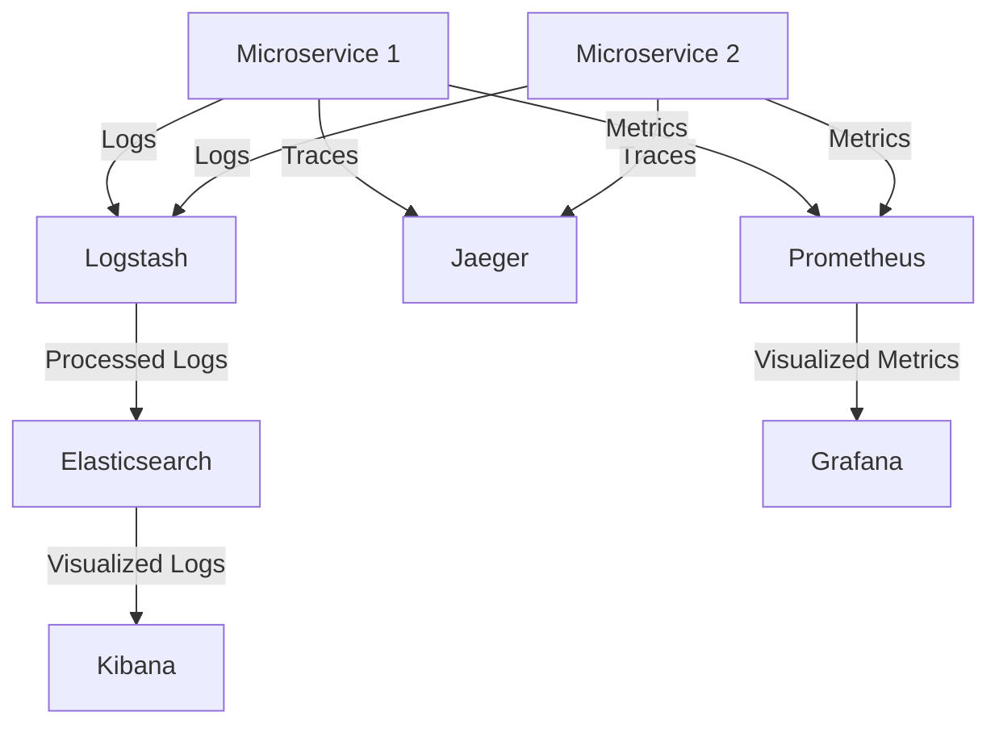

## 12.9. Logging, Monitoring, and Tracing

In the world of microservices, observability is a crucial aspect that allows developers and system architects to gain insights into the behavior and performance of their systems. This section delves into the essential components of observability: logging, monitoring, and tracing. We will explore how these components can be effectively implemented in Elixir microservices to ensure robust, scalable, and fault-tolerant systems.

### Observability

Observability is the ability to infer the internal state of a system based on the knowledge of its external outputs. In the context of microservices, observability enables developers to understand how services interact, identify bottlenecks, and troubleshoot issues effectively. It comprises three main pillars:

1. **Logging**: Capturing and storing logs from various services to provide a detailed history of events.
2. **Monitoring**: Collecting and analyzing metrics to assess the health and performance of the system.
3. **Tracing**: Tracking the flow of requests across services to understand the interaction and dependencies between them.

### Centralized Logging

Centralized logging involves aggregating logs from multiple services into a single location, making it easier to search, analyze, and visualize log data. This is particularly important in microservices architectures, where logs are generated by numerous independent services.

#### Implementing Centralized Logging with ELK Stack

The ELK stack, consisting of Elasticsearch, Logstash, and Kibana, is a popular choice for centralized logging. Here's how you can set it up for your Elixir microservices:

- **Elasticsearch**: A distributed search and analytics engine that stores and indexes log data.
- **Logstash**: A data processing pipeline that ingests, transforms, and sends log data to Elasticsearch.
- **Kibana**: A visualization tool that allows you to explore and analyze log data stored in Elasticsearch.

```elixir
# Example Elixir Logger configuration for sending logs to Logstash
config :logger, :console,
  format: "$time $metadata[$level] $message\n",
  metadata: [:request_id]

config :logger, :logstash,
  host: "localhost",
  port: 5044,
  level: :info
```

In this configuration, logs are formatted and sent to a Logstash instance running on `localhost`. Logstash then processes these logs and forwards them to Elasticsearch for storage and indexing.

#### Using Loki for Lightweight Logging

Loki, developed by Grafana Labs, is another tool for centralized logging that is designed to be cost-effective and easy to use. Unlike the ELK stack, Loki does not index the contents of the logs but instead indexes the metadata, making it more efficient for certain use cases.

```elixir
# Example Elixir Logger configuration for sending logs to Loki
config :logger, :console,
  format: "$time $metadata[$level] $message\n",
  metadata: [:request_id]

config :logger, :loki,
  url: "http://localhost:3100/loki/api/v1/push",
  labels: [application: "my_app"]
```

### Distributed Tracing

Distributed tracing is essential for understanding the flow of requests across microservices. It helps in identifying latency issues, bottlenecks, and service dependencies. Tools like OpenTracing and Jaeger are commonly used for implementing distributed tracing.

#### Implementing Tracing with OpenTracing and Jaeger

OpenTracing provides a standard API for distributed tracing, while Jaeger is an open-source tool for tracing and monitoring microservices. Here's how you can integrate them into your Elixir application:

1. **Install the OpenTracing and Jaeger libraries**:

   ```elixir
   # Add dependencies to your mix.exs
   defp deps do
     [
       {:opentracing, "~> 0.4.0"},
       {:jaeger_client, "~> 0.2.0"}
     ]
   end
   ```

2. **Configure Jaeger**:

   ```elixir
   # Configure Jaeger in your application
   config :jaeger_client,
     service_name: "my_service",
     agent_host: "localhost",
     agent_port: 6831
   ```

3. **Instrument your code**:

   ```elixir
   # Example of tracing a function call
   def my_function() do
     OpenTracing.start_span("my_function")
     # Your code here
     OpenTracing.finish_span()
   end
   ```

This setup allows you to trace requests across your services and visualize them using Jaeger's UI, helping you to identify performance issues and optimize your system.

### Metrics and Monitoring

Monitoring involves collecting and analyzing metrics to assess the health and performance of your system. Prometheus and Grafana are widely used tools for this purpose.

#### Collecting Metrics with Prometheus

Prometheus is an open-source monitoring and alerting toolkit that collects metrics from configured targets at given intervals. It stores all scraped samples locally and runs rules over this data to generate alerts.

1. **Install Prometheus**:

   ```bash
   # Download and run Prometheus
   wget https://github.com/prometheus/prometheus/releases/download/v2.26.0/prometheus-2.26.0.linux-amd64.tar.gz
   tar xvfz prometheus-*.tar.gz
   cd prometheus-*
   ./prometheus --config.file=prometheus.yml
   ```

2. **Configure Prometheus to scrape metrics from your Elixir application**:

   ```yaml
   # prometheus.yml
   scrape_configs:
     - job_name: 'elixir_app'
       static_configs:
         - targets: ['localhost:4000']
   ```

3. **Instrument your Elixir application**:

   ```elixir
   # Use Telemetry to expose metrics
   defmodule MyApp.Metrics do
     use Prometheus.PlugExporter
     use Prometheus.Metric

     def setup do
       Counter.declare(name: :http_requests_total, help: "Total number of HTTP requests")
     end

     def increment_request_count do
       Counter.inc(name: :http_requests_total)
     end
   end
   ```

#### Visualizing Metrics with Grafana

Grafana is a powerful visualization tool that integrates seamlessly with Prometheus to provide dashboards and alerts.

1. **Install Grafana**:

   ```bash
   # Download and run Grafana
   wget https://dl.grafana.com/oss/release/grafana-7.5.5.linux-amd64.tar.gz
   tar -zxvf grafana-7.5.5.linux-amd64.tar.gz
   cd grafana-7.5.5
   ./bin/grafana-server
   ```

2. **Configure Grafana to use Prometheus as a data source**:

   - Open Grafana in your browser (http://localhost:3000).
   - Add Prometheus as a data source.
   - Create dashboards to visualize your metrics.

### Visualizing Observability in Microservices

To better understand how these components fit together, let's visualize the architecture of observability in a microservices environment.



**Diagram Description**: This diagram illustrates the flow of logs, traces, and metrics from microservices to centralized logging, tracing, and monitoring systems. Logs are sent to Logstash, processed, and stored in Elasticsearch, then visualized in Kibana. Traces are sent to Jaeger for distributed tracing, and metrics are collected by Prometheus and visualized in Grafana.

### Best Practices for Logging, Monitoring, and Tracing

1. **Consistent Logging Format**: Use a consistent format for logs across all services to facilitate easier aggregation and analysis.
2. **Log Levels**: Implement log levels (e.g., DEBUG, INFO, WARN, ERROR) to control the verbosity of logs and focus on relevant information.
3. **Correlation IDs**: Use correlation IDs to trace requests across services, making it easier to follow the flow of a request through the system.
4. **Alerting**: Set up alerts for critical metrics to proactively address issues before they impact users.
5. **Data Retention**: Define data retention policies to manage storage costs and ensure compliance with regulations.

### Try It Yourself

Experiment with the provided code examples by modifying the logging configuration to send logs to different endpoints or by adding additional metrics to be collected by Prometheus. Try visualizing different metrics in Grafana and explore the Jaeger UI to trace requests across your services.

### Knowledge Check

- Explain the importance of observability in microservices.
- Describe how centralized logging can be implemented using the ELK stack.
- Demonstrate how distributed tracing can be achieved with OpenTracing and Jaeger.
- Provide an example of how metrics can be collected and visualized using Prometheus and Grafana.

### Key Takeaways

- Observability is crucial for understanding the behavior and performance of microservices.
- Centralized logging, distributed tracing, and metrics collection are key components of observability.
- Tools like the ELK stack, Loki, OpenTracing, Jaeger, Prometheus, and Grafana are essential for implementing observability in Elixir microservices.

### Embrace the Journey

Remember, mastering observability is a continuous journey. As you progress, you'll gain deeper insights into your systems and build more resilient and efficient microservices. Keep experimenting, stay curious, and enjoy the journey!

## Quiz: Logging, Monitoring, and Tracing



### What is the primary purpose of observability in microservices?

- [x] To gain insights into system behavior and performance
- [ ] To increase the number of microservices
- [ ] To reduce the cost of infrastructure
- [ ] To eliminate the need for testing

> **Explanation:** Observability allows developers to understand how services interact, identify bottlenecks, and troubleshoot issues effectively.

### Which tool is part of the ELK stack for centralized logging?

- [x] Elasticsearch
- [ ] Prometheus
- [ ] Grafana
- [ ] Jaeger

> **Explanation:** The ELK stack consists of Elasticsearch, Logstash, and Kibana for centralized logging.

### What is the role of Jaeger in distributed tracing?

- [x] To trace requests across services
- [ ] To store logs
- [ ] To visualize metrics
- [ ] To collect alerts

> **Explanation:** Jaeger is used for tracing and monitoring microservices, helping to identify performance issues and optimize the system.

### Which tool is used for collecting metrics in Elixir microservices?

- [x] Prometheus
- [ ] Loki
- [ ] Kibana
- [ ] OpenTracing

> **Explanation:** Prometheus is an open-source monitoring and alerting toolkit that collects metrics from configured targets.

### What is a best practice for logging in microservices?

- [x] Use a consistent logging format
- [ ] Log everything at the DEBUG level
- [ ] Avoid using log levels
- [ ] Store logs locally on each service

> **Explanation:** Using a consistent logging format across all services facilitates easier aggregation and analysis.

### Which tool is used for visualizing metrics collected by Prometheus?

- [x] Grafana
- [ ] Logstash
- [ ] Jaeger
- [ ] Elasticsearch

> **Explanation:** Grafana is a powerful visualization tool that integrates seamlessly with Prometheus to provide dashboards and alerts.

### What is the benefit of using correlation IDs in logging?

- [x] To trace requests across services
- [ ] To increase log verbosity
- [ ] To reduce log storage
- [ ] To eliminate the need for monitoring

> **Explanation:** Correlation IDs help trace requests across services, making it easier to follow the flow of a request through the system.

### What is the purpose of setting up alerts for critical metrics?

- [x] To proactively address issues before they impact users
- [ ] To increase the number of logs
- [ ] To reduce the need for tracing
- [ ] To eliminate the need for metrics

> **Explanation:** Alerts for critical metrics allow developers to address issues proactively, ensuring system reliability and performance.

### Which tool is designed for lightweight logging without indexing log contents?

- [x] Loki
- [ ] Elasticsearch
- [ ] Prometheus
- [ ] Jaeger

> **Explanation:** Loki is designed to be cost-effective and efficient by indexing metadata instead of the contents of logs.

### True or False: Distributed tracing helps in identifying service dependencies and bottlenecks.

- [x] True
- [ ] False

> **Explanation:** Distributed tracing is essential for understanding the flow of requests across microservices, helping to identify latency issues, bottlenecks, and service dependencies.


