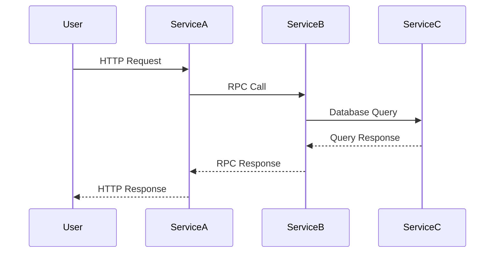
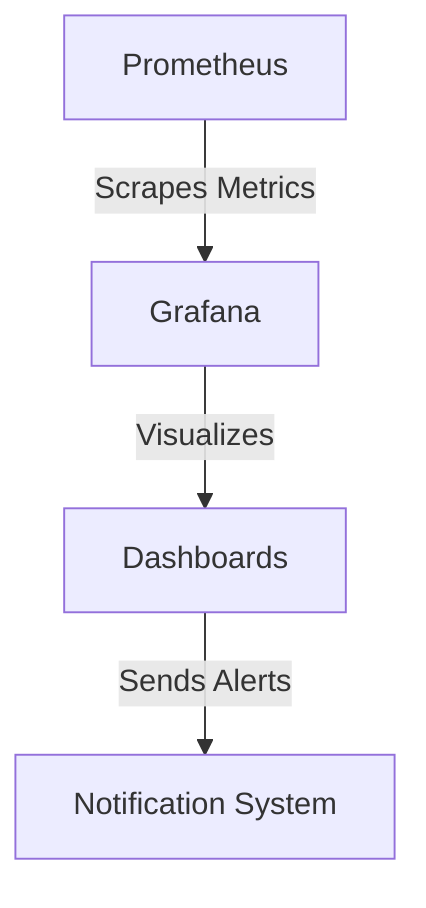

## 12.9. Logging, Monitoring, and Tracing

In the world of microservices, observability is a crucial aspect that ensures the reliability and performance of distributed systems. Observability encompasses logging, monitoring, and tracing, providing insights into system behavior and performance. This section will guide you through implementing effective logging, monitoring, and tracing strategies in Elixir microservices.

### Observability

Observability is the ability to understand the internal state of a system based on the data it produces. It is a critical component for maintaining and operating microservices efficiently. Observability helps in:

- **Identifying Performance Bottlenecks:** By understanding system behavior, you can pinpoint areas that need optimization.
- **Troubleshooting Issues:** Quickly diagnose and resolve issues by analyzing logs, metrics, and traces.
- **Ensuring Reliability:** Continuously monitor system health to ensure uptime and reliability.

### Centralized Logging

Centralized logging is essential for aggregating logs from multiple microservices into a single location, making it easier to search, analyze, and visualize logs. Tools like the ELK stack (Elasticsearch, Logstash, Kibana) or Loki are commonly used for this purpose.

#### Setting Up Centralized Logging with ELK

1. **Elasticsearch:** A distributed search and analytics engine that stores logs.
2. **Logstash:** A data processing pipeline that ingests logs from various sources, transforms them, and sends them to Elasticsearch.
3. **Kibana:** A visualization tool that allows you to explore and visualize logs stored in Elasticsearch.

**Example Configuration:**

```yaml
# Logstash Configuration
input {
  file {
    path => "/var/log/elixir_app/*.log"
    start_position => "beginning"
  }
}

filter {
  grok {
    match => { "message" => "%{TIMESTAMP_ISO8601:timestamp} %{LOGLEVEL:loglevel} %{GREEDYDATA:message}" }
  }
}

output {
  elasticsearch {
    hosts => ["http://localhost:9200"]
    index => "elixir-logs-%{+YYYY.MM.dd}"
  }
}
```

#### Using Loki for Logging

Loki is a more lightweight alternative to the ELK stack, designed to work seamlessly with Prometheus and Grafana.

1. **Promtail:** Collects logs and pushes them to Loki.
2. **Loki:** Stores logs in a time-series database.
3. **Grafana:** Visualizes logs alongside metrics.

**Example Configuration:**

```yaml
# Promtail Configuration
server:
  http_listen_port: 9080
  grpc_listen_port: 0

positions:
  filename: /tmp/positions.yaml

clients:
  - url: http://localhost:3100/loki/api/v1/push

scrape_configs:
  - job_name: system
    static_configs:
      - targets:
          - localhost
        labels:
          job: varlogs
          __path__: /var/log/elixir_app/*.log
```

### Distributed Tracing

Distributed tracing is vital for understanding the flow of requests across different services in a microservices architecture. It helps in identifying latency issues and understanding service dependencies.

#### Implementing Distributed Tracing with OpenTracing

OpenTracing provides a standard API for distributed tracing. Jaeger is a popular open-source tool that implements OpenTracing.

**Setting Up Jaeger:**

1. **Install Jaeger:** Deploy Jaeger as a Docker container or Kubernetes pod.
2. **Instrument Your Code:** Use OpenTracing libraries to instrument your Elixir code.

**Example Elixir Code:**

```elixir
defmodule MyApp.Tracer do
  use OpenTracing.Tracer

  def trace_request(request, handler) do
    span = start_span("request", child_of: extract_span_context(request))
    handler.(request)
    finish_span(span)
  end
end
```

#### Visualizing Traces with Jaeger

Jaeger provides a UI to visualize traces, showing the path and duration of requests across services. This helps in identifying slow services and optimizing performance.


```mermaid
sequenceDiagram
    participant User
    participant ServiceA
    participant ServiceB
    participant ServiceC

    User->>ServiceA: HTTP Request
    ServiceA->>ServiceB: RPC Call
    ServiceB->>ServiceC: Database Query
    ServiceC-->>ServiceB: Query Response
    ServiceB-->>ServiceA: RPC Response
    ServiceA-->>User: HTTP Response
```

### Metrics and Monitoring

Metrics and monitoring are essential for tracking the performance and health of your microservices. Prometheus and Grafana are widely used for collecting and visualizing metrics.

#### Collecting Metrics with Prometheus

Prometheus is a powerful monitoring and alerting toolkit that collects metrics from services and stores them in a time-series database.

1. **Instrument Your Code:** Use Prometheus client libraries to expose metrics.
2. **Configure Prometheus:** Set up Prometheus to scrape metrics from your services.

**Example Elixir Code:**

```elixir
defmodule MyApp.Metrics do
  use Prometheus.PlugExporter

  def setup do
    Counter.new([name: :http_requests_total, help: "Total number of HTTP requests"])
    Gauge.new([name: :memory_usage_bytes, help: "Memory usage in bytes"])
  end

  def increment_request_count do
    Counter.inc(:http_requests_total)
  end

  def set_memory_usage(value) do
    Gauge.set(:memory_usage_bytes, value)
  end
end
```

#### Visualizing Metrics with Grafana

Grafana is a visualization tool that integrates with Prometheus to create dashboards for monitoring system metrics.

- **Create Dashboards:** Use Grafana to create dashboards that display key metrics like request rates, error rates, and latency.
- **Set Alerts:** Configure alerts in Grafana to notify you of critical issues.


```mermaid
graph TD;
    A[Prometheus] -->|Scrapes Metrics| B[Grafana]
    B -->|Visualizes| C[Dashboards]
    C -->|Sends Alerts| D[Notification System]
```

### Try It Yourself

To deepen your understanding, try setting up a simple Elixir application with logging, monitoring, and tracing:

1. **Set Up Logging:** Configure Logstash or Promtail to collect logs from your Elixir application.
2. **Implement Tracing:** Use OpenTracing and Jaeger to trace requests through your application.
3. **Monitor Metrics:** Instrument your application with Prometheus and visualize metrics in Grafana.

Experiment with different configurations and observe how changes affect the observability of your system.

### Knowledge Check

- Explain the importance of observability in microservices.
- Describe the components of the ELK stack and their roles.
- How does distributed tracing help in a microservices architecture?
- What are the benefits of using Prometheus and Grafana for monitoring?

### Summary

In this section, we explored the critical components of observability in Elixir microservices, including centralized logging, distributed tracing, and metrics monitoring. By implementing these strategies, you can gain valuable insights into your system's behavior and performance, ensuring reliability and efficiency.

## Quiz Time!



### What is the primary purpose of observability in microservices?

- [x] To gain insights into system behavior and performance
- [ ] To increase the number of microservices
- [ ] To reduce the cost of infrastructure
- [ ] To eliminate the need for testing

> **Explanation:** Observability provides insights into the internal state of a system, helping to understand its behavior and performance.

### Which tool is used for centralized logging in the ELK stack?

- [x] Elasticsearch
- [ ] Prometheus
- [ ] Grafana
- [ ] Jaeger

> **Explanation:** Elasticsearch is the search and analytics engine used in the ELK stack for centralized logging.

### What is the role of Jaeger in distributed tracing?

- [x] To visualize and analyze traces across services
- [ ] To store logs in a database
- [ ] To monitor system metrics
- [ ] To deploy microservices

> **Explanation:** Jaeger is used to visualize and analyze traces, helping to understand the flow of requests across services.

### Which tool is used to collect and store metrics in a time-series database?

- [x] Prometheus
- [ ] Kibana
- [ ] Loki
- [ ] Logstash

> **Explanation:** Prometheus collects and stores metrics in a time-series database.

### How does Grafana integrate with Prometheus?

- [x] By visualizing metrics collected by Prometheus
- [ ] By collecting logs from Prometheus
- [ ] By storing traces in Prometheus
- [ ] By deploying services with Prometheus

> **Explanation:** Grafana visualizes metrics collected by Prometheus, allowing for the creation of dashboards and alerts.

### What is the primary benefit of using distributed tracing?

- [x] To understand the flow of requests across services
- [ ] To reduce the number of logs
- [ ] To increase the speed of deployments
- [ ] To decrease the number of microservices

> **Explanation:** Distributed tracing helps understand the flow of requests across services, identifying latency issues and dependencies.

### Which component of the ELK stack is responsible for data visualization?

- [x] Kibana
- [ ] Logstash
- [ ] Elasticsearch
- [ ] Loki

> **Explanation:** Kibana is responsible for visualizing data stored in Elasticsearch.

### What is the function of Promtail in the Loki stack?

- [x] To collect logs and push them to Loki
- [ ] To visualize metrics
- [ ] To store traces
- [ ] To deploy applications

> **Explanation:** Promtail collects logs and pushes them to Loki for storage and analysis.

### Which tool is used for creating dashboards to monitor system metrics?

- [x] Grafana
- [ ] Jaeger
- [ ] Logstash
- [ ] Kibana

> **Explanation:** Grafana is used to create dashboards for monitoring system metrics.

### True or False: Distributed tracing can help identify slow services in a microservices architecture.

- [x] True
- [ ] False

> **Explanation:** Distributed tracing provides visibility into the flow of requests, helping to identify slow services and optimize performance.



Remember, mastering observability in Elixir microservices is just the beginning. As you continue to explore and implement these strategies, you'll build more resilient and efficient systems. Keep experimenting, stay curious, and enjoy the journey!
