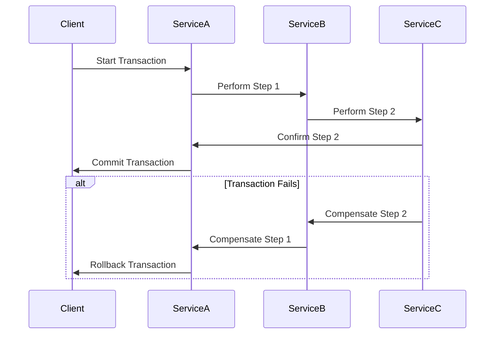

## 13.10. Transaction Management

In the realm of enterprise integration patterns, transaction management plays a pivotal role in ensuring data integrity and consistency across systems. This section delves into the intricacies of transaction management in Elixir, focusing on the ACID properties, handling distributed transactions, and utilizing tools like multi-database coordinators and Sagas for complex transaction management.

### Understanding ACID Properties

ACID is an acronym that stands for Atomicity, Consistency, Isolation, and Durability. These properties are fundamental to ensuring reliable transaction processing in databases.

#### Atomicity

Atomicity ensures that a transaction is treated as a single unit, which either completes in its entirety or not at all. This means that if any part of the transaction fails, the entire transaction is rolled back, leaving the system in its previous state.

**Example:**

```elixir
defmodule BankTransaction do
  def transfer(from_account, to_account, amount) do
    Ecto.Multi.new()
    |> Ecto.Multi.update(:debit, debit_account(from_account, amount))
    |> Ecto.Multi.update(:credit, credit_account(to_account, amount))
    |> Repo.transaction()
  end

  defp debit_account(account, amount) do
    # Logic to debit the account
  end

  defp credit_account(account, amount) do
    # Logic to credit the account
  end
end
```

In this example, the `Ecto.Multi` module is used to ensure that both the debit and credit operations are atomic. If either operation fails, the transaction is rolled back.

#### Consistency

Consistency ensures that a transaction brings the database from one valid state to another, maintaining database invariants. This means that any data written to the database must be valid according to all defined rules, including constraints, cascades, triggers, and any combination thereof.

**Example:**

```elixir
defmodule OrderTransaction do
  def place_order(order_details) do
    Ecto.Multi.new()
    |> Ecto.Multi.insert(:order, create_order(order_details))
    |> Ecto.Multi.run(:validate_stock, fn _repo, %{order: order} ->
      validate_stock(order)
    end)
    |> Repo.transaction()
  end

  defp create_order(order_details) do
    # Logic to create an order
  end

  defp validate_stock(order) do
    # Logic to validate stock availability
  end
end
```

Here, the transaction ensures that the order is only placed if the stock is available, maintaining consistency.

#### Isolation

Isolation ensures that concurrent transactions do not interfere with each other. This means that the intermediate state of a transaction is invisible to other transactions, preventing them from accessing data being modified by another transaction.

**Example:**

```elixir
defmodule InventoryTransaction do
  def update_inventory(item_id, quantity) do
    Ecto.Multi.new()
    |> Ecto.Multi.run(:lock_item, fn repo, _changes ->
      repo.get_for_update!(Item, item_id)
    end)
    |> Ecto.Multi.update(:update_quantity, update_item_quantity(item_id, quantity))
    |> Repo.transaction()
  end

  defp update_item_quantity(item_id, quantity) do
    # Logic to update item quantity
  end
end
```

In this example, `get_for_update!` is used to lock the item record, ensuring isolation from other transactions.

#### Durability

Durability guarantees that once a transaction has been committed, it will remain so, even in the event of a system failure. This is typically achieved through the use of transaction logs and backups.

**Example:**

```elixir
defmodule DurableTransaction do
  def commit_transaction(changeset) do
    Repo.transaction(fn ->
      Repo.insert!(changeset)
      # Additional logic to ensure durability
    end)
  end
end
```

### Managing Distributed Transactions

Distributed transactions involve coordinating transactions across multiple databases or services, ensuring that all parts of the transaction are completed successfully or rolled back in case of failure.

#### Challenges of Distributed Transactions

- **Network Latency:** Communication between distributed systems can introduce latency.
- **Partial Failures:** Some systems may succeed while others fail, complicating rollback.
- **Consistency Models:** Different systems may have varying consistency models.

#### Tools for Distributed Transactions

##### Multi-Database Coordinators

Multi-database coordinators help manage transactions across multiple databases, ensuring atomicity and consistency.

**Example:**

```elixir
defmodule MultiDBTransaction do
  def perform_transaction do
    Ecto.Multi.new()
    |> Ecto.Multi.run(:db1_operation, fn _repo, _changes ->
      # Operation on Database 1
    end)
    |> Ecto.Multi.run(:db2_operation, fn _repo, _changes ->
      # Operation on Database 2
    end)
    |> Repo.transaction()
  end
end
```

##### Sagas

Sagas are a pattern for managing long-running transactions by breaking them into a series of smaller, compensatable transactions. Each step in the saga has a corresponding compensating action to undo the step if necessary.

**Example:**

```elixir
defmodule OrderSaga do
  def execute_order_saga(order_details) do
    with {:ok, order} <- create_order(order_details),
         {:ok, _} <- reserve_inventory(order),
         {:ok, _} <- charge_payment(order) do
      {:ok, order}
    else
      {:error, reason} -> compensate_order(order, reason)
    end
  end

  defp create_order(order_details) do
    # Logic to create order
  end

  defp reserve_inventory(order) do
    # Logic to reserve inventory
  end

  defp charge_payment(order) do
    # Logic to charge payment
  end

  defp compensate_order(order, reason) do
    # Logic to compensate for failed order
  end
end
```

### Visualizing Transaction Management

To better understand transaction management, let's visualize the flow of a distributed transaction using a Saga pattern.



In this diagram, we see how a transaction is initiated by the client and flows through multiple services. If any step fails, compensating actions are triggered to roll back the transaction.

### Design Considerations

When implementing transaction management in Elixir, consider the following:

- **Use Ecto.Multi for Atomicity:** Leverage `Ecto.Multi` to ensure atomic operations within a single database.
- **Implement Sagas for Distributed Transactions:** Use the Saga pattern for managing transactions across multiple services.
- **Ensure Isolation with Locks:** Use database locks to ensure isolation in concurrent transactions.
- **Plan for Durability:** Implement logging and backup strategies to ensure durability.
- **Handle Network Latency:** Design systems to tolerate network latency in distributed transactions.

### Elixir Unique Features

Elixir offers several unique features that facilitate transaction management:

- **Ecto for Database Interactions:** Ecto provides a robust framework for interacting with databases, including support for transactions and multi-database operations.
- **Concurrency with Processes:** Elixir's lightweight processes make it easy to manage concurrent transactions.
- **Fault Tolerance with OTP:** The OTP framework provides tools for building fault-tolerant systems, essential for reliable transaction management.

### Differences and Similarities

Transaction management in Elixir shares similarities with other languages but also has unique aspects:

- **Similarities:** Concepts like ACID properties and distributed transactions are common across languages.
- **Differences:** Elixir's functional paradigm and concurrency model offer unique approaches to transaction management, such as using processes and OTP for fault tolerance.

### Try It Yourself

Experiment with the code examples provided by modifying them to suit different scenarios. For instance, try implementing a Saga pattern for a different use case, such as booking a flight and hotel together. Consider how you would handle compensating actions if one part of the transaction fails.

### Knowledge Check

- Explain the ACID properties and their importance in transaction management.
- Describe how the Saga pattern can be used to manage distributed transactions.
- Discuss the role of Ecto.Multi in ensuring atomicity in Elixir transactions.

### Summary

Transaction management is a critical aspect of enterprise integration patterns, ensuring data integrity and consistency across systems. By understanding ACID properties, managing distributed transactions, and leveraging tools like multi-database coordinators and Sagas, you can build robust and reliable systems in Elixir.

Remember, this is just the beginning. As you progress, you'll build more complex and interactive systems. Keep experimenting, stay curious, and enjoy the journey!

## Quiz: Transaction Management



### What does the 'A' in ACID stand for?

- [x] Atomicity
- [ ] Availability
- [ ] Accessibility
- [ ] Asynchronous

> **Explanation:** The 'A' in ACID stands for Atomicity, which ensures that a transaction is treated as a single unit that either completes in its entirety or not at all.

### Which Elixir module is commonly used to ensure atomic operations in transactions?

- [x] Ecto.Multi
- [ ] GenServer
- [ ] Phoenix.Channel
- [ ] Supervisor

> **Explanation:** Ecto.Multi is used in Elixir to ensure atomic operations within a transaction.

### What is the primary purpose of the Saga pattern?

- [x] To manage long-running transactions by breaking them into smaller, compensatable transactions
- [ ] To ensure data durability
- [ ] To provide isolation in concurrent transactions
- [ ] To handle network latency

> **Explanation:** The Saga pattern is used to manage long-running transactions by breaking them into smaller, compensatable transactions.

### Which property of ACID ensures that a transaction brings the database from one valid state to another?

- [x] Consistency
- [ ] Atomicity
- [ ] Isolation
- [ ] Durability

> **Explanation:** Consistency ensures that a transaction brings the database from one valid state to another, maintaining database invariants.

### What is a common challenge of distributed transactions?

- [x] Network Latency
- [ ] Data Redundancy
- [ ] High Availability
- [ ] Scalability

> **Explanation:** Network latency is a common challenge in distributed transactions due to the communication between distributed systems.

### How does Elixir's concurrency model aid in transaction management?

- [x] By using lightweight processes to manage concurrent transactions
- [ ] By providing a global lock for all transactions
- [ ] By ensuring all transactions are synchronous
- [ ] By using a single-threaded model

> **Explanation:** Elixir's concurrency model uses lightweight processes to manage concurrent transactions, making it efficient and scalable.

### What is the role of compensating actions in the Saga pattern?

- [x] To undo steps in a transaction if necessary
- [ ] To ensure data durability
- [ ] To provide isolation in concurrent transactions
- [ ] To handle network latency

> **Explanation:** Compensating actions in the Saga pattern are used to undo steps in a transaction if necessary.

### Which property of ACID ensures that once a transaction has been committed, it will remain so?

- [x] Durability
- [ ] Atomicity
- [ ] Consistency
- [ ] Isolation

> **Explanation:** Durability ensures that once a transaction has been committed, it will remain so, even in the event of a system failure.

### What is the primary use of database locks in transaction management?

- [x] To ensure isolation in concurrent transactions
- [ ] To provide atomicity
- [ ] To handle network latency
- [ ] To ensure data durability

> **Explanation:** Database locks are used to ensure isolation in concurrent transactions, preventing interference between them.

### True or False: Ecto.Multi can be used for managing distributed transactions across multiple databases.

- [x] True
- [ ] False

> **Explanation:** Ecto.Multi can be used to manage transactions across multiple databases, ensuring atomicity and consistency.


